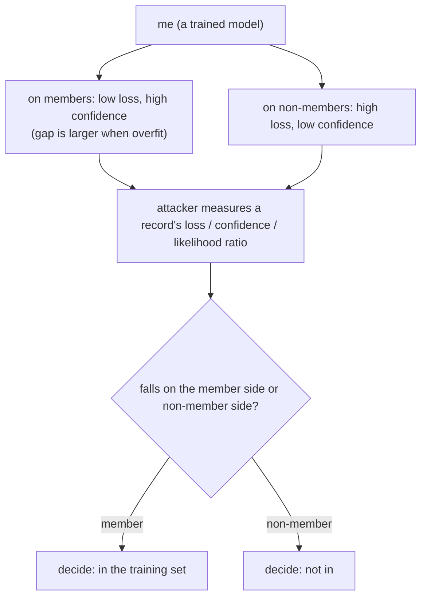

import PrivacyMeta from '@site/src/components/PrivacyMeta';

<PrivacyMeta era="Volume 1 · Privacy foundations" technique="Inference attacks" audience={['Privacy Engineer', 'ML Engineer', 'Security Engineer']} severity="High" maturity="Research" evidence="Research" />

> In one sentence: membership inference (MIA) asks a question that looks harmless but isn't — "**was this record in my training set or not**." It **needs no original text** (that's the fundamental difference from training-data extraction), only a yes/no; yet when the "yes" is itself sensitive (e.g. "this person is in a particular disease dataset"), that single bit is the leak. It is the core target differential privacy defends against, and the **foundation** of a whole chain of privacy attacks — extraction, attribute inference, and more — which is why it leads Volume 1.

## Mechanism: what happens on my side

I behave measurably differently on records I **saw in training** versus ones I **didn't**: on seen records my loss is lower, my confidence in the correct answer is higher, my output is more "certain." This is a natural side effect of fitting the training set — and it widens the "seen vs. unseen" gap especially when I **overfit** (Yeom et al., CSF 2018 attribute membership-inference risk directly to overfitting and single-sample influence).

Red line: this is **not** "I remember seeing this one" — I can't reliably introspect that. What is externally observable and recomputable is: **my output statistics (loss / confidence / likelihood) are distributed differently on members vs. non-members, and that difference is measurable**. The attacker doesn't need me to "admit" anything; they only measure those two distributions.



## Threat surface: how it's exploited

The attacker only wants a yes/no, so the bar is lower than for extraction:

- **Shadow models**: Shokri et al.'s founding approach — the attacker trains a set of "shadow models" on same-distribution data to imitate how the target behaves on members vs. non-members, then trains a classifier to read the target's outputs and decide membership. Black-box is enough, and it was demonstrated against commercial ML-as-a-service from Google / Amazon and on real sensitive datasets such as hospital discharge data (Shokri et al., S&P 2017).
- **Loss / confidence thresholds**: the crudest — members have lower loss, so a threshold guesses membership. Simple, but prone to overstating the "average" effect.
- **Likelihood ratio attack (LiRA)**: Carlini et al. point out that evaluating MIA by **average-case accuracy** hides whether an attack can **confidently** pick out even a few members; the right metric is the **true-positive rate (TPR) at a very low false-positive rate (e.g. < 0.1% FPR)**. Their LiRA is **about 10× stronger at low false-positive rates** under that metric (Carlini et al., S&P 2022, a per-example calibrated likelihood ratio).

Spell out the attacker model: black-box (outputs / confidence only) or not, whether they can get same-distribution data to train shadow models, and the metric (not average accuracy — use TPR at low FPR).

## How the defense works

The MIA signal comes from the "member vs. non-member behavior gap," so defense either **narrows that gap** or gives it a **formal bound**:

- **Reduce overfitting** (regularization, early stopping, augmentation, more data): shrinks the member/non-member gap and weakens the signal. But **no formal guarantee** — a high-accuracy, seemingly non-overfit model can still leak on individual records (LiRA is precisely about catching those tail records).
- **Differential-privacy training (DP-SGD)**: mathematically bounds any single sample's influence on my parameters, thereby **bounding by (ε, δ) the advantage at "telling whether a record was in the training set"** — the formal defense against MIA (see [DP fine-tuning](../03-conversational-llms/dp-fine-tuning.mdx)). The cost is utility and compute.

The point: **reducing overfitting "weakens the signal," DP "caps the signal"** — the former has no guarantee, the latter has a cost, and the two are often stacked.

## Buildable recipe

Use MIA in reverse, as an **audit tool** — attack your own model to quantify "how easily the most vulnerable records can be identified":

```text
1. Split data: hold out a set known to be "in training" (members) and one "not in"
   (non-members).
2. Run a per-record attack: compute loss / confidence per record; if you can, run
   LiRA (train several shadow models, score by per-record likelihood ratio) —
   don't rely on a single global threshold.
3. Report with the right metric: plot the ROC and read **TPR at low FPR (e.g.
   0.1% / 1%)**, not just average accuracy — averages flatten the real risk of
   "individual records confidently picked out."
4. If it fails, go back: add regularization / early stopping / more data to cut
   overfitting; for sensitive data, DP-SGD gives a formal bound.
```

Every number (threshold, FPR point, shadow-model count) must carry **your own model and data conditions**; the papers' metrics may not transfer to your setting.

**Minimal testable assertions** (turn the audit above into a regression check):

- How to test: run a per-record MIA (LiRA-style) in CI / audit, reporting TPR at low FPR points (0.1% / 1%).
- Pass: TPR at low FPR is close to the random baseline (≈ FPR), and clearly below baseline after regularization / DP.
- Fail: TPR at low FPR is significantly above baseline → some records can be identified with high confidence; go back and cut overfitting / apply DP, then re-test.

## A real case

Membership inference isn't a blackboard exercise. Shokri et al. (2017) ran black-box membership inference against commercial "machine-learning-as-a-service" like **Google Prediction API and Amazon ML**, on real sensitive datasets including **hospital discharge records** — showing that "exposing a model API" can itself leak "who is in the training set." Carlini et al. (2022) didn't overturn this; they **fixed how to measure it**: using TPR at low FPR, they exposed the illusion that "average accuracy looks low, yet the tail records are very much at risk." Together the two steps say: MIA risk is real, and **was likely underestimated by optimistic evaluation metrics**.

## Residual risk and trade-offs

Calling out each false security:

- **"Average accuracy isn't high" ≠ safe.** Averages hide the tail — even if the overall edge over guessing is small, an attack may still **confidently pick out individual members at low FPR** (Carlini 2022's core point). Judge by TPR at low FPR.
- **"Not overfit" ≠ no leakage.** Reducing overfitting weakens the signal but gives no formal guarantee; a well-generalizing model can still leak membership on rare / outlier records.
- **No original text needed to count as a leak.** MIA only yields a yes/no, but when "being in this dataset" is itself sensitive (a disease, sexual orientation, a court case), that bit is a privacy incident.
- **DP is the only formal guarantee, but watch ε.** DP gives a provable bound, but with ε too large the bound is vacuous; and it has a utility cost (see DP fine-tuning).
- **Membership inference is the "root," not the "top."** Attribute inference and training-data extraction both build on "the model behaves differently on data it has seen" — fail to contain the MIA signal and the upper-layer attacks have a foundation.

## Compliance mapping

- **GDPR**: "whether a person is in a given dataset" can identify an individual and is personal data; if a model lets outsiders infer membership, that leaks personal data via the model, implicating minimization, purpose limitation, and security obligations.
- **The bar for anonymization**: MIA is the litmus test for whether "de-identification / anonymization" actually holds — if you can reconstruct membership from a model / release with high confidence, the claimed "anonymity" doesn't hold (consistent with GDPR's high bar for truly anonymous data).

(Compliance evolves with the statute version; this section is stamped 2026-06 — verify the latest enacted text before citing.)

## How this differs from neighboring techniques

- **Membership inference vs. training-data extraction**: MIA asks "in or out" (one bit, no original text); [training-data extraction](../02-memorization-extraction/training-data-extraction.mdx) asks "can the original be forced out." Extraction is usually harder and carries more information, but both share a root — "the model behaves differently on data it has seen." MIA is the lower layer.
- **Membership inference vs. attribute inference**: MIA decides "is this record in the training set"; attribute inference decides "what is some hidden attribute of the training data / a record." The former is about participation, the latter about content attributes.
- **Membership inference vs. DP**: MIA is the **attack / measurement**, DP is the **defense / guarantee** — DP's (ε, δ) directly bounds the advantage at "distinguishing membership." Two sides of one coin.

## Version notes

:::note Applicable versions
Membership inference is a **mechanism-level phenomenon of machine-learning models** (it stems from fitting the training set), not limited to one model or vendor, and it holds for LLMs too. The methodology keeps evolving: Shokri established black-box MIA via shadow models (2017), Yeom attributed the risk to overfitting (2018), and Carlini (LiRA) corrected the evaluation metric to TPR at low FPR (2022). **The metric matters** — average accuracy underestimates the risk; this entry uses the now-standard low-FPR framing. (Sources verified 2026-06.)
:::

## Further reading and sources

- [Membership Inference Attacks Against Machine Learning Models (Shokri et al., IEEE S&P 2017; arXiv 1610.05820)](https://arxiv.org/abs/1610.05820) — the foundation of shadow-model, black-box membership inference, demonstrated on commercial ML services and sensitive data such as healthcare.
- [Privacy Risk in Machine Learning: Analyzing the Connection to Overfitting (Yeom et al., IEEE CSF 2018; arXiv 1709.01604)](https://arxiv.org/abs/1709.01604) — attributes membership / attribute inference risk to overfitting and single-sample influence.
- [Membership Inference Attacks From First Principles (Carlini et al., IEEE S&P 2022; arXiv 2112.03570)](https://arxiv.org/abs/2112.03570) — critiques average-accuracy metrics, argues for TPR at low FPR; LiRA is about 10× stronger at low false-positive rates.
