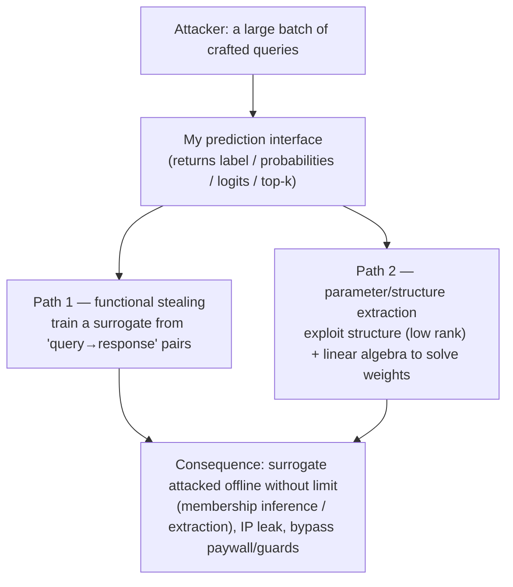

import PrivacyMeta from '@site/src/components/PrivacyMeta';

<PrivacyMeta era="Volume 1 · Privacy foundations" technique="Model extraction & stealing" audience={['Security Engineer', 'ML Engineer', 'Privacy Engineer']} severity="Medium" maturity="Research" evidence="Research" />

> In one sentence: don't assume "weights not published = the model is confidential." As long as I expose a query interface, an attacker with a batch of crafted queries + my outputs can (depending on their goal) **clone my behavior**, and even **solve for some of my parameters**. Tramèr et al. (USENIX Security 2016) cloned logistic regression / decision trees / neural networks with near-perfect fidelity on discriminative ML services; Carlini et al. (ICML 2024 Best Paper) extracted the final projection layer of **production LLMs** and recovered the hidden dimension — at a tens-of-dollars cost under their paper's setup. The privacy implication first: a stolen / cloned model can be **attacked offline, repeatedly** (membership inference, extraction), amplifying one-time API access into a **persistent** privacy risk. Conclusion: API access ≠ zero leakage — threat-model "the queries themselves can be used to extract model information."

## Mechanism: what happens on my side

My prediction interface returns **information** for every query — possibly a label, probabilities, logits, even top-k candidates. The attacker treats me as a **repeatedly queryable function**, with two paths:

1. **Model stealing (functional)**: use a large number of **actively chosen** queries to collect "query → my response" pairs, and train a **surrogate model** to approximate my decision boundary. The goal is to clone **behavior**, not necessarily to obtain my real weights.
2. **Parameter / structure extraction**: exploit a **structural property leaked by the interface** (e.g. the low-rank nature of some layer), combined with linear algebra (binary search, linear programming, singular value decomposition) to **directly solve** for some weights or structural quantities (like the hidden dimension).

To be clear about the red line: this isn't "I actively leaked my weights" — rather, **my outputs mathematically constrain my parameters**, and enough clever queries can **solve** those constraints. I can't introspect this or "decide not to leak," because the leak lives in "the mathematical relationship between output and parameters," not in my intent.



## Threat surface: what can be stolen and where the boundary is

**Can be stolen**:

- **Behavior**: a surrogate that behaves close to me (decision boundary approximation).
- **Some parameters / structure**: like the hidden dimension or the final projection matrix — exactly what Carlini et al. recovered from typical API access to production models.
- **Evasion as a stepping stone**: with a surrogate in hand, run **white-box** adversarial attacks on it, then transfer back to me.

**Privacy amplification (the reason this belongs in a privacy book)**: once the attacker has a surrogate or recovered parameters, they can run membership inference and training-data extraction **offline, with no rate limit** — amplifying "one-time access bounded by my interface's rate / monitoring" into a **persistent attack surface outside my control**.

**Boundary (don't overstate)**: what's been demonstrated is mostly **partial** extraction — Carlini et al. recovered the **projection layer** (up to symmetries), not all weights, let alone the training data itself; extracting full weights / training data is much harder, with cost typically **rising steeply** with model scale. Keep "partially stealable" separate from "the whole model gets stolen," and don't scare yourself on both ends.

## How the defense works

The core fact: **there's no free lunch where you both open queries and leak nothing.** The more information I output (logits > probabilities > label only), the easier stealing is and the fewer queries it takes. All mitigations **raise the attack cost**, they don't eliminate it:

- **Output minimization**: return only the coarsest granularity that suffices (give the label rather than probabilities, truncate rather than full logits when you can).
- **Rate limiting + anomalous-query detection**: high-entropy / systematic boundary-scanning query patterns are a stealing signal.
- **Billing / quotas**: make the cost corresponding to "queries needed to clone" exceed the model's own value.
- **Watermarking / fingerprinting**: doesn't prevent stealing, but helps **trace** a stolen surrogate after the fact.

To break it down: these all **raise the cost**, they're not a boundary. Carlini et al.'s result shows that even exposing a **normal** API that returns no "extra" information, **some parameters can still be solved** — so model "the interface itself leaks information," rather than assuming "not handing out the weights = safe."

## Buildable recipe

```text
1. Minimize output information: return the coarsest granularity downstream truly needs
   (label > truncated probabilities > full logits/embeddings); for every extra tier of
   info, know how much it lowered the stealing cost.
2. Rate limiting + anomaly detection: alert / throttle on systematic, high-entropy,
   boundary-scanning query patterns.
3. Tighten the interface for high-value models: for extremely high-value models, consider
   not exposing raw logits / embedding vectors.
4. Watermark / fingerprint: leave a traceable mark in the model to help prove a stolen
   surrogate after the fact (a post-hoc measure, not prevention).
5. Threat-model "behavior can be cloned": ask "what's the worst after cloning" — IP loss,
   or offline privacy attacks (MIA / extraction on the surrogate)? Tier the interface and
   set monitoring strength accordingly.
```

Every item has to land on **your model's value and interface shape** — "is it worth stealing" and "how expensive is one theft" decide how high you should push the cost.

**Minimal testable assertions** (turn the risk into an estimable, regression-able check):

- How to test: for your interface, estimate the **queries × unit price** needed for "functional cloning to a target fidelity" as a safety margin; and check whether rate limiting / anomalous-query detection is live.
- Pass: the query cost to reach usable fidelity is **higher than** the model asset's value, and there's rate / anomaly protection plus a traceable watermark.
- Fail: a small number of queries yields high-fidelity cloning, or structural quantities can be solved from normal outputs, while the interface has **no** rate limiting / detection → tighten per the recipe.

## Research status (engineering feasibility)

(This entry's maturity is "Research": what follows is **empirical attack** evidence, mostly **partial** extraction; the numbers are tied to each paper's setup, not an endorsement that "the whole model can be casually stolen.")

- **The discriminative-era foundation**: Tramèr et al. (USENIX Security 2016) showed that on **online ML services** like BigML and Amazon ML, a black-box attacker with no priors could extract the functionality of logistic regression, neural networks, and decision trees with **near-perfect fidelity**. This is the earliest systematic evidence for "an open prediction API = an exposed model," and is exactly why this entry sits in Volume 1's "pre-LLM, discriminative-era privacy foundations."
- **Reaching production LLMs**: Carlini et al. (ICML 2024 Best Paper) give the **first parameter-stealing attack on production language models**: with **typical API access** alone, top-down recovery of a transformer's **final projection layer** (up to symmetries). Under their paper's setup, **tens-of-dollars worth of queries** recovered the entire projection matrix of OpenAI's Ada / Babbage, confirming for the first time their hidden dimensions of 1024 / 2048; they also recovered gpt-3.5-turbo's hidden dimension (the paper estimates roughly thousands of dollars to recover its full projection matrix). The method is targeted queries + exploiting the final layer's low rank, with binary search / linear programming / SVD. **These numbers are tied to their attack setup and the interface behavior at the time — verify the conditions at the source before citing.**

## Residual risk and trade-offs

Breaking the false security item by item:

- **Defense raises cost, doesn't eliminate.** As long as you open queries and return informative output, stealing has a path; what you can do is make it **too expensive to be worth it**.
- **Output minimization has a cost.** Legitimate downstream consumers needing probabilities / embeddings are affected — a real security-vs-usability trade-off to account for openly.
- **Detection can be evaded.** Slow, distributed, human-like queries can dodge anomaly detection; it lowers risk, doesn't give a boundary.
- **Stealing amplifies downstream privacy attacks.** This is the key from the privacy angle: once a surrogate is in hand, the attacker can run membership inference / extraction **offline, without limit**, bypassing your interface's rate and monitoring.
- **"Weights not published" ≠ "confidential."** Your outputs already constrain the parameters mathematically; confidentiality depends on **output granularity + query cost**, not on "I didn't ship the weights."

## How this differs from neighboring techniques

- **Model extraction vs. membership inference (this volume)**: MIA asks "is **a given sample** in the training set"; this entry steals **the model itself** (behavior / parameters). But they're strongly related — **stealing amplifies MIA**: with a surrogate, run membership inference offline, without limit.
- **Model extraction vs. training-data extraction (Volume 2)**: training-data extraction wants the **training corpus** (data); this entry wants the **model parameters / behavior** (the model). Different objects, but a stolen model makes the former easier.
- **Model extraction vs. confidential inference (Volume 5)**: confidential inference defends against the **cloud provider / co-tenant** seeing weights or inputs (trust boundary at the **infrastructure**, see [Confidential inference](../05-frontier-deployment/confidential-inference.mdx)); this entry defends against a **legitimate API user** reverse-engineering via queries (trust boundary at the **interface**). Both concern model confidentiality, but with different adversaries and boundaries.

## Version notes

:::note Applicable versions
"Opening a prediction / generation interface leaks model information, and enough queries can clone behavior or solve for some parameters" is a **model-independent, paradigm-level** fact (the root cause is that outputs mathematically constrain parameters). But the **specific cost, which part can be solved, and how many queries it takes** are tightly tied to model structure, the interface's output granularity, and the attack setup — Tramèr's (2016, discriminative services) and Carlini's (2024, the projection layer of production LLMs) numbers **don't transfer directly** to your model; you must re-estimate against your own interface and asset value. Stamped 2026-06. (Sources verified 2026-06.)
:::

## Further reading and sources

- [Stealing Machine Learning Models via Prediction APIs (Tramèr et al., USENIX Security 2016; arXiv 1609.02943)](https://arxiv.org/abs/1609.02943) — founds model extraction: black-box queries clone logistic regression / NN / decision trees on discriminative ML services with near-perfect fidelity. This entry's primary source (the discriminative-era foundation).
- [Stealing Part of a Production Language Model (Carlini et al., ICML 2024 Best Paper; arXiv 2403.06634)](https://arxiv.org/abs/2403.06634) — first parameter-stealing on production LLMs: typical API access recovers the final projection layer and hidden dimension; the numbers are tied to their setup, verify conditions before citing.
