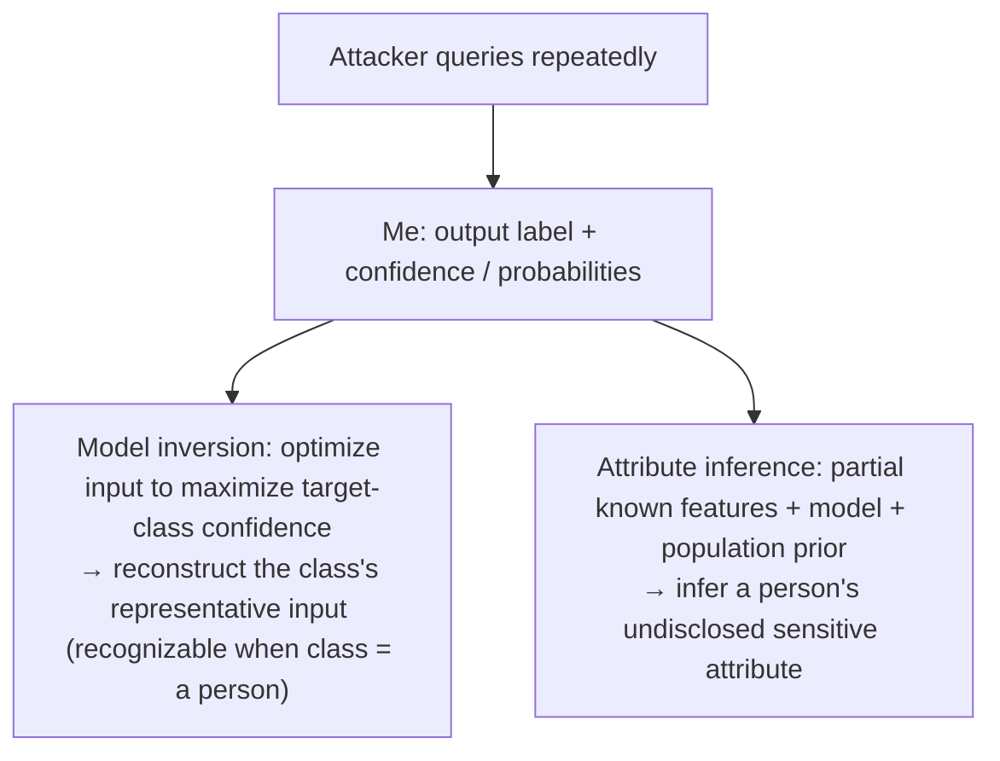

import PrivacyMeta from '@site/src/components/PrivacyMeta';

<PrivacyMeta era="Volume 1 · Privacy foundations" technique="Inference attacks (MIA / inversion / attribute)" audience={['Privacy Engineer', 'ML Engineer', 'Security Engineer']} severity="High" maturity="Research" evidence="Research" />

> In one sentence: beyond "deciding whether someone is in the training set" (membership inference), inference attacks have two more direct, dangerous branches: **model inversion** — using repeated queries + the **confidence** I emit to rebuild what a class's **training sample "looks like"** (Fredrikson et al. at CCS 2015 reconstructed recognizable faces from a face-recognition model); and **attribute inference** — given a person's partial known info + me, inferring their **undisclosed sensitive attribute** (Fredrikson et al.'s 2014 warfarin-dosing case). Conclusion first: **confidence / probability outputs are the fuel**, and attribute inference also borrows population-statistics correlations — don't assume "didn't send raw data out" is safe; look at output granularity, whether DP is stacked, and whether a class maps to a single individual.

## Mechanism: what happens on my side

For each query I often give not just a label but **confidence / probabilities**. These values **mathematically constrain "what input would produce them,"** enabling two attacks:

1. **Model inversion**: the attacker **optimizes an input** to make me give the **highest possible confidence** for a target class; on convergence, the result is a **representative input** for that class. When a class **happens to correspond to one person** (e.g. "per-person face recognition"), this representative reconstruction can be a **recognizable** image of that person (Fredrikson et al., CCS 2015).
2. **Attribute inference**: given a person's **partial known features** + me (a model mapping those features to outputs) + a **population prior**, the attacker infers the person's **undisclosed sensitive attribute** (genotype, health status). Fredrikson et al. (2014) demonstrated this on a personalized warfarin-dosing model.

To be clear about the red line: it's not "I actively revealed whose face / whose attribute" — I can't introspect. What's externally verifiable is that **my confidence outputs constrain the input space, and enough optimization reconstructs a class representative / sensitive attribute**. Same root as model extraction (output constrains parameters) and membership inference (output leaks membership): "the output carries more than the prediction itself."



## Threat surface: what can be inferred, and the boundary

**Can be inferred**:

- **Class representative** (model inversion): an "average / representative" input; when class granularity is one individual, recognizable to the person.
- **Sensitive attribute** (attribute inference): given partial features + population distribution, a high-confidence guess at a person's undisclosed attribute.

**Key boundary / don't overstate** (or it becomes its own misdirection):

- Model inversion mostly reconstructs a **class representative**, **not** a pixel-perfect recovery of a **specific training image** (that's closer to [Gradient leakage](../05-frontier-deployment/gradient-leakage.mdx) or [Training-data extraction](../02-memorization-extraction/training-data-extraction.mdx)); its harm is that when "class = a person," the representative is already recognizable.
- Attribute inference **partly comes from population statistics**, not entirely from "the model memorized this person" — meaning it **can't be fully eliminated** (if an attribute correlates with observable features, it's statistically inferable), though the model's existence **amplifies / eases** it.

## How the defense works

Three complementary measures:

- **Reduce output granularity**: return only labels, or coarsen / truncate confidence — both inversion and attribute inference feed on **fine-grained confidence**, so the less you give, the harder it is (same logic as [Model extraction & stealing](./model-extraction-stealing.mdx)).
- **Differential privacy**: DP bounds single-sample influence on the model, weakening inversion / inference "targeting an individual in training" (see [DP fine-tuning](../03-conversational-llms/dp-fine-tuning.mdx)); but the part of attribute inference **rooted in population correlation**, DP can't suppress.
- **Careful class granularity**: avoid "one class = one real person," which makes inversion directly equivalent to "reconstruct this person."

To break it down: **attribute inference can't be "zeroed out" by technology** — half of it is statistical reality. The honest goal is "**lower the additional leakage the model brings**," not promising "the attacker can infer no attribute." Treating the latter as achievable is this entry's false security.

## Buildable recipe

```text
1. Output minimization: external interfaces default to labels / coarsened confidence; if
   giving fine probabilities, know how much it lowers inversion / inference cost and weigh
   it against asset sensitivity.
2. Review class granularity: avoid "one class = one individual"; treat face / identity
   models as especially high-risk.
3. Stack DP: for models involving individuals in training, use DP to bound single-sample
   influence (report ε), weakening individual-targeted inversion.
4. Distinguish the two risk sources: model inversion (memorization / confidence) is
   engineering-reducible; the population-statistics part of attribute inference isn't —
   state this honestly in privacy evals, don't promise zero.
5. Red-team audit: run model inversion + attribute inference against your interface,
   quantifying "how far it reconstructs / infers under your output granularity / DP," and
   fold into pre-release eval.
```

Every conclusion is tied to **your model, class design, and output granularity** — a paper's invertibility doesn't transfer to your setup.

**Minimal testable assertions** (turn inference risk into a regression check):

- How to test: run model inversion (optimize input to maximize target-class confidence) + attribute inference (partial features + population prior) against your interface, evaluating reconstruction recognizability / attribute-inference accuracy under your output granularity / DP config.
- Pass: under labels-only / coarsened confidence + DP, inversion reconstructions are **not recognizable to an individual** and attribute-inference accuracy is **near the population baseline** (i.e. "the model brings no significant additional leakage").
- Fail: fine confidence can be optimized into a **recognizable** class representative, or attribute inference is **significantly above** the population baseline, while the interface has no output-granularity control / no DP → tighten per the recipe.

## Research status (engineering feasibility)

(This entry's maturity is "Research": below is **empirical attack** evidence, some scenario-specific, not an endorsement that "any model can be casually inverted into an individual.")

- **Reconstructing faces from a face-recognition model**: Fredrikson et al. (ACM CCS 2015) formalized model inversion using **confidence information**, and demonstrated that with **black-box access alone** one can reconstruct **recognizable** faces of training-set members from a face-recognition classifier — revealing that "deploying a face-recognition API exposes the faces of the people in the training set."
- **Real consequences of attribute inference**: Fredrikson et al. (USENIX Security 2014) did an end-to-end case study on a personalized **warfarin-dosing** model, showing that given partial demographics + the model, one can infer an individual's **sensitive genotype** — attribute inference isn't abstract; in healthcare it's real privacy harm.
- (Later work used GANs / diffusion models to improve reconstruction quality; this entry focuses on the founding mechanism and boundary — verify the latest literature before citing specific enhancements.)

## Residual risk and trade-offs

Breaking the false security item by item:

- **Confidence is the fuel.** Exposing fine probabilities = oiling inversion / inference; output minimization has a usability cost, but it's a real trade-off.
- **Model inversion ≠ verbatim recovery of a training image.** It gives a class representative; the harm is when "class = a person." Don't conflate it with gradient inversion / training-data extraction "pulling up any original image."
- **Attribute inference can't be pushed to zero.** Half of it comes from population statistics; the honest goal is "lower the model's additional leakage," not "the attacker gets nothing."
- **DP suppresses the individual, not the statistics.** DP weakens inversion targeting an individual in training, but can't touch the correlation between an attribute and observable features.
- **Class granularity is a modeling decision.** "One class, one real person" makes inversion directly equal "reconstruct this person" — something to avoid at design time.

## How this differs from neighboring techniques

- **Model inversion / attribute inference vs. membership inference (this volume)**: MIA decides "is **a sample in or out** of the training set"; this entry **infers content** (what a class looks like / a sensitive attribute), a step further. All three are on the "inference attacks" board — MIA is the foundation, this entry is its two extensions.
- **Model inversion vs. training-data extraction (Volume 2) / gradient leakage (Volume 5)**: those want **verbatim / pixel-perfect specific training samples** (extracted from memory / gradients); model inversion gives a **class representative** (from confidence optimization) — different reconstruction targets and fidelity, don't conflate.
- **Attribute inference vs. PII regurgitation (Volume 3)**: PII regurgitation is the model **emitting** the personal info it memorized; attribute inference **infers from the output** an attribute that wasn't given — one is reproduction, one is inference.

## Version notes

:::note Applicable versions
"Confidence outputs can be used to invert a class representative / infer a sensitive attribute" is a **model-independent** paradigm-level fact (the output carries more than the prediction). But **how recognizable inversion gets, and how far above baseline attribute inference rises**, are tightly tied to model type, class granularity, output granularity, and data — Fredrikson et al.'s (2014/2015) face / warfarin conclusions **don't transfer directly** to your setup; you must run inversion / inference audits against your own interface. Later GAN / diffusion enhancements keep evolving; stamped 2026-06. (Sources verified 2026-06.)
:::

## Further reading and sources

- [Model Inversion Attacks that Exploit Confidence Information and Basic Countermeasures (Fredrikson et al., ACM CCS 2015)](https://dl.acm.org/doi/10.1145/2810103.2813677) — founds model inversion: black-box confidence to reconstruct recognizable faces of a face-recognition model's training-set members. This entry's primary source.
- [Privacy in Pharmacogenetics: An End-to-End Case Study of Personalized Warfarin Dosing (Fredrikson et al., USENIX Security 2014)](https://www.usenix.org/conference/usenixsecurity14/technical-sessions/presentation/fredrikson_matthew) — a real attribute-inference case: inferring a sensitive genotype from a dosing model + partial demographics. This entry's attribute-inference basis.
