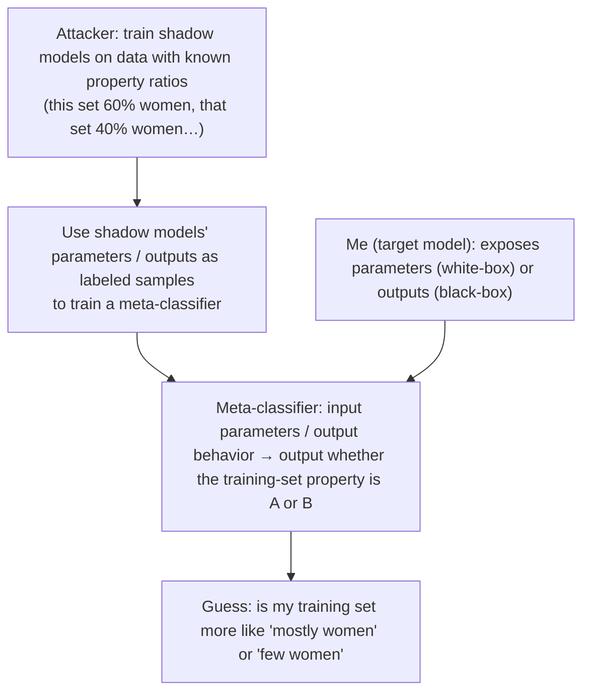

import PrivacyMeta from '@site/src/components/PrivacyMeta';

<PrivacyMeta era="Volume 1 · Privacy foundations" technique="Inference attacks (MIA / inversion / attribute)" audience={['Privacy Engineer', 'ML Engineer', 'Security Engineer']} severity="Medium" maturity="Research" evidence="Research" />

> In one sentence: this entry isn't about deciding whether someone is in (membership inference) or rebuilding a specific sample (inversion) — it's about extracting a **statistical property** of my whole training **set**: "what fraction of women / a given ethnicity was this model trained on." Ganju et al. (CCS 2018) did exactly this with a **meta-classifier**: on US Census Income data, it distinguishes training sets that are **38% vs 65% women** and **0% vs 87% white**. Suri & Evans (PoPETs 2022) then **formalized** it as "distribution inference" and gave the `n_leaked` metric to quantify the risk. Conclusion first: **the population makeup of a training set can itself be sensitive** (trade secret / group privacy) — don't focus only on protecting a single individual; sometimes the attacker doesn't want any one record at all.

## Mechanism: what happens on my side

My **parameters** and **output statistics** mathematically carry traces of the training set's **overall distribution** — not any one record, but "what this batch of data looks like." An attacker exploits this by training a **meta-classifier**: its input is my parameters (white-box) or my output behavior (black-box), and its output is "is this model's training set more like A or B" (e.g. "women a majority or a minority").

Concretely, Ganju et al.'s (CCS 2018) white-box approach: a fully connected network's (FCNN) neurons have **permutation invariance** — reorder the neurons within a layer and the function is unchanged, yet the **arrangement of the raw weight vector** changes. Feeding the weights directly to a meta-classifier drowns it in this meaningless permutation noise; they instead feed a **representation that is invariant to neuron permutation** (map each neuron's parameters to features, then aggregate within a layer in a permutation-invariant way), so the meta-classifier learns to read a training-set property out of "a layer's overall parameter distribution." The attacker first trains a batch of "shadow models" on data with **known property ratios** (this set 60% women, that set 40% women…), uses their parameters as labeled samples to train the meta-classifier, and once it's trained, runs it once against my parameters to get a guess at my training set's ratio.

To be clear about the red line: it's not "I know what fraction of women is in my training set / I remember this batch's makeup" — I can't introspect my training set's ratio. What's externally recomputable is that **my parameter / output statistics vary with the training set's population makeup — enough for an attacker to train a meta-classifier that tells different makeups apart**.



## Threat surface: what can be inferred, and what the attacker needs

**Can be inferred**: the training set's **aggregate / population property** — the **ratio / makeup** of some sensitive feature (what fraction women, the share of an ethnicity, the share of a region's samples, the positive/negative class ratio), not any specific record. What Ganju et al. distinguished on Census Income data is **overall-makeup** differences like 38% vs 65% women, 0% vs 87% white.

**Attacker model / prerequisites** (these decide feasibility — spell them out per BACKLOG-privacy.md "classification checklist"):

- **White-box vs black-box**: Ganju et al.'s demonstration is **white-box** — the attacker has my parameters (open / shared weights, parameter exchange in federated learning, model exfiltration). That's the strongest, most direct setting. Property / distribution inference also has **black-box** variants (query only, train the meta-classifier on observed output behavior), but black-box is generally harder with less information. **First, be clear which exposure surface you have.**
- **Can train shadow models**: the attacker needs to train same-architecture shadow models on data with **known property ratios** (knowing or approximating my training pipeline and architecture).
- **Binary / distinguishing**: the classic setting is **distinguishing two makeups** (A vs B), not reading out a continuous ratio directly; estimating "exactly what percent" is harder and depends heavily on the ratio range the shadow models cover.
- **Success criterion**: the meta-classifier's **distinguishing accuracy** on held-out target models — and (see below) the `n_leaked` Suri & Evans convert it into.

## How the defense works

Say it bluntly up front: **distribution inference can't be pushed to zero — that's statistical reality**, just like the population-correlation part in [Model inversion & attribute inference](./model-inversion-attribute-inference.mdx). As long as parameters / outputs vary statistically with the training set's makeup (they must, or the model learned nothing), there is in principle a learnable signal. So the honest goal is "**assess and be informed**," not "promise the attacker can infer no population property." Treating the latter as achievable is this entry's false security.

Given that, what you *can* do is **raise the attack cost and shrink the leakage**:

- **DP helps somewhat, but it's aimed at the wrong target**: DP bounds a **single sample's** influence on parameters, which is directly effective against attacks "targeting an individual in training" (membership inference / individual inversion); but distribution inference wants the **overall makeup**, an aggregate that DP's individual-level guarantee **doesn't directly cover** — don't treat DP as a silver bullet for distribution inference. (DP mechanism: [DP fine-tuning](../03-conversational-llms/dp-fine-tuning.mdx).)
- **Control the parameter exposure surface**: white-box is the strongest setting. If you can avoid publishing raw weights, do (distill / expose only an API / use secure aggregation in federated learning), pushing the attacker back from white-box to black-box and sharply reducing the signal.
- **Quantify with `n_leaked`, not gut feel**: Suri & Evans (PoPETs 2022) convert "the meta-classifier's distinguishing accuracy" into an intuitive quantity — **how many records the adversary would need to sample directly from the population distribution to match that distinguishing power**. This turns an abstract "attack success rate" into "equivalent to leaking N samples," easy to align with your asset sensitivity.

## Buildable recipe

```text
1. First identify the exposure surface: is your model open weights / federated
   parameter exchange (white-box), or API-only (black-box)? Distribution-inference
   signal is strongest under white-box — treat "must we publish weights?" as a privacy
   decision, not an engineering default.

2. Put "training-set population makeup" on the asset list: it may be a trade secret
   (data-source composition) or group privacy (a sensitive attribute's ratio). Don't let
   your threat model only say "protect a single record."

3. Run a distribution-inference red team (distinguishing): train shadow models with
   known ratios + a meta-classifier, and assess "under your exposure surface (white-box /
   black-box), can it distinguish the two makeups you care about (e.g. 30% vs 70% of some
   attribute)." For white-box, reference Ganju et al.'s permutation-invariant approach.

4. Report risk with n_leaked, not just an accuracy: convert the meta-classifier's
   distinguishing power into "equivalent to the attacker sampling how many records"
   (Suri & Evans). Easier to distinguish → smaller n_leaked → more real risk.

5. Tighten the exposure surface: distill / expose only an API / add secure aggregation
   where you can, pushing white-box back to black-box. Stacking DP weakens individual-
   level attacks, but state honestly in privacy evals that "DP doesn't directly cover
   distribution inference" — don't promise zero.
```

Every conclusion is tied to **your model architecture, exposure surface, and the property you care about** — a paper's distinguishability on Census data **doesn't transfer** to your setup.

**Minimal testable assertions** (turn distribution-inference risk into a regression check):

- How to test: train a batch of shadow models with known property ratios + a meta-classifier, and under your real exposure surface (white-box parameters / black-box outputs) measure the meta-classifier's distinguishing accuracy for "the two population makeups you care about," then convert to `n_leaked`.
- Pass: under the form you **actually expose externally** (e.g. API-only, with secure aggregation), the meta-classifier's distinguishing accuracy is **near chance**, or the corresponding `n_leaked` is **large enough that direct sampling is cheaper for the attacker** (i.e. the model brings no significant additional distribution leakage).
- Fail: under a form where you expose weights, the meta-classifier can **significantly distinguish** the two makeups you care about and `n_leaked` is small → tighten the exposure surface per the recipe (distill / withdraw white-box / secure aggregation), and record the residual risk honestly in privacy evals.

## Research status (engineering feasibility)

(This entry's maturity is "Research": below is **empirical-attack / formalization** evidence, tightly bound to the experimental datasets and settings — not an endorsement that "any model can be casually read for its training-set ratio.")

- **Reading a training set's population makeup out of a fully connected network (white-box)**: Ganju et al. (ACM CCS 2018) proposed property inference via a meta-classifier exploiting FCNN **permutation invariance**; on US **Census Income** data it distinguishes training sets that are "**38% vs 65% women**" and "**0% vs 87% white**" — revealing that "sharing the weights of a model trained on a sensitive population leaks that training data's population makeup." (This entry does not cite a single top-line accuracy figure: that number was not verifiable; we describe only the setup and the makeup conditions it distinguishes.)
- **Formalizing the risk + giving `n_leaked`**: Suri & Evans (PoPETs 2022) formalize the above as **distribution inference** and propose the `n_leaked` metric — converting distinguishing accuracy into "how many records the adversary would need to sample directly from the distribution to match that distinguishing power." **Hard**-to-distinguish ratio pairs (e.g. 0.5 vs 0.51) need much more sampling (one figure the paper gives is 95% distinguishing accuracy ≈ `n_leaked` 84), while **easy** ratio pairs (e.g. 0.5 vs 0.9) need very little (the same 95% accuracy ≈ `n_leaked` 3). This makes "how severe is distribution inference" quantifiable against asset sensitivity.
- (Founding thread: meta-classifier property inference traces back to Ateniese et al., "Hacking Smart Machines with Smarter Ones," Int. J. Security and Networks 2015; the two papers above advanced it to neural networks and to formal quantification. Verify the latest literature before citing specific enhancements.)

## Residual risk and trade-offs

Breaking the false security item by item:

- **Distribution inference can't be pushed to zero.** As long as parameters / outputs vary with the training set's makeup (they must), there's a learnable statistical signal; the honest goal is "assess, be informed, shrink the additional leakage," not "the attacker gets nothing."
- **DP is not the silver bullet here.** DP gives an **individual-level** guarantee; distribution inference wants the **aggregate makeup** — the targets don't coincide. Stacking DP weakens individual attacks, but don't treat it as the cure for distribution inference.
- **White-box is the strongest setting.** Publishing weights / federated parameter exchange turns the signal up to maximum. Distill / expose only an API / add secure aggregation to push the attacker back to black-box — an exposure-surface decision to make at design time.
- **"Population makeup" is also an asset to protect.** It may be a trade secret (data sources) or group privacy (a sensitive attribute's ratio). Defending only "a single record" misses this whole class of risk.
- **The numbers are tightly bound to the setting.** Ganju's distinguishable makeups (38% vs 65%, etc.) and Suri & Evans's `n_leaked` (84 / 3, etc.) are bound to the Census dataset and specific ratio pairs — don't transfer them into "my model is this number too."

## How this differs from neighboring techniques

Make the "**individual vs population**" axis explicit — it's the fundamental boundary between this entry and its two neighbors:

- **vs [Membership inference](./membership-inference.mdx) (this volume)**: membership inference asks "is **one specific individual in or out** of the training set" (a yes/no bit); this entry asks "what is the **whole set's** population makeup" (an aggregate property). The former is individual-level, the latter population-level — both on the "inference attacks" board, but the unit of leakage differs.
- **vs [Model inversion & attribute inference](./model-inversion-attribute-inference.mdx) (this volume)**: there, "attribute inference" infers **one individual's** undisclosed sensitive attribute (this person's genotype), or rebuilds a **class's representative sample**; this entry infers the **whole training set's** population property (what fraction women). One lands on the **individual**, the other on the **population** distribution — both names carry "attribute," but the unit they act on is the opposite, so don't conflate them.

## Version notes

:::note Applicable versions
"Parameter / output statistics carry traces of the training distribution and can be read by a meta-classifier into a population property" is a **model-independent** paradigm-level fact. But **how fine a makeup can be distinguished, and what `n_leaked` is**, are tightly tied to model architecture, exposure surface (white-box / black-box), the ratio range the shadow models cover, and the dataset — Ganju et al.'s (2018) Census-distinguishable makeups and Suri & Evans's (2022) `n_leaked` values **don't transfer directly** to your setup; you must run distribution-inference audits against your own exposure surface. Enhancements beyond these two papers keep evolving; stamped 2026-06. (Sources verified 2026-06.)
:::

## Further reading and sources

- [Property Inference Attacks on Fully Connected Neural Networks using Permutation Invariant Representations (Ganju et al., ACM CCS 2018)](https://dl.acm.org/doi/10.1145/3243734.3243834) — white-box property inference: a meta-classifier exploiting FCNN permutation invariance distinguishes a training set's population makeup on Census Income data (38% vs 65% women, 0% vs 87% white). This entry's primary source.
- [Formalizing and Estimating Distribution Inference Risks (Suri & Evans, PoPETs 2022)](https://petsymposium.org/popets/2022/) — formalizes attribute inference as distribution inference and proposes `n_leaked` (≈84 for hard ratio pairs, ≈3 for easy ones) to quantify the risk. This entry's basis for the distribution-inference formalization and quantification.
- (Foundational, optional) Ateniese et al., "Hacking Smart Machines with Smarter Ones" (Int. J. Security and Networks 2015) — the origin of meta-classifier property inference.
