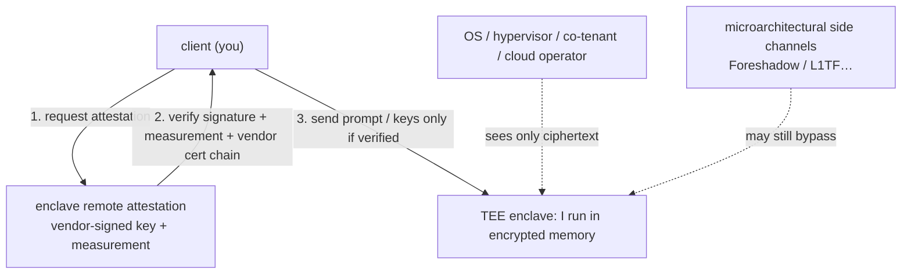

import PrivacyMeta from '@site/src/components/PrivacyMeta';

<PrivacyMeta era="Volume 1 · Privacy foundations" technique="Privacy-preserving computation" audience={['Privacy Engineer', 'Security Engineer', 'ML Engineer']} severity="Medium" maturity="Production" evidence="Official docs" />

> In one sentence: a trusted execution environment (TEE) uses **hardware** to fence **data in use** into an encrypted, remotely attestable enclave, so co-tenants, a malicious OS / hypervisor, even the cloud operator can't see inside — the hardware route to keeping an LLM's prompts and weights **confidential from the cloud provider**. But hold two boundaries: the **root of trust is the chip vendor** (you trust Intel / AMD / NVIDIA's keys and implementation), and TEEs have been repeatedly broken by **microarchitectural side channels** (the Foreshadow family). It's the load-bearing wall for Volume 5's "confidential inference," so Volume 1 spells out up front what it does and doesn't guarantee.

## Mechanism: what happens on my side

When I (the model) run inside a TEE, two things happen on my side:

1. **Memory / GPU memory is hardware-encrypted and isolated.** The memory where I process your prompt is encrypted and integrity-protected at runtime by the chip; the OS, hypervisor, and other tenants on the same machine — even with higher privilege — see only ciphertext. The Confidential Computing Consortium (CCC) defines a TEE's guarantee as three properties: **data confidentiality, data integrity, and code integrity** (CCC, *A Technical Analysis of Confidential Computing*).
2. **Remote attestation.** The hardware uses a **vendor-signed key** to produce a report proving "this is a genuine enclave running exactly the code you specified (measurement matches)." You **verify that attestation first, then** send the prompt / keys in. NVIDIA H100 is the first GPU to support confidential computing: an on-die root of trust + signed attestation report, with CPU↔GPU transfers encrypted via **AES-GCM-256** (NVIDIA official).

Red line: a TEE gives "**outsiders can't see it + provable identity**," **not** "absolutely secure." It **shifts** trust to the chip vendor, doesn't protect against bugs in the enclave's own code, and can't stop the side channels below.



## Threat surface: what a TEE does and doesn't defend

- **Defends**: snooping co-tenants, a malicious OS / hypervisor, and (on some parts) a cloud operator with physical access — the core promise is "hand data to the cloud, but the cloud can't see plaintext."
- **Doesn't defend ① a compromised root of trust**: you're forced to trust the chip vendor's key infrastructure and implementation; if the vendor's root keys or attestation service fail, the whole trust chain collapses.
- **Doesn't defend ② microarchitectural side channels**: Foreshadow (L1 Terminal Fault) used transient out-of-order execution to read protected memory from an SGX enclave, and the demonstration **extracted even Intel's own remote-attestation keys** (Van Bulck et al., USENIX Security 2018); SGAxe, ÆPIC Leak, and others since have repeatedly shown a TEE's confidentiality gets broken by new microarchitectural attacks.
- **Doesn't defend ③ bugs in the enclave's code**: a TEE guarantees "outsiders can't look," not "the inside is bug-free" — memory corruption inside the enclave still leaks.
- **Doesn't defend ④ exfiltration paths**: once your code moves data out of the TEE (writes a log, calls a non-TEE service), protection ends.

## How the defense works

A TEE rests on three pieces: **hardware isolation + runtime memory encryption + remote attestation**. The load-bearing one is **remote attestation** — without it, "I send data to something claiming to be a TEE" is meaningless (the other end could be an impostor process); with it, you can cryptographically verify, **before** handing over plaintext, that the other end really is genuine code on genuine hardware. So "used a TEE" and "verified the attestation correctly" are two different things — only the latter is the security boundary.

## Buildable recipe

```text
1. Pick hardware: CPU TEE (Intel TDX / SGX, AMD SEV-SNP) protects the CPU side;
   GPU TEE (NVIDIA H100 / H200 confidential computing) protects GPU-side inference.
2. Verify attestation on the client (the crux): before sending data — check the
   vendor signature, compare the measurement (is it your code / model?), validate
   the vendor cert chain and revocation; refuse to send if anything mismatches.
3. Encrypt the links: CPU-GPU and client-enclave end to end (e.g. H100's
   AES-GCM-256); don't let data travel in the clear into/out of the enclave.
4. Shrink the TCB: put only necessary code (model + minimal runtime) in the
   enclave to reduce the "bug inside the enclave" surface.
5. Track microcode / patches: side channels are mitigated by ongoing vendor
   microcode; pin the specific CPU model and microcode version.
```

Every choice carries **your threat model**: are you defending against co-tenants, the cloud operator, or an attacker with physical access? Different goals map to different hardware and different residual side-channel assumptions.

**Minimal testable assertions** (turn attestation verification into a regression check — don't stop at "we used a TEE"):

- How to test: tamper with / forge the enclave or change the code measurement, and run the client verification flow.
- Pass: when the measurement mismatches, the vendor signature is invalid, or the cert-chain / revocation check fails, the client **always refuses to send plaintext**; it sends only when all pass.
- Fail: the client doesn't verify attestation (or only sets up TLS but never compares the measurement) → that's not really using the TEE; make attestation verification a gate before sending.

## A real case / current vendor state

TEE is a **shipping** technology: Intel SGX / TDX and AMD SEV-SNP are mature CPU-side products; **NVIDIA H100 is the first GPU to support confidential computing** — standard PyTorch / TensorFlow / ONNX models run in the GPU TEE **without modification**, and the client just adds an attestation-verification step before sending data (NVIDIA official). This moves "confidential inference" from theory to "deployable on mainstream AI stacks."

:::caution To be verified
Apple Private Cloud Compute (PCC) is marketed as a consumer-facing production instance of confidential inference; this entry has **not deeply verified** its mechanism details (attestation scope, the trust assumption in Apple itself). Verify against Apple Security's official docs before citing (recorded in `BACKLOG-privacy.md`).
:::

## Residual risk and trade-offs

Calling out each false security:

- **"Running in a TEE" ≠ secure.** The side-channel record (Foreshadow / SGAxe / ÆPIC…) repeatedly shows confidentiality gets broken; security is tied to the specific CPU model, microcode version, and patch status — not a one-and-done.
- **"A TEE means we needn't trust the cloud vendor" ≠ eliminating trust.** You merely **shifted** trust from the cloud operator to the chip vendor — root keys, attestation service, and hardware implementation all have to be trusted. Trust didn't vanish; it changed target.
- **Not verifying attestation = not using the TEE.** The most common deployment mistake: build an enclave but never compare the measurement on the client — that's sending plaintext to a black box that merely "claims" to be a TEE.
- **A TEE doesn't cover bugs inside the enclave.** Memory corruption and logic flaws inside still leak; the bigger the TCB, the higher the risk.
- **Performance overhead varies widely by scenario.** Memory encryption, encrypted CPU-GPU transfer, and weight swap-in/out all add cost, with **reports ranging from low single-digit percent to several times**, depending on workload / model size / batch / whether weight protection and attestation are included — measure on your own load, don't lift a single optimistic number (specific figures to be verified against a first source; see `BACKLOG-privacy.md`).

## Compliance mapping

- **GDPR Art. 32 (appropriate technical measures)**: a TEE brings "data in use" under protection too (filling the gap beyond at-rest / in-transit), helping argue "appropriate technical and organizational measures were taken."
- **Liability doesn't vanish with a TEE**: putting inference in a cloud TEE still likely makes the cloud vendor a **processor / subprocessor** in law — not seeing plaintext technically does not dissolve the contractual and liability relationship (you still need a DPA, subprocessor disclosure, etc.; see [Inference-service data boundary](../06-governance-compliance/inference-service-data-boundary.mdx)).

(Compliance evolves with the statute version; this section is stamped 2026-06 — verify the latest enacted text before citing.)

## How this differs from neighboring techniques

- **TEE vs. HE / MPC**: a TEE trades **hardware trust** for performance — fast and general, but you trust the chip vendor and live with side channels; HE / MPC rest on **cryptography** — no hardware trust, but far slower (see [HE·MPC](./he-mpc.mdx), the other foundation in this volume). The three are often weighed together: trade speed for hardware trust, or cryptography for zero hardware trust.
- **TEE vs. DP**: a TEE protects "**data in use from being seen by outsiders**" (the operational / deployment surface); differential privacy protects "**outputs from leaking a single sample**" (the training surface). One blocks outside snooping, the other bounds internal leakage — orthogonal, and stackable.

## Version notes

:::note Applicable versions
A TEE is a **model-agnostic** hardware mechanism, but **tightly bound to specific chips and microcode**: guarantees, performance, and known side channels all change with CPU / GPU generation and patches. This entry reflects the 2026-06 product landscape (Intel SGX/TDX, AMD SEV-SNP, NVIDIA H100/H200 confidential computing); the security and overhead of a specific model are whatever the vendor's current docs and your own measurements say. (Sources verified 2026-06.)
:::

## Further reading and sources

Mixed evidence — **primary: official docs / standards** (CCC, NVIDIA); **supplementary: research** (Foreshadow side channel).

- [A Technical Analysis of Confidential Computing (CCC, v1.3)](https://confidentialcomputing.io/wp-content/uploads/sites/10/2023/03/CCC-A-Technical-Analysis-of-Confidential-Computing-v1.3_unlocked.pdf) — standard: the TEE's confidentiality / integrity / code-integrity definition and the "data in use" gap.
- [Confidential Computing on H100 GPUs (NVIDIA official)](https://developer.nvidia.com/blog/confidential-computing-on-h100-gpus-for-secure-and-trustworthy-ai/) — official: the first confidential-computing GPU, on-die root of trust, remote attestation, CPU-GPU AES-GCM-256 encryption.
- [Foreshadow: Extracting the Keys to the Intel SGX Kingdom (Van Bulck et al., USENIX Security 2018)](https://www.usenix.org/conference/usenixsecurity18/presentation/bulck) — research: L1TF transient execution reads protected memory from an SGX enclave, extracting even attestation keys.
