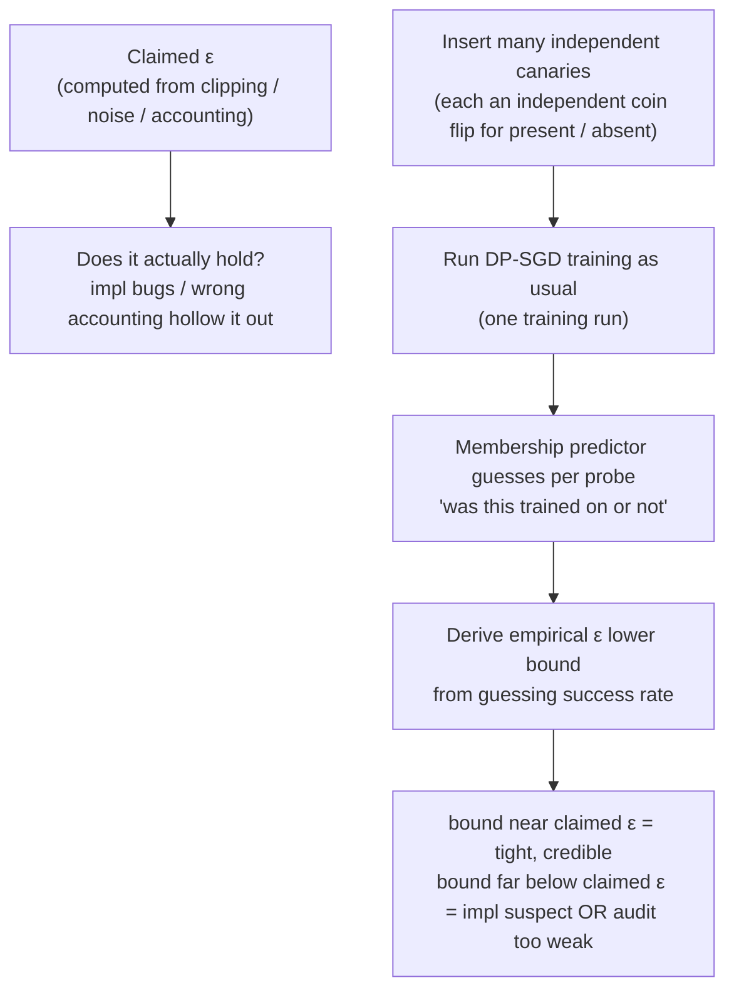

import PrivacyMeta from '@site/src/components/PrivacyMeta';

<PrivacyMeta era="Volume 2 · Memorization and extraction" technique="Privacy evaluation & auditing" audience={['Privacy Engineer', 'ML Engineer', 'Security Engineer']} severity="Medium" maturity="Research" evidence="Research" />

> In one sentence: you turned on DP-SGD and reported "ε=8" on the model card — but is that ε real? A miswritten clip, too little noise, or the wrong accounting convention will **silently** hollow out the guarantee while the reported number sits unchanged. **DP auditing** is the test: insert many independent probes into training, then use how well you can guess "which probes were trained on" to derive an **empirical ε lower bound** — the privacy you actually deliver is no stronger than that bound. Steinke et al. (NeurIPS 2023 Outstanding Paper) made it runnable in **one training run**, cheap enough to keep as a regression check. Conclusion first: **"we used a DP library" does not mean "the ε holds"**, and auditing is the only empirical way to turn a *claimed* ε into an *audited* ε.

## Mechanism: what happens on my side

In ordinary training, how much a single sample can move my parameters has no uniform bound in the differential-privacy sense; DP-SGD installs a provable (ε, δ) ceiling on it via per-sample clipping plus noise (how to do that is [DP fine-tuning](../03-conversational-llms/dp-fine-tuning.mdx)). **But that (ε, δ) is computed — from the clip norm, noise multiplier, sampling rate, and step count in your code, run through a privacy accountant — and being computed is not the same as holding.** One deviation in the implementation (gradients not actually clipped, noise added in the wrong place, the accountant fed the wrong sampling rate, batching that isn't Poisson) and the reported ε is a paper number while the real leakage can be far larger.

Auditing approaches it from the other direction: rather than trusting the *computed* ε, it **lower-bounds the ε you actually deliver from observable behavior**. The method inserts many **independent probes (canaries)** into the training set — each probe's presence/absence decided by an independent coin flip. After training, a membership predictor **guesses**, for each probe, "was this one trained on or not." The better the guesses, the more sharply I separate "is this sample in training or not"; and (ε, δ)-DP is exactly what upper-bounds that distinguishability — so the **guessing success rate** can be translated back into an **empirical lower bound on ε**: no claimed ε should sit below the bound the audit forces out.

The red line has to be stated plainly here, or it becomes false security: auditing is **not** me introspecting "I remember this probe, I know it's in my training set" — I can't reliably introspect training-data influence. What the audit measures is an **externally observable, recomputable quantity** — the empirical ε lower bound derived from membership-guess success on the inserted probes. The subject can be "I," but the predicate (how well membership can be guessed, and the ε it lower-bounds) is something others compute from my outputs/weights, not something I attest to remembering. An empirical bound that lands close to the claimed ε means the guarantee is "tight" and fairly credible; a bound far below the claimed ε only means "either the implementation/accounting is broken, or this audit itself is too weak" — it's a **lower bound**, and it can't distinguish those two cases (see "Residual risk").



## Threat surface: what the audit can and can't measure

This entry is a **defender's measurement tool** — you use it to verify your *own* DP implementation, not to attack someone else. So the "threat surface" becomes **capability and blind spots**:

**Can measure**:

- **An empirical ε lower bound**: a checkable number saying "the privacy you actually deliver is no stronger than this." It gives the *claimed* ε an empirical counterpart — if you reported ε=8, ask whether the audit can force out a bound near it.
- **Implementation / accounting bugs**: an audited bound that **clearly exceeds** your claimed ε is a hard red flag — it means your real privacy is worse than claimed, most likely because clipping didn't take effect, noise was added wrong, the accounting convention is off, or sampling isn't Poisson. These bugs are often invisible on code review; the audit surfaces them from behavior.
- **The cost of one training run**: Steinke et al.'s key contribution is compressing auditing from "train hundreds of models" down to "train one" — by inserting many **independent** probes in the **same** run and using their presence/absence as many independent trials (Steinke et al., NeurIPS 2023). Cheap enough to wire into CI regression.

**Can't measure / limits** (must be stated, or it becomes its own false security):

- **The audit gives a lower bound, not an upper bound.** The upper bound ("worst-case leakage is no more than X") still comes only from **proof** — the privacy accounting. Passing the audit is only "no counterexample found"; it never equals "the ε has been proven to hold." Read the bounds together: the accountant gives the upper bound, the audit gives the lower bound, and only squeezing from both ends is meaningful.
- **A loose lower bound ≠ the implementation is correct.** An audited bound far below the claimed ε could mean the implementation is genuinely good — **or that the audit is just too weak** (poor probe design, a weak membership predictor, black-box access to only the last step). A weak audit and a correct implementation **can't be told apart** from a single loose bound.
- **Black-box is usually looser than white-box.** The more the attacker can see, the tighter the bound: seeing all intermediate steps (white-box) squeezes harder than seeing only the final model (black-box). For the same implementation, a black-box audit typically yields a looser bound — don't read a loose black-box bound as "the implementation is very safe."
- **Valid only within the probes / threat model you tested.** Change the probe design, the membership predictor, or the threat model and the bound moves; the paper's bound numbers don't transfer directly to your setting.

## How the defense works

The audit works thanks to the **correspondence between differential privacy and statistical distinguishability**: (ε, δ)-DP upper-bounds "how much one sample's presence/absence shifts the output distribution," and therefore upper-bounds the success rate of "guessing back, from the output, whether that sample was present." Turn it around — **if the membership-guess success rate you observe is high enough that only 'ε is at least some value' can explain it, that value is an empirical lower bound**. That is the mathematical pivot that turns a *claimed* ε into an *audited* ε.

What it protects, and what it doesn't, has to be nailed down:

- **It upgrades "I claim ε=X" into "I audited that the privacy actually delivered is no stronger than ε≥L."** The closer L is to X, the more your accounting isn't fooling itself; L far below X is a signal to go back and check the implementation/accounting (not "proven safe").
- **It does not replace proof.** The formal upper bound always comes from the privacy accountant; the audit is the empirical **falsifier** — it catches fakes, it doesn't issue certificates. The two are the upper bound (proof) and the lower bound (audit), the two halves of the picture.

What made this genuinely practical, from Steinke et al., is dropping the audit from "train hundreds of models to force out one meaningful bound" to **one training run**: insert many **independent** probes in a single run, manufacture many independent trials from "can each probe be added/removed independently," and fold them into one bound using the connection between DP and statistical generalization (Steinke et al., NeurIPS 2023). Only once the cost falls from "hundreds of runs" to "one" does auditing go from a paper exercise to a regression-able engineering step.

## Buildable recipe

Back to a neutral engineering register. The audit skeleton is "insert probes → train once → guess membership → derive the bound":

```text
1. Design the probe set: build many independent canaries; each one's presence in
   this run is decided by an independent coin flip. Probes should resemble your real
   sensitive strings (rare, fixed-format, high-influence) and be mutually independent
   — independence is the premise for "one training run as many trials."
2. Run your DP-SGD as usual: use the real implementation and hyperparameters you
   want to audit (clip norm C, noise multiplier σ, sampling rate q, steps T). Don't
   swap in a "clean" codebase for the audit — the thing under audit is the code you ship.
3. Guess membership per probe: after training, use a membership predictor (e.g. rank
   by each probe's loss / score) to guess "was this probe in this run." White-box can
   use all intermediate steps; black-box uses only the final model — record which,
   because the bound is valid only within that threat model.
4. Derive the empirical ε lower bound: from the guessing success rate (hits / false
   positives), compute the empirical ε lower bound L with the audit formula, and
   annotate threat model (black-box / white-box), probe count, model, and dataset.
5. Compare with the claimed ε and set a gate: put L next to the ε your accountant
   reported. L exceeds the claimed ε → hard fail (real leakage over budget, go check
   the implementation / accounting); L far below the claimed ε → only "no counterexample
   found," don't claim "verified private" from it — record the audit's strength
   (probe count / predictor / black-box vs white-box).
```

Every number is tied to **your model, data, probe design, and threat model** — paper values like "white-box empirical ε≥1.8 against an analytical upper bound of about 4" (WideResNet / CIFAR-10, DP-SGD claiming (ε=8, δ=10⁻⁵), white-box; Steinke et al., NeurIPS 2023, verified 2026-06) **must not be copied over**; they're comparable only within that setup.

**Minimal testable assertions** (turn the audit into a regression check, don't stop at "we inserted probes"):

- How to test: insert a fixed set of independent probes into the DP training pipeline you're about to ship, run one audit, compute the empirical ε lower bound L under the same convention, and compare with the claimed ε the accountant reported; record threat model (black-box / white-box), probe count, model, and dataset.
- Pass: L is **not above** your claimed ε (no counterexample of "real leakage over budget" found); and the audit strength (probe count, predictor, white-box / black-box) is equal to or stronger than the previous version, so L is comparable across versions. **Note**: passing only proves "no counterexample this time," not "the ε holds" — the formal upper bound still comes from the accountant.
- Fail: L **exceeds** the claimed ε (real privacy weaker than claimed, go check clipping / noise / accounting / whether sampling is Poisson); or there's no audit baseline; or L jumps once you use a stronger predictor → the audit didn't pass; don't ship at the claimed ε.

## Research status (engineering feasibility)

(This entry's maturity is "Research": the methodology comes from peer-reviewed academic work; below is the method and engineering-feasibility evidence, not an endorsement that "DP auditing is already a standard production gate.")

- **One training run auditing (this entry's primary source)**: Steinke, Nasr, and Jagielski's *Privacy Auditing with One (1) Training Run* won the **NeurIPS 2023 Outstanding Paper award**. By inserting many **independent** probes in the **same** run and deriving an empirical ε lower bound from membership guesses, it compresses auditing that previously "needed hundreds of models" down to **one training run**; the method makes minimal assumptions about the algorithm and works in both black-box and white-box settings. On WideResNet / CIFAR-10 with DP-SGD claiming (ε=8, δ=10⁻⁵), it forces out a **white-box** empirical ε≥1.8 (against an upper bound of about 4 in their analysis; verified 2026-06) — the visible gap between the lower and upper bounds is exactly why "the audit gives a lower bound, not an upper bound."
- **Prior auditing work (the multi-model route)**: Jagielski, Ullman, and Oprea's *Auditing Differentially Private Machine Learning: How Private is Private SGD?* (NeurIPS 2020) uses **data-poisoning attacks** to construct worst-case samples and approach an empirical privacy lower bound across **many training runs**, in order to empirically check "whether DP-SGD's real privacy is better than the analytical guarantee." It established the "reverse an empirical bound out of attack success" idea, but at high cost (many models must be trained) — exactly the pain point one-run auditing addresses.

## Residual risk and trade-offs

Breaking the false security item by item:

- **"We used a DP library = the ε holds" is wrong.** ε is computed from the clipping / noise / accounting in your code; one deviation in the implementation or accounting hollows it out while the reported number doesn't move. The reason auditing exists is that this number is **untrusted by default** and has to be empirically falsified.
- **The audit gives a lower bound, not an upper bound.** It can catch "real leakage over budget," but not catching it **does not equal** "the ε has been proven to hold." The upper bound always comes from proof (the accountant); the audit is the other half — don't let it stand alone as "verified private."
- **Black-box auditing is usually looser than white-box.** The less the attacker sees, the looser the forced bound; a loose black-box bound **doesn't mean the implementation is safer**, only that this audit saw less. Comparing bounds across threat models is meaningless.
- **A weak audit ≠ a correct implementation.** A loose bound could be a genuinely good implementation, or poor probes / a weak predictor / black-box-only — you can't tell those apart from a loose bound. Don't read "not caught" as "proven absent."
- **The bound moves with audit strength.** A stronger membership predictor, more probes, or white-box information pushes the bound up; today's loose bound may climb above the claimed ε under a stronger attack. The audit is a **per-version, use-a-strong-enough-attack** regression item, not a one-time checkup.

## How this differs from neighboring techniques

- **DP auditing vs. quantifying memorization (this volume)**: [Quantifying memorization & auditing](./quantifying-memorization.mdx) measures **memorization** — using a probe's exposure to quantify "how much I memorized"; this entry audits the **formal (ε, δ) guarantee** — "is the privacy upper bound you claim empirically holding?" One looks at memorization strength, the other at whether the ε has been hollowed out; both use probes, but ask different questions.
- **DP auditing vs. DP fine-tuning (Volume 3)**: [DP fine-tuning](../03-conversational-llms/dp-fine-tuning.mdx) is about **how to do** DP training (clipping + noise + accounting produce a claimed ε); this entry is about **how to verify** the ε you claim — confronting the *computed* ε with an empirical lower bound. The former produces the claimed ε, the latter falsifies / supports it; use them together: after DP fine-tuning, force out an empirical bound with the audit and see how far it sits from the claimed ε.

## Version notes

:::note Applicable versions
The auditing paradigm "reverse an empirical ε lower bound out of membership / attack success" (the multi-model route, NeurIPS 2020) and the cost-reduction to "auditing in one training run" (NeurIPS 2023) are **model-independent** methodology, common across vendors. But the **absolute value of the empirical ε lower bound, its gap from the claimed ε, and the black-box / white-box difference** are all tied to your probe design, membership predictor, threat model, model, and dataset; paper values (e.g. white-box ε≥1.8 against an upper bound of about 4) **don't transfer directly**, and every new version must be **re-audited** with your own implementation and a strong-enough attack. Stamped 2026-06. (Sources verified 2026-06.)
:::

## Further reading and sources

- [Privacy Auditing with One (1) Training Run (Steinke, Nasr, Jagielski, NeurIPS 2023 Outstanding Paper; arXiv 2305.08846)](https://arxiv.org/abs/2305.08846) — this entry's primary source. Inserts many independent probes in one training run and reverses an empirical ε lower bound out of membership guesses, dropping auditing from "hundreds of runs" to "one"; includes the WideResNet / CIFAR-10 result of white-box empirical ε≥1.8 under a claimed (ε=8, δ=10⁻⁵).
- [Auditing Differentially Private Machine Learning: How Private is Private SGD? (Jagielski, Ullman, Oprea, NeurIPS 2020)](https://papers.nips.cc/paper/2020/hash/fc4ddc15f9f4b4b06ef7844d6bb53abf-Abstract.html) — prior auditing work: uses data-poisoning attacks across many training runs to approach an empirical privacy lower bound, establishing the "attack success → empirical bound" idea and highlighting the high cost of the multi-model route.
