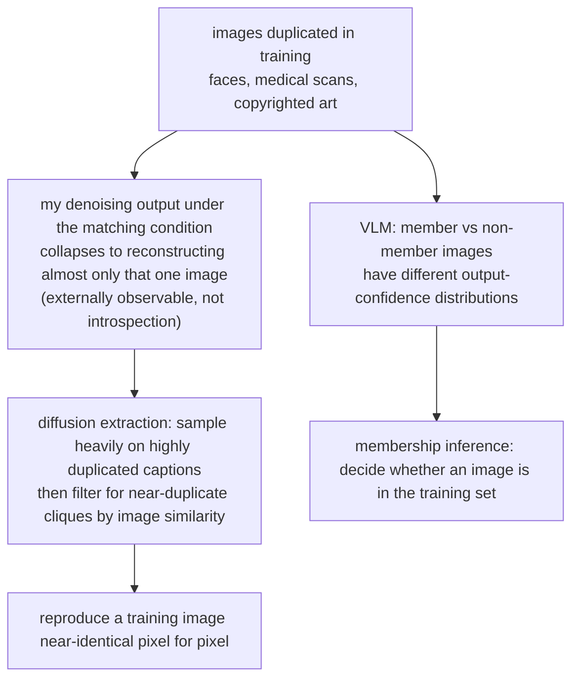

import PrivacyMeta from '@site/src/components/PrivacyMeta';

<PrivacyMeta era="Volume 2 · Memorization and extraction" technique="Memorization & training-data extraction" audience={['Privacy Engineer', 'ML Engineer', 'Security Engineer']} severity="Medium" maturity="Research" evidence="Research" />

> In one sentence: memorization and extraction don't only happen to text — **images too**. Fine-tune a diffusion / vision model on private images (patient scans, internal design assets, copyrighted art), and to an outside attacker, **given the right prompt, I may generate an image near-identical, pixel for pixel, to some specific training image**; that reproduction is measurable by matching generated images against the training set, and it is **driven mostly by images that were duplicated in training** — the more duplicated an image, the more likely it comes back out. Conclusion first: don't assume "a generative model only paints new images, it won't emit the originals." Image-domain memorization is real, the defenses share the same root as text memorization (dedup + DP + similarity auditing), but the cost is now "near-copy" rather than "verbatim."

## Mechanism: what happens on my side

This is the image counterpart of [Training-data extraction](./training-data-extraction.mdx): the same memorization root, a different modality (pixels rather than tokens). What a diffusion model learns in training is to denoise step by step from noise into an image that fits the data distribution; for images that appear **repeatedly** in the training set, the loss-minimizing solution is often to, under the matching condition (say a given caption), reconstruct **almost only that one original image**. A vision-language model (VLM) is trained on image-text pairs, and its output statistics (likelihood / confidence) differ measurably between images it **has seen** and images it hasn't.

Mind the red line: this is **not** "I remember this image" — I can't reliably introspect which training image I memorized. What is externally observable and recomputable is something else: **given the right prompt, the image I generate is near-identical to some specific image in the training set**, and that "near-identical" can be measured with image similarity (such as a patch-based pixel distance) by **matching the generated output against the training set**; for a VLM, the attacker measures the difference in my output confidence between member and non-member images. The attacker doesn't need to believe I "remember"; they only need to measure that externally observable quantity.



## Threat surface: what can be extracted, under what conditions

First pin the attacker model: diffusion extraction is mostly **black-box** (being able to sample by prompt is enough, no weights needed); VLM membership inference varies by method (VL-MIA uses confidence-style signals). The success criterion is not "looks similar to the eye" but **the similarity between a generated image and some training image crossing a threshold** (recomputable).

- **Duplication is the main amplifier — not "any image is extractable."** Carlini et al.'s (USENIX Security 2023) extraction pipeline deliberately **targets highly duplicated samples**: for Stable Diffusion they took the roughly **350,000 most-duplicated** examples in the training set, generated **500** images per caption, ran near-duplicate filtering over some **175 million** generations, and flagged a caption as memorized only when **at least 10** of its 500 images collapsed into a near-duplicate clique (patch-based image distance) — ultimately confirming **94** Stable Diffusion extractions under the strict criterion, loosened to **109** near-copies under manual inspection. The key finding: **a duplicated training image is orders of magnitude more likely to be memorized than a non-duplicated one.** So the extractable profile is "highly duplicated + distinctive," not "any image in the training set."
- **Near-verbatim, not bit-exact.** Text extraction is often **verbatim** (a UUID or key, character for character); image extraction is usually a **near-copy** — visually indistinguishable from the original, over the similarity threshold, but not necessarily pixel-perfect. For privacy / copyright, a near-copy is **already enough to constitute leakage and infringement** (a face you can recognize as a specific person, a painting whose source you can name).
- **The stakes concentrate in three kinds of images**: **faces** (identifiable to a person), **medical imaging** (patient-identifiable and highly sensitive), and **copyrighted art / trademarked logos** (Carlini et al.'s extracted samples ranged from photographs of real people to trademarked company logos).
- **VLM membership inference: decide whether an image is in the training set.** Li et al. (NeurIPS 2024) introduce **VL-MIA, the first membership-inference benchmark for large vision-language models**, together with a token-level image-detection pipeline and the MaxRényi-K% metric (based on model output confidence), turning "was this image / image-text pair used in training" into a reproducible, scorable detection — motivated precisely by the risk that training sets contain sensitive images like **private photos and medical records**. This shares a root with [Membership inference](../01-foundations/membership-inference.mdx), only with the decision target swapped from a text sample to an image.

## How the defense works

Image memorization and text memorization share **the same root** (both come from deterministic fitting of highly duplicated / distinctive samples), so the measures carry over — only the metric switches to image similarity:

- **Training-data deduplication (image near-duplicates)**: since duplication is the main amplifier, run **near-duplicate dedup** on images before training (perceptual hashing / embedding-nearest-neighbor clustering, dropping highly similar copies), directly cutting the "duplication → memorization" path. This is the same move as the text dedup in [Training-data deduplication](./training-data-deduplication.mdx), done in pixel / embedding space.
- **Differential-privacy training (DP-SGD)**: mathematically bounds the influence of a **single image / single sample** on my parameter distribution, lowering the probability that any one image is near-reproduced. The cost is generation-quality loss and training overhead, and **ε greater than 0 means "bounded leakage," not "zero leakage."**
- **Output-side similarity filtering**: after generation, match the result against the training set (or its embedding index) and block / resample on a high-similarity hit. This is a treat-the-symptom cat-and-mouse game; it's a backstop only.
- **Don't over-train on highly sensitive images**: for faces / medical / copyrighted images, reduce repeated exposure and control training epochs and each image's occurrence count — cutting off, at the source, the probability that deterministic reconstruction becomes the loss-minimizing solution and gets forced out.

Calling out the boundary: dedup lowers **frequency and probability**, not a formal guarantee; an image that appears only once yet is distinctive enough can still be memorized (same as text — see the dedup entry). A formal bound needs DP on top.

## Buildable recipe

**Before** releasing an image-generation / multimodal model, turn "will it spit training images back" into a regression-able replication audit (tailor by data sensitivity):

```text
1. Dedup images before ingest: run near-duplicate detection on training images
   (perceptual hashing pHash / embedding-nearest-neighbor clustering), merge or
   drop highly duplicated images — cutting the "duplication -> memorization" path.
   Record the per-image near-duplicate count distribution before and after.
2. DP on sensitive images: for datasets with faces / medical / copyrighted images,
   train with DP-SGD, record ε/δ and the accounting method; smaller ε = more
   private, lower generation utility — pick per use case, don't just label "DP added."
3. Run a replication audit before release: batch-sample generations against the
   training set (especially the highly duplicated subset), match with image
   similarity (patch-based pixel distance / embedding similarity), measure the
   "near-duplicate hit rate," and set an explicit threshold as a release gate;
   abnormally high hits -> go back and strengthen dedup / DP.
4. Audit membership inference on the VLM side: hold out one group known to be
   "in the training set" and one "not," run MIA (confidence / VL-MIA-style signals),
   report TPR at low FPR — don't report average accuracy only.
5. Inference-side backstop: scan generated images for training-set similarity and
   block, but as the last line, not the only line.
```

Every quantitative parameter (dedup similarity threshold, replication-audit threshold, ε) must carry **your own experimental conditions** when you deploy it — don't lift the papers' numbers directly; the model scale, data, and similarity definition may not match yours.

**Minimal testable assertions** (turn the recipe into a regression check):

- How to test: before release, batch-generate against the training set (including the highly duplicated subset), compute the "near-duplicate hit rate" under a fixed similarity criterion, and make it a CI gate in the pipeline audit step; on the VLM side run per-sample MIA and report TPR at low FPR.
- Pass: near-duplicate hit rate ≤ a preset threshold, and clearly below baseline after dedup / DP; MIA TPR at low FPR is close to the random baseline.
- Fail: a highly duplicated image has an abnormally high near-duplicate hit rate (it can be near-reproduced), or MIA TPR at low FPR is well above baseline → go back and strengthen image dedup / DP, then re-test.

## Research status (engineering feasibility)

(This entry is marked maturity "Research": the evidence comes from academic work, but the attack pipeline has been run on production-grade open models. What follows is the method and feasibility evidence.)

- **The founding demonstration for diffusion extraction**: Carlini et al. (USENIX Security 2023) used a generate-and-filter pipeline to extract on the order of a thousand training-sample memorizations from **widely used open-source text-to-image models** like Stable Diffusion (under their strict criterion, about 94 confirmed for Stable Diffusion, loosened to about 109 near-copies), ranging from **photographs of real people to trademarked logos**; they also note diffusion models are **less private on this axis than earlier generative models such as GANs**. This turned "image memorization" from conjecture into recomputable extraction.
- **Systematic measurement of replication**: Somepalli et al. (CVPR 2023) built an image-retrieval framework that turns "did the generated image replicate a training image" into a comparable metric, found **blatant training-data replication** on models including Stable Diffusion, and measured that the **replication rate is affected by training-set size** — the less training data, the more pronounced the replication. This gives evidence, independent of Carlini, that near-copying really happens and correlates with data scale / duplication.
- **Benchmarking VLM membership inference**: Li et al.'s (NeurIPS 2024) VL-MIA turns "is this image / image-text pair in a VLM's training set" into the first standardized benchmark and attack pipeline, motivated directly by training sets potentially containing sensitive images like private photos and medical records. It shows the image-domain privacy risk isn't only "extract the original image" but also the lower-bar path of "decide that an image was used."

## Residual risk and trade-offs

Calling out each "false security" in turn:

- **"A generative model only paints new images, it won't emit the originals" is wrong.** Existing research recomputes near-copies on widely used open-source diffusion models; it just happens **mostly on highly duplicated images**, not on any image — but that's no reason for comfort, it only bounds the risk profile.
- **Reducing duplication ≠ eradicating it.** Dedup removes the "duplication" amplifier; an image that appears **only once, yet is distinctive enough** (a strongly featured face, a lesion scan) can still be memorized and near-reproduced. A formal guarantee needs DP on top, and **DP's ε is not zero** — it bounds single-sample influence, not "never reproduces," and generation quality drops: an explicit trade-off.
- **A near-copy still infringes and still leaks.** Don't console yourself with "it's not pixel-perfect anyway" — a face you can recognize as a specific person, a painting whose source you can name, is already leakage / infringement in the privacy and copyright sense. A loose similarity threshold is just self-deception.
- **Similarity filtering is cat-and-mouse.** Matching outputs against the training set backstops, but bypasses (a smaller crop, a slight style transfer) keep appearing; it doesn't hold the floor.
- **Risk scales with data scale / duplication.** The more a training image is duplicated, the more easily it comes back; feeding the same batch of high-value images repeatedly (celebrity faces, signature designs) for better results tends to scale this privacy / copyright risk up too — dedup / auditing / DP must scale with it.

## How this differs from neighboring techniques

- **vs. Training-data extraction (text, this volume)**: [Training-data extraction](./training-data-extraction.mdx) is about an LLM emitting **training text verbatim** (UUIDs, keys, PII strings); this entry is its **image / multimodal version** — the same memorization root, modality swapped to pixels, extraction shifting from "verbatim" to "near-copy," the metric from string matching to image similarity, the stakes concentrated in faces / medical / copyright. Don't conflate the two, and don't re-derive the text-extraction mechanism here.
- **vs. Quantifying memorization and auditing (this volume)**: [Quantifying memorization and auditing](./quantifying-memorization.mdx) is the general defender-side method of **injecting probes to measure memorization strength**; this entry is the **specific image-domain attack surface plus its replication audit**. The audit method carries over (swap exposure for image near-duplicate hit rate), but this entry focuses on "images get spat back" itself.
- **vs. Membership inference (Volume 1)**: [Membership inference](../01-foundations/membership-inference.mdx) asks "is a sample in the training set"; the VLM membership-inference part of this entry is exactly its landing on images / image-text pairs (VL-MIA), while the diffusion-extraction part goes further — it doesn't only decide in-or-out, it **reconstructs the original image**.

## Version notes

:::note Applicable versions
Verbatim (near-verbatim) memorization and extractability in the image domain are **mechanism-level phenomena of diffusion / vision generative models** — common across model generations, not one model's temperament. Founding evidence: diffusion extraction established on open-source text-to-image models like Stable Diffusion in 2023 (Carlini, USENIX Security 2023), data replication systematically measured and tied to training scale the same year (Somepalli, CVPR 2023), and VLM membership inference benchmarked in 2024 (Li et al., NeurIPS 2024, VL-MIA). **In existing measurements, duplication of training images is the main amplifier of extractability** — so feeding high-value images repeatedly into training should not be treated as inherently safe; it calls for image dedup, replication auditing, and privacy controls (the exact behavior varies with the training pipeline and dedup / DP strategy, and is not guaranteed monotonic across all setups). (Sources verified 2026-07.)
:::

## Further reading and sources

- [Extracting Training Data from Diffusion Models (Carlini et al., USENIX Security 2023; arXiv 2301.13188)](https://www.usenix.org/conference/usenixsecurity23/presentation/carlini) — a generate-and-filter pipeline extracts training images from Stable Diffusion (about 94 under the strict criterion, loosened to about 109 near-copies), ranging from photographs of real people to trademarked logos; duplicated samples are orders of magnitude more likely to be memorized, and diffusion is less private than GANs. Primary source for this entry.
- [Diffusion Art or Digital Forgery? Investigating Data Replication in Diffusion Models (Somepalli et al., CVPR 2023)](https://openaccess.thecvf.com/content/CVPR2023/html/Somepalli_Diffusion_Art_or_Digital_Forgery_Investigating_Data_Replication_in_Diffusion_CVPR_2023_paper.html) — measures training-data replication via image retrieval, finds blatant replication on models including Stable Diffusion, with the replication rate affected by training-set size; independent of Carlini, confirming near-copying really happens.
- [Membership Inference Attacks against Large Vision-Language Models (Li et al., NeurIPS 2024; arXiv 2411.02902)](https://papers.nips.cc/paper_files/paper/2024/hash/b2c892312af07f8a77afbeed188391f4-Abstract-Conference.html) — VL-MIA, the first VLM membership-inference benchmark, plus a token-level image-detection pipeline and the MaxRényi-K% metric, turning "is this image in a VLM's training set" into reproducible detection; confirms the lower-bar image-domain membership-inference leakage path.
