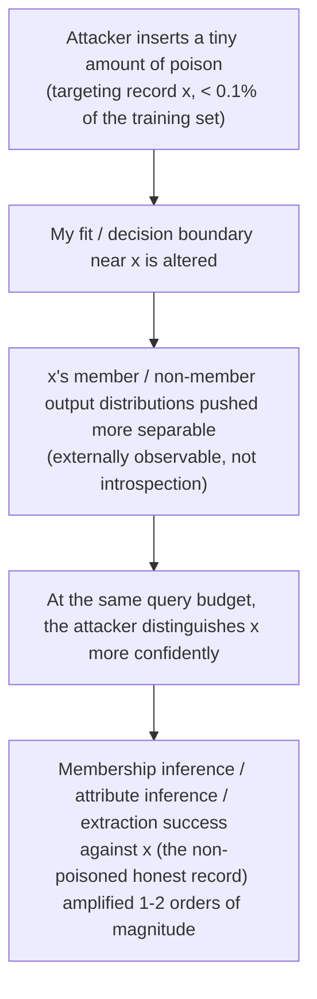

import PrivacyMeta from '@site/src/components/PrivacyMeta';

<PrivacyMeta era="Volume 2 · Memorization and extraction" technique="Memorization & training-data extraction" audience={['Privacy Engineer', 'Security Engineer', 'ML Engineer']} severity="High" maturity="Research" evidence="Research" />

> In one sentence: poisoning isn't only an integrity ("corrupt the model") problem — it's a privacy problem too. Tramèr et al. (*Truth Serum*, CCS 2022) show that inserting a **tiny amount (< 0.1%)** of carefully crafted poison into the training set raises the success of membership inference / attribute inference / data extraction against **other, non-poisoned** records by **1–2 orders of magnitude**; their signature number — inserting just **8 poison samples into CIFAR-10 (0.03% of the set)** lifts membership-inference **true-positive rate (TPR) from 7% to 59% (at 0.1% FPR)** for a targeted image. And web-scale poisoning is **cheap and practical**: by buying expired domains for a "split-view," you can **control ~0.01% of LAION-400M for ~\$60** (Carlini et al., S&P 2024 — this is a **feasibility** result, not itself a privacy-leak result). Conclusion first: **training-data integrity = a privacy problem; an untrusted data source is a privacy amplifier.**

## Mechanism: what happens on my side

Normally, the "is it in the training set" signal for a target record `x` is **diluted** by a large surrounding crowd of ordinary samples — an attacker has a hard time singling `x` out to distinguish it. Poisoning changes exactly this.

The few poison samples the attacker inserts **specifically alter my fit / decision boundary near the target record `x`**: they push the two worlds — "`x` is in the training set" vs. "`x` is not" — **further apart** in my externally observable outputs (loss / confidence / likelihood). So the same external attacker, with the same query budget, can single `x` out more confidently — the membership / attribute / extraction signal is **amplified**.

Note the first-person red line: this is **not** "I decide to leak more about `x`" — I can't reliably introspect my own training-data influence. What's externally observable and recomputable is that **after the poison enters training, my member/non-member output distributions on the target record are pushed to be more separable** — an attacker doesn't need me to "admit" I memorized `x`, they only need to measure this amplified distributional gap.

What gets amplified is **another, non-poisoned** record: the poison sample is the "key," and what leaks is the honest record it points at — which is exactly what makes it stealthier than "poisoning breaks integrity."



## Threat surface: how it's exploited / how you get leaked

Attacker model (matching Truth Serum's setup):

- **The attacker can inject a small number of samples into the training data** — this is the core premise. In a web-scale crawling scenario, this amounts to "getting attacker-controlled content into the next training corpus" (see "split-view" feasibility below).
- **Poison budget is tiny**: Truth Serum uses < 0.1% of the training set; on CIFAR-10 it's concretely **8 samples / 0.03%**.
- **The attack target is other records**: the attacker wants to know whether some **honest** record is in the training set (membership inference), one of its hidden attributes (attribute inference), or to coax it out (extraction). Poisoning is just the amplifier.
- **Scoring metric**: still read at low false-positive rate — Truth Serum reports exactly the **TPR at 0.1% FPR: from 7% to 59%** (for a target image). Don't use average accuracy, which washes out this real "tail samples singled out with high confidence" risk (same metric as [Membership inference attacks](../01-foundations/membership-inference.mdx)).

To state the amplification clearly: Truth Serum measured that poisoning raises membership-inference / attribute-inference / data-extraction success by **1–2 orders of magnitude** over the un-poisoned baseline. These numbers are tied to its image-classification setup (CIFAR-10, etc.) and **don't transfer directly** to your model and data.

## How the defense works

This threat's root is "**untrusted data entered training**," so the defense either **guards the data source** or **caps single-sample influence**:

- **Trusted data provenance and lineage**: treat the training corpus as a **supply chain** — record where each datum came from, whether it's trusted, and whether it's reviewable (connect to the data lineage in [Data lifecycle & deletion propagation](../06-governance-compliance/data-lifecycle-deletion.mdx)). Poisoning amplification depends on "attacker-controlled content entering training," so guarding the entrance removes the premise.
- **Dedup / anomaly-sample detection**: poison samples often cluster, or are highly concentrated on the target point, so dedup and outlier detection can filter some out ([Training-data deduplication](./training-data-deduplication.mdx) is especially effective against **duplicate-type** poisoning — it incidentally cuts poison samples that were injected in many copies). But this is an empirical measure with leakage, not a formal guarantee.
- **Differential privacy (DP-SGD) for high-sensitivity targets**: DP mathematically **bounds the influence of any single sample on my parameter distribution**. This precisely **counteracts** poisoning amplification — poisoning works by levering my behavior at the target point with a few samples, and DP gives that leverage an (ε, δ) bound. Truth Serum's authors also list DP as a principled defense against their attack. The cost is utility and compute, and **ε > 0 means "bounded influence," not "zero influence."**
- **Put "training-data integrity" into the privacy threat model**: this is a conceptual defense — stop treating poisoning only as an integrity problem ("the model gets broken") and write it into the threat model as a **privacy amplifier**, evaluated alongside membership inference / extraction.

To break down the boundaries: dedup / anomaly detection **weakens the signal** (no bound, has leakage), DP **caps the signal** (with an ε cost), and guarding the source **narrows the entrance** (can't stop historical data already mixed in). The three are complementary; none is a silver bullet.

## Buildable recipe

A minimal set of actions you can follow (scale to your data-source trust):

```text
1. Treat the training corpus as a supply chain: tag each source with a trust label + keep
   lineage (origin / fetch time / checksum); isolate and heavily audit open-crawl content
   the attacker can control. Don't let "it's all crawled anyway" become default trust.
2. Dedup + anomaly detection before ingest: near-dup dedup (MinHash / suffix-array)
   incidentally cuts duplicate-type poison; run outlier / cluster detection on the training
   distribution and flag abnormally concentrated sample groups for review.
3. DP-SGD on high-sensitivity targets: use DP for training / fine-tuning that contains
   sensitive records, record ε/δ and the accounting method. DP bounds single-sample
   influence, exactly counteracting "a few poison samples levering target-point behavior."
4. Put poisoning amplification into the privacy threat model and red team: when assessing
   membership / extraction risk, explicitly add a tier "if the attacker can poison < 0.1%
   of training data, how big is the amplified risk" — don't test only the clean baseline.
5. Defend web-scale corpora against split-view: fixed snapshot + content checksums (verify
   on fetch, train on the snapshot); don't re-fetch URLs live at training time — that is the
   exact entrance for expired-domain poisoning (see case below).
```

Every quantitative parameter (ε, dedup / anomaly thresholds, poison-budget tier) must carry **your own experimental conditions** at deployment — the paper's "8 samples / 0.03% → 7%→59%" is a CIFAR-10 setup; don't copy it.

**Minimal testable assertions** (turn poisoning-amplification assessment into a regression check):

- How to test: in red teaming / auditing, actively inject a small number of **deletable, traceable, no-real-PII** poison samples (targeting several canary targets) into the training set; after training, measure the target canaries' membership-inference TPR at low FPR — comparing "no poison" vs. "< 0.1% poison" tiers.
- Pass: the poison tier's TPR amplification over the clean tier is **controlled** (within your acceptable range); sources have lineage, poison samples are flagged by anomaly detection; high-sensitivity targets have DP bounding them.
- Fail: a small amount of poison significantly raises a target canary's low-FPR TPR with **no DP** backstop, or you can't produce data lineage, or anomaly detection is blind to clustered poison → not adequate; go back to guard the source / add DP and re-test.

## Research status (engineering feasibility)

(This entry's maturity is "Research": Truth Serum is a research-grade attack demonstration; below distinguishes two kinds of evidence — the "privacy result" and the "feasibility support.")

- **Privacy result (Truth Serum, CCS 2022)**: Tramèr et al. show poisoning can act as a **privacy amplifier** — poisoning < 0.1% of the training set raises membership inference / attribute inference / data extraction against **other, non-poisoned records** by 1–2 orders of magnitude. The most concrete example: on CIFAR-10, **inserting 8 poison samples (0.03%)** lifts a target image's membership-inference **TPR from 7% to 59% (at 0.1% FPR)**. This directly connects "training-data integrity" with "privacy."
- **Feasibility support (Carlini et al., S&P 2024 — note: this is an integrity / feasibility result, not itself a privacy leak)**: *Poisoning Web-Scale Training Datasets is Practical* shows web-scale data poisoning is **cheap and practical**. Its **split-view** poisoning exploits the reality that "datasets store only URLs and fetch at training time": buying an expired domain still referenced by the dataset lets you create a divergence between "what was seen at annotation time" and "what is fetched at training time" — from which the authors estimate **~\$60 suffices to control ~0.01% of LAION-400M's samples**. It does **not** directly give a privacy-leak magnitude; its role is to show that "getting attacker-controlled content into training" — Truth Serum's premise — is **extremely cheap in real web corpora**.

Putting the two together: the poisoning premise needed to amplify privacy leakage is **cheaply attainable** in a real data supply chain — which is exactly why "training-data integrity" should be treated as a privacy problem.

## Residual risk and trade-offs

Breaking the false security item by item:

- **"We don't fine-tune on user data / it's all crawled public data" ≠ safe.** Public crawled corpora are precisely the cheapest entrance for poisoning (split-view, ~\$60 for 0.01% of LAION); "public" doesn't mean "trusted."
- **Dedup / anomaly detection can miss.** Poison samples aren't necessarily duplicated or obviously outlying; a small, carefully crafted set can slip past thresholds. Dedup works on **duplicate-type** poison, not necessarily **single-shot, stealthy** poison.
- **DP isn't zero amplification.** DP-SGD's ε is nonzero — it gives a "single-sample influence is bounded" cap, thus **limiting** how much poison can lever, but not "poison is fully neutralized." The tighter ε, the more utility drops; account for it openly.
- **What's amplified is someone else.** The most counterintuitive point of this threat: the poison samples are placed by the attacker, but what leaks is an **honest third party's** record — watching only "was my data altered" misses "someone else's privacy is amplified because my data was poisoned."
- **Magnitude is tied to the experimental setup.** "1–2 orders of magnitude" and "8 samples → 7%→59%" come from image classification (CIFAR-10, etc.); the amplification on your modality / model / data must be self-measured — don't copy the optimistic number.

## How this differs from neighboring techniques

- **Privacy-targeted poisoning vs. [Training-data extraction](./training-data-extraction.mdx)**: extraction is **passive** — the attacker coaxes memorized samples out of an existing model without altering training data; this entry is **active** — the attacker first drips material into the training set to **amplify** multiple leaks, including extraction. One exploits memorization as an accomplished fact; one alters training to manufacture stronger leakage.
- **Privacy-targeted poisoning vs. [Membership inference attacks](../01-foundations/membership-inference.mdx)**: membership inference is **the very attack being amplified** — Truth Serum's signature number (7%→59% TPR @ 0.1% FPR) measures exactly the MIA after poisoning amplification. This entry isn't another attack but the **lever that amplifies MIA / attribute inference / extraction together** via poisoning.
- **Privacy-targeted poisoning vs. [Training-data deduplication](./training-data-deduplication.mdx)**: dedup is a partial defense — it cuts **duplicate-type** poison (poison injected in many copies gets deleted incidentally) and lowers the memorization / extraction baseline; but it's powerless against **single-shot, stealthy** targeted poisoning and gives no formal bound. The two are complementary, not substitutes.

## Version notes

:::note Applicable versions
"Poisoning can act as a privacy amplifier" is a research conclusion established by Tramèr et al. in an **image-classification** setup (CIFAR-10, etc.) (CCS 2022); its magnitudes — "< 0.1% poison amplifies 1–2 orders of magnitude," "8 samples / 0.03% lifts target MIA TPR 7%→59% @ 0.1% FPR" — are **tied to that experimental setup and don't transfer directly** to LLMs / your model and data; you must self-measure at deployment. The feasibility of split-view poisoning and "~\$60 controls ~0.01% of LAION-400M" are Carlini et al.'s estimates based on the 2023 dataset ecosystem (S&P 2024), an **integrity / feasibility** support rather than a privacy-leak magnitude; expired-domain prices and dataset snapshot policies change over time. Both attack and defense evolve; stamped 2026-06. (Sources verified 2026-06.)
:::

## Further reading and sources

Mixed-evidence note — primary: Truth Serum (the privacy result); supplementary: Poisoning Web-Scale Datasets (integrity / feasibility support, not a privacy-leak magnitude).

- [Truth Serum: Poisoning Machine Learning Models to Reveal Their Secrets (Tramèr et al., ACM CCS 2022)](https://dl.acm.org/doi/10.1145/3548606.3560554) — this entry's primary source. Poisoning < 0.1% of the training set amplifies membership / attribute inference / extraction against **other, non-poisoned records** by 1–2 orders of magnitude; on CIFAR-10, 8 samples (0.03%) lift a target image's MIA TPR from 7% to 59% (at 0.1% FPR).
- [Poisoning Web-Scale Training Datasets is Practical (Carlini et al., IEEE S&P 2024; arXiv 2302.10149)](https://arxiv.org/abs/2302.10149) — **feasibility support (an integrity result, not a privacy leak)**. Split-view poisoning: buy expired domains, ~\$60 controls ~0.01% of LAION-400M, showing the premise "get attacker-controlled content into training" is extremely cheap in real web corpora.
