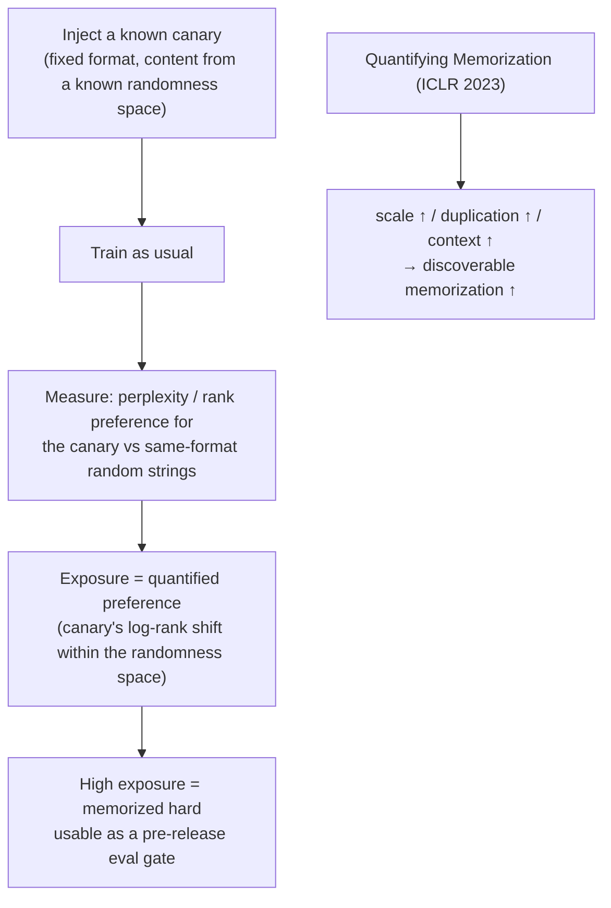

import PrivacyMeta from '@site/src/components/PrivacyMeta';

<PrivacyMeta era="Volume 2 · Memorization and extraction" technique="Privacy evaluation & auditing" audience={['Privacy Engineer', 'ML Engineer', 'Security Engineer']} severity="Medium" maturity="Research" evidence="Research" />

> In one sentence: "how much private data did I actually memorize" shouldn't be a gut feeling — it **can be measured**. The Secret Sharer (USENIX Security 2019) gives the method: insert random **canaries** into the training set, then use **exposure** to measure how strongly I prefer each one over random strings — higher exposure means it's memorized harder. Quantifying Memorization (ICLR 2023) goes further and measures: **the bigger the model, the more a sequence is duplicated, and the longer the context, the more discoverable memorization there is**. Conclusion first: **audit** memorization with canaries + exposure before release, turning "how much got memorized" into a regression-able number — don't say "it probably didn't memorize anything" on a hunch, which is the false security of a missing audit.

## Mechanism: what happens on my side

In ordinary training, how much I fit a single sample has **no uniform bound in the differential-privacy sense** (same root as training-data extraction and membership inference). To **actively quantify** it, the method is to **inject known canaries**:

Put a **fixed-format, random-content** canary into the training set (e.g. "the random number is 281265017," with the digits drawn from a known randomness space). After training, look at my **perplexity / rank** on that canary — how much I prefer the one actually inserted over **other random values** of the same format from the same space. The stronger the preference, the more I've "memorized" it. **Exposure** turns this preference into **a number**: based on where that canary ranks (on a log scale) within the whole randomness space when ordered by the model's preference.

To be clear about the red line: this is **not** "I admit I remember 281265017" — I can't introspect that. What's externally measurable is that **my output preference on that canary is significantly above the random baseline**, and exposure makes that observable preference into a comparable, regression-able scalar.



## Threat surface: what the audit can and can't measure

This entry is a **defender's measurement tool**, so the "threat surface" becomes **capability and blind spots**:

**Can measure**:

- **Memorization strength of a single injected sample** (exposure) — a comparable, regression-able scalar.
- **Memorization scaling**: Quantifying Memorization measures empirically that memorization rises monotonically with **model scale, a sequence's duplication count, and provided context length** — usable to **predict** "switch to a bigger model / train more epochs, and memorization will rise."
- **Relative defense gains**: compare exposure **before and after** dedup / DP / early stopping, turning "did the defense help" into a number.

**Can't measure / limits** (must be stated, or it becomes its own false security):

- A canary is a **proxy metric**: it measures how strongly **that format** gets memorized, not directly whether **all** PII in your real corpus got memorized — anything not injected is invisible to this method.
- **High exposure ≠ necessarily externally extractable**: extraction also depends on the attacker's query power and priors; but conversely, **low exposure is more reassuring**, and high exposure is a clear red flag.
- The audit is valid only on **the distribution you tested / the canaries you injected** — outside that coverage is a blind spot.

## How the defense works

The intuition for **exposure**: place the canary into its whole randomness space, rank all candidates by "how much the model prefers each"; the further forward the canary ranks (the larger its shift from where a random one should sit), the higher the exposure. Its value is giving "memorization" a **comparable, regression-able** unit — so you can answer questions that were otherwise guesswork:

- "Does this version memorize more or less than the last?" → compare exposure.
- "How much did dedup / DP actually suppress memorization?" → look at the exposure drop.
- "Will a bigger model make memorization blow up?" → estimate from the Quantifying Memorization scaling trend, then verify empirically.

To break it down: exposure is an **empirical measurement**, not a formal guarantee (formal guarantees need DP, see [DP fine-tuning](../03-conversational-llms/dp-fine-tuning.mdx)); but it can **empirically corroborate** whether DP / dedup truly suppressed memorization — the two are complementary.

## Buildable recipe

```text
1. Design the canary set: inject several groups of canaries covering different
   duplication counts (1x / 9x / ...) and different formats (resembling your real
   sensitive strings: card numbers, key formats, ID formats).
2. Compute exposure after training: compute exposure per canary group, keep it as
   this version's memorization baseline.
3. Set a pre-release gate: exposure above threshold (or above the previous version)
   → block release, go back and check dedup / training epochs / whether DP is needed.
4. Use it for defense A/B: measure exposure before/after dedup, before/after DP,
   before/after early stopping, to quantify the gain.
5. Pair with membership inference (Volume 1): run MIA audits on real samples as a
   complement to canary exposure — one measures "memorization of injected canaries,"
   the other "can a real sample be decided as a member."
```

Every number is tied to **your model, data, and canary design** — don't copy paper thresholds; exposure's absolute value is only comparable within one measurement convention.

**Minimal testable assertions** (turn the audit into a regression check):

- How to test: fix a set of known canaries (with several duplication tiers), and after each training run compute exposure under the same convention, comparing to the previous baseline.
- Pass: each canary's exposure is **below the set threshold** and **not above** the previous baseline; versions with dedup / DP should show a visible exposure drop.
- Fail: some canary's exposure approaches "full memorization" (the order of magnitude where it can be extracted verbatim), or a new version rises for no reason, or there's no exposure baseline at all → the audit didn't pass; don't ship.

## Research status (engineering feasibility)

(This entry's maturity is "Research": the method comes from academic work but has been used for **real production audits**; below is the method and feasibility evidence.)

- **Method foundation + a production audit use case**: The Secret Sharer (Carlini et al., USENIX Security 2019) proposes the canary + exposure method and demonstrates that inserting one credit-card number into a Penn Treebank model lets it be fully extracted; more importantly, **Google's Smart Compose** (a commercial completion model trained on millions of users' emails) used this method to **quantify and limit data exposure** — showing memorization auditing isn't a paper method but an engineering action that lands in a production release gate.
- **Measuring memorization scaling**: Quantifying Memorization (Carlini et al., ICLR 2023) measures systematically across a series of models that discoverable memorization rises with **model scale, sequence duplication, and context length** — giving a data-backed answer to "will memorization get worse as I scale the model up" (yes, so the audit must be redone at scale).

## Residual risk and trade-offs

Breaking the false security item by item:

- **A canary is a proxy, not ground truth.** It sees what you injected, not what you didn't — passing the audit doesn't equal "absolutely no real PII memorized."
- **High exposure isn't necessarily extractable, but only low exposure is reassuring.** Treat high exposure as a red flag, and low exposure as "risk lowered," not "zero risk."
- **The audit is valid only within the measured distribution.** A biased canary design biases the conclusion; canaries must match the format of your real sensitive strings.
- **Memorization rises with scale.** A small model passing today may not pass after switching to a bigger model / more epochs — the audit is a **per-version** regression item, not a one-time checkup.
- **Measurement ≠ defense.** Exposure only tells you how much got memorized; suppressing it takes dedup / DP / data minimization (this entry is the thermometer, not the medicine).

## How this differs from neighboring techniques

- **Memorization auditing vs. training-data extraction (this volume)**: extraction is the **attacker actually getting data out** (offense); this entry is the **defender actively injecting canaries to quantify memorization strength** (audit). One offense, one audit, used together: passing the audit lowers extraction risk but doesn't replace red-team extraction testing.
- **Memorization auditing vs. membership inference (Volume 1)**: MIA decides "is **a real sample** in the training set," usable directly as an audit tool; canary / exposure is "inject **known probes** and quantify memorization," more controllable and comparable. Complementary: one tests real samples, one tests injected probes.
- **Memorization auditing vs. DP fine-tuning (Volume 3)**: DP gives a **formal bound** (an up-front guarantee); exposure gives an **empirical measurement** (an after-the-fact checkup). Mutually verifying: with DP applied, exposure should drop visibly — if it doesn't, the DP config or privacy unit is off.

## Version notes

:::note Applicable versions
The canary + exposure audit method (USENIX Security 2019) and the trend of memorization rising with scale / duplication / context (ICLR 2023) are **model-independent** measurement science, common across vendors. But the **absolute exposure value, thresholds, and scaling slope** are all tied to your model, data, and canary design; paper values **don't transfer directly**, and every new version and every scale-up must be **re-measured** with your own canaries. Stamped 2026-06. (Sources verified 2026-06.)
:::

## Further reading and sources

- [The Secret Sharer: Evaluating and Testing Unintended Memorization in Neural Networks (Carlini et al., USENIX Security 2019; arXiv 1802.08232)](https://arxiv.org/abs/1802.08232) — founds the canary + exposure audit method; includes the Penn Treebank card-number extraction demo and the Google Smart Compose production-audit use case. This entry's primary source.
- [Quantifying Memorization Across Neural Language Models (Carlini et al., ICLR 2023; arXiv 2202.07646)](https://arxiv.org/abs/2202.07646) — measures systematically that memorization rises with model scale / sequence duplication / context length, the data basis for "the audit must be redone at scale."
