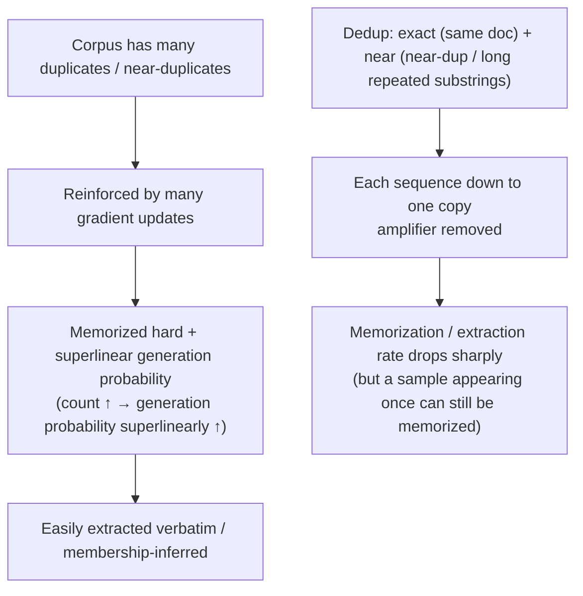

import PrivacyMeta from '@site/src/components/PrivacyMeta';

<PrivacyMeta era="Volume 2 · Memorization and extraction" technique="Memorization & training-data extraction" audience={['Privacy Engineer', 'ML Engineer', 'Security Engineer']} severity="Medium" maturity="Production" evidence="Research" />

> In one sentence: **duplication** in training data is the **amplifier** of memorization and extraction. Kandpal et al. (ICML 2022) measured that the success of privacy attacks **largely comes from corpus duplication**, and that the probability I regenerate a sequence is **superlinear in its count** in the training set — a sequence appearing **10 times** is generated on average about **1000×** more often than one appearing once. Lee et al. (ACL 2022) found existing corpora contain many near-duplicates, and **after deduplication** I emit memorized text verbatim about **10× less** often, with fewer training steps. Conclusion first: dedup is a **high-return** move that cuts memorization / extraction / membership-inference risk a lot; but it lowers **frequency and probability, not a formal guarantee** — a rare sample appearing once can still be memorized; for a formal guarantee, stack DP.

## Mechanism: what happens on my side

Duplication makes a sequence get **reinforced by many gradient updates** during training — memorized harder, higher generation probability. The **superlinear relationship** Kandpal et al. measured is key: count → generation probability is **not linear but superlinearly** amplified (10× ≈ 1000×).

**Deduplication** (exact + near) deletes duplicate documents / substrings down to a single copy **before** training, **directly removing this amplifier**: each sequence is reinforced at most once, so memorization and extractability drop sharply.

To be clear about the red line: it's not "I decide to memorize duplicates less" — I can't introspect. What's externally measurable is that **duplication is reinforced in the training dynamics, and dedup removes the reinforcement source**, so before/after dedup my memorization degree (exposure) / verbatim extraction rate shows an observable drop (measurable with the probes in [Quantifying memorization & auditing](./quantifying-memorization.mdx)).



## Threat surface: what dedup lowers, what it doesn't

**Lowers**:

- **Verbatim memorization and extraction**: Lee et al. measured memorized-text generation frequency dropping to about **1/10** after dedup.
- **Duplication-dependent privacy-attack success**: Kandpal et al. show privacy-attack success largely stems from duplication, which dedup cuts at the root.
- **Overfitting / data contamination from near-duplicates**.

**Doesn't lower / boundary** (must be stated, or it's false security again):

- **Samples appearing only once** can still be memorized — dedup only handles "duplicates," and is **powerless** against a **single-occurrence** sensitive sample.
- **Not a formal guarantee**: dedup has no (ε, δ) bound; it lowers empirical frequency / probability.
- **Near-dedup has thresholds**: too loose misses near-duplicates, too tight over-deletes; there's always an edge.

**Boundary**: dedup is an **empirical reduction**, DP is a **formal guarantee**; stack them (dedup to lower the baseline, then DP for the bound, see [DP fine-tuning](../03-conversational-llms/dp-fine-tuning.mdx)).

## How the defense works

Two layers: **exact dedup** (delete identical documents) + **near dedup** (e.g. MinHash to find near-duplicate documents, suffix arrays to find and delete long repeated substrings). The principle is removing the **"count → generation probability"** superlinear amplifier — Lee et al. used suffix arrays to locate long repeated substrings and provided dedup tooling.

To break it down: dedup **lowers frequency / probability, gives no bound**; Lee / Kandpal themselves frame it as **"mitigate," not eliminate**. For a formal guarantee, stack DP. Treating "ran dedup" as "no memorization" is the false security this entry breaks.

## Buildable recipe

```text
1. Two layers of dedup before training: document-level exact dedup + substring / near-dup
   dedup (MinHash / suffix arrays).
2. Record dedup rate / coverage: how many duplicates were deleted, at what threshold, as
   a reviewable metric (don't just say "we deduplicated").
3. Stack DP for a formal guarantee: dedup lowers the baseline, DP gives the (ε, δ) bound
   (report ε); complementary, not substitutes.
4. Don't rely on dedup for rare single-occurrence sensitive samples: dedup only handles
   duplicates — these need data minimization / DP / just not feeding them.
5. Verify the gain with memorization auditing: before/after dedup, measure exposure /
   extraction rate with canaries / extraction probes to prove dedup truly suppressed
   memorization (see Quantifying memorization & auditing).
```

Every number is tied to **your corpus and dedup threshold** — the paper's "down to 1/10" doesn't transfer; re-measure with your own audit.

**Minimal testable assertions** (turn the dedup gain into a regression check):

- How to test: before/after dedup, measure verbatim memorization / extraction rate with the same canary / extraction probes (see memorization auditing).
- Pass: verbatim memorization / extraction rate **drops substantially** after dedup; dedup rate / threshold is recorded; sensitive **single-occurrence** samples have DP / minimization as a backstop.
- Fail: claiming "no memorization" from dedup alone, or rare samples still extractable with **no DP** backstop, or no before/after comparison → not adequate.

## Research status (engineering feasibility)

(This entry's maturity is "Production": dedup is **standard pre-training data preparation**; below is the empirical evidence for its privacy gain.)

- **Dedup makes models "better" and memorize less verbatim**: Lee et al. (ACL 2022) found language-modeling corpora contain many near-duplicates and long repeated substrings, and models trained on them have **over 1% of unprompted output copied verbatim** from training data; after dedup, models **emit memorized text about 10× less frequently** and reach the same or better accuracy with fewer training steps.
- **Dedup substantially mitigates privacy risk**: Kandpal et al. (ICML 2022) show privacy-attack success is **largely attributable to** duplication in web corpora, and measured the **superlinear relationship between generation probability and training count** — a sequence appearing 10 times in training data is generated on average about **1000×** more often than one appearing once. This turns "duplication = privacy amplifier" from intuition into a measurable quantitative result.

## Residual risk and trade-offs

Breaking the false security item by item:

- **Dedup isn't a formal guarantee.** No ε; it lowers frequency / probability. For a bound, still DP.
- **A single-occurrence sample can still be memorized.** Dedup only cuts duplicates — single-occurrence sensitive data is beyond it; needs minimization / DP.
- **Near-dedup has leakage.** Loose threshold misses near-duplicates, tight over-deletes; some edge always remains.
- **Cross-corpus / incremental-training duplication is hard to fully clear.** Multiple sources and continued training make true "global uniqueness" hard.
- **Dedup changes frequency, not "once memorized, still extractable."** It lowers the probability of being memorized, but what is memorized stays extractable — so pair it with auditing + DP.

## How this differs from neighboring techniques

- **Training-data deduplication vs. training-data extraction (this volume)**: that one is the **attack** (private data extracted verbatim); this entry is its **primary defense** (cut the duplication amplifier). Read together.
- **Training-data deduplication vs. quantifying memorization & auditing (this volume)**: auditing measures **how much got memorized** (the thermometer); dedup is **how to memorize less** (a medicine). Dedup's gain is verified with the audit.
- **Training-data deduplication vs. DP fine-tuning (Volume 3)**: dedup is an **empirical reduction** (no bound); DP gives a **formal guarantee** (with an ε cost). Often stacked: dedup to lower the baseline, then DP for the bound.
- **Training-data deduplication vs. PII regurgitation (Volume 3)**: dedup lowers regurgitation of **duplicated PII**; but **single-occurrence** PII still needs scrubbing / DP, which dedup can't cover.

## Version notes

:::note Applicable versions
"Duplication amplifies memorization, dedup substantially mitigates it" is a **model-independent** empirical regularity (from duplicate samples being reinforced by many gradient updates). But the **reduction factor, superlinear slope, and thresholds** are tied to corpus, dedup method, and model scale — Lee's (~1/10) and Kandpal's (10× → ~1000×) numbers **don't transfer directly** to your setup; you must re-measure with your own memorization audit. Dedup tooling and near-dup algorithms evolve; stamped 2026-06. (Sources verified 2026-06.)
:::

## Further reading and sources

- [Deduplicating Training Data Makes Language Models Better (Lee et al., ACL 2022; arXiv 2107.06499)](https://aclanthology.org/2022.acl-long.577/) — corpora contain many near-duplicates; after dedup, verbatim-memorization generation drops ~10× with fewer training steps; provides suffix-array dedup tooling. This entry's primary source.
- [Deduplicating Training Data Mitigates Privacy Risks in Language Models (Kandpal et al., ICML 2022; PMLR v162)](https://proceedings.mlr.press/v162/kandpal22a.html) — privacy-attack success largely stems from duplication; generation probability superlinear in training count (10× ≈ 1000× of once). This entry's quantitative basis.
