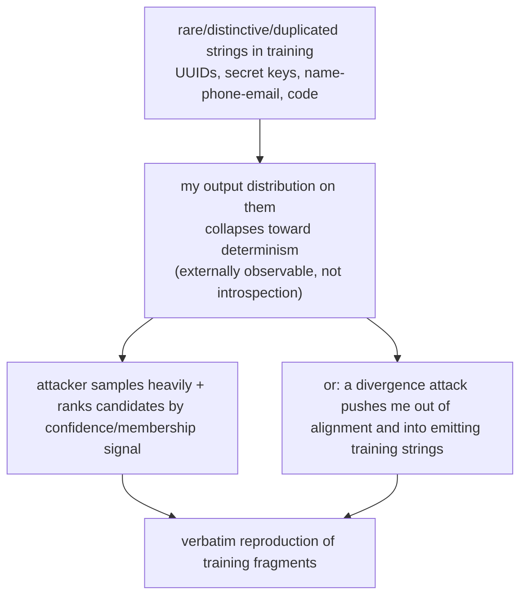

import PrivacyMeta from '@site/src/components/PrivacyMeta';

<PrivacyMeta era="Volume 2 · Memorization and extraction" technique="Memorization & training-data extraction" audience={['Privacy Engineer', 'ML Engineer', 'Security Engineer']} severity="High" maturity="Research" evidence="Research" />

> In one sentence: "Train on private data and it just becomes statistics — you can't get it back out" is a dangerous illusion. To an outside attacker, even if a piece of text appeared in training only once (even in a single document), as long as it's rare, distinctive, and fixed-format enough, **verbatim extraction has been observed in existing research settings** — and **measurements show: the larger the model, the more often it was duplicated, and the more context you give, the more discoverable memorization there is**.

## Mechanism: what happens on my side

What I do in training is plain: for sequences I've seen, I drive down the prediction loss on the next token. For sequences that are **rare, distinctive, or repeated** (a string of UUIDs, a secret key, a "name + phone + email"), the loss-minimizing solution is often to make me, given that string's prefix, give **almost only the original continuation**.

Mind the red line: this is **not** "I remember this record" — I can't reliably introspect what I've memorized. What is externally observable and recomputable is something else: **my output distribution on these strings collapses toward determinism**. Given the right prefix, my probability of emitting the original is abnormally high. The attacker doesn't need to believe I "remember"; they only need to measure that distribution.



## Threat surface: how it's exploited

The attacker does **not** need to know my training set; black-box queries are enough:

- **Generate-and-rank**: on GPT-2, Carlini et al. had the model generate many samples, then ranked them by a membership signal (such as how confident the model is in its own output), and pulled **hundreds of verbatim training fragments** out of a GPT-2 trained on public web scrapes — including real PII (names, phone numbers, emails), 128-bit UUIDs, code, and IRC conversations — **even when those strings appeared in just one training document** (Carlini et al., USENIX Security 2021).
- **Divergence attack**: against a production model already aligned into a "chat assistant," Nasr et al. used a prompt that makes the model diverge, breaking it out of the chat persona and into emitting training data, raising the rate of extractable data by about **150×**, demonstrated on a closed production model like ChatGPT (Nasr et al., 2023).

The most dangerous data shares a profile: **highly duplicated, rare, fixed-format** — keys, tokens, UUIDs, unique personal info, blocks of code. Those are exactly what get pushed toward deterministic reproduction.

## How the defense works

No silver bullet — just a few measures that push the probability down and narrow the extractable surface:

- **Training-data deduplication**: memorization grows with **duplication count** (see "why dedup works" below), so near-duplicate deduplication of the corpus before training markedly lowers the chance of being memorized and extracted.
- **Differential-privacy pretraining / fine-tuning (DP-SGD)**: mathematically bounds the influence of any **single sample** on my parameters, lowering the probability that any one sample is reproduced verbatim. The cost is utility loss and training overhead, and **ε > 0 means "bounded leakage," not "zero leakage."**
- **Memorization auditing**: inject canaries (rare marker strings) before training, measure their exposure (how much I favor them) afterward — turning "how much did it memorize" into a quantifiable, regression-testable metric instead of a guess.
- **Output-side PII filtering**: scan and block before I emit. This is a treat-the-symptom cat-and-mouse game; it's a backstop, not a replacement for the three above.

**Why dedup works, with evidence**: in *Quantifying Memorization*, Carlini et al. give three log-linear relationships — the degree to which I emit memorized data grows monotonically with ① model capacity, ② the number of times a sample is **duplicated**, and ③ the number of **context tokens** given; and the 6B-parameter GPT-J memorized at least **1%** of its training set, The Pile (Carlini et al., ICLR 2023, from "discoverable memorization" measurements on the GPT-Neo/J family on The Pile). Duplication is one of the three amplifiers, and dedup is precisely what removes it.

## Buildable recipe

A minimal set of actions you can follow (tailor by data sensitivity):

```text
1. Dedup before ingest: run near-duplicate detection on the training corpus
   (e.g. suffix-array / MinHash), merge or drop highly duplicated documents —
   directly cutting the "duplication -> memorization" amplification path.
2. DP on sensitive data: for datasets with PII / secrets, train with DP-SGD,
   record the privacy budget ε/δ and the accounting method; smaller ε = more
   private, lower utility — pick per use case, don't just label "DP added."
3. Audit memorization before launch: inject canaries (synthetic, no real PII,
   deletable and traceable fixed-format rare strings), measure their exposure
   afterward; abnormally high exposure -> go back and strengthen dedup / DP.
   Never use real sensitive data as a canary — that just injects PII into training.
4. Inference-side backstop: scan/block PII / secrets in outputs, but as the last
   line, not the only line.
```

Every quantitative parameter (ε, dedup threshold, exposure threshold) must carry **your own experimental conditions** when you deploy it — don't lift the papers' numbers directly; their model scale, data, and definitions may not match yours.

**Minimal testable assertions** (turn the recipe above into a regression check):

- How to test: after training, run an exposure measurement on injected canaries; make it an audit step / CI gate in the pipeline.
- Pass: every canary's exposure ≤ a preset threshold, and clearly below baseline after dedup / DP.
- Fail: a canary's exposure is abnormally high → it's at high risk of verbatim extraction; go back and strengthen dedup / DP, then re-test.

## A real case

In 2023, Nasr et al. ran a public demonstration against production, aligned, commercial models like ChatGPT: a prompt that makes the model "keep repeating a word" eventually induced it to **diverge**, break out of the assistant persona, and emit blocks of training data — including real personal information. That moved "training-data extraction" from "lab research on GPT-2" to "holds on live, closed, large models too" (Nasr et al., *Scalable Extraction of Training Data from (Production) Language Models*, 2023). What it confirms is not one vendor's slip-up but the same class of mechanism risk: **once memorization is in the weights, alignment and chat wrapping do not guarantee it can't be extracted.**

## Residual risk and trade-offs

Calling out each "false security" in turn:

- **Dedup ≠ elimination.** Dedup removes the "duplication" amplifier; but a private string that appears **only once, yet is rare and distinctive enough**, can still be memorized and extracted (single-document leakage is exactly Carlini 2021's core point).
- **DP ≠ zero leakage.** DP-SGD's ε is not zero — it gives a "bounded single-sample influence" guarantee, not "never reproduces." And the tighter you set ε, the more utility you lose: an explicit trade-off to account for.
- **Output filtering is cat-and-mouse.** Rules always lag new induction tricks (the divergence attack is the example); it backstops, it doesn't hold the floor.
- **"We don't open training / don't fine-tune on user data" ≠ safe.** Once data has been through training, the memorization is already in the weights; deleting the source or flipping a switch won't make the learned strings vanish (this is also the hard part of machine unlearning and the right to be forgotten — see Volume 5).
- **Risk often scales with capability.** In existing measurements, larger capacity means more discoverable memorization — scaling the model up for more power tends to scale this privacy risk up with it, so dedup / auditing / DP must scale too.

## Compliance mapping

- **GDPR right to be forgotten (Art. 17)**: a person can demand deletion of their personal data. But "delete someone's record from the training set" is **not** "the model forgot it" — memorized strings can still be extracted. There's a real gap between the technical deletion obligation and the cost of retraining / unlearning (expanded in Volume 5 · Verifiable deletion and machine unlearning).
- **EU AI Act**: training-data transparency obligations for general-purpose models surface "what was used in training, and did it contain personal data," which is directly tied to memorization / extraction risk.

(Compliance evolves with the statute version; this section is stamped 2026-06 — verify against the latest enacted text before citing.)

## How this differs from neighboring techniques

- **Extraction vs. membership inference**: extraction asks "can the model be made to **generate / emit** a training sample"; membership inference asks "can you **decide** whether a sample is in the training set." The former needs the original text; the latter only a yes/no. Both stem from "the model behaves differently on data it has seen," but the goal and success criteria differ — don't conflate them (membership inference is a later entry in this volume).
- **Memorization / regurgitation / extraction**: memorization is "retained in the weights"; regurgitation is "incidentally emitted in normal use"; extraction is "an attacker **actively** forces it out." This entry is about being actively extracted.

## Version notes

:::note Applicable versions
Verbatim memorization and extractability are **mechanism-level phenomena of autoregressive language models** — common across vendors and versions, not one model's temperament. The attacks keep evolving over time: established on GPT-2 in 2021 (Carlini, USENIX), quantified in 2023 into log-linear relationships with scale / duplication / context (Carlini, ICLR), and demonstrated via divergence attack on production models like ChatGPT (Nasr). **In existing measurements, model capacity, duplication count, and context length all amplify discoverable memorization** — so a bigger model and longer context should not be treated as inherently lowering this risk; they call for stronger dedup, memorization auditing, and privacy controls (the exact behavior varies with the training pipeline and the dedup / DP / alignment strategy, and is not guaranteed monotonic across all setups). (Sources verified 2026-06.)
:::

## Further reading and sources

- [Extracting Training Data from Large Language Models (Carlini et al., USENIX Security 2021; arXiv 2012.07805)](https://arxiv.org/abs/2012.07805) — pulled hundreds of verbatim training fragments out of GPT-2, including PII / UUIDs / code, with single-document samples leaking too.
- [Quantifying Memorization Across Neural Language Models (Carlini et al., ICLR 2023; arXiv 2202.07646)](https://arxiv.org/abs/2202.07646) — memorization grows log-linearly with model capacity, duplication count, and context length; GPT-J 6B memorized at least 1% of The Pile.
- [Scalable Extraction of Training Data from (Production) Language Models (Nasr et al., 2023; arXiv 2311.17035)](https://arxiv.org/abs/2311.17035) — a divergence attack raises the extractable-data rate by about 150×, demonstrated on closed production models like ChatGPT.
