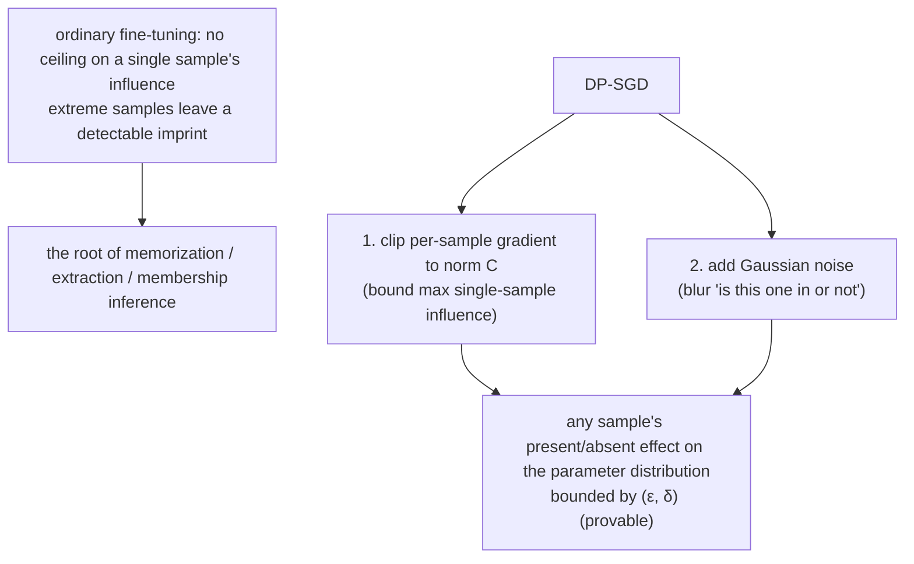

import PrivacyMeta from '@site/src/components/PrivacyMeta';

<PrivacyMeta era="Volume 3 · Conversational LLMs" technique="Differential privacy" audience={['Privacy Engineer', 'ML Engineer']} severity="Medium" maturity="Experimental" evidence="Research" />

> In one sentence: fine-tuning me on sensitive data and hoping "it just won't leak" doesn't hold — that's exactly where memorization and extraction come from. DP fine-tuning (DP-SGD: clip per-sample gradients + add noise) gives a **provable** property: it bounds any single sample's influence on my parameters within an (ε, δ) bound, lowering the chance it gets reproduced verbatim or membership-inferred. But remember two things: **ε is not zero** — it's "bounded leakage," not "zero leakage"; and **more private usually means lower utility**. Don't read "DP was applied" as "private" — look at what ε is, and whether it protects a sample or a user.

## Mechanism: what happens on my side

In ordinary fine-tuning, how much a single sample can "tug" my parameters has **no uniform bound in the differential-privacy sense** — there are of course engineering limits (learning rate, gradient clipping, numerical range), but none of those is a provable privacy bound; one extreme, distinctive sample can still leave an **externally detectable imprint** on me (this is the shared root of memorization, extraction, and membership inference).

DP-SGD (Abadi et al., CCS 2016) changes two things:

1. **Per-sample gradient clipping**: clip each sample's gradient contribution to a norm bound C — putting a ceiling on any single sample's maximum influence.
2. **Gaussian noise**: add noise on top of the clipped, summed gradient — blurring out "was this particular sample in this batch or not."

The result is a provable property: whether any one sample is **present or absent**, its effect on my final parameter distribution is bounded by (ε, δ). Mind the red line: this is **not** "DP made me forget it" — I can't introspect that. What is externally arguable is: **within the defined neighboring relation, privacy unit, and accounting assumptions, the extra information an attacker can gain at telling apart 'was this sample in training or not' — from my parameters or outputs — is bounded by (ε, δ)** — but the actual attack risk still depends on the prior, the query method, the number of compositions, and whether the privacy unit matches what you mean to protect.



## Threat surface: what DP does and doesn't defend

DP directly weakens **single-sample distinguishability** — membership inference (is someone in the fine-tuning set), single-sample memorization, and verbatim extraction. Even an attacker who can query outputs, or holds the weights, has their advantage at "decide whether a given sample was in training" capped by the budget.

But it has clear boundaries, and does **not** defend these:

- **Out-of-budget side channels**: DP only protects "the part that went through DP-SGD training." Plaintext private data in the prompt, the RAG store, logs, or caches is all outside this boundary.
- **ε set too large**: ε is continuous; set it large enough and the "bound" loosens to meaninglessness — "technically used DP" ≠ "actually private."
- **Wrong privacy unit**: sample-level DP protects "one sample"; protecting "all of one user's data" needs user-level DP. Using sample-level where you meant user-level is a common false security.

## How the defense works

The definition of (ε, δ)-differential privacy: for two **neighboring** datasets (differing by exactly one sample), the ratio of probabilities that the mechanism's output lands in any set is bounded by e^ε, plus a δ slack term. Intuitively — whether your record is in or out barely changes the distribution of "what I turn into," so an attacker can hardly infer your presence from me.

In engineering it's two pieces: **clip + noise** give the per-step privacy loss, and **privacy accounting** sums many steps into a total budget — Abadi et al.'s moments accountant makes that summation far tighter than naive composition, so you add much less noise at the same privacy and keep more utility (Abadi et al., 2016). The point: **ε is a budget not a switch, δ is the small probability you allow it to "fail," and the privacy unit decides who is protected** — without spelling out all three, the letters "DP" mean nothing.

## Buildable recipe

```text
1. Fix the privacy unit first: protect a single sample or a single user? User-level
   needs grouping by user for clipping/noise — don't default to sample-level.
2. Use a mature library for DP-SGD (e.g. Opacus): set clipping norm C, noise
   multiplier σ, sampling rate q, steps T, and derive (ε, δ) from a privacy
   accountant (moments/RDP).
3. Use a large pretrained model + DP-suited hyperparameters: naive DP-SGD drops a
   lot on NLP, but a large model with DP-adapted hyperparameters (larger batch,
   specific learning rate) and a pretraining-aligned objective pulls utility back
   markedly at the same privacy budget (Li et al., ICLR 2022).
4. Save memory: use ghost clipping to avoid instantiating per-sample gradients
   (Li 2022); or pair parameter-efficient fine-tuning (LoRA/adapter) with DP,
   often better on utility/privacy/compute at once (Yu et al., ICLR 2022).
   Note: parameter-efficient != private — only clipping + noise + accounting +
   privacy unit together constitute DP; LoRA/adapter is just a cheaper carrier.
5. Report the full set: ε, δ, privacy unit, accounting method, utility metric —
   not just "DP added."
```

Every number (C, σ, the final ε) must carry **your own data and model conditions** when you ship it; the papers' values may not transfer to your setting.

**Minimal testable assertions** (turn the recipe above into a regression check):

- How to test: re-derive the reported (ε, δ) with an independent privacy accountant (moments / RDP), and check the privacy unit matches the clipping / noise configuration.
- Pass: (ε, δ) re-derives to the same order of magnitude; clipping norm / noise multiplier / sampling rate / steps are all present; the privacy unit matches what you mean to protect (sample / user).
- Fail: can't re-derive / no accounting / mismatched privacy unit → it isn't formal DP; don't label it "DP added."

## A real case

(This entry's maturity is "Experimental": what follows is **research progress and engineering feasibility** evidence, not an endorsement that DP fine-tuning is already deployed at production scale; production-grade DP / federated deployment is in Volume 5.)

DP fine-tuning had a "bad reputation" phase: bolt DP-SGD straight onto NLP and utility dropped a lot while compute got expensive, so it was deemed "impractical." Two 2022 works were the turning point: Li et al. showed that **large pretrained language models can be "strong differentially private learners"** — with DP-suited hyperparameters and ghost clipping, beating the best DP models of the time at the same privacy budget (Li et al., ICLR 2022); Yu et al. combined **parameter-efficient fine-tuning** (e.g. LoRA / adapters) with DP, improving utility, privacy, and compute/memory at once (Yu et al., ICLR 2022). What they confirm is not "DP fine-tuning is now free," but that "**at a reasonable ε, the utility cost of DP fine-tuning has gone from 'unusable' to 'an engineering trade-off you can make.'**" (Larger production-scale DP / federated deployments, like Gboard's DP-FTRL, are federated learning — see Volume 5.)

## Residual risk and trade-offs

Calling out each false security:

- **ε is not zero.** DP gives "bounded single-sample influence," not "never leaks." ε=1 and ε=100 are worlds apart — saying "DP added" without reporting ε says nothing.
- **Utility vs. privacy is a real cost.** Tighter ε means more noise means more likely utility loss. It's a trade-off to account for, not free safety.
- **"Formal DP" ≠ "privacy-inspired."** Only actual clipping + noise + accounting gives a formal guarantee; "added some noise" without budgeting is not DP — don't conflate them.
- **DP only covers the training boundary.** The weights are private, but the same record sitting in a prompt, a RAG store, or logs still leaks. DP is the privacy of the training step, not of the whole system.
- **Don't mismatch the privacy unit.** Protecting "users" with only "sample-level" dilutes the guarantee when a user has many records.

## Compliance mapping

- **GDPR / data minimization**: DP gives a **quantifiable** privacy guarantee, useful for a DPIA (data protection impact assessment) and for arguing "we took technical measures." But DP **does not automatically satisfy the right to be forgotten** — "bounding single-sample influence" is not "deleting a record" (true deletion / unlearning is Volume 5).
- **NIST**: SP 800-226 (DP guidelines) gives terminology and an evaluation frame for engineering DP — a yardstick for "is this ε reasonable, is the accounting credible."

(Compliance evolves with statute/standard versions; this section is stamped 2026-06 — verify the latest text before citing.)

## How this differs from neighboring techniques

- **DP fine-tuning vs. training-data deduplication**: dedup lowers memorization but gives **no formal guarantee** (rare single samples can still be extracted — see [Training-data extraction](../02-memorization-extraction/training-data-extraction.mdx)); DP gives a **formal bound** but at a utility cost. They often stack: dedup to lower the baseline, DP for the formal guarantee.
- **DP vs. machine unlearning**: DP is **prevention up front** (bound single-sample influence during training); unlearning is **deletion after the fact** (already trained, now try to erase one record's influence). Both concern "a single sample," but one is before, one is after (unlearning is Volume 5).

## Version notes

:::note Applicable versions
The DP-SGD skeleton (clip + noise + moments accounting) has held since 2016 (Abadi, CCS); it's a **model-agnostic** training mechanism, common across vendors. Getting it to "acceptable utility" on large-language-model fine-tuning is roughly a 2022 advance (Li / Yu, ICLR 2022), engineered further via libraries like Opacus. **Note**: the ε values and utility conclusions in the papers are tied to specific models, data, and tasks and don't transfer directly; deployment must re-derive them with your own privacy accounting. (Sources verified 2026-06.)
:::

## Further reading and sources

- [Deep Learning with Differential Privacy (Abadi et al., ACM CCS 2016; arXiv 1607.00133)](https://arxiv.org/abs/1607.00133) — the DP-SGD foundation: per-sample clipping + Gaussian noise give (ε, δ)-DP, with the moments accountant tightening the multi-step budget.
- [Large Language Models Can Be Strong Differentially Private Learners (Li et al., ICLR 2022; arXiv 2110.05679)](https://arxiv.org/abs/2110.05679) — a large pretrained model + DP-suited hyperparameters + ghost clipping beats the best prior DP models at the same privacy budget.
- [Differentially Private Fine-tuning of Language Models (Yu et al., ICLR 2022; arXiv 2110.06500)](https://arxiv.org/abs/2110.06500) — parameter-efficient fine-tuning (LoRA / adapters) combined with DP improves utility / privacy / compute at once.
