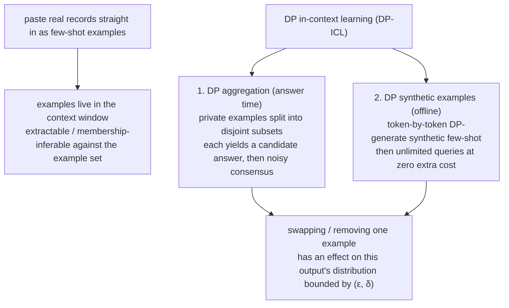

import PrivacyMeta from '@site/src/components/PrivacyMeta';

<PrivacyMeta era="Volume 3 · Conversational LLMs" technique="Differential privacy" audience={['Privacy Engineer', 'ML Engineer']} severity="Medium" maturity="Experimental" evidence="Research" />

> In one sentence: to get me to "follow the format," you paste a few real customer records into the prompt as few-shot examples — and those private examples can be extracted or membership-inferred (deciding whether a given record was in the example set). DP in-context learning (DP-ICL) doesn't touch the weights; it **puts differential privacy on the private examples in the prompt**: either it splits the private examples into disjoint subsets and does a **noisy aggregation** over my outputs across those subsets before answering, or it uses the private data to **generate a batch of synthetic examples with an (ε, δ) guarantee** that replace the real ones. What it can bound is **any single private example's influence on the answer** — not me introspecting the prompt. Two boundaries up front: **it protects the examples, not the query itself**; and **ε isn't zero**, so out-of-aggregation side channels still leak.

## Mechanism: what happens on my side

When you drop real records straight into the prompt as few-shot examples, those private examples **live in my current context window** — alongside the system prompt and conversation history, with no built-in "confidential / public" layering on my side (see [Context-surface privacy](./context-surface-privacy.mdx)). The externally observable consequence: an attacker can **extract** the example content through ordinary conversation, or across many queries **close in on** "is this record actually in the example set or not" — i.e. membership inference against the **example set**. Feeding raw private examples into the prompt is exactly how that leakage surface opens.

DP-ICL takes a different route: **don't feed the raw private examples into the user-facing answer**, and instead bound any single example's influence on the final output with differential privacy. Two mainstream approaches:

1. **DP aggregation (at answer time)**: split the private examples into **disjoint subsets**, stitch each subset in as few-shot examples and have me produce one candidate answer per subset, then do a **noisy consensus aggregation** over that set of answers — for classification, a mechanism like Gaussian Report-Noisy-Max privately selects the label; for generation, aggregate with noise at the embedding / keyword level (Wu et al., ICLR 2024). Any single example lands in exactly one subset, so changing it alters at most one candidate answer, and the noise blurs that difference away.
2. **DP synthetic examples (offline generation)**: first use the private data to **generate a batch of synthetic few-shot examples token by token** — run inference over disjoint subsets and apply a DP noisy aggregation over each step's token distribution — producing synthetic examples with an (ε, δ) guarantee; afterward you use the **synthetic examples** as demonstrations for an unlimited number of queries **at no additional privacy cost** (Tang et al., ICLR 2024).

Let me be clear about the red line (this is a mechanism tendency, not an introspective promise): DP-ICL is **not** "I read the prompt and decided not to leak the examples" — I can't reliably introspect which line in the prompt is sensitive. What is externally arguable is: **within the defined neighboring relation and accounting assumptions, swapping out / removing one private example from the example set has an effect on this output's distribution bounded by (ε, δ)** — so the extra advantage an attacker gains at "telling whether a given record entered the example set" is capped by the budget. The thing being constrained is **the output's sensitivity to a single example**, achieved by subset partitioning + noisy aggregation, not by me "keeping my mouth shut."



## Threat surface: what DP-ICL does and doesn't defend

DP-ICL directly weakens **the distinguishability of any single private example**: membership inference against the **example set** (was a given record placed among the few-shot), and verbatim extraction of some example from the answer. Even an attacker who can query repeatedly and observe outputs has their advantage at "tell whether a given example entered the set" capped by the privacy budget.

But it has clear boundaries, and does **not** defend these:

- **The query itself is out of scope.** DP-ICL bounds the influence of the **private examples (demonstrations)** on the output; sensitive content in the user's current question is **not** covered by this (ε, δ) — that's a different attack surface (context-surface privacy / inference-service retention).
- **ε set too large.** ε is continuous; set it large enough and the "bound" loosens to meaninglessness — "technically used DP-ICL" ≠ "actually private."
- **Out-of-aggregation side channels.** DP only protects "the examples that went through the DP aggregation / DP generation." If you also put the raw records into the system prompt, RAG snippets, logs, or caches, that plaintext still leaks — DP-ICL doesn't cover it.
- **Utility cost.** Splitting into subsets and adding noise **costs utility**; more subsets and stronger noise usually mean lower single-answer quality. It's a trade-off to account for, not free safety.

Spell out the attacker model: this entry assumes a **black-box query** attacker (can ask repeatedly, observe outputs, not necessarily needing logprobs), with success measured as "membership-inference advantage against the example set" or "extraction of some example." For empirical evidence that raw examples pasted into a prompt leak, see cross-model system-prompt / example extraction research (Zhang, Carlini & Ippolito, COLM 2024).

## How the defense works

DP-ICL lands the definition of (ε, δ)-differential privacy **onto the prompt example as the object**: the neighboring datasets are no longer "differ by one training sample" but "**differ by one few-shot example**"; the mechanism is not a DP-SGD training step but a **query-facing noisy aggregation / noisy generation**. The intuition is the same — whether your example is in the set or not barely changes the distribution of "how I answer this time," so an attacker can hardly infer its presence from my answer.

How "bounded single-example influence" is assembled in engineering:

- **Disjoint subsets** → any single example influences only one subset's candidate answer, bounding "one example's maximum influence" (analogous to PATE's teacher partitioning).
- **Noisy aggregation / noisy generation** → add noise over candidate answers or token distributions to blur "was this example in this batch."
- **Privacy accounting** → sum the multiple steps (multiple aggregations, or the many token-wise calls during generation) into a total budget (ε, δ). A nice property of DP synthetic examples: **generate once, pay the privacy bill once**, then serve unlimited queries from the synthetic examples with no further charge (Tang et al., ICLR 2024); DP aggregation, by contrast, **spends budget on every answer**, so the number of queries eats directly into the budget.

The point, same as DP fine-tuning: **ε is a budget not a switch, δ is the small probability you allow it to "fail," and the privacy unit (here, "one example") decides who is protected.** The protected object is "example-level" — if one person's sensitive info is spread across several examples, the example-level guarantee dilutes (the same false security as "using sample-level where you meant user-level" in DP fine-tuning).

## Buildable recipe

```text
1. Separate what you protect first: is it "the private examples in the prompt" or
   "the user query"? DP-ICL only covers the former; sensitive content on the query
   side goes through context-surface privacy / inference-service retention — don't mix.
2. Pick a form:
   - Online Q&A, examples change often -> DP aggregation (answer time): split private
     examples into disjoint subsets, stitch each as few-shot for a candidate answer,
     aggregate with DP (classification: Gaussian Report-Noisy-Max; generation: noise
     at the embedding / keyword level). Note: each answer spends budget, so query
     volume eats ε directly.
   - Examples reusable, must serve many queries -> DP synthetic examples (offline):
     token-by-token DP-generate a batch of synthetic few-shot from the private data,
     then answer unlimited queries from the synthetic examples at zero extra privacy
     cost (Tang et al., ICLR 2024).
3. Fix the privacy unit + report the full set: privacy unit = "one example"; derive
   (ε, δ) from a privacy accountant (RDP / PRV, etc.) and report the full set: ε, δ,
   privacy unit, subset count / aggregation mechanism, utility metric — not just
   "DP-ICL added."
4. Report the utility cost: give the non-private baseline on the same task and a
   utility curve across several ε levels (e.g. ε=1 / 3 / 8), so readers see "how many
   points you lose to be a bit more private," not just one optimistic number.
5. Run membership inference against the example set to verify: only when the
   attacker's advantage at "is a given example in the set" is pushed near random does
   the defense actually hold (see "Minimal testable assertions" below).
```

Every number (subset count, σ, the final ε, the utility drop) must carry **your own data, task, and model conditions** when you ship it; the papers' values may not transfer to your setting, and deployment must re-derive them with your own privacy accounting.

**Minimal testable assertions** (turn the recipe above into a regression check):

- How to test: (1) re-derive the reported (ε, δ) with an independent privacy accountant, checking the privacy unit (one example) matches the subset-partition / aggregation configuration; (2) run a membership-inference probe against the **example set** — construct "in-set / out-of-set" example pairs, use black-box query attacks to distinguish them, and measure the attacker's advantage (AUC's deviation from 0.5).
- Pass: (ε, δ) re-derives to the same order of magnitude; the membership-inference advantage is pushed near random (AUC near 0.5); and the utility drop relative to the non-private baseline is within a budget level you can accept.
- Fail: can't re-derive / no accounting / mismatched privacy unit → it isn't formal DP; don't label it "DP-ICL added." Membership-inference advantage still significant → ε is too loose or the aggregation / subset configuration is off; go back and tighten the budget or re-partition subsets, rather than just "rewording it so the model won't repeat."

## Research progress · engineering feasibility

(This entry's maturity is "Experimental": what follows is **research-prototype and engineering-feasibility** evidence, not an endorsement that DP-ICL is already deployed at scale.)

- **DP-aggregation DP-ICL**: Wu et al. (ICLR 2024) proposed the DP-ICL paradigm — a **noisy consensus aggregation** over model outputs across disjoint example subsets (Gaussian Report-Noisy-Max for classification; embedding / keyword-level aggregation for generation), evaluated on four text-classification benchmarks and two generation tasks; its abstract reports that **even at ε=1**, the aggregation is **competitive with** non-private aggregation (the number is tied to their experimental setup — the specific benchmarks, model, aggregation mechanism, and query budget; verify each condition against the original before citing).
- **DP-synthetic-example DP-ICL**: Tang et al. (ICLR 2024) **generate synthetic few-shot examples token by token with DP** from the private data, producing synthetic demonstrations with a formal DP guarantee; the key engineering property is **generate once, pay the privacy bill once**, after which the synthetic examples serve an unlimited number of queries with no further privacy cost. This turns "example protection" from "pay budget on every Q&A" into "a one-time offline cost," which is more practical when you must serve many queries.
- **What it confirms is not "free"**: these two works confirm that "**at a reasonable ε, putting DP on prompt private examples has gone from 'infeasible' to 'an engineering trade-off you can make,'**" not that "DP-ICL is now free and production-ready." Both attack and defense are still evolving; deployment means re-deriving ε yourself and testing the membership-inference advantage.

## Residual risk and trade-offs

Calling out each false security:

- **"Use real records as examples and the model just won't leak them" is wrong.** Raw examples in the prompt live in the context window — extractable / membership-inferable — and DP-ICL works by **changing the mechanism** (subsets + noisy aggregation / DP generation), not by me "keeping quiet." Doing nothing and just pasting the records in is no protection at all.
- **DP-ICL protects the examples, not the query.** It bounds the influence of the **private demonstrations** on the output; sensitive content in the user's current question is not inside this (ε, δ). Don't treat it as "privacy for the whole pipeline."
- **ε is not zero.** It gives "bounded single-example influence," not "never leaks." ε=1 and ε=100 are worlds apart — saying "DP-ICL added" without reporting ε says nothing.
- **Utility vs. privacy is a real cost.** Splitting into subsets and adding noise loses points; the tighter the budget, the more you lose. It's a trade-off to account for.
- **Out-of-aggregation side channels still leak.** DP only covers "the examples that went through the DP aggregation / DP generation"; the same record sitting in the system prompt, a RAG store, or logs still leaks. DP-ICL is not system-level privacy, just the privacy of the "prompt private examples" step.
- **Don't mismatch the privacy unit.** The protected object is "one example"; if a person's info is spread across several examples, the example-level guarantee dilutes.

## How this differs from neighboring techniques

- **DP-ICL vs. DP fine-tuning (this volume, same "differential privacy" board)**: both use "bound a single privacy unit's influence within (ε, δ)," but the **object and timing differ**. [DP fine-tuning](./dp-fine-tuning.mdx) uses DP-SGD to **change the weights** — clip + noise to bound one **training sample**'s influence on the **parameter distribution**; DP-ICL **doesn't touch the weights** and, at **inference / generation time**, bounds one **prompt example**'s influence on **this output** (subset partitioning + noisy aggregation / DP generation). In one line: **protect training data, change parameters → DP fine-tuning; protect the private examples in the prompt, change no parameters → DP-ICL.** The two can stack: DP fine-tune the base to cover the weight side, then add DP-ICL on the example side.
- **DP-ICL vs. context-surface privacy (this volume)**: [Context-surface privacy](./context-surface-privacy.mdx) is about the **leakage surface** — "things already in the context window (system prompt / others' data / credentials) can be extracted"; DP-ICL is **one formally-guaranteed mitigation** aimed at the **private few-shot example** subset of that — using noisy aggregation / DP synthetic examples to bound a single example's influence. The former is the problem (and the leakage surface this entry defends), the latter one solution; DP-ICL does not address the query side or misplaced credentials, which still belong to context-surface privacy's general recipe (keys out of the prompt, authorization enforced in the backend).

## Version notes

:::note Applicable versions
DP-ICL's two skeletons — **answer-time DP aggregation** (disjoint example subsets + noisy consensus, Wu et al.) and **offline DP synthetic examples** (token-by-token DP generation, Tang et al.) — were both established around 2024 (ICLR 2024) and are **model-agnostic** inference-time mechanisms that can wrap a black-box LLM. **Note**: the ε values and utility conclusions in the papers are tied to specific models, data, tasks, and query budgets and don't transfer directly; deployment must re-derive them with your own privacy accounting and empirically test the membership-inference advantage against the example set. Both attack and defense are still evolving; this section is stamped 2026-06 — verify each ε / utility condition against the source before citing.
:::

## Further reading and sources

- [Privacy-Preserving In-Context Learning for Large Language Models (Wu et al., ICLR 2024; arXiv 2305.01639)](https://arxiv.org/abs/2305.01639) — the DP-ICL paradigm: a noisy consensus aggregation over model outputs across disjoint example subsets (Gaussian Report-Noisy-Max for classification; embedding / keyword-level for generation), bounding a single example's influence on the answer within (ε, δ); the abstract reports competitiveness with non-private aggregation at ε=1 (tied to their experimental setup).
- [Privacy-Preserving In-Context Learning with Differentially Private Few-Shot Generation (Tang et al., ICLR 2024; arXiv 2309.11765)](https://arxiv.org/abs/2309.11765) — token-by-token DP generation of synthetic few-shot examples from private data; generate once and pay the privacy bill once, then serve unlimited queries at zero extra cost; the primary source for this entry's "DP synthetic examples" variant.
- [Effective Prompt Extraction from Language Models (Zhang, Carlini & Ippolito, COLM 2024; arXiv 2307.06865)](https://arxiv.org/abs/2307.06865) — corroborates that content placed in the prompt (including few-shot examples) can be extracted with high probability by simple text attacks — the raw leakage surface DP-ICL sets out to mitigate.
