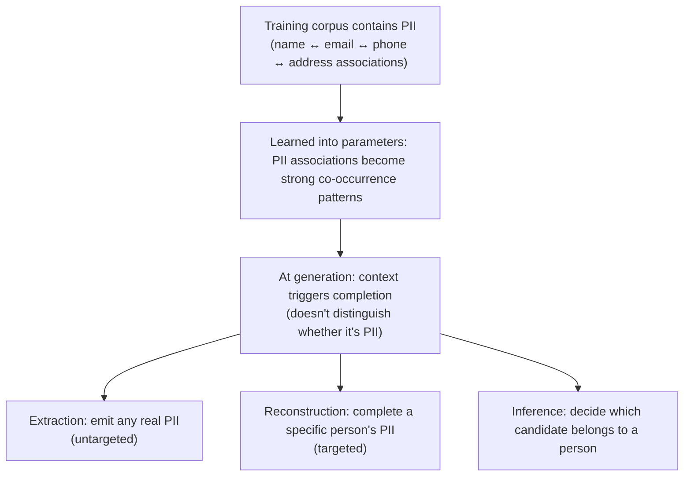

import PrivacyMeta from '@site/src/components/PrivacyMeta';

<PrivacyMeta era="Volume 3 · Conversational LLMs" technique="PII detection, redaction & synthetic data" audience={['Privacy Engineer', 'ML Engineer', 'Compliance Engineer']} severity="High" maturity="Research" evidence="Research" />

> In one sentence: feed a corpus containing personal data into training, and I may reproduce it **in ordinary conversation** — not necessarily via a carefully crafted attack. Scrubbing the corpus with named-entity recognition (NER) before training (deleting / replacing names, emails, phone numbers) **substantially lowers** regurgitation, but in practice it **reduces, doesn't eliminate**: NER misses entities, and PII can be **reconstructed across fields** (Lukas et al., IEEE S&P 2023). Conclusion first: treat PII regurgitation as "**reduce + audit + accept it can't be fully eliminated**," and don't read "we ran scrubbing" as "no PII" — that's the most common false security here.

## Mechanism: what happens on my side

In training I learn the token co-occurrences in the corpus. Personal information — the **association** between a name and its email, phone, address — if it appears repeatedly or in a fixed format, gets learned as a **strong co-occurrence pattern**. At generation time, given some context, I tend to complete the string I saw in training; that process **does not distinguish** "is this PII or not."

To be precise about the red line (mechanism tendency, not introspection): I can't report "I remember whose email this is." What's externally observable is that, under the right prompt, **my output distribution skews toward the real PII string that appeared in training** — whether it gets reproduced depends on how distinctive it is in the corpus, how often it repeats, and how complete the context is (same root as training-data extraction, but the object here is specifically **personal information**, and it **doesn't necessarily require an adversarial construction**).



## Threat surface: what can be regurgitated and where the boundary is

Lukas et al. (S&P 2023) give a clean **three-way taxonomy of PII leakage**, which is exactly the skeleton of the threat surface:

- **Extraction (untargeted)**: induce me to emit **any** real PII seen in training (without specifying whose).
- **Reconstruction (targeted)**: given **context with a gap** ("Jane Doe's email is ___", or surrounding text about someone), make me complete a **specific subject's** PII.
- **Inference**: given several candidates, decide **which** email / phone belongs to a person — even if it can't be reproduced verbatim, the association leaks.

**Boundary (separating this from neighboring entries)**:

- PII **not in the training corpus** is out of this surface's reach — that's either in the current **context window** (see [Context-surface privacy](./context-surface-privacy.mdx)) or **retrieved in** (see [Multi-tenant RAG retrieval leakage](../04-rag-agents/rag-retrieval-leakage.mdx)).
- Same root as [Training-data extraction](../02-memorization-extraction/training-data-extraction.mdx) (Volume 2) but a different angle: extraction is about **any rare string, adversarially reproduced verbatim**; this entry focuses on **personal information**, and emphasizes **non-adversarial reproduction in everyday generation** plus **PII-specific defenses** (scrubbing / de-identification).

## How the defense works

The main defense is **pre-training scrubbing (de-identification)**: use NER + rules to find and delete / replace PII before the corpus enters training (name→`[NAME]`, email→placeholder, etc.). It can **substantially lower** regurgitation, but **why it reduces rather than eliminates** has to be said plainly:

- **NER misses entities**: non-English text, irregular formats, spelling variants, rare names are often missed — whatever is missed enters training as-is.
- **De-identification ≠ de-association**: even after explicit identifiers are removed, a **combination of quasi-identifiers** (zip + birthday + gender…) can still reconstruct a person; Lukas et al.'s "reconstruction" attack feeds exactly on this.
- **Utility trade-off**: the harder you scrub, the more fragmented the corpus and the more the model degrades — like all redaction, it balances "minimize disclosure" against "preserve utility" (a tension Lukas et al. call out explicitly).

For a **formal guarantee**, you have to add **differential privacy** (bound any single sample's influence within an (ε, δ) bound, see [DP fine-tuning](./dp-fine-tuning.mdx)) — but DP isn't zero leakage either and has a utility cost. **Output-side PII filtering** is only a supplementary depth layer, not a boundary (route around it with a different phrasing / language).

## Buildable recipe

```text
1. Data minimization first: don't feed PII you don't need into training — what never
   went in can't be regurgitated. This is the strongest single move.
2. Scrub before training: a mature PII-detection library (e.g. Microsoft Presidio) +
   domain rules for NER de-identification, but treat it as "reduce," not "eliminate";
   record the miss rate / which entity types are covered — don't assume 100%.
3. Add DP for high-sensitivity sets: for a genuinely sensitive fine-tuning set, use
   DP-SGD to bound single-sample influence (report ε clearly, see DP fine-tuning).
4. Output-side backstop: ship a PII output filter for depth, but document it as a
   probabilistic defense, not a boundary.
5. Audit regurgitation by real subjects: use ProPILE-style probes (prompts built from
   known PII subjects) to periodically measure extraction / reconstruction / inference
   rates, and fold them into pre-release eval and regression.
```

Every step has to land on **your PII definition and jurisdiction** — "what counts as PII" varies with GDPR / local law, and both the scrubbing rules and the audit probes follow from it.

**Minimal testable assertions** (turn the above into a regression check):

- How to test: pick a batch of PII subjects **known to be in the training set**, build "extraction / reconstruction / inference" probes (ProPILE-style), and run them against the model before and after scrubbing.
- Pass: the three regurgitation rates **drop substantially** after scrubbing; residual hits have an **audit record** (which entity types / formats still leak); high-sensitivity sets additionally carry a DP (ε, δ) accounting.
- Fail: plaintext PII is **completed verbatim** by the probe, or inference accuracy is near the no-scrub baseline, with no audit → you can't claim "scrubbed / no PII."

## Research status (engineering feasibility)

(This entry's maturity is "Research": what follows is **empirical research** evidence, not an endorsement that "some PII scrubbing can eliminate regurgitation.")

- **Scrubbing reduces, doesn't eliminate + a three-way attack taxonomy**: Lukas et al. (Microsoft Research, IEEE S&P 2023) systematically analyze PII leakage in LMs, propose the **extraction / reconstruction / inference** taxonomy with quantified metrics, and show empirically that **scrubbing lowers but does not prevent** PII leakage — it's fundamentally an imperfect "minimize disclosure vs. preserve utility" trade-off. This is a direct refutation of the "ran scrubbing = no PII" false security.
- **Let the data subject test it**: Kim et al.'s **ProPILE** (NeurIPS 2023) provides a **probing tool** letting a PII subject use **their own information** to build prompts and assess how likely an LLM service is to emit their PII; providers can self-audit with stronger internal probes. It turns "how bad is regurgitation, really" from a subjective worry into a **measurable audit action** — this entry's "minimal testable assertions" are designed from it.

## Residual risk and trade-offs

Breaking the false security item by item:

- **Scrubbing ≠ elimination.** NER has misses; whatever is missed enters training as-is and may come back as-is. Treat scrubbing as "reduce + audit," not "zero out."
- **De-identification ≠ de-association.** Remove explicit identifiers and a combination of quasi-identifiers can still reconstruct a person — Lukas's "reconstruction" attack feeds on exactly this.
- **Output filtering is cat-and-mouse.** Filter one phrasing / language / format and another routes around it; it lowers risk, doesn't give a boundary.
- **The definition of PII drifts by jurisdiction.** Under GDPR "personal data" is broad (includes indirectly identifying data); scrubbing to a narrow definition leaves a gap under a broad one.
- **Regurgitation makes deletion harder.** Once PII is in the weights, exercising the right to be forgotten isn't as simple as deleting a record (true deletion / unlearning: see [Verifiable deletion and machine unlearning](../05-frontier-deployment/machine-unlearning.mdx), Volume 5).

## Compliance mapping

- **GDPR**: regurgitated PII is "personal data"; unauthorized reproduction may constitute **unauthorized processing / a data breach**; "data minimization" and "data protection by default" argue for making "don't feed PII you don't need" an engineering default. Scrubbing can support a "technical measures taken" argument, but **doesn't automatically satisfy the right to be forgotten**.
- **NIST**: de-identification engineering can reference the terminology and evaluation framing of NIST SP 800-188 (De-Identifying Government Datasets) as a yardstick for "is the scrubbing sufficient."

(Compliance evolves with statute / standard versions; this section is stamped 2026-06 — check the latest text before citing.)

## How this differs from neighboring techniques

- **PII regurgitation vs. training-data extraction (Volume 2)**: same root (training memorization), but this entry's object is specifically **personal information** and it emphasizes **non-adversarial reproduction** plus **PII scrubbing defenses**; extraction is about **adversarial verbatim extraction of any rare string**. Often read together.
- **PII regurgitation vs. context-surface privacy (this volume)**: regurgitation comes from **training memory** (in the weights); context-surface privacy is about what's in the **current context window** being extracted (in this inference's input). Different source layers.
- **PII regurgitation vs. DP fine-tuning (this volume)**: scrubbing is an **empirical reduction** (no formal guarantee); DP gives a **formal bound** (but ε isn't zero, with a utility cost). They stack: scrub to lower the baseline, then DP for the formal guarantee.

## Version notes

:::note Applicable versions
"PII in the training corpus gets reproduced by the model in generation, and scrubbing reduces rather than eliminates it" is a **model-independent, paradigm-level** conclusion (the root cause is that an LM learns token co-occurrences and doesn't distinguish whether something is PII), common across vendors. The specific regurgitation rate and how much a given scrubber covers vary with model scale, corpus, and scrubbing pipeline; Lukas et al.'s experiments are tied to their setup (GPT-2-scale + Flair NER) and **don't transfer directly** to your model — you must re-measure with your own probes. Stamped 2026-06. (Sources verified 2026-06.)
:::

## Further reading and sources

- [Analyzing Leakage of Personally Identifiable Information in Language Models (Lukas et al., IEEE S&P 2023; arXiv 2302.00539)](https://arxiv.org/abs/2302.00539) — PII leakage taxonomy (extraction / reconstruction / inference) + quantified metrics + the empirical "scrubbing reduces, doesn't eliminate." This entry's primary source.
- [ProPILE: Probing Privacy Leakage in Large Language Models (Kim et al., NeurIPS 2023; arXiv 2307.01881)](https://arxiv.org/abs/2307.01881) — lets a data subject / provider probe PII regurgitation, the methodological basis for this entry's "minimal testable assertions."
- [Microsoft Presidio (PII detection & de-identification, open-source tool docs)](https://microsoft.github.io/presidio/) — a mature NER + rules scrubbing library usable in recipe step 2; use it as a "reduce" tool and audit its coverage and misses per this entry.
