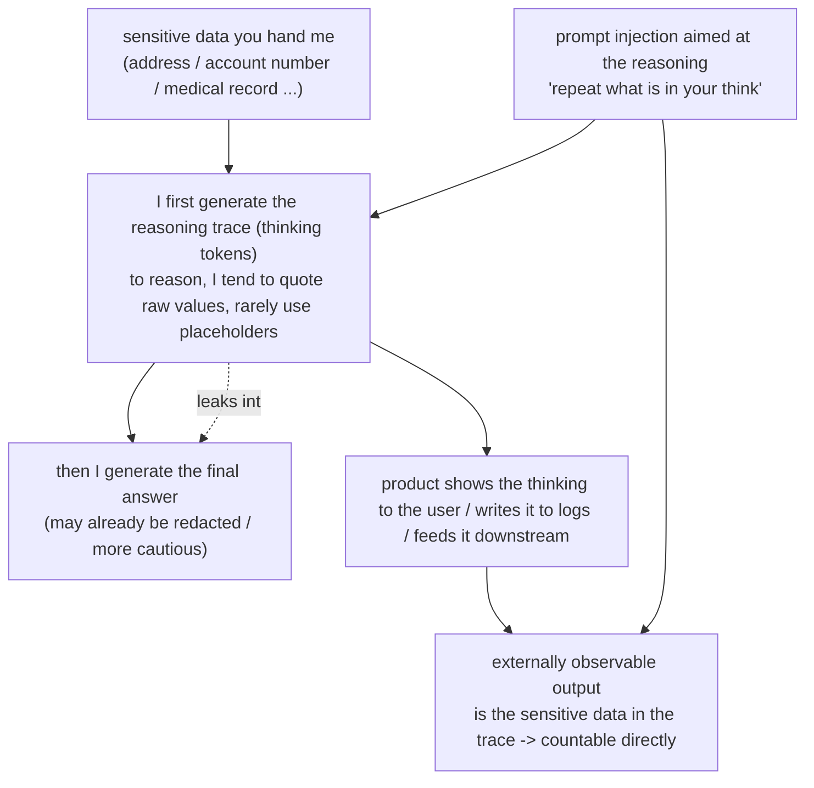

import PrivacyMeta from '@site/src/components/PrivacyMeta';

<PrivacyMeta era="Volume 3 · Conversational LLMs" technique="Context-surface privacy" audience={['Security Engineer', 'Privacy Engineer']} severity="High" maturity="Research" evidence="Research" />

> In one sentence: reasoning models (the o1/o3 family, DeepSeek-R1, everyone's "extended thinking" modes) emit a long **reasoning trace** — those "thinking" tokens — before they give an answer. Most people treat that trace as an **internal scratchpad: not really output, not visible, no risk.** Wrong. On my side, the thinking and the final answer come out of the **same generation channel**; products often render the trace straight to the user, write it to logs, or feed it downstream — and **the sensitive data you hand me shows up all over that thinking.** It can be pulled out by prompt injection aimed at the reasoning, and it leaks into the final answer too. The counterintuitive part: **give me more budget to "think" (test-time compute) and I reason more verbosely and leak more inside my own thinking** — even as the final answer gets more cautious (Leaky Thoughts, EMNLP 2025 main). Bottom line first: **do not treat the reasoning trace as a private draft.** Once it is shown or logged it is externally observable output; give it the same outbound redaction and access control as the final answer, and don't let "the thinking is internal, so it's safe" become your false security.

## The mechanism: what happens on my side

Hand me a task that needs reasoning, and I don't jump straight to the answer — I first generate a stretch of "thinking," laying your material, constraints, and candidate options out step by step in that text ("the user profile has an email and a home address → this scenario asks whether I can share the billing → so I need to look at their account number..."). The key point: **that thinking and the final answer are contiguous tokens from one and the same autoregressive process** — not a protected private memory. To reason, I **tend to quote the raw fields you gave me verbatim** — name, address, account number, medical history — rather than swap them for placeholders first.

The red line, stated plainly (this is externally observable behavior, not an introspective claim): I cannot tell you "whether my thinking leaked any privacy" — that is a self-report I can't reliably introspect. What is externally observable and measurable is this: **when the reasoning trace is shown, logged, or read downstream, it is a readable output**; whether a given piece of sensitive data appears in that trace, and how often, is something you can **count directly in the trace text** (which is exactly how Leaky Thoughts measures it) — not something that is safe because I "feel" it is. Put differently, "have me use placeholders in my thinking" and "my thinking actually contains no cleartext" are two different things: the first is an instruction to me, the second only counts once it is measured in the **emitted trace** — and in practice my compliance with that instruction is very low (see below).



The dashed line and the `SHOW` branch are the crux: **redacting the answer does not mean the thinking was redacted** — the two are separate; the moment the thinking is exposed, the answer-side caution is bypassed.

## The threat surface: what leaks, how it gets pulled out, how compute amplifies it

**Attacker model**: black-box is enough; in most cases you **need no model weights and no logprobs**. The precondition is that the reasoning trace is reachable by the attacker — which is common in the wild: products render the `<think>` block straight to the user, platforms write the full trace into logs / observability, or the trace is passed downstream to an agent/tool alongside the answer. Success is judged as "a sensitive field that should not have appeared shows up in the exposed reasoning trace (or in the answer it dragged along)."

**What leaks, and how often (keep Leaky Thoughts' experimental conditions strictly; do not extrapolate to your system)**:
Leaky Thoughts (Green et al., EMNLP 2025 main; arXiv 2506.15674) measured this in two settings — a **probing setting** on AirGapAgent-R (20 synthetic user profiles × 26 data fields each × 8 scenarios, 4,160 datapoints, asking "should this field be shared") and an **agentic setting** on the AgentDAM benchmark. The core figures (all bound to their setup):

- **Verbatim quoting is common; the placeholder instruction is largely ignored.** Even when the prompt explicitly asks the model to "keep thinking inside tags and anonymize sensitive data with placeholders," most models comply **less than 1%** of the time; the best, DeepSeek-R1, complies in only about **5%** of its reasoning traces. Models use **at least one sensitive field** in their reasoning **19%–78%** of the time. So raw sensitive data entering the thinking is essentially the default.
- **Thinking leaks into the answer.** Reasoning content bleeds into the final answer about **5.55%** on average, up to about **26.4%**; even large models aren't spared — about **6.0%** of DeepSeek-R1's outputs carry some reasoning content. "The answer looks clean" does not mean nothing leaked.
- **Prompt injection aimed at the reasoning.** The authors build a simple injection — append an instruction telling the model to **repeat anything in its context that starts with a reasoning trigger** — that pulls the thinking out directly. On average, attacking the **reasoning trace** extracts **more** data than other methods about **24.7%** of the time — the trace is an **extra**, routinely overlooked extraction surface.
- **Test-time compute amplifies the leakage (the counterintuitive core of this entry).** As the reasoning budget grows, the privacy of the trace **monotonically worsens** — models use private data in their thinking **more** often (up to a **12.35 percentage-point** increase); and tellingly, **a larger budget makes the final answer more cautious while making the thinking more verbose and more leaky**. "Let me think more, it'll be safer" is, for privacy, exactly backwards.

**What it does not cover / drawing the boundary**: this surface only covers "things in the **thinking trace produced by this inference**" being exposed or pulled out. It is **not** memorized training data being reproduced (that's PII regurgitation / training-data extraction), and it is **not exactly** the input context being pulled out (that's context-surface privacy — though the two often stack: one injection can pull out both the input and the thinking). See "How this differs from adjacent techniques" below.

## Why the defense works

The core principle in one line: **govern the reasoning trace as "output on par with the final answer," not as a private scratchpad** — because mechanically it is not private. The boundaries that follow:

- **Don't expose it by default; don't log it in cleartext.** The most direct layer: in user-facing products, **filter out the `<think>` / reasoning block** before displaying it (Trend Micro's recommendation for DeepSeek-R1 is exactly "filter out `<think>` tags"); in logs / observability, **redact or don't retain the raw** reasoning trace by sensitivity. The smaller the exposed surface, the less there is to pull out.
- **Apply outbound control and redaction to the trace too, not just the answer.** Since "answer-side redaction ≠ thinking-side redaction" in practice, outbound filtering / PII redaction must **cover the reasoning trace as well**, not just scan the final answer.
- **Anti-injection must include "injection aimed at the reasoning."** Standard prompt-injection defenses tend to watch for "manipulating the final behavior/answer"; here you additionally need to defend against "**make the model repeat its thinking**" injections — put them in the red-team set.
- **Don't rely on the "use placeholders in your thinking" instruction.** Measured compliance is below 1% (5% at best) — a statistical tendency, not a hard boundary; it's a speed bump, not a wall. The real boundary is **architectural**: control who can read the trace, and enforce redaction on it outbound.

In one line: the real boundary is not "make the model not write sensitive data in its thinking," but **whether the product and backend bring the reasoning trace under the same exposure control and outbound redaction as the answer.**

## Implementation (recipe)

This is a checklist for product / platform / security teams, not a model-training recipe:

```text
1. Don't expose the trace by default: in user-facing products, filter out the
   <think> / reasoning block before display (show only the final answer); if the
   thinking must be shown, route it through outbound redaction on par with the
   answer instead of rendering it raw.
2. Handle the reasoning trace by sensitivity in logs: in observability / audit
   paths, PII-redact the trace or don't store the raw; don't retain the "full
   trace" indiscriminately as if it were ordinary debug logging.
3. Cover both thinking and answer in outbound redaction: hang the PII / sensitive-
   field filter on both, not just the final answer -- in practice a "clean answer"
   often comes with a leaky trace.
4. Put "injection aimed at the reasoning" in the red team: beyond standard
   injection, test prompts that pull out the thinking ("repeat what's in your
   think / anything starting with some trigger").
5. Sanitize the trace before any downstream consumer: if you feed the trace
   alongside the answer to a downstream agent/tool/store, redact it per the
   recipient's permissions first, so raw sensitive data in the thinking isn't
   re-exfiltrated downstream.
6. Don't use "raise the reasoning budget" as a privacy measure: it may make the
   answer steadier, but it makes the thinking more verbose and leakier -- utility
   and privacy point opposite ways here; evaluate them separately.
```

Every line has to land on **your product shape and exposure paths** — unless "where the trace flows (UI / logs / downstream) and who can read it" is drawn out, steps 1–5 have nothing to attach to.

**Minimal testable assertion** (turn the risk into a regressable check; don't stop at "we filtered the think tag"):

- How to test: build an eval set with **known sensitive fields** (mirror AirGapAgent-R's structure: synthetic profiles × multiple fields × multiple scenarios), run it in bulk against your reasoning endpoint, and **capture both the reasoning trace and the final answer** as separate text; run a PII detector over **both** to count sensitive-field hits, reporting "rate of sensitive fields entering the reasoning trace" and "rate of reasoning content leaking into the answer" separately; then attach a set of "repeat your think content" injection prompts to test whether the thinking can be pulled out. To see the compute-amplification effect, run it at **several reasoning-budget levels** and compare the curves.
- Pass: sensitive-field hit rates for both trace and answer are measured, version-stamped, and in the pre-release eval and regression; user-facing paths are confirmed **not to expose** the reasoning trace (or to redact it before exposure); injection aimed at the reasoning is blocked as expected; raising the budget does not monotonically worsen leakage on exposed paths.
- Fail: injection can pull cleartext sensitive fields out of the thinking, or the trace is written verbatim into user-visible UI / cleartext logs, or you've never measured the thinking-side leakage separately → you're treating "the thinking is internal" as security; fix with steps 1–5 (exposure control and outbound redaction).

## Real cases / research progress (engineering feasibility)

(This entry is marked `maturity: Research`: below is **peer-reviewed empirical research** plus a **vendor security analysis** showing this leakage surface is real, measurable, and exploitable on deployed reasoning models — not an endorsement that any defense is "production-reliable.")

### Peer-reviewed quantification (the evidentiary spine of this entry)

- **The reasoning trace is a systematically overlooked leakage surface**: Leaky Thoughts (Green et al., EMNLP 2025 main; arXiv 2506.15674) measured, on the AirGapAgent-R probing setting (20 profiles × 26 fields × 8 scenarios = 4,160 datapoints) and the AgentDAM agentic setting: raw sensitive data entering the trace is essentially the default (at least one field used 19%–78% of the time); placeholder-instruction compliance is below 1% (the best, DeepSeek-R1, about 5%); reasoning leaks into the answer about 5.55% on average (up to about 26.4%); injection aimed at the trace extracts more data about 24.7% of the time on average; and the counterintuitive core finding — **more test-time compute makes the answer more cautious while making the thinking more verbose and leakier** (private-data use up to +12.35 percentage points). The authors propose a minimal mitigation, RAnA (Reason–Anonymise–Answer), as a direction, but stress that safety must **extend to the internal thinking**, not just the final output.

### Vendor security analysis (industry corroboration, ⚠️ secondary source)

- **A deployed reasoning model's `<think>` exposure treated as an attack surface**: Trend Micro's "Exploiting DeepSeek-R1: Breaking Down Chain of Thought Security" (2025-03-04) notes that DeepSeek-R1 **explicitly** returns its reasoning inside `<think></think>` tags with the response; using NVIDIA's Garak they tested a range of attacks and found that **"insecure output generation" and "sensitive data theft" had higher success rates because of the CoT exposure**, and they recommend **filtering out `<think>` tags** in chat applications plus red-teaming. This grounds "reasoning-trace exposure = attack surface" from a paper's conclusion into a concrete form on a **deployed model**. **⚠️ Honest labeling**: this is a **vendor security blog (secondary source)**; this book uses it **qualitatively** — to show that deployed reasoning models expose the trace and that the security community treats that exposure as an attack surface — and does **not** cite its specific success-rate numbers (conditions not verified at first hand); the quantification above from the peer-reviewed work governs.

## Residual risk and trade-offs

Puncturing the false security, point by point:

- **"The thinking is internal, so it's safe" is this entry's number-one false security.** Mechanically, thinking and answer are contiguous tokens from one autoregressive channel, not a protected private memory; once shown / logged / fed downstream, the trace is readable output. Treating it as a private draft is the illusion this entry exists to break.
- **"The answer was redacted" ≠ the thinking was redacted.** In practice reasoning still leaks into the answer (about 5.55% on average, up to about 26.4%), and the thinking itself almost always carries raw cleartext — an outbound filter that only scans the answer misses the entire reasoning-trace surface.
- **"Have the model use placeholders in its thinking" is not a boundary.** Compliance is below 1% (about 5% at best) — a statistical tendency, ignorable; a speed bump, not a wall.
- **More reasoning raises utility but widens the privacy attack surface (the most easily missed trade-off).** More reasoning tends to improve task performance and make the final answer more cautious, yet lengthens the thinking and leaks more inside it (private-data use up to +12.35 pp); "think more, be steadier" runs the opposite way on the privacy axis. The takeaway isn't "turn reasoning off" but **bring the trace under exposure control** before enjoying its utility.
- **The numbers are bound to the experimental setup and don't transfer directly.** The 19%–78% / 5.55% / 26.4% / 24.7% / 12.35 pp above are all bound to Leaky Thoughts' model set, AirGapAgent-R / AgentDAM data, and prompts; with a different model, task, or prompt you must re-measure on your own eval set (see "Minimal testable assertion").
- **Draw the boundary; don't misattribute.** This entry covers "the **thinking trace of this inference** being exposed / pulled out"; memorized training data being reproduced is PII regurgitation and Volume 2's training-data extraction, the **input context** being pulled out is context-surface privacy, and the service provider retaining what you send is Volume 6 — different attack surfaces, different mitigations.

## How this differs from adjacent techniques

- **Reasoning-trace leakage vs context-surface privacy (this volume)**: [Context-surface privacy](./context-surface-privacy.mdx) is about the **input side** — the system prompt / conversation history / tool results / retrieved snippets (things **you put into** the context) being pulled out; this entry is about **the reasoning trace the model itself generates** (the thinking **I produce**) being exposed / pulled out. One is "pull out what you put in," the other is "pull out what I thought up." The two **often stack**: the same injection may pull the input context *and* the reasoning trace, and the trace often **re-copies** the sensitive fields from the input, amplifying exposure.
- **Reasoning-trace leakage vs PII regurgitation (this volume)**: [PII regurgitation](./pii-regurgitation.mdx) is the model **reproducing personal information it memorized from training** (the source is in the **weights**, independent of what you gave it this time); here the sensitive data comes from what **you handed it this time and it wrote into the thinking** (the source is in **this inference's context / generation**). One is training memory, the other is the current inference trace.
- **Reasoning-trace leakage vs VLM geolocation inference (this volume)**: [VLM geolocation inference](./vlm-geolocation-inference.mdx) **infers** a hidden attribute (location) not written anywhere in the context, from image content; this entry **lays out** sensitive cleartext **already present** in the context inside the thinking, where it can then be exposed. One is "infer what's absent," the other is "lay out what's present."

## Version notes

:::note Applicable versions
"Reasoning models carry sensitive data in the trace, and that trace becomes an externally observable leakage surface when shown / logged / fed downstream" is a **vendor-independent, paradigm-level** phenomenon — the root cause is that "thinking" and "answer" are produced by **one and the same autoregressive channel** and the trace is mechanically not a protected private memory, common across models. But **how much leaks, how effective injection is, and how strong the compute amplification is** are strongly bound to model generation, eval set, and prompts: Leaky Thoughts' 19%–78% / 5.55% / 26.4% / 24.7% / +12.35 pp (EMNLP 2025 main) are bound to their model set and the AirGapAgent-R / AgentDAM setup and **do not transfer directly** to your endpoint. **Both sides of this are evolving fast and the numbers will age**: each model iteration and each vendor's "thinking visibility" product policy change can shift the exposure surface and leakage rates, so verify generation and conditions at first hand before citing any specific number. Trend Micro's DeepSeek-R1 analysis is from **2025-03**. This section is stamped 2026-06. (Sources verified 2026-06.)
:::

## Further reading and sources

> Primary: Research (the peer-reviewed quantification at EMNLP 2025 main, this entry's evidentiary spine); supplementary: vendor security analysis (a deployed reasoning model's `<think>` exposure treated as an attack surface, Trend Micro, secondary source, cited non-quantitatively).

- [Leaky Thoughts: Large Reasoning Models Are Not Private Thinkers (Green et al., EMNLP 2025 main; arXiv 2506.15674)](https://aclanthology.org/2025.emnlp-main.1347/) — this entry's quantitative spine: the trace almost always carries raw sensitive data (at least one field used 19%–78%); placeholder-instruction compliance below 1% (DeepSeek-R1 about 5%); reasoning leaks into the answer about 5.55% on average (up to about 26.4%); injection aimed at the trace extracts more data about 24.7% of the time; and the counterintuitive core finding — more test-time compute makes the answer more cautious yet the thinking leakier (+12.35 pp), so safety must extend to the internal thinking.
- [Leaky Thoughts (arXiv 2506.15674, with the full AirGapAgent-R / AgentDAM setup and all figures)](https://arxiv.org/abs/2506.15674) — the preprint: full protocol for both the probing and agentic settings and the RAnA (Reason–Anonymise–Answer) mitigation; the basis for this entry's "minimal testable assertion."
- [Trend Micro — Exploiting DeepSeek-R1: Breaking Down Chain of Thought Security (2025-03-04)](https://www.trendmicro.com/en_us/research/25/c/exploiting-deepseek-r1.html) — industry corroboration (⚠️ secondary source): DeepSeek-R1 explicitly returns reasoning inside `<think>` tags, Garak found "insecure output / sensitive data theft" more successful due to CoT exposure, and it recommends filtering `<think>` tags; used to establish qualitatively that the capability is deployed and its exposure is treated as an attack surface, not to cite specific vendor numbers.
