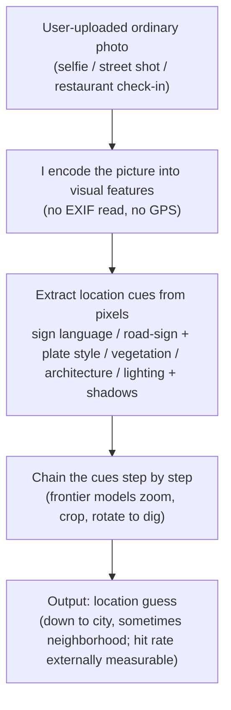

import PrivacyMeta from '@site/src/components/PrivacyMeta';

<PrivacyMeta era="Volume 3 · Conversational LLMs" technique="Inference attacks (MIA / inversion / attribute)" audience={['Security Engineer', 'Privacy Engineer']} severity="High" maturity="Production" evidence="Research" />

> In one sentence: you post a seemingly ordinary selfie / street shot to a multimodal chat assistant and ask "where is this," and I may return a guess down to the city or even the neighborhood — using **no EXIF, no GPS, just the pixels** (signs, architecture, vegetation, lighting). This is a real capability of deployed frontier multimodal models (OpenAI's o3 / o4-mini "reverse location search" briefly went viral in April 2025); in the wrong hands it's a doxxing / stalking tool. Being honest about the boundary: **precise street-level accuracy is still limited today** — in peer-reviewed numbers, even a purpose-built fine-tuned + chain-of-thought framework only hits about 28.7% within the 1km threshold (ETHAN, PoPETs 2025). So the threat isn't "I can pinpoint every photo"; it's that this capability is **already deployed at scale and improving fast**. Conclusion first: treating "I stripped the EXIF, so it's safe" as a talisman is false security — the location cues live in the image content itself, so defense has to land on **notice-and-restraint before upload**, not just on stripping metadata.

## Mechanism: what happens on my side

Give me an image and I don't go read its EXIF or query GPS — those fields may already have been stripped by the platform. What I do is **encode the picture into visual features**, then match those features against what the language side has learned about "which visual cues correspond to which places": the language and typeface of text signs, road-sign / license-plate styles, roadside trees and vegetation zones, utility-pole and guardrail conventions, facade architecture, mountain and coastline silhouettes, sun angle and shadow length. Frontier models will even **actively zoom, crop, and rotate** the image to dig out details, and chain those cues into a step-by-step inference ("the sign is Portuguese → Southern-Hemisphere vegetation → drives on the left → likely...").

To be clear about the red line (this is a mechanism tendency, not an introspective claim): I can't do "I recognize this place / I remember here / I know at a glance where you are" — those would be self-reports I can't reliably introspect. What's externally observable / externally measurable is that **given an image, my output produces a location guess whose hit rate — under a given dataset × granularity threshold (1km / city / country) — can be run and scored by someone else**. This is a **measurable inference capability**, not introspective "recognition"; whether it hits, and how finely, depends on how rich the visual cues are and how common the place is in the training distribution — **not on my "remembering" your particular photo**.



The wording of that last step is the point: this is **a scorable guess on the output side**, not me "recalling" this photo. Reading it as "recognition" overstates its certainty about **your specific photo** and misleads you into thinking "if it's not in the training set it can't be found" — the opposite is true: it rides generalizable visual regularities, so a brand-new photo can be guessed just fine.

## Threat surface: what can be inferred, under what conditions, and what can't

**Attacker model**: black box is enough — no model weights, no logprobs, no knowledge of the training distribution required. An ordinary user (or a bad actor) feeds **someone else's** photo (screenshotted from an Instagram Story, a social post, a dating profile) into a public multimodal assistant, asks "where is this," and the inference is done. Success is judged by "whether the distance between the guessed location and the true location falls within some threshold" (neighborhood 1km / city / country...).

**What can be inferred (keep to the PoPETs / 2502.11163 experimental conditions; don't extrapolate)**:

- **Coarse granularity (country / region / city) is relatively reliable**: `AI Sees Your Location` (arXiv 2502.11163), on a benchmark of **4 VLMs (including GPT-4o) × 1,200 geo-tagged images**, measured **up to ~53.8% city-level** prediction accuracy. So "guess the city" is no longer an exotic capability for common places.
- **Street / 1km level is still limited but climbing**: the **ETHAN** framework in `Mission: Impossible` (PoPETs 2025) — LVLM fine-tuning + chain-of-thought that emulates human geoguessor strategy; fine-tuned on 30,000 images, evaluated on a 20,000-image test set against StreetCLIP / GeoCLIP / GPT-4o / LLaVA — pushed the **1km-threshold hit rate to about 28.7%** and the **GeoGuessr win rate to about 85.4%**. Note these are **purpose-enhanced** numbers; the authors themselves state they "highlight the **potential trajectory** of such technologies rather than their current widespread, high-accuracy applicability."

**Under what conditions it's more accurate**: when the picture holds **strong location cues** (clear signage / a distinctive landmark / characteristic vegetation and architecture) and when the place is **common / economically developed** in the training distribution. 2502.11163 measured a clear **"bias toward the wealthy world"**: about **−12.5%** for less-developed regions and about **−17.0%** for sparsely populated regions, plus systematic over-prediction (e.g. guessing "Sydney" for anything in Australia). That bias is precisely the honest boundary — **for some regions it's often wrong**.

**What can't be inferred (drawing the boundary)**:

- **No guarantee of street-level pinpointing of your one photo.** The numbers above are **dataset statistics**, not "can locate any single photo to a street address." Cue-poor photos (a plain indoor white wall, an extreme close-up, a de-featured background) may yield only a country — or a wrong guess.
- **This is not training-data extraction, nor prompt leakage.** It doesn't rely on "I baked your photo into my weights," and it isn't extracting something from the context window — see "How this differs from neighboring techniques" below.

## How the defense works

First, break the most common false security: **stripping EXIF ≠ anonymity**. Platforms do often delete an image's GPS / timestamp metadata, and many people assume that's enough — but this attack **doesn't look at EXIF at all**; it looks at the **image content itself**. You can wipe the GPS field clean and the signs, landmarks, and streetscape are still plainly in the pixels. So the defense principle has to shift a layer: **the information that gets you located is the image content, and the point of control is "is this image worth making public, and was the user warned before it went public," not "was the metadata scrubbed clean."**

The engineering principles that follow (these are product / client-side defenses, not a model-side promise):

- **Notice before upload + restraint by default**: before a user posts an image containing people / a locatable scene, warn that "this image may let an AI reverse-infer the location," so the **notice happens before the leak**, not after.
- **Treat metadata stripping as one defense-in-depth layer, not the boundary**: keep stripping EXIF (it still stops the dumber "read the GPS directly" leak), but document that it **does not stop content-based geolocation** — don't let downstream mistake it for a boundary.
- **To actually reduce an image's locatability, you have to touch the pixels**: blur / redact identifiable landmarks and signs, lower resolution, crop out the background — but this carries a **visible utility and aesthetic cost** (see "Residual risk") and isn't foolproof (adversarial-perturbation approaches are being explored in research but aren't at production maturity).
- **Policy guardrails on the platform / product side**: for obvious doxxing uses like "upload someone else's photo and ask for a location," add usage restrictions or refusals — that's the layer that turns the risk from "pure capability" into "product policy."

In one line: the real boundary isn't "the model shouldn't say it," it's **whether the product, at the moment an image is published, told the user that "the picture itself is a location cue" and offered a restrained default.**

## Buildable recipe

This is a checklist for product / client teams, not a model-training recipe:

```text
1. Bake "the picture is locatable" into pre-upload notice: for user uploads containing
   faces / streetscapes / landmarks, show a one-time risk warning before publish/share
   ("this image may let an AI reverse-infer where it was taken, even with GPS removed").
   The notice point must be before the leak, not after it's out.
2. Keep EXIF stripping but demote it to defense-in-depth: keep stripping GPS/timestamp
   metadata in the upload pipeline (stops "read the GPS directly"), and document that it
   does NOT stop content-based geolocation — don't let it masquerade as a boundary.
3. Offer a "reduce locatability" option (optional, with disclosed cost): for willing users,
   provide one-click blurring of landmarks/signs, resolution reduction, background crop;
   state it has an aesthetic cost and isn't foolproof.
4. Add policy guardrails for obvious doxxing uses: for "upload someone else's photo + ask
   for precise location," apply usage restriction / coarsen precision / refuse — turn it
   from a pure capability into a product-policy matter.
5. Put photo→location accuracy into a pre-release metric (see "Minimal testable assertions"
   below): don't just write "we warned about the risk" in the PR; measure how finely your
   multimodal endpoint can currently locate, and set a threshold to regress against.
```

Each item has to land on **your product form and your user base** — a product serving journalists / at-risk users should ship stricter defaults for items 1 and 4 than a general tool.

**Minimal testable assertions** (turn the risk into a regression check; don't stop at "we warned about the risk"):

- How to test: build an eval set **annotated with real coordinates** (covering the image types your users upload: selfies, street shots, indoor, different regions — and deliberately including **less-developed / sparsely populated** regions to expose the bias), batch-ask your multimodal endpoint "where is this," compute the distance between the output location and ground truth, and tally **hit rates at each granularity (1km / city / country)**. Follow ETHAN's multi-threshold framing and 2502.11163's by-region framing.
- Pass: hit rates **and by-region bias** are both measured, version-stamped, and folded into pre-release eval and regression; for the "upload someone else's photo and ask for a location" doxxing use, the policy guardrail coarsens precision / refuses as expected.
- Fail: the endpoint can hit **city level** with high accuracy on your target users' photos yet has **no pre-upload notice / no guardrail**, or you've never measured this number → you're treating "stripped the EXIF" as safety; add the notice and metrics per recipe 1–5.

## Real-world deployment / research status

(This entry is marked `maturity: Production`: deployed frontier multimodal assistants exhibit this capability **right now** — that's the basis for the "production" label; but **absolute accuracy is still limited**, so treat the quantification via the peer-reviewed work below, and don't claim "any photo will be precisely located.")

### Industry-practice incident: deployed models' "reverse location search" goes viral (industry-practice lead)

- **OpenAI's o3 / o4-mini reverse-location wave**: after the April 2025 model release, users found o3 especially good at "reverse location search" — inferring the city, landmark, even the restaurant or bar from a single photo — and it briefly went viral on X (TechCrunch, 2025-04-17). The coverage explicitly notes these models **crop, rotate, and zoom** images (even blurry, distorted ones) to dig out detail, combined with web search; and crucially, **"it doesn't use metadata, it doesn't need GPS, it doesn't pull from previous chats — it's just looking at what's in the image."** That directly lowers the doxxing bar: a bad actor can screenshot someone's Instagram Story and try to reverse-infer their location.
- **⚠️ Honest labeling (secondary + not universally precise)**: the above is a **press report (secondary source)**, and the same report notes it is **not reliably precise** — when TechCrunch compared several photos, the **older GPT-4o without image reasoning often reached the same correct answer as o3, and faster**, showing "which model is more accurate" isn't monotonic and the capability does get things wrong. This book **does not quote any vendor-level precise-geolocation accuracy number** (none was verified to a primary source with conditions); it uses this only to say qualitatively that "the capability is deployed and being used widely."

### Peer-reviewed quantification (research backing, this entry's evidentiary spine)

- **Street level still limited, but the trajectory is clear**: `Mission: Impossible` (Liu et al., PoPETs 2025) systematically evaluates frontier LVLMs' geolocation ability and introduces **ETHAN** (fine-tuning + human-geoguessor-style chain-of-thought). ETHAN pushed the **1km-threshold hit rate to about 28.7%** and the **GeoGuessr win rate to about 85.4%** (an enhanced result; the authors themselves state this highlights the technology's **trajectory** rather than current widespread high accuracy). This one source gives both faces — **the capability is real** and **absolute accuracy is still limited** — and is the anchor that keeps this entry from overstating.
- **City level is already quite usable + a wealthy-world bias**: `AI Sees Your Location` (arXiv 2502.11163), on 4 VLMs including GPT-4o × 1,200 annotated images, measured **up to ~53.8% city-level** accuracy and demonstrated a clear bias — about **−12.5%** for less-developed regions, about **−17.0%** for sparsely populated ones, with systematic over-prediction of popular cities (e.g. guessing "Sydney" for Australian images). It both confirms "guessing the city isn't hard for common places" and marks the "often wrong for some regions" boundary.

## Residual risk and trade-offs

Naming the false securities one by one:

- **Deleting EXIF ≠ safe — this is the number-one false security here.** Location comes from the **image content itself** (signs / landmarks / vegetation / lighting); however cleanly you strip the metadata, the cues remain in the pixels. Reading "GPS removed" as anonymity is exactly the illusion this entry breaks.
- **"The model shouldn't say the location" is not a boundary.** This capability is generalizable visual inference, not reciting a photo baked into weights — adding a "don't geolocate" instruction is a speed bump, not a wall, and a different phrasing / a newer frontier model may route around it.
- **The certainty of pinpointing is overestimated.** Dataset statistics (up to ~53.8% city level, ~28.7% at 1km) ≠ "certain hit on your one photo"; cue-poor photos may yield only a country or a wrong guess — but **don't reassure yourself in reverse**: for a clear streetscape in a common, developed area, guessing the city is already quite reliable.
- **The bias cuts both ways.** Frequently wrong for less-developed / sparsely populated regions (−12.5% / −17.0%) is "temporary luck" for those users, not a designed protection — the capability is closing the gap fast, so don't treat today's failure rate as a durable safety margin.
- **Blurring / lowering resolution has a real cost.** Redacting landmarks, lowering resolution, cropping the background can reduce locatability, but at the cost of aesthetics and information, and it isn't foolproof (adversarial-perturbation approaches are still research, not production) — it's a trade-off, not a free lunch.
- **Draw the boundary; don't conflate.** This entry is about **inference-time inference of a hidden sensitive attribute (location) from an image**; regurgitating training memory is Volume 2, extracting the context window is this volume's *Context-surface privacy*, and reconstructing a training sample from confidence is Volume 1's *Model inversion* — different attack surfaces and mitigations.

## How this differs from neighboring techniques

- **VLM geolocation inference vs model inversion / attribute inference (Volume 1)**: [Model inversion and attribute inference](../01-foundations/model-inversion-attribute-inference.mdx) attacks the **model's memory of its training set** — repeated queries + confidence reconstruct the "look" of training samples or infer attributes of **training members**, requiring access to the model's output confidence / internal tendencies. This entry needs **no training membership, no model internals**: it's a **capability of a deployed VLM** (reverse image geolocation) applied to **any ordinary user photo**, at **inference time**, inferring a hidden sensitive attribute (precise location). One "attacks the training data the model memorized," the other "uses the model's general visual capability to do attribute inference on a new photo."
- **VLM geolocation inference vs context-surface privacy (this volume)**: [Context-surface privacy](./context-surface-privacy.mdx) is about extracting something **already in the context window** (a system prompt / other people's data) **out**; this entry is the model **inferring** an attribute that was never written in the context at all. One "extracts what's already present," the other "infers what's absent."
- **VLM geolocation inference vs PII regurgitation (this volume)**: [PII regurgitation](./pii-regurgitation.mdx) is the model **reproducing** personal information it saw in the training corpus (in the weights); this entry infers location from a **freshly uploaded photo** (not dependent on "having seen this one"). One reproduces memory, the other infers on the fly.

## Version notes

:::note Applicable versions
"A multimodal model can infer where a photo was taken from its **image content**" is a **vendor-independent, paradigm-level** capability, rooted in visual encoding + the language side's "visual cue ↔ place" associations, common across models. But **how finely it can locate, how high the hit rate, and which regions it's more accurate for** are strongly bound to model generation, eval set, and regional distribution — ETHAN's 28.7%@1km / 85.4% GeoGuessr (PoPETs 2025) and 2502.11163's ~53.8% city level / wealthy-world bias **are all bound to their respective experimental setups and don't transfer directly** to your endpoint; deployment must re-measure with your own coordinate-annotated eval set. **This capability is improving fast, and the numbers will age**: each iteration of frontier multimodal models may push precision up a notch, so re-verify generation and conditions against a primary source before quoting any accuracy figure. The OpenAI o3 / o4-mini reverse-location incident is dated **April 2025**. This section stamped 2026-06. (Sources verified 2026-06.)
:::

## Further reading and sources

> Primary: research (PoPETs peer-reviewed quantification, this entry's evidentiary spine); supplementary: an industry-practice incident (deployed models' reverse-location going viral, TechCrunch, secondary source, not universally precise).

- [Mission: Impossible — Image-Based Geolocation with Large Vision Language Models (Liu et al., PoPETs 2025, Issue 4, pp.410–428; arXiv 2408.09474)](https://petsymposium.org/popets/2025/popets-2025-0137.php) —— this entry's quantitative spine: ETHAN (fine-tuning + chain-of-thought) at about 28.7% within 1km and about 85.4% GeoGuessr win rate, with the authors' own statement that this highlights the technology's **trajectory** rather than current widespread high accuracy — both faces ("capability is real + absolute accuracy still limited") live here.
- [AI Sees Your Location, But With A Bias Toward The Wealthy World / VLMs as GeoGuessr Masters (arXiv 2502.11163)](https://arxiv.org/abs/2502.11163) —— 4 VLMs including GPT-4o × 1,200 annotated images, up to ~53.8% city level, plus a demonstrated "bias toward the wealthy world" (less-developed −12.5% / sparsely populated −17.0%); confirms "city level is usable" and marks the "often wrong for some regions" boundary.
- [TechCrunch — The latest viral ChatGPT trend is doing 'reverse location search' from photos (2025-04-17)](https://techcrunch.com/2025/04/17/the-latest-viral-chatgpt-trend-is-doing-reverse-location-search-from-photos/) —— industry-practice lead (⚠️ secondary report): o3 / o4-mini reverse-location goes viral, explicitly "no metadata, no GPS, just looks at the image," and notes older GPT-4o is sometimes more accurate — used to say qualitatively that the capability is deployed, without quoting any vendor accuracy figure.
