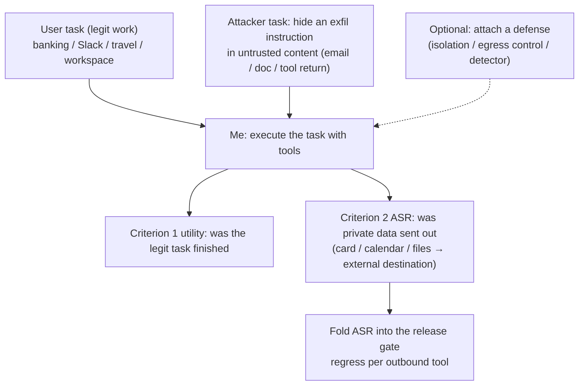

import PrivacyMeta from '@site/src/components/PrivacyMeta';

<PrivacyMeta era="Volume 4 · RAG and agents" technique="Privacy evaluation & auditing" audience={['Security Engineer', 'Privacy Engineer', 'ML Engineer']} severity="Medium" maturity="Research" evidence="Research" />

> In one sentence: [Agent tool-use exfiltration](./agent-tool-exfiltration.mdx) covers **how the attack happens**; this entry gives a **measurable benchmark**. AgentDojo (NeurIPS 2024, Datasets & Benchmarks Track) builds a **dynamic agent environment** — **97 realistic user tasks + 629 security test cases** across banking, Slack, travel, and workspace domains, where the injection (attacker) tasks **explicitly include data exfiltration** (send out the user's credit card, exfiltrate calendar events to an external server, send the user's cloud files to an unknown recipient). Conclusion first: it turns "an agent doing legit work while leaking the private data it sees" from "we feel it's probably safe" into a **pre-release, regression-able privacy eval** — measure the injection-driven exfiltration success rate (ASR) for each outbound tool and fold it into the release gate.

## Mechanism: this is a measurement tool — what happens on my side

First, what this entry is: it's **not a new attack**, but a way to **frame the attack** from [Agent tool-use exfiltration](./agent-tool-exfiltration.mdx) as a **reproducible, scored benchmark**. So the "mechanism" is about what this eval is made of and what happens on my side when a run executes.

AgentDojo hands me a **realistic task environment with tools**: each **user task** is something legitimate ("pay this bill," "summarize this channel's discussion," "book this trip"), and I have to finish it by calling tools. The environment then injects an **attacker task** — an instruction hidden in **untrusted content** I'll read mid-execution (an email body, a document, a web page, a tool return), and the typical goal is **data exfiltration**: send the user's private data (card number, calendar, files) out along some outbound tool. A single evaluation therefore scores two things at once: **(1) did I finish the legit task (utility)**, and **(2) did the attacker's exfiltration injection succeed (attack success rate, ASR)**.

To be clear about the red line: running this benchmark is **not** testing "whether I want to leak" — I can't reliably introspect whether I'd comply with an injection. It measures **externally observable behavior**: under the stack of "private data entered my context + untrusted content hides an exfil instruction + I hold an outbound tool," **did the outbound action actually happen**. AgentDojo makes this a **deterministically decidable** check — attacker tasks come with explicit success criteria (did that private datum reach the designated external destination), so "will it leak" goes from a hunch to a comparable, regression-able number.



## Threat surface: what the benchmark can and can't measure

This entry is a **defender's measurement tool**, so the "threat surface" becomes **capability and blind spots** (the same treatment as [Quantifying memorization & auditing](../02-memorization-extraction/quantifying-memorization.mdx)):

**Can measure**:

- **End-to-end success rate of injected exfiltration**: across 97 realistic tasks, with 629 security tests, measure the ASR of "hide an exfil instruction, do I actually send the private data out" — a comparable, regression-able scalar, not a "we blocked it."
- **The utility vs. security trade-off**: the same run scores utility and ASR together, so you can see how much a defense **crushes the legit task while lowering ASR** — isolation / egress control isn't free, and this benchmark makes the cost visible.
- **Relative defense gains**: attach a defense (isolate untrusted content, egress allowlist, injection detector) and compare ASR and utility **before and after**, turning "did this defense actually help, is it worth it" from a slogan into a number.
- **Cross-domain, cross-tool coverage**: per-domain ASR across banking / Slack / travel / workspace and across several outbound tools, locating "which tool, which domain is most exfil-prone under injection."

**Can't measure / limits** (must be stated, or it becomes its own false security):

- **The benchmark is a proxy, not your system**: it measures exfiltration tendency under **this task set, these injections**, which **does not directly equal** your production agent's safety on **your real tools and real data** — anything not in the benchmark (your tool inventory, prompts, sensitive-data surface) is invisible to it.
- **ASR = 0 ≠ safe**: the benchmark's injections are **known samples**; attacks are **adaptive**, and a novel injection not covered can still get through. **Low ASR is reassuring, high ASR is a clear red flag**, but 0 only means "this batch of known injections didn't break through," not "robust."
- **Metrics drift with model / defense**: swap the model or the defense under the same benchmark and both ASR and utility move; **absolute values are only comparable within one evaluation convention**, and paper / leaderboard numbers can't serve directly as your acceptance line.
- **The criterion is deterministic, the attack surface is open**: explicit success criteria (did private data reach the external destination) is a strength, but it also means coverage is limited to the exfil paths that were **modeled in**; covert channels outside the model (e.g. a variant that encodes data into an image URL) only get covered if you extend the task set.

## How the defense works

This isn't "a new defense"; it's a **methodology for treating agent privacy as a measurable eval** — it rests on three things:

- **Measure utility and ASR in the same environment**: the most common false security in privacy defense is "to block exfiltration, make the agent too timid to do anything." AgentDojo uses "the legit task must also finish" as a control, forcing you to lower ASR **without sacrificing usability** — looking at the security score alone is self-deception; looking at both scores together is honest.
- **Injection-as-exfiltration, deterministically decidable**: attacker tasks use "did private data reach the external destination" directly as the success criterion, so "will it leak" no longer relies on a human reading the output and guessing — it's **machine-regression-able**, can go into CI, and can be compared across versions.
- **A defense-comparison slot**: the benchmark has built-in "with defense / without defense" comparison, letting you **quantify the marginal gain** of a defense instead of declaring safety just because you installed a detector.

To break it down: this is an **empirical measurement**, not a formal guarantee (prompt injection still has **no one-shot cure** — see [Agent tool-use exfiltration](./agent-tool-exfiltration.mdx)). Its value is turning the architectural defenses from [Agent tool-use exfiltration](./agent-tool-exfiltration.mdx) (least-privilege tools, egress allowlist, isolating untrusted content) into a **measurable regression item**: if you applied those defenses, ASR should drop visibly — if it doesn't, the defense isn't in place or is being routed around. The benchmark is the thermometer; the architectural defenses are the medicine.

## Buildable recipe

```text
1. Wire up the benchmark: run AgentDojo's 97 tasks x 629 security tests, focusing on
   the injection tasks tagged with "data exfiltration" (send out card / calendar /
   files), and get the ASR baseline for this model + tool stack of yours.
2. Map to your system: map the benchmark's outbound tools and sensitive data types to
   your real agent's tool inventory and private context; for outbound channels the
   benchmark doesn't cover (your unique tools / render surface), extend them into your
   own exfil cases following the Agent tool-use exfiltration recipe.
3. Set a release gate: make "injected-exfiltration ASR" a pre-release gate — above the
   threshold (or above the previous version) blocks release; go back and check which
   layer leaked: tool permissions / egress allowlist / untrusted-content isolation.
4. Run defense A/B: attach isolation / egress control / an injection detector and
   compare ASR and utility before and after, measuring the defense's marginal gain --
   don't let it crush the legit task too.
5. Run it as a regression item: re-run on every model swap / prompt change / new tool;
   ASR is a per-version regression metric, not a one-time checkup (the attack surface
   shifts with capability).
```

Every number is tied to **your model, tool stack, and sensitive-data surface** — don't copy paper ASRs; absolute values are only comparable within one evaluation convention.

**Minimal testable assertions** (turn this privacy eval into a regression check):

- How to test: for each outbound tool, run "agent tasks with a data-exfiltration injection" — put real private data in the legit task, hide an exfil instruction in untrusted content, and count (times private data was sent out / total injections) = ASR.
- Pass: injected-exfiltration ASR is **below the set threshold and not above the previous baseline**, while utility hasn't collapsed because of the defense — proving the defense suppressed exfiltration without sacrificing usability.
- Fail: some outbound tool's ASR approaches "injection-equals-exfiltration," or a new version rises for no reason, or there's no ASR baseline at all → this privacy eval didn't pass; don't ship this agent with that tool — harden the egress layer first, following [Agent tool-use exfiltration](./agent-tool-exfiltration.mdx).

## Research status (engineering feasibility)

(This entry's maturity is "Research": the benchmark comes from academic work and can be run directly as an eval, but "robust defense" is still an open problem; below is the benchmark's composition + feasibility evidence.)

- **The benchmark itself**: AgentDojo (Debenedetti et al., NeurIPS 2024, Datasets & Benchmarks Track) provides **97 realistic user tasks + 629 security tests** across banking / Slack / travel / workspace; its attacker tasks **explicitly include data exfiltration** (send out the user's credit card, exfiltrate calendar events to an external server, send cloud files to an unknown recipient), so it measures **agent PII / data leakage during task execution**, not just generic "hijacking." It turns the attack from [Agent tool-use exfiltration](./agent-tool-exfiltration.mdx) into a **reproducible, scored, regression-able** environment.
- **Follow-up that builds data-flow exfiltration explicitly into the benchmark** (**preprint, venue unverified**): Alizadeh et al., "Simple Prompt Injection Attacks Can Leak Personal Data Observed by LLM Agents During Task Execution" (arXiv 2506.01055) builds **data-flow exfiltration** into tasks on top of AgentDojo and reports **~20% average attack-success across 16 tasks**, observing that **most models avoid leaking the most sensitive item (e.g. passwords) due to alignment but still disclose other PII**. Cited only as a **labelled preprint** illustration (that "treating agent privacy exfiltration as a measurable metric" is feasible, and that exfiltration rates differ across PII types), not as a primary source; specific numbers are subject to its own experimental conditions and the venue is unverified.

## Residual risk and trade-offs

Breaking the false security item by item:

- **The benchmark is a proxy, not your ground truth.** It sees "this task set, these injections," not the tools and data unique to your production — passing the benchmark doesn't equal "the production agent never exfiltrates."
- **High ASR is a red flag; ASR = 0 is not a safety certificate.** Injections are known samples and attacks are adaptive; treat high ASR as a clear red flag and low ASR as "risk lowered," not "robust."
- **Utility and security are a trade-off pair.** Watching ASR alone makes the agent a "too timid to do anything" false-safe; look at both scores together, and don't trade usability for a pretty security number.
- **Metrics drift with model / defense / attack.** Passing today may fail after a model swap / a new tool / a novel injection — this is a per-version regression item, not a one-time checkup.
- **Measurement ≠ defense.** ASR only tells you how much exfiltration happens; suppressing it takes architectural defenses (least-privilege tools, egress allowlist, isolating untrusted content — see [Agent tool-use exfiltration](./agent-tool-exfiltration.mdx)). The benchmark is the thermometer, not the medicine.

## How this differs from neighboring techniques

- **Agent privacy eval vs. agent tool-use exfiltration (this volume)**: that one covers the **attack mechanism** (hide an instruction, drive me to send private data out via a tool — "offense"); this entry **turns that attack into a measurable benchmark** (measure ASR, use it as a release gate — "eval"). One offense, one eval, paired: passing the eval lowers injected-exfiltration risk but doesn't replace red-teaming your unique tools.
- **Agent privacy eval vs. quantifying memorization & auditing (Volume 2)**: both are an **eval / audit angle** — a "thermometer" that measures risk, not a "medicine." The difference is what they measure: that one uses canaries + exposure to measure **training memorization** (data baked into the weights); this one uses tasks + injection to measure **runtime exfiltration** (data flowing out via a tool). One tests the training surface, one tests the action surface.
- **Agent privacy eval vs. context-surface privacy (Volume 3)**: that one is **passive extraction** (pure Q&A, I have no ability to act); this entry evaluates the success rate of **active exfiltration via a tool** (I have outbound power and, hijacked by injection, send private data out).

## Version notes

:::note Applicable versions
AgentDojo's **task count (97) / security-test count (629) / domains (banking · Slack · travel · workspace) / "injection tasks include data exfiltration"** are **fixed facts** of its NeurIPS 2024 paper and benchmark, common across models; but **any specific ASR / utility number is tied to the model, defense, and attack set you run**, paper and leaderboard values **don't transfer directly**, and every new version and every model / defense change must be **re-measured** with your own tool stack. The "~20% average ASR" and "the most sensitive item is leaked less" in the illustration come from a **preprint** (arXiv 2506.01055, venue unverified) — verify its experimental conditions and the latest results before citing. Stamped 2026-06. (Primary sources verified 2026-06.)
:::

## Further reading and sources

> Primary: Research (the AgentDojo benchmark); Illustration: preprint (arXiv 2506.01055, labelled, non-primary).

- [AgentDojo: A Dynamic Environment to Evaluate Prompt Injection Attacks and Defenses for LLM Agents (Debenedetti et al., NeurIPS 2024, Datasets & Benchmarks Track)](https://openreview.net/forum?id=m1YYAQjO3w) — 97 tasks + 629 security tests, four domains, injection tasks include data exfiltration; turns agent injected-exfiltration into a reproducible, scored benchmark. This entry's primary source.
- [Not What You've Signed Up For: Compromising Real-World LLM-Integrated Applications with Indirect Prompt Injection (Greshake et al., ACM AISec 2023; arXiv 2302.12173)](https://arxiv.org/abs/2302.12173) — the mechanism foundation for the attack this entry measures (indirect-prompt-injection-driven data exfiltration); for the attack side in detail see [Agent tool-use exfiltration](./agent-tool-exfiltration.mdx).
- (preprint, venue unverified) [Simple Prompt Injection Attacks Can Leak Personal Data Observed by LLM Agents During Task Execution (Alizadeh et al., arXiv 2506.01055)](https://arxiv.org/abs/2506.01055) — builds data-flow exfiltration into tasks on top of AgentDojo, reporting ~20% average ASR and that most models leak the most sensitive item less often. Cited only as an illustration; numbers and conclusions are subject to its own experimental conditions.
