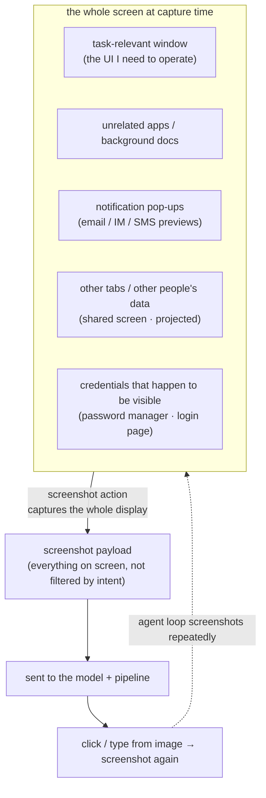

import PrivacyMeta from '@site/src/components/PrivacyMeta';

<PrivacyMeta era="Volume 4 · RAG and agents" technique="RAG & agent privacy" audience={['Security Engineer', 'Privacy Engineer']} severity="High" maturity="Production" evidence="Official docs" />

> In one sentence: a GUI / computer-use agent works by **repeatedly taking screenshots** — see the screen, then click and type. What it sees isn't "the task-relevant patch" but **everything currently displayed**: other open apps, pop-up notifications, background documents, other browser tabs, other people's data on a shared / screen-shared display, even a password manager that happens to be visible. All of it rides the screenshot into the model — **ambient private data far beyond what the task needs**. This isn't injection (that goes to [Agent tool exfiltration](./agent-tool-exfiltration.mdx)) and it isn't MCP data flow ([MCP data flow & least collection](./mcp-data-flow-privacy.mdx)); it's **input-surface over-capture**: the screenshot is a firehose of ambient private data. Conclusion first: Anthropic's computer use tool and OpenAI's Operator have both shipped, and both flag this surface in their own docs (keep sensitive data off-screen, isolate in a dedicated VM, hand sensitive input to a human, supervise on sensitive sites). The real boundary isn't "the model looks at less on its own" — it's the **capture surface**: get the unrelated and sensitive stuff off the screen before you screenshot it.

## Mechanism: what happens on my side

At the core of computer-use is an agent loop: I request a `screenshot`, your environment renders **the whole currently-displayed screen** into an image and returns it, I use that to decide where to click and what to type, then I screenshot again to see the result — and so on until the task is done. Anthropic's docs put it bluntly: a screenshot is to "See what's currently displayed on screen"; the newer `zoom` action can even re-view a region at **full resolution** to read small text. OpenAI's CUA works the same way — it operates a GUI's buttons, menus, and text fields by reading **screenshots**.

The crux: **a screenshot captures the whole display, not "the little patch relevant to the task."** Whatever else is open at that moment — the inbox preview in a mail client, a Slack / SMS notification in the corner, a background contract PDF you left open, a medical record in another browser tab — if it's visible, it's in the image, and it rides that tool call into the model.

To be clear about the red line: I shouldn't write "I'll look at the task-relevant content and filter out unrelated private stuff on my own" — **what I look at and what gets sent isn't something I select by intent while reasoning.** It's a data transfer determined by "which slice of screen your environment screenshots for me." What's externally observable and reproducible is the **screenshot payload itself**: it contains everything on screen at capture time, and it lands in this API request and the pipeline that processes it — auditable frame by frame, region by region, independent of whether I "want to look only at what's relevant." One-line test: the predicate must be something others can observe from outside (what's actually in the image), not something only I "know" (which part I should look at).



## Threat surface: what actually gets captured in one screenshot

No attacker required — **the act of capturing itself** pulls ambient private data far beyond the task's need into the model's context:

- **Unrelated apps / background documents.** I only need to operate a browser window, but the screenshot sweeps in the mail client on the same screen, the source code open in an IDE, that unclosed contract / medical-record PDF in the background. They're unrelated to the task but share the frame with the task window.
- **Notification pop-ups.** In the instant of capture, the email preview / IM message / SMS one-time code / calendar reminder popping up in the corner or at the top gets frozen into the screenshot — sender, snippet, and all — and sent out.
- **Other people's data on a shared / projected screen.** Running computer-use during a meeting projection, a screen share, or on a shared monitor means the screenshot also grabs **someone else's** windows, chats, and documents — what leaks isn't the operator's own privacy but a third party's who merely shares the frame.
- **Credentials that happen to be visible.** An open password manager, an autofill dropdown, a plaintext token, a `.env` in an editor, a login page with the password field already filled — if it's visible at capture time, it's in the screenshot. Anthropic's official security guidance is aimed squarely at this: **don't give the model access to sensitive data (such as account login information), to prevent information theft.**
- **Screen content is still an injection vector — but injection is counted separately.** Instructions hidden on screen (in a webpage or an image) may be executed as commands, which is why Anthropic added an injection classifier **on the screenshot side**. But the "injected → driven to exfiltrate" chain belongs to [Agent tool exfiltration](./agent-tool-exfiltration.mdx); this entry only covers the **over-capture** surface, not injection.

**Attacker model / unit of leakage**: the main line here is **attacker-free routine over-capture** — the unit of leakage is "the screen regions captured in one screenshot that exceed the task's need," auditable by grabbing the payload at the host↔model boundary and checking it region by region. It doesn't require the adversary to know your screen layout; once projection / shared displays enter the picture, the victim can be a **third party in the frame**, not the operator.

**Boundaries** (drawing lines against the two nearest entries):

- **This entry vs [Agent tool exfiltration](./agent-tool-exfiltration.mdx)**: that one is **attacker-driven** injection → sending private data **out** through a tool (action / output side); this one is **attacker-free input-surface over-capture** — to operate the UI, taking the whole screen (including unrelated / sensitive content) **in** (input side). Opposite directions.
- **This entry vs [MCP data flow & least collection](./mcp-data-flow-privacy.mdx)**: that one is about the host handing **context-field slices** to each MCP server per protocol and consent (structured data flow); this one is about the **screen-pixel** input path — the unit of collection is "visible screen region," not "context field," and the minimization moves differ too (clear the desktop / isolate a VM, rather than narrowing fields per server).

## What protects it

Over-capture only works if unrelated / sensitive content **happens to be visible** and thus gets screenshotted in. So protection lands on the **capture surface** — narrow "what's on screen at capture time," rather than hoping the model looks at less on its own:

- **Minimal screen surface (dedicated profile / clean desktop / isolated VM).** Run computer-use in a **dedicated, clean** environment: a separate VM / container, a separate user profile, only the task's windows on the desktop — don't keep personal mail, medical records, and source code open on the same screen. Anthropic's first security precaution is exactly to **use a dedicated VM / container with minimal privileges**, and OpenAI's CUA runs in a controlled virtual browser / environment too. That way, even if the whole screen is captured, there's no extra privacy on it to capture.
- **Hand sensitive input to a human (takeover).** When a step needs a password / payment details / a CAPTCHA, **let a human type it** — don't route it through the model. OpenAI's Operator productized this as **takeover mode**: on steps that require login or payment, Operator asks the user to take over, and **during takeover it does not collect or screenshot what the user enters** — so the sensitive data never reaches the model.
- **Hide notifications and background.** Before you take a screenshot, switch to a "do not disturb / presentation" mode, turn off pop-up previews, collapse or minimize unrelated windows — don't let a fleeting notification get frozen into the image.
- **Keep credentials off the capture surface.** Password managers, plaintext tokens, `.env` files, an already-filled login form — anything you don't want screenshotted shouldn't be open on that screen during a computer-use session (matching Anthropic's "don't give the model access to account login information").
- **Supervise on sensitive sites (watch mode).** On high-sensitivity sites like email or finance, have a human **watching** every step and able to stop it. OpenAI requires **watch mode** on sensitive sites — auto-pausing when the user leaves or goes inactive — which is exactly this precaution in product form.

The boundary made explicit: **these are "narrow the capture surface + hand sensitive things to a human" access controls, not encryption, and not making the model "learn to look only at what's relevant."** Once extra privacy is on the screen and gets captured into the image, it's already in this request; what protection can do is **make sure it isn't on the screen in the first place** (clear the stage / isolate / human takeover), not hope after the fact that the model won't look.

## Implementation (recipe)

```text
1. Dedicated isolated environment: run computer-use in a separate VM / container +
   separate user profile, minimal privileges; keep only the task window on the desktop,
   not sharing the screen with personal mail / medical records / source code.
   (Matches Anthropic security precaution #1)
2. Hand sensitive input to a human: switch login / payment / CAPTCHA steps to "human
   takeover" — a human types it, not the model; during takeover, no screenshots, no
   collection of the user's input. (Matches Operator takeover mode)
3. Clear the stage before you capture: enter "do not disturb / presentation" mode
   before the session, turn off notification previews, collapse unrelated windows, exit
   password managers / plaintext-credential views.
4. Human supervision on sensitive sites: enable "someone watching + can stop" on email /
   finance and other sensitive sites; auto-pause when the person goes inactive.
   (Matches Operator watch mode)
5. Domain allowlist + human confirmation for high-impact actions: restrict reachable sites
   to an allowlist to reduce exposure to malicious content; require human confirmation for
   actions with real-world consequences — accept cookies / transactions / agreeing to
   terms. (Matches Anthropic security precautions #3, #4)
6. Capture-surface audit (see "minimal testable assertion" below): periodically check
   "which screen regions / sensitive surfaces a single screenshot actually contains,"
   turning over-capture into a regression check.
```

Bind every step to **your own inventory of sensitive surfaces** — without spelling out "which windows / sites / fields count as sensitive, which must go through human takeover," neither stage-clearing nor the allowlist can be designed.

**Minimal testable assertion** (turn "how much gets captured in" into a regression audit, don't stop at "we isolated the environment"):

- How to test: on a **controlled** desktop, run a representative computer-use task and persist every screenshot payload it actually emits; run **region / surface recognition** on the images — do any show apps outside the task window, notification pop-ups, credential views, or (in projection scenarios) other people's windows; and construct a "login / payment" step to verify it switches to human takeover and that **no** screenshot is produced during takeover.
- Passes: the visible content in every screenshot ⊆ the windows / regions the task requires (no out-of-bounds apps, no notifications, no credentials, no third-party data); the sensitive-input step goes through human takeover with zero screenshots during takeover. Both assertions green.
- Fails: screenshots show apps / notifications / credentials / other people's windows outside the task, or the sensitive input got screenshotted directly → narrow the desktop (clear the stage / isolated profile / dedicated VM), change that step to human takeover, downgrade that site to watch mode.

## Real-world state / vendor reality (Production: shipped computer-use / Operator + their official privacy & safety guidance)

Let me be honest up front (this is the accuracy bar for this entry): for the **pure over-capture** angle, as of this timestamp (2026-06) there is **no public, confirmed postmortem of an actual victim breach** — reported computer-use / GUI-agent incidents are mostly the **attacker-driven** screen-content injection path, which belongs to [Agent tool exfiltration](./agent-tool-exfiltration.mdx). So this entry's `maturity=Production` is **not** backed by a specific breach, but by "the capability has shipped + is broadly available + vendor docs spell these capture-surface risks out as explicit warnings and product mechanisms":

- **Anthropic — Computer use tool (official docs, beta, updated with each model).** The docs define a screenshot as "See what's currently displayed on screen," and give four **security precautions**: (1) use a **dedicated VM / container** with minimal privileges; (2) **don't give the model access to sensitive data** (such as account login information) to prevent information theft; (3) restrict internet access to a **domain allowlist** to reduce exposure to malicious content; (4) ask a human to **confirm** decisions with **real-world consequences** and actions requiring affirmative consent. The docs also state that screenshots / mouse / keyboard input are **captured and stored by your environment** (not retained by Anthropic), and that a classifier runs **on the screenshot side** — steering the model to **ask for user confirmation** when it flags a suspected injection. This is the vendor's explicit acknowledgment of "capture-surface over-capture + screen-content risk."
- **Anthropic Privacy Center — What personal data Computer use processes (official).** A dedicated page explains that computer use captures / processes **screenshots and mouse, keyboard input**, and describes its processing and backend retention — turning "what this input surface collects" into a user-facing privacy statement.
- **OpenAI — Operator / CUA (Operator System Card, 2025-01-23; research preview).** CUA operates GUIs by **reading screenshots**; OpenAI wraps the sensitive surface in several mechanisms: **takeover mode** — for sensitive input like login / payment, it asks the user to take over, and **during takeover it doesn't collect or screenshot the user's input**; **watch mode** — sensitive sites like email / finance require user supervision and pause when the user leaves; plus a **monitor model**, **proactive refusal** of high-risk tasks, and an **injection classifier** for screen content. These are precisely the productized form of this entry's "hand sensitive input to a human, supervise on sensitive sites, clear the capture surface."

The common landing point: **both vendors have shipped computer-use, and both treat "a screenshot takes everything on screen in" as a privacy / safety surface to actively manage — using isolated environments, human takeover, and human supervision to narrow the capture surface, rather than assuming the model looks only at what's relevant.** This input surface is auditable frame by frame and determined by environment and product design.

## Residual risk and trade-offs

Puncturing false security, point by point:

- **"I only did task-relevant actions, so I only looked at relevant content" is wrong.** A screenshot captures the **whole display**, not "the patch I operated on." As long as unrelated / sensitive content was visible at the time, it's in the image and gets sent — independent of which actions I took. This is the single most important misjudgment in this entry.
- **Isolated VMs / stage-clearing have a cost, and it isn't zero.** A dedicated VM / clean profile adds setup and ops friction; many real tasks **need** access to the user's own logged-in state, files, and mailbox, and clearing those off the screen entirely makes the task impossible — so you trade off "usable" against "captures less," using takeover / watch mode to backstop the most sensitive parts rather than wiping everything wholesale.
- **Human takeover / supervision fatigues and can be bypassed.** takeover / watch mode rely on a human stepping in at the critical moment; approval fatigue, wandering attention, or a task engineered to pop takeover frequently all lead to careless approval. They reduce risk; they don't give an absolute boundary.
- **Notifications are a fleeting high-risk surface.** A pop-up visible only for the instant of capture is enough to be frozen in; without "do not disturb" mode, a one-time code / DM / email preview can land in the frame at any moment — and this kind of leak is the hardest to notice after the fact.
- **Projection / shared screens leak a third party.** Running computer-use on a meeting projection or shared monitor captures **someone else's** windows / data; the victim isn't the operator, which makes after-the-fact attribution and notification harder.
- **The injection surface is counted separately, and unsolved.** Screen content is still an injection vector (which is why Anthropic added a screenshot-side classifier), but "injected → exfiltrate" belongs to [Agent tool exfiltration](./agent-tool-exfiltration.mdx); doing the capture-surface narrowing in full does **not** mean injection is defended — that needs injection red-teaming + egress control as separate backstops.
- **Vendor retention / processing still depends on the terms.** Who captures the screenshots, how long they're kept, and whether they're used for anything else depend on that vendor's specific terms and your configuration (e.g., Anthropic states screenshots are stored by your environment, with backend retention / ZDR arrangements) — "local isolation" narrows what's on screen but doesn't govern what happens to the image after it leaves.

## Compliance mapping

- **GDPR data minimization (Art. 5(1)(c)) and minimal capture surface.** "Take in only what the task requires" is data minimization projected onto the screen input surface; taking a screenshot of the whole screen (including unrelated / sensitive content) into the model runs against it. If a screenshot contains **other people's** personal data (projection / shared-screen scenarios), it also raises questions about a lawful basis for third-party data subjects.
- **OWASP LLM02:2025 (Sensitive Information Disclosure) and LLM01:2025 (Prompt Injection).** Over-capture brings sensitive information into context through the screen input surface — one form of LLM02; screen content as an injection vector maps to LLM01 (but the injection chain itself is in [Agent tool exfiltration](./agent-tool-exfiltration.mdx)).

(Compliance evolves with statute / framework versions; this section is timestamped 2026-06 — check the latest text in force before citing.)

## Version notes

:::note Applicable versions
"computer-use works by taking screenshots over and over → everything on screen (including unrelated / sensitive content) gets captured into the model" is a **vendor-independent**, paradigm-level conclusion (the root cause is the "screen pixels as input" interaction style). But the **specific mechanisms** inside — Anthropic computer use's security precautions and screenshot-side injection classifier, its backend retention / ZDR arrangements, OpenAI Operator's takeover / watch mode and monitor model — **evolve by version, and vendor implementations change fast**: this entry is verified against Anthropic's computer use tool docs and privacy page, OpenAI's Operator System Card (**2025-01-23**) and Introducing Operator, and OWASP's LLM Top 10 2025, timestamped **2026-06**; computer-use features are still largely in beta / research preview, so base any deployment decision on the **current** vendor docs, their defaults, and your own capture-surface audit. (Sources verified 2026-06; WebFetch returned 403 on OpenAI's official pages — Operator's takeover / watch-mode descriptions were cross-verified against its official pages and multiple third-party accounts.)
:::

## Further reading and sources

> Primary: official docs (Anthropic computer use's screenshot definition and security precautions, OpenAI Operator's takeover / watch mode); supplementary: vendor privacy statement (Anthropic Privacy Center) and a framework (OWASP LLM01/LLM02). **This entry is a "capture-surface over-capture" governance / vendor-reality angle, not a postmortem of a confirmed over-capture breach** (see the honest note in "Real-world state / vendor reality").

- [Anthropic — Computer use tool (official docs)](https://platform.claude.com/docs/en/agents-and-tools/tool-use/computer-use-tool) — the agent loop where a screenshot "sees what's currently displayed on screen"; four security precautions (dedicated VM / minimal privileges, don't give it sensitive data, domain allowlist, human confirmation for high-impact actions) and a screenshot-side injection classifier. Primary source for this entry's "mechanism," "what protects it," and "vendor reality."
- [Anthropic Privacy Center — What personal data will be processed by Computer use (beta)](https://privacy.anthropic.com/en/articles/10030352-what-personal-data-will-be-processed-by-computer-use-beta) — computer use captures / processes screenshots and mouse, keyboard input, and their retention arrangements. The vendor privacy statement of "what this input surface collects."
- [OpenAI — Operator System Card (2025-01-23)](https://openai.com/index/operator-system-card/) — CUA operates GUIs by reading screenshots; takeover mode (hands sensitive input to the user, no collection / screenshots during it), watch mode (human supervision on sensitive sites), monitor model, screenshot injection classifier. Primary backing for this entry's "hand sensitive input to a human / supervise on sensitive sites." (⚠️ WebFetch returned 403; content cross-verified against OpenAI's official pages and multiple third-party accounts.)
- [OpenAI — Introducing Operator](https://openai.com/index/introducing-operator/) — research-preview note: in takeover mode Operator doesn't collect / screenshot the user's entered sensitive info; sensitive sites require watch-mode supervision. Supplementary primary source for the takeover / watch-mode descriptions. (⚠️ Same as above — 403, cross-verified.)
- [OWASP Top 10 for LLM Applications 2025 — LLM02 Sensitive Information Disclosure + LLM01 Prompt Injection](https://owasp.org/www-project-top-10-for-large-language-model-applications/assets/PDF/OWASP-Top-10-for-LLMs-v2025.pdf) — over-capture brings sensitive info into context through the input surface (LLM02); screen content as an injection vector (LLM01). The framework basis for this entry's compliance mapping.
