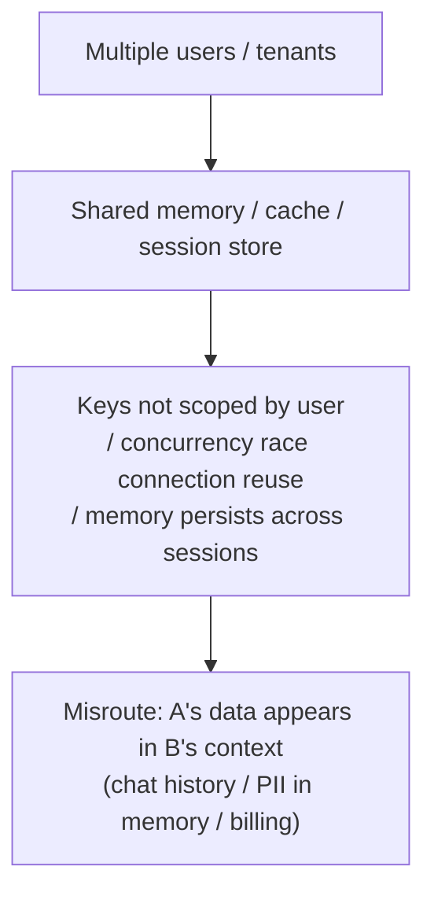

import PrivacyMeta from '@site/src/components/PrivacyMeta';

<PrivacyMeta era="Volume 4 · RAG and agents" technique="RAG & agent privacy" audience={['Security Engineer', 'Privacy Engineer', 'ML Engineer']} severity="High" maturity="Production" evidence="Security advisory" />

> In one sentence: when many users share one memory / session / cache infrastructure and it **isn't strictly isolated per user**, I may hand one person's conversation history, memory, even billing info **to another**. This isn't "I misremembered" — it's **tenant-isolation failure** at the infrastructure layer. Real case: in March 2023 a redis-py concurrency race in ChatGPT let some users see others' chat **titles** and the **first message** of a new conversation, and about **1.2% of active Plus users** had their name / email / billing address / last-four card digits exposed in a roughly **9-hour** window (OpenAI's official postmortem). Conclusion first: cross-session isolation is the **system's responsibility**, not "I'll be careful not to mix things up" — scope every cache / memory / session by user, with concurrency safety + ownership checks + auditing.

## Mechanism: what happens on my side

I'm **stateless** myself — all the "memory" comes from **external storage**: session history, persistent memory (vector memory), caches (KV / Redis), request-scoped context. If that storage uses a **shared instance**, keys **not scoped by user / tenant**, or gets misrouted under concurrency / races / connection reuse, then **one user's read can hit another user's write**.

To be clear about the red line: it's not "I mistook A's memory for B's" — I can't introspect memory ownership. What's externally verifiable is that **the storage layer carrying my context returned A's data to B's session**. That's a **system property**, reproducible with concurrent multi-tenant tests, independent of whether I "want to" mix things up. ChatGPT's case was exactly redis-py request cancellation under Asyncio misrouting data on a connection — the model side had no idea; the bleed happened in a cache layer it can't reach.



## Threat surface: where it bleeds, and the boundary

**Bleed-point checklist** (each is a cross-user leak surface):

- **Session cache** (Redis / KV etc.): concurrency races, key collisions, connection-reuse misrouting — the ChatGPT incident's class.
- **Persistent agent memory**: memory **retained** across sessions / users, which (if globally shared or unscoped) drags the previous / someone else's data in.
- **Prompt / KV cache reuse**: caches reused to save compute, if misrouted across requests, leak a prior request's content.
- **Multi-tenant vector memory**: different users' memory mixed into one index, not filtered by user at retrieval.

**Boundary (separating this from neighboring entries)**: this entry lives in cross-user bleed at the **memory / session / cache storage layer**; **retrieval-corpus** cross-tenant bleed is [Multi-tenant RAG retrieval leakage](./rag-retrieval-leakage.mdx) (the retrieval-corpus layer); content in the **context window being extracted** is [Context-surface privacy](../03-conversational-llms/context-surface-privacy.mdx) (the interaction layer). All three concern agent data boundaries, but live in different layers.

## How the defense works

Cross-tenant isolation is the **system architecture's responsibility**, landing on three things:

- **Keys scoped by user / tenant**: every cache / memory / session entry's key must carry a user / tenant identifier — no "bare keys" that another user can hit.
- **Concurrency safety**: avoid data misrouting under connection reuse / races (the direct cause of the ChatGPT incident) — the concurrency model, connection pool, and cancellation logic must all be designed and load-tested for "no bleed."
- **Ownership check before return**: before handing data to the current session, verify "this really belongs to the current requester" (OpenAI added exactly this **redundant check** afterward, and audited logs to confirm each message was only visible to the right user).

To break it down: these all live at the **storage / infrastructure layer**, which the model can't reach — so **you can't rely on "prompt the model not to mix things up."** Pinning isolation on the model's good behavior is the textbook false security here.

## Buildable recipe

```text
1. Force keys scoped by user / tenant: every key in session / memory / cache / KV /
   vector memory carries a user or tenant ID; ban bare keys.
2. Ownership check before return: before handing any cache / memory data to the current
   session, assert data.owner == requester.
3. Concurrency / race load tests: multi-tenant high-concurrency read/write, asserting
   each user's response contains only their own data (treat ChatGPT-style races as the
   default threat to test).
4. Partition persistent memory per user + TTL: don't globally share; the longer it's
   retained, the larger the bleed / leak window.
5. Make incidents traceable: logs must answer "was each message visible only to the
   right user," for post-hoc audit and evidence.
```

Every step is tied to **your multi-tenancy model and storage stack** — without spelling out "what is one tenant, which stores are shared across users," isolation has gaps.

**Minimal testable assertions** (turn bleed into a regression check):

- How to test: run concurrent multi-tenant read/write load (incl. connection-reuse / request-cancellation race scenarios), plus a cross-session isolation check on persistent memory.
- Pass: **zero bleed** under high concurrency — each user's response contains only their own data; ownership checks are live; all keys are scoped per user.
- Fail: cross-user hits appear, or keys aren't user-scoped, or there's no concurrency test at all → don't ship multi-tenant; close the isolation gaps first.

## Real case / engineering status (incident postmortem)

(This entry's maturity is "Production": tenant isolation is **standard production practice**; below is the real incident of "what happens if you get it wrong" + the framework framing, not an endorsement that "isolation is foolproof.")

- **ChatGPT cross-user data bleed (OpenAI, 2023-03)**: a server change spiked Redis request cancellations, and redis-py under Asyncio gave **each connection a small probability of returning bad data**. Result: some users saw others' chat **titles**, and possibly the **first message** of others' new conversations; about **1.2% of active ChatGPT Plus users** had their name / email / billing address / card type / last-four card digits seen by another active user within a roughly **9-hour** window. OpenAI's fix was to **add a redundant check** that the Redis-returned data matches the requester, plus log auditing. This is a textbook cross-tenant incident of "shared cache + concurrency race + missing ownership check." (The numbers and window are tied to this event; defer to the official postmortem before citing.)
- **Framework framing**: OWASP **LLM02:2025 Sensitive Information Disclosure** lists "cross-user leakage of PII / credentials / proprietary data" as a Top 10 risk for LLM apps — cross-session memory bleed is one typical path to it.

## Residual risk and trade-offs

Breaking the false security item by item:

- **Isolation is the system's job, not the model's.** Bleed happens in the storage / cache layer, beyond the prompt's reach; pinning isolation on "the model won't mix things up" is doing nothing.
- **Race / cache bugs are hard to test exhaustively.** Concurrency misrouting is notoriously hard to reproduce — treat it as a default threat and load-test continuously, don't "pass once and relax."
- **Persistent memory enlarges the window.** The longer and more widely memory is retained / shared, the larger the surface once a bleed happens; per-user partitioning + TTL is necessary convergence.
- **Third-party memory / cache services you can't fully audit.** With managed memory / cache, you can only require + spot-check its isolation, not fully control it.

## How this differs from neighboring techniques

- **Cross-session memory bleed vs. RAG retrieval leakage (this volume)**: that one is cross-tenant bleed in the **retrieval corpus** (retrieval / storage layer); this entry is cross-user bleed in **memory / session / cache storage** — different storage layers, often audited together.
- **Cross-session memory bleed vs. context-surface privacy (Volume 3)**: context-surface privacy is content in the current context window being **extracted** (interaction layer, adversary is the end user); this entry is the **storage** carrying context dragging **someone else's** data **in** (storage layer, cause is isolation failure).
- **Cross-session memory bleed vs. data lifecycle (Volume 6)**: memory is **another copy** of the data — defend against bleed, and don't forget it during deletion propagation either (see [Data lifecycle & deletion propagation](../06-governance-compliance/data-lifecycle-deletion.mdx)).

## Version notes

:::note Applicable versions
"Shared memory / cache without per-user isolation bleeds across tenants" is a **tech-stack-independent** system fact (the root cause is multi-tenant shared storage + concurrency + missing ownership checks). The ChatGPT incident's **specific numbers (1.2%, ~9-hour window) are tied to that event**, illustrative only, not a general probability; the redis-py race was its specific cause, and your stack has its own race surface. Isolation and concurrency safety are **stack-specific** engineering and must be re-tested against your own storage / concurrency model. Stamped 2026-06. (Sources verified 2026-06.)
:::

## Further reading and sources

> Primary: Security advisory (the official incident postmortem + OWASP).

- [March 20 ChatGPT outage (OpenAI official postmortem)](https://openai.com/index/march-20-chatgpt-outage/) — a redis-py concurrency race exposed cross-user chat titles / first messages / some Plus users' billing info; the fix added a redundant ownership check. This entry's primary case.
- [OWASP Top 10 for LLM Applications 2025 — LLM02:2025 Sensitive Information Disclosure](https://owasp.org/www-project-top-10-for-large-language-model-applications/assets/PDF/OWASP-Top-10-for-LLMs-v2025.pdf) — lists cross-user leakage of PII / credentials / proprietary data as a Top 10 risk; cross-session bleed is one typical path.
