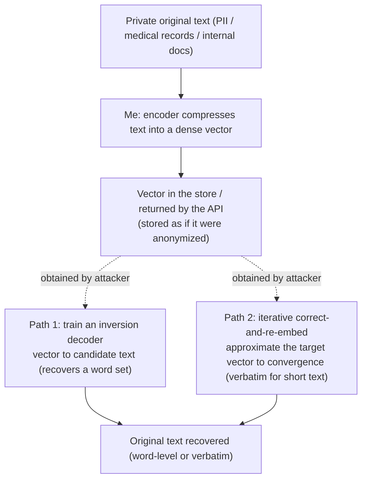

import PrivacyMeta from '@site/src/components/PrivacyMeta';

<PrivacyMeta era="Volume 4 · RAG and agents" technique="RAG & agent privacy" audience={['Privacy Engineer', 'Security Engineer', 'ML Engineer']} severity="High" maturity="Research" evidence="Research" />

> In one sentence: embedding private text into vectors and storing them in a vector store **is not anonymization** — embeddings can be **inverted back to the original text**. Song & Raghunathan (CCS 2020) recovered roughly **50–70% of the input words** (a word set, no order) from sentence embeddings in their setup; Morris et al.'s vec2text (EMNLP 2023) recovered **92% of 32-token text inputs exactly** against GTR-base embeddings. Conclusion first: **an embedding is just another representation of private data**, not a de-identified artifact — encrypt it, access-control it, and set its retention as if it could be turned back into the original text; don't relax just because "we only stored vectors."

## Mechanism: what happens on my side

When I embed a piece of text, what I do is have an encoder compress it into a dense vector (a few hundred to a few thousand floats). Intuitively "compressed into numbers = the text is gone," but that intuition is wrong: **to make semantically similar texts produce similar vectors, the encoder has to keep enough lexical / semantic information in the vector** — and "enough" is often enough to **reconstruct the original text**.

This gives an attacker two inversion paths, neither of which needs me to "actively reveal" anything:

1. **Train an inversion model (a learned decoder)**: the attacker trains a reverse mapping on `text → embedding` pairs that takes a target vector in and emits candidate text. Song & Raghunathan (CCS 2020) formalized this class of information leakage in embedding models and recovered the **set of input words** from sentence embeddings on held-out data.
2. **Iterative "correct-and-re-embed" approximation**: the attacker guesses some text, embeds it with the **same** embedding model, compares the gap to the target vector, corrects the candidate by that gap, re-embeds, and loops to convergence — at convergence the candidate's embedding approximates the target vector, and the candidate is the (approximate or verbatim) original text. Morris et al.'s vec2text takes this path (EMNLP 2023).

To be clear about the red line: it's not "I remember this text / I recited it" — I can't reliably introspect what I encoded. **What's externally recomputable and verifiable is** that my embedding vector mathematically constrains "what text would produce it," and the two paths above can **solve that constraint back to the original text**. Same root as [Model inversion & attribute inference](../01-foundations/model-inversion-attribute-inference.mdx) — "the output (here, the embedding vector) carries far more than the downstream task needs."



## Threat surface: what can be recovered, who can attack, and the boundary

**What can be recovered** (tightly tied to the embedding model and text length — see version notes):

- **A word set (unordered)**: in Song & Raghunathan's setup, roughly 50–70% of the input words are recovered from a sentence embedding — you don't get order, but "which words appeared" is often already fatal for PII (names, diagnoses, amounts, tokens).
- **Verbatim short text**: in vec2text's GTR-base setup, 92% of 32-token inputs are recovered **exactly** (exact-match) — at the length of short queries, short chunks, or a single log line, text can be solved back word-for-word.

**Who can attack / attacker model**: anyone who **obtains the embedding vectors themselves**, no original text required. Typical sources —

- **Vector-store leak / misconfiguration**: the store is read, a backup leaks, or multi-tenant isolation fails — what's inside is a pile of "invertible" vectors.
- **API returns embeddings directly**: an embedding endpoint hands vectors to the caller (frontend, third party, logs), so the vectors leave your trust boundary.
- **Shared / outsourced index**: the vector index is hosted by a third party or shared across teams, and whoever holds it can attempt inversion.
- Inversion fidelity also depends on whether the attacker **can query the same embedding model** (the "re-embed" path like vec2text needs this) and knows the domain distribution — these are applicability conditions, not optional footnotes.

**Boundary / don't conflate with neighbors** (conflating is its own misdirection):

- This entry is **embedding → original-text inversion** (solve a vector back to text). It's **not** the "retrieval ranks by similarity, not permission, and surfaces another tenant's chunk to you" problem from [Multi-tenant RAG retrieval leakage](./rag-retrieval-leakage.mdx) — that's an **access-control** issue across tenants, where the original text was already in the store and got wrongly retrieved; this entry is that **even with no wrongful retrieval, the vector itself can be solved back to the original text**. The two often co-occur in one RAG system, but the root cause and the fix differ.

## How the defense works

**What makes the defense hold**: since the embedding retains the information needed to reconstruct the original, the **only safe premise** is to treat the embedding **as a representation of private data** — its protection floor should equal that of the original text. What that does and doesn't protect:

- **"Treat as private data" protects**: through equal encryption, access control, and retention / deletion policy, it raises the bar for "obtaining the vector" to match "obtaining the original text" — an attacker who can't get the vector has nothing to invert.
- **It does not protect**: once the vector has left the boundary (API return, store leak, outsourced index), encryption / ACLs no longer apply; all that's left is the **empirical** defense of "make the vector itself harder to invert" (perturb, reduce dimensionality, quantize the embedding), and **perturbation simultaneously hurts retrieval / downstream utility**, with **no universal guarantee of how much perturbation actually blocks inversion** — you must measure inversion against **your own** embeddings, not assume "lower-dimensional means safe."

To break it down: **"we only stored vectors, not the text" is not anonymization**. Treating it as anonymization, and on that basis lowering the encryption / access-control level of the vector store, is this entry's false security — the "anonymous vectors" an attacker obtains may be solved back to named original text.

## Buildable recipe

Back to a neutral engineering register:

```text
1. Classify embeddings as private data: vector stores / embedding caches share the
   classification of the source text — equal at-rest encryption, equal access control
   (ACL / multi-tenant isolation), equal retention and deletion policy. Don't grant the
   vector store a "they're just anonymous vectors anyway" backdoor privilege.
2. Tighten the embedding egress surface: the embedding API by default does not return raw
   vectors to untrusted callers / frontend apps / third parties; if it must, know this hands
   out an invertible payload, decide by asset sensitivity, and log it.
3. Redact PII before embedding: redact / placeholder the text before embedding it (see PII
   detection & redaction), so that "even if inverted, only already-redacted text comes
   back" — more reliable than perturbing the vector after the fact.
4. Perturb / reduce-dimension / quantize the embedding if needed, but measure: any
   "harder to invert" treatment must report both (a) how much inversion success dropped and
   (b) how much retrieval / downstream utility dropped — report both, not just one.
5. Minimize storage: only embed / index what genuinely needs to be retrieved, shorten
   retention, and don't leave raw vectors in logs.
6. Red-team inversion audit: actually run inversion (train a decoder + iterative re-embed)
   against your vector store / embedding endpoint, quantifying "how far it recovers under
   your embedding model, text length, and same-model-query access," and fold into
   pre-release eval.
```

Every conclusion is tied to **your embedding model, your text-length distribution, and whether the attacker can query the same model** — the paper's 50–70% / 92% are numbers under their respective experimental setups and **don't transfer directly** to your system; you must measure your own.

**Minimal testable assertions** (turn inversion risk into a regression check):

- How to test: using **your own** embedding model, embed a batch of representative texts containing known PII into vectors, then run inversion against those vectors (train a reverse decoder + iterative correct-and-re-embed), measuring word-level recall and exact-match rate, and check whether the recovered text hits any of the known PII.
- Pass: under your deployed embedding treatment (redaction + perturbation / dimensionality reduction), the recovered text's **rate of hitting known PII is near zero**, exact-match recovery is well below the no-defense baseline, and the vector store's / embedding endpoint's external access-control and encryption level **equal the original text's**.
- Fail: inversion solves vectors back to PII-bearing original text (word-level or verbatim) while the vector store is treated as "anonymous data" with relaxed encryption / ACLs, or the embedding API returns raw vectors to untrusted parties → tighten layer by layer per the recipe.

## Research status (engineering feasibility)

(This entry's maturity is "Research": below are **academically demonstrated** inversion results, tightly tied to their respective experimental setups — not an endorsement that "any vector store can casually be solved back to verbatim text.")

- **Recovering input word sets from sentence embeddings**: Song & Raghunathan (ACM CCS 2020) formalized information leakage in embedding models, proposed inversion / inference attacks, and recovered roughly **50–70% of the input words** (a word set, no order) from sentence embeddings on held-out BookCorpus. This founds the conclusion that "embeddings are not one-way / irreversible."
- **Verbatim recovery of short text (vec2text)**: Morris, Kuleshov, Shmatikov, Rush (EMNLP 2023, Outstanding Paper) proposed vec2text — approaching the target vector by **iteratively correcting the candidate text and re-embedding it with the same model** — recovering **92% of 32-token text inputs exactly (exact-match)** against **GTR-base** embeddings. This pushes "embedding leakage" from "recover a bag of words" to "verbatim reconstruction of short text."
- (Later work keeps advancing on cross-embedding-model transfer, longer texts, and defense robustness; this entry focuses on the founding mechanism and boundary — verify the latest literature before citing. Inversion quality varies a lot with model and text length, so don't treat any single paper's best number as a general upper bound.)

## Residual risk and trade-offs

Breaking the false security item by item:

- **"We only stored vectors" is not anonymization.** The embedding retains what's needed to reconstruct the original; downgrading the vector store's protection as if it held anonymous data is the top mistake.
- **Inversion fidelity varies wildly with the setup.** 50–70% word-level, 92% verbatim — tied respectively to Song & Raghunathan's / vec2text's embedding model, text length, and same-model-query access. **Short text is more dangerous** (vec2text's strong result is at the 32-token scale); longer text is harder to invert but that doesn't mean safe — your real numbers must be measured.
- **Perturbation / dimensionality reduction is an empirical defense, not a proof.** Adding noise / reducing dimensions may raise inversion cost, but there's no formal guarantee like DP's for "how much is enough to be safe," and it necessarily hurts retrieval utility — quantify both "inversion drop" and "utility drop," don't report only the favorable side.
- **Delete the original and the vector may remain.** Deleting a record in the primary store doesn't remove its embedding from the vector store / cache / backups — the residual vector can still be inverted back to that "deleted" original. Handle this alongside [Data lifecycle & deletion propagation](../06-governance-compliance/data-lifecycle-deletion.mdx): deletion requests must fan out to the vector store.
- **Once an embedding leaves the boundary, you can't recall it.** A vector that was returned by an API, written to logs, or stored in a third-party index can't be protected after the fact by tightening ACLs — whoever already has it can invert it — so "don't let it leave" beats "remediate after it leaves."

## How this differs from neighboring techniques

- **Embedding inversion vs. [Multi-tenant RAG retrieval leakage](./rag-retrieval-leakage.mdx) (this volume)**: retrieval leakage is an **access-control** problem — the original text was already in the store and got handed to a tenant who shouldn't see it because retrieval ranks "by similarity, not permission"; this entry is **representation-layer inversion** — even with no wrongful retrieval, the vector itself can be solved back to the original. The former fixes retrieval-side ACLs / isolation, the latter fixes "don't treat vectors as anonymous, and tighten vector egress." Both commonly coexist in one RAG system.
- **Embedding inversion vs. [Model inversion & attribute inference](../01-foundations/model-inversion-attribute-inference.mdx) (Volume 1)**: that entry inverts a **classifier's confidence outputs** and reconstructs a **class representative / sensitive attribute**; this entry inverts an **embedding vector** and reconstructs **the specific piece of text that was embedded** (a word set or verbatim). Both belong to the "the output carries excess information" family, but the reconstruction target and fidelity differ — one gives a class's "look," the other gives the original text.
- **Embedding inversion vs. [Data lifecycle & deletion propagation](../06-governance-compliance/data-lifecycle-deletion.mdx) (Volume 6)**: that entry says deletion requests must fan out to all copies; this entry gives the concrete reason "why the vector store must be on the fan-out list" — a residual vector can be inverted back to deleted original text, so deleting the original while keeping the vector means it isn't cleanly deleted.

## Version notes

:::note Applicable versions
"Text embeddings can be inverted back to the original (word-level, up to verbatim for short text)" is a **model-independent** paradigm-level fact — as long as the encoder retains lexical / semantic information for similarity, inversion has a foothold. But **how high the fidelity gets** is tightly tied to the embedding model (Song & Raghunathan's sentence embeddings / vec2text's GTR-base), text length (vec2text's 92% is at the 32-token scale), whether the attacker can query the same model, and the domain distribution — the paper's **50–70% word-level and 92% verbatim numbers are bound to their original models / data and don't transfer directly** to your system; you must measure inversion against **your own** embeddings. Later inversion methods for cross-model transfer and longer texts keep evolving; stamped 2026-06. (Sources verified 2026-06.)
:::

## Further reading and sources

- [Information Leakage in Embedding Models (Song & Raghunathan, ACM CCS 2020)](https://dl.acm.org/doi/10.1145/3372297.3417270) — founds embedding leakage: formalizes information leakage in embedding models and recovers roughly 50–70% of input words (a word set, no order) from sentence embeddings on held-out BookCorpus. This entry's basis for "word-level inversion."
- [Text Embeddings Reveal (Almost) As Much As Text (Morris, Kuleshov, Shmatikov, Rush, EMNLP 2023, Outstanding Paper)](https://aclanthology.org/2023.emnlp-main.765/) — the vec2text method: iterative correct-and-re-embed to approach the target vector, recovering 92% of 32-token text exactly against GTR-base embeddings. This entry's basis for "verbatim inversion."
