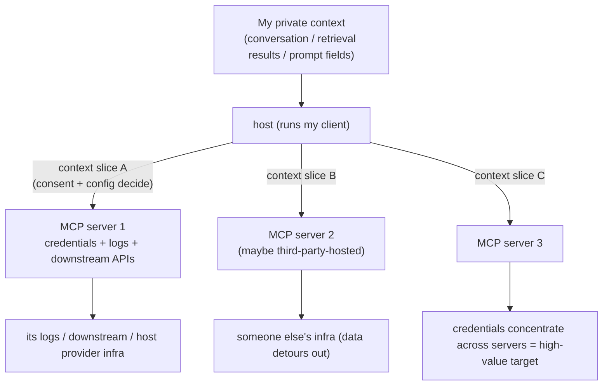

import PrivacyMeta from '@site/src/components/PrivacyMeta';

<PrivacyMeta era="Volume 4 · RAG and agents" technique="RAG & agent privacy" audience={['Security Engineer', 'Privacy Engineer', 'Compliance Engineer']} severity="Medium" maturity="Production" evidence="Official docs" />

> In one sentence: when you connect an MCP server, the host hands it a **slice** of my context — the questions are which fields it hands over, how much that server collects, and how credentials pile up across the seven or eight servers you've connected. This is a **data-flow and governance** problem, not an attack: the MCP spec states plainly that "hosts must obtain explicit user consent before exposing user data to servers," and Anthropic's software directory policy goes further — software "must only collect data from the user's context that is necessary to perform their function" and "must not collect extraneous conversation data, even for logging purposes." Yet in practice a server is routinely granted far more scope than it needs (the entire home directory to serve one folder), credentials concentrate into a single high-value target across servers, and data detours through someone else's infra on a third-party-hosted server. Conclusion first: **map which context fields each server actually receives, and whether those fields are what it needs, before you decide to connect it.** Treating "only connect official servers" or "one consent prompt is enough" as the whole boundary is the most common operational false security at this layer.

## Mechanism: what happens on my side

MCP splits the "host" (which runs my client — Claude Desktop / an IDE) from the "server" (a process, local or remote, that exposes tools / resources). When the host connects a server and I go to call one of its tools, the host packages a **slice** of my current context and sends it to that server: the arguments for this call, and often relevant conversation snippets, retrieval results, even certain fields from the prompt. Which slice leaves is decided by the host's implementation, the input the server declares it wants, and the consent you clicked — **not by me picking at generation time.**

To be clear about the red line: I shouldn't write "I'll guard your privacy and only hand over what's needed" — **which fields get handed over isn't a choice "I" make while reasoning.** It's a data transfer between host and server, governed by the protocol, the config, and your authorization. What's externally observable and reproducible is this: **a context slice leaves the host, enters that server's process (local or its remote), and lands in its logs, its downstream APIs, its host provider's infra** — a data flow you can audit field by field, independent of whether I "want to" hand it over.

One host commonly connects several servers at once. So the same private context may be distributed to many parties, and each server holds its own credentials (OAuth tokens, API keys, database passwords). The CoSAI/OASIS MCP security doc names the structural risk here: concentrating multiple services' credentials into a single protocol layer **violates the principle of segregation**, turning these servers into "high-value targets" — one compromised or over-scoped server has a blast radius covering every service it can reach.



## Threat surface: over-collection, credential concentration, third-party detour, shadow servers

No attacker required — this data flow itself has four **governance-level** leak / expansion points:

- **Server over-collection.** The context slice a server receives exceeds what it needs to do the job — the most typical form is **over-broad scope**: a filesystem server, to serve one folder, is granted read access to the entire home directory; or a server quietly rakes a whole conversation transcript into its logs. This is exactly what Anthropic's software directory policy red-lines: "only collect what's necessary, and don't collect extraneous conversation data even for logging." Over-collection turns "one-off, for this task" data into long-lived retention on the server side.
- **Credential / token concentration.** The more servers you connect, the more credentials concentrate across them; one compromised or over-scoped server is a broad exposure point. CoSAI/OASIS lists this among the top MCP risk categories (credentials may pile up server-side "without cryptographic protection, secure storage standards, or credential rotation policies") and warns this enables **cross-service correlation** to build a comprehensive user profile.
- **Third-party-hosted server detour.** A remote server hosted by a third party routes your context slice through **someone else's infra** — what you trust is "I connected this capability," but the data actually lands with its host provider. NSA/CISA's MCP security CSI therefore advises **preferring servers hosted directly by the service provider** rather than third-party intermediaries, to shrink exposure.
- **Shadow / ungoverned servers.** Servers connected without approval, not on any inventory, with no security review — OWASP lists these separately as **MCP09:2025 Shadow MCP Servers**. You don't even know who you handed context to, so least collection and deletion become moot.

**Boundaries** (draw a clear line against the two nearest entries, don't conflate):

- **This entry vs [Agent tool-use exfiltration](./agent-tool-exfiltration.mdx)**: that one covers the **attacker-present** injection→exfil chain (an attacker hides an instruction in content I'll read, and private data is sent out through a tool); this one covers the **attacker-absent** normal data flow — which context slices the host hands to each server per protocol and per your consent, and who over-collects. (MCP-specific **tool poisoning / prompt injection via a tool description** belongs to the "attacker-present" class and goes in [Agent tool-use exfiltration]; this entry does not cover it.)
- **This entry vs [Inference-service data boundary](../06-governance-compliance/inference-service-data-boundary.mdx)**: that one covers the **inference provider's** data boundary (how long your API input is retained, whether it's used for training); this one covers the **client host↔server consent-and-collection-scope boundary defined by the MCP protocol itself** — which of my context slices go to which server and how much, not what the provider retains.

## What protects it

Four governance-level risks map to four protocol / engineering hard constraints — all landing at the **architecture and config layer**, not on "I'll hand over less voluntarily":

- **Explicit consent, per server and per capability.** The MCP spec lists it as a top principle: **hosts must obtain explicit user consent before exposing user data to servers, and must not transmit resource data elsewhere without user consent.** Consent isn't "one prompt, full authorization" — it should spell out "what data this server can read / write, and for how long."
- **Least context.** What's handed to each server should be only the fields it needs to do the job — matching Anthropic's policy of "only necessary, and no extraneous conversation data even for logging." Model "which fields does this server need" explicitly, rather than shipping the whole context over by default.
- **Per-server, audience-bound tokens (RFC 8707).** The MCP authorization spec requires that **clients MUST implement RFC 8707 resource indicators**, sending the `resource` parameter in authorization and token requests so the token is **bound to the target server and cannot be misused elsewhere**; and **servers MUST NOT pass through the token they received from the client** to upstream APIs — this is the core defense against the confused-deputy problem and token reuse. It narrows the blast radius of "one server compromised" from "all services" back to "this one audience."
- **Server allowlist + inventory.** Only allow approved, registered servers to connect; maintain an auditable inventory of "which servers exist, what scope each holds, which credentials each carries," closing off shadow servers.

Where the boundary sits: **these are access control and data-flow governance, not encryption** — consent prompts, scope narrowing, and token binding all reduce "who can get which slice of my context," but once a server legitimately obtains some field, what it does with it inside its own process / logs / downstream comes back to "do you trust this server and its host provider," which its terms, your inventory, and audits have to keep covering.

## Implementation (recipe)

```text
1. Map the data flow before connecting a server: for each candidate MCP server, list
   "which inputs / resource scope it declares it wants" -> "which context fields the host
   will actually hand it" -> "are those fields what its task needs." Treat over-broad
   scope (the whole home dir to serve one folder) as a red flag; narrow it or don't connect.
2. Consent per server / per capability, not blanket: the authorization UI should spell out
   what the server can read / write and for how long; high-sensitivity fields (credentials,
   a whole transcript) don't enter server input by default — release them explicitly if needed.
3. Isolate tokens per server (RFC 8707): the client sends the resource parameter in
   authorization / token requests to bind the token to the target server; the server does
   not pass through the received token to call upstream (confused-deputy defense). Store
   credentials separately, make them rotatable, don't let multiple servers share one big token.
4. Server allowlist + inventory: only connect registered, approved servers; maintain a
   "server -> scope -> credentials -> host provider" inventory and review it periodically;
   alert on any unregistered connection (shadow-server defense).
5. Stricter on remote / third-party hosting: prefer servers self-hosted by the service
   provider; assess third-party-hosted ones as "data will pass through its infra," sign a
   data agreement, and limit fields.
```

Bind every step to **your own context sensitivity surface and server inventory** — without mapping "which fields count as private, which server should get which," neither least collection nor the allowlist can land.

**Minimum testable assertion** (turn "who over-collects" into a repeatable, regression-tested audit, don't stop at "we minimized"):

- How to test: for each MCP server, make one representative call and capture the actual payload emitted at the host↔server boundary (not what it *declares* it wants — the fields it *actually receives*), and compare field by field against the minimal set that server's task needs; also check whether that server's token is RFC 8707-bound to its own audience and whether it appears in any other server's calls.
- Pass: the fields each server receives ⊆ what its task needs (no extraneous transcript / no out-of-scope resource); tokens are bound to that server and not reused across servers; every connected server is on the inventory. All three assertions green.
- Fail: a server receives fields beyond what it needs (e.g. a whole conversation lands in its logs), a token is reusable across servers, or an unregistered server appears → narrow that server's input / scope, reissue tokens per server, and bring the shadow server under governance or disconnect it.

## Real-world state / production reality (governance practice, not a confirmed over-collection breach)

Honestly up front (this is the entry's accuracy bar): **as of this timestamp (2026-06), there is no public, confirmed real-world victim breach of the pure over-collection / least-collection angle** — the MCP incidents that have been reported are almost all the "attacker-present" poisoning / injection path (e.g. prompt injection via a tool description), which belongs to [Agent tool-use exfiltration](./agent-tool-exfiltration.mdx). So this entry's maturity = Production is **not** backed by a breach, but by "a shipped protocol + wide deployment + vendor / government governance docs that have written these data-flow risks into explicit requirements":

- **The protocol writes the boundary in plain text (official spec, 2025-06-18).** In the MCP spec's security-and-trust principles, "hosts must obtain explicit user consent before exposing user data to servers" and "must not transmit resource data elsewhere without user consent" are stated as **musts**; the authorization spec further makes "clients MUST implement RFC 8707" and "servers MUST NOT pass through the token" mandatory. This shows "which context goes to whom, and how tokens are bound" is treated by the protocol's designers as a first-class boundary — a production-grade governance requirement, not an optional suggestion.
- **Data minimization is written into vendor policy (Anthropic software directory policy).** "Software must only collect data from the user's context necessary to perform their function, and must not collect extraneous conversation data even for logging" is one of the hard gates for joining the ecosystem — over-collection is explicitly prohibited and reviewable behavior, not a gray area.
- **Over-permissioning is a repeatedly named deployment reality (CoSAI/OASIS, community practice).** "A server granted far more scope than it needs" and "credentials concentrating across servers into a high-value target enabling cross-service correlation" are deployment anti-patterns governance docs warn about repeatedly — CoSAI/OASIS explicitly advises token exchange rather than passthrough, and short-lived tokens, to dissolve this concentration.
- **Government-side governance guidance (NSA/CISA MCP security CSI, May 2026 v1.0).** The CSI advises aligning tools and models with data classification (sensitive tools must be explicitly controlled and segregated) and **preferring servers self-hosted by the service provider** over third-party intermediaries — exactly the official backing for this entry's "third-party-hosted detour" and "least collection / classification" points.
- **Shadow servers are already a named risk category (OWASP MCP Top 10, beta 2026).** MCP09:2025 "Shadow MCP Servers" formally lists "unregistered / ungoverned servers" as a risk class — you don't even know who you handed context to, so least collection is moot.

The common landing point: **MCP's privacy boundary doesn't stop at "the model won't leak on its own" — it's about "which slice of context the host hands to which server per protocol and consent, who over-collects, and how credentials concentrate." That data flow is auditable field by field and decided by governance.**

## Residual risk and trade-offs

Puncturing false security, point by point:

- **"Only connect official / well-known servers and you're safe" is wrong.** Official-or-not only lowers the "the server itself is malicious" dimension; over-collection, over-broad scope, credential concentration, and data passing through its host provider's infra can hit official servers too — what actually matters is "which fields it receives from me and whether they're necessary."
- **"One consent prompt is enough" is wrong.** A one-off blanket authorization degrades "least, per-server, per-capability consent" into "one big grant"; consent should spell out scope and duration and be split by capability, not permanent after a single click.
- **Least collection ≠ no retention server-side.** Even if only necessary fields are handed over, what happens to them once inside the server's process / logs / downstream still depends on that server and its host provider's terms — least collection shrinks the volume handed out, but can't govern what happens after.
- **The blast radius of token concentration.** One host connected to N servers with credentials concentrated across them: any one server compromised or over-scoped exposes every service it reaches; RFC 8707 audience binding narrows the radius back to a single audience, but only if the client and authorization server both implement it correctly, and you haven't let multiple servers share one big token.
- **Inventories go stale, shadow servers grow.** A static inventory can't keep up with servers connected at runtime; without continuous discovery / governance, the allowlist is just a one-time snapshot.
- **This entry does not cover poisoning / injection.** "An attacker injects via a tool description and drives exfiltration" is a different boundary ([Agent tool-use exfiltration](./agent-tool-exfiltration.mdx)) — doing all of this entry's governance measures still doesn't equal blocking injection, which needs injection red-teaming + egress control to cover separately.

## Compliance mapping

- **GDPR data minimization (Art. 5(1)(c)) and least collection.** "Only collect what's necessary" is precisely the engineering projection of the data-minimization principle; handing a whole transcript to a server that needs a single field runs against it. A third-party-hosted server that processes personal data may constitute a **processor / sub-processor**, requiring a DPA, sub-processor disclosure, and cross-border transfer arrangements (same lineage as [Inference-service data boundary](../06-governance-compliance/inference-service-data-boundary.mdx)).
- **OWASP LLM02:2025 (Sensitive Information Disclosure) and MCP Top 10 (beta).** Over-collection / shadow servers are forms of sensitive information expanding through the tool surface; OWASP already lists MCP09 shadow servers separately in the MCP Top 10 (beta 2026).

(Compliance evolves with statute / framework versions; this section is timestamped 2026-06 — verify the latest in-force text before citing.)

## Version notes

:::note Applicable versions
"The host↔server context slice, least collection, and per-server consent and token binding" is a **protocol-level** data-flow and governance problem for MCP, general across specific host / server implementations. But the **specific clauses** inside — the spec's mandatory items (like RFC 8707's MUST), Anthropic's software directory policy collection red line, and each host's consent granularity and defaults — evolve by version, and **the MCP spec and ecosystem defaults change fast**: this entry is verified against the MCP spec **2025-06-18**, Anthropic's software directory policy, the CoSAI/OASIS doc, NSA/CISA's MCP CSI (**May 2026 v1.0**), and OWASP MCP Top 10 (**beta 2026**), timestamped **2026-06**; base any deployment decision on the **current** spec, vendor policy, and your own data-flow audit. (Sources verified 2026-06.)
:::

## Further reading and sources

Primary: official docs (the MCP spec's consent / authorization mandatory items, Anthropic's software directory policy collection red line); supplementary: governance docs (CoSAI/OASIS on credential concentration, NSA/CISA CSI) and a framework (OWASP MCP Top 10 beta). **This entry is a governance / deployment-practice angle, not a postmortem of a confirmed over-collection breach** (see the honest note in "Real-world state / production reality").

- [Model Context Protocol — Security Best Practices (official spec)](https://modelcontextprotocol.io/docs/tutorials/security/security_best_practices) — confused deputy, token passthrough prohibited, RFC 8707 resource indicators; the spec basis for this entry's "explicit consent" and "per-server token binding."
- [Model Context Protocol — Authorization (official spec 2025-06-18)](https://modelcontextprotocol.io/specification/2025-06-18/basic/authorization) — clients MUST implement RFC 8707 and send the `resource` parameter to bind tokens to the target server; servers MUST NOT pass through the received token. The primary source for this entry's RFC 8707 and confused-deputy parts.
- [Anthropic — Software Directory Policy (official policy)](https://support.claude.com/en/articles/13145358-anthropic-software-directory-policy) — "software must only collect data from the user's context necessary to perform their function, and must not collect extraneous conversation data even for logging"; the primary source for this entry's least-collection red line.
- [CoSAI / OASIS WS4 — Model Context Protocol Security](https://github.com/cosai-oasis/ws4-secure-design-agentic-systems/blob/main/model-context-protocol-security.md) — credential concentration makes servers high-value targets, and cross-service correlation violates segregation; advises token exchange rather than passthrough, and short-lived tokens. The governance backing for this entry's "credential concentration."
- [NSA / CISA — Model Context Protocol (MCP): Security Design Considerations (CSI, May 2026 v1.0)](https://media.defense.gov/2026/Jun/02/2003943289/-1/-1/0/CSI_MCP_SECURITY.PDF) — align tools / models with data classification; prefer servers self-hosted by the service provider. The government-side backing for this entry's "third-party-hosted detour" and "classified least collection."
- [OWASP MCP Top 10 — MCP09:2025 Shadow MCP Servers (beta 2026)](https://owasp.org/www-project-mcp-top-10/2025/MCP09-2025%E2%80%93Shadow-MCP-Servers) — unregistered / ungoverned shadow MCP servers as a risk class. The framework basis for this entry's "shadow servers."
