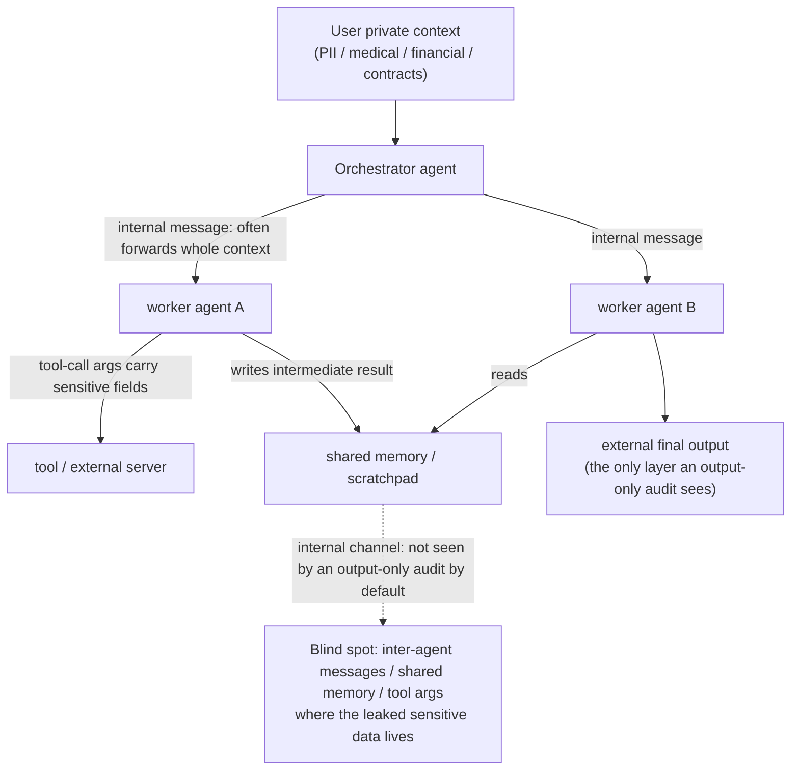

import PrivacyMeta from '@site/src/components/PrivacyMeta';

<PrivacyMeta era="Volume 4 · RAG and agents" technique="RAG & agent privacy" audience={['Security Engineer', 'Privacy Engineer', 'ML Engineer']} severity="Medium" maturity="Research" evidence="Research" />

> In one sentence: when a job is split across several collaborating agents (an orchestrator plus a few workers), private data doesn't only travel the "final answer to the user" path — it also flows through **inter-agent messages, shared memory, and tool-call arguments**, i.e. **internal channels**. Several 2025–2026 benchmarks (**all preprint / workshop-tier, each flagged ⚠️ below**) converge on the same observation: **internal channels leak substantially more sensitive data than the external output**, and **an audit that only looks at the final output misses a large fraction of it**. Conclusion first: if your audit boundary stops at "what the model said to the user," it can't see the dominant leakage surface in a multi-agent system — **internal channels must also be audited, redacted, and shared on a need-to-know minimum**.

## Mechanism: what happens on my side

First, what this entry is *not*. It is **not** a single injected agent exfiltrating data outward (that's [Agent tool-use exfiltration](./agent-tool-exfiltration.mdx) and [Agent privacy evaluation](./agent-privacy-benchmark.mdx)), and it is **not** a shared cache/memory that fails to isolate tenants and bleeds one user's data into another's session (that's the infrastructure bug in [Cross-session memory bleed](./cross-session-memory-bleed.mdx)). This entry is about the **normal, non-adversarial** case: to get the job done, sensitive fields flow between agents **by design** — the orchestrator hands user context to a worker, a worker writes an intermediate result into shared memory, one agent stuffs an argument into another tool call — and **those internal hops are themselves a leakage surface**, one that by default sits **outside the view of an output-only audit**.

The first-person red line, stated plainly: this is **not** "I decide to over-share" — I can't reliably introspect which fields I'll carry along in an internal message. What can be externally verified is that **in a multi-agent collaboration trace, sensitive fields observably appear in inter-agent messages / shared memory / tool arguments**, and that this is measurable **by inspecting those internal traces**, independent of whether I "want" to say more. Put differently: move the leakage check from "read the final answer" to "read the internal traces," and the count of violations goes up.

Why internal tends to leak more than external: the **external output** usually passes through an aligned "speaking to the user" self-restraint (the model is trained to be more careful with the final reply), whereas **inter-agent messages / tool arguments** read more like "working drafts and internal memos" — the model's tendency to pass the full context through verbatim is stronger there. So the same private datum is more likely to be carried out via an internal channel than via the external answer.



## Threat surface: internal channels vs external output, and the blind spot of output-only audits

Who, under what assumptions, turns this mechanism into a real leak — this entry has two "adversary" readings, which must be kept apart:

- **Over-sharing with no adversary (the main thread here)**: there is no attacker; the **collaboration design** simply makes sensitive fields travel a few extra hops internally. The party at risk is anyone who can read the internal traces: the logging system, the observability platform, third-party tools / MCP servers, other readers of shared memory, and whoever later obtains the trace. **An output-only audit inherently cannot see this** — it only reads the final answer.
- **Amplified under an adversary**: once a hop is hijacked by indirect prompt injection, an internal channel also becomes an outbound channel (back to [Agent tool-use exfiltration](./agent-tool-exfiltration.mdx)); ConVerse-style agent-to-agent attacks precisely hide the malicious request inside "plausible-looking" dialogue to coax another agent into surrendering context.

**Adversary / observer model (per benchmark — conditions must be carried)**: these findings come from **runtime behavioral measurement**; the systems under test are generally **black-box API models plus a multi-agent orchestration framework** (CrewAI / AutoGen / LangGraph and the like), and the decision criterion is **inspecting the internal execution traces** for the appearance of sensitive fields, not just reading the final output. Every number below is **bound to its paper's scenario set, models, and decision criteria**, and **all sources are preprint / workshop-tier** — not to be transplanted as settled fact:

- ⚠️ **AgentLeak (arXiv 2602.11510, preprint; per its page "to appear in IEEE Access 2026," i.e. not yet a finalized peer-reviewed version; verified 2026-07)**: under an orchestrator–worker topology it instruments several channels at once (external output, inter-agent messages, tool inputs/outputs, shared memory, logs, artifacts) and, over **1,000 scenarios**, **5 production LLMs**, and roughly **4,979 execution traces**, reports that **internal channels leak roughly 2.5–2.6× more than the external output**, and that **auditing only the external output misses over 40% of violations** (on independent verification the absolute values vary across preprint versions / channel definitions — internal ~69%–74% vs external ~27%–28%, ~42%–46% missed). These figures are **bound to its scenario set, models, and three-tier detection pipeline, and shift across preprint versions**, not a general probability.
- ⚠️ **MAGPIE (NeurIPS 2025 ResponsibleFM Workshop — note: a workshop, not the NeurIPS main track; arXiv 2510.15186 / OpenReview vZgdho8Vx0)**: about **200 high-stakes, non-adversarial collaborative tasks** that make private information "essential to solving the task," forcing agents to trade off collaboration against information control. It reports that **even when explicitly instructed not to leak**, frontier models still leak substantially — e.g. **Gemini-2.5-Pro up to ~50.7% and GPT-5 up to ~35.1%** (upper bounds under its own protocol). The numbers are **bound to its task set and prompt conditions**.
- ⚠️ **ConVerse (arXiv 2511.05359, accepted to Findings of EACL 2026; verified 2026-07)**: across travel / real-estate / insurance domains, 12 user personas, and roughly **864 contextual attacks (~611 privacy + ~253 security)**, it models **autonomous multi-turn agent-to-agent conversations** with malicious requests embedded in plausible discourse. It reports **privacy attacks succeeding up to ~88%**, and observes that **"stronger models leak more."** The numbers are **bound to its attack set and decision criteria**.

The three differ in scenarios, criteria, and venue, yet point the **same way**: **multi-agent internal channels are a primary leakage surface that output-only audits systematically underestimate**, and being a stronger model does not necessarily mean being safer. **Because all three are preprint / workshop-tier, this is offered only as a qualitative "several recent benchmarks converge" claim; no single percentage is enough to serve as an acceptance threshold.**

## How the defense works

This defense rests on one move: **extend the boundary of audit and control from "what the model said externally" to "how data flows inside the system."** It protects against the "internal-channel leak" surface; it does not replace your existing defenses against injection / exfiltration. Four pillars:

- **Audit internal channels, not just external output**: instrument and detect on inter-agent messages, shared-memory writes, and tool-call arguments — wherever a sensitive field appears, count a violation. Measuring only the final output scores that large slice of leakage as zero.
- **Minimum sharing between agents (data minimization pushed down to the orchestration layer)**: what the orchestrator hands a worker should be only the fields **that worker needs to complete its sub-task**, not "forward the entire user context verbatim." This is GDPR data minimization realized *inside* a multi-agent system (echoing [MCP data flow and least collection](./mcp-data-flow-privacy.mdx), which puts least-collection at the host↔server boundary).
- **Pass on demand, not the whole payload**: the default behavior is often "copy the whole context to the next hop"; the defense is to switch to **explicit per-field allowlists / reference passing** (pass a handle / ID so the downstream fetches, with authorization, only when needed), narrowing the "carried along by accident" surface.
- **Redact / control internal channels too**: the PII redaction, field-level masking, and outbound checks you already apply to the external output must **also apply to internal messages and tool arguments** — don't assume "it's internal, so it's safe." Internal ≠ trusted: logs, third-party tools, and other readers of shared memory all sit downstream of this internal channel.

To be blunt: this is **measurement plus data-flow governance**, not a formal guarantee. It turns "internal leakage" from a blind spot into something visible and regression-able, but whether it actually goes down still depends on the orchestration layer really doing minimum sharing and redaction — the audit is the thermometer, minimum sharing is the medicine.

## Buildable recipe

```text
1. Instrument the internal channels: in your orchestration framework (CrewAI /
   AutoGen / LangGraph etc.), trace (1) inter-agent messages (2) shared-memory /
   scratchpad writes (3) tool-call arguments, recording which fields each hop
   carried — not just the final answer.
2. Run sensitive-field detection: over those three internal channels, run PII /
   sensitive-field detection (NER + regex + your own sensitive-category list);
   a hit counts as one "internal-channel violation."
3. Minimum sharing at the orchestration layer: change the orchestrator->worker
   payload to a per-field allowlist carrying only what the sub-task needs; pass
   a reference / ID instead of raw text where possible (fetch with authorization
   downstream).
4. Redact the internal channels too: apply the same masking / redaction you use
   on the external output to internal messages and tool arguments; don't assume
   "internal, therefore safe."
5. Dual-lens comparative audit: in the same run, count "violations visible in the
   external output only" and "violations visible across all internal channels,"
   and treat the gap (what output-only missed) as your system's internal-leak
   blind-spot metric, regressed per version — the larger the gap, the more you're
   relying on an audit lens that can't see the whole picture.
```

Every number is bound to **your orchestration topology, field sensitivity surface, and detectors** — don't copy any paper's percentage; those absolute values are only comparable within their own protocol.

**Minimal testable assertions** (turn "internal leakage" into a regression check, don't audit the external output only):

- How to test: run a batch of multi-agent collaboration tasks with real sensitive fields in them; audit **two lenses simultaneously** — (a) scan sensitive fields in the final external output only; (b) scan sensitive fields across all internal channels (inter-agent messages + shared-memory writes + tool-call arguments). Count violations for each.
- Passing: the internal-channel violation count is **below a set threshold and no higher than the previous baseline**; the "output-only-missed violations" — the excess of (b) over (a) — converges to an acceptable range; orchestration-layer minimum sharing and internal redaction are in place. This proves you didn't leave the primary leakage surface in the audit blind spot.
- Failing: (b) is far higher than (a) (many violations visible only in the internal channels, invisible to the external audit), or there is no internal-channel audit lens at all, or the orchestrator forwards the whole user context verbatim → this internal-leak check fails; add minimum sharing and internal redaction (steps 3 and 4 above) before shipping the multi-agent orchestration.

## Research status (engineering feasibility)

(This entry is marked maturity "Research": the findings come from **recent benchmarks that are all preprint / workshop-tier and pending replication**. These works show that "making multi-agent internal-channel leakage a measurable metric" is engineering-feasible and that the gap versus output-only audits is quantifiable — but they do not constitute a settled, universal probability. **Each item below keeps its paper's conditions and a ⚠️ flag.**)

- ⚠️ **AgentLeak (arXiv 2602.11510, preprint / per its page to appear in IEEE Access 2026)**: turns **internal-channel leakage** in multi-agent systems into an end-to-end measurable benchmark — orchestrator–worker topology, multiple channels instrumented at once, 1,000 scenarios × 5 production LLMs (incl. GPT-4o, GPT-4o-mini, Claude 3.5 Sonnet, Mistral Large, Llama 3.3 70B) × ~4,979 traces. Core observation: **internal channels leak roughly 2.5–2.6× the external output; output-only audits miss over 40% of violations** (absolute values shift across preprint versions / channel definitions: internal ~69%–74% vs external ~27%–28%, ~42%–46% missed). It turns this entry's abstract claim ("more leaks internally than externally, and it's under-audited") into something **reproducible and scoreable**. Numbers are **bound to its scenarios / models / detection protocol, and shift across preprint versions**; venue pending confirmation.
- ⚠️ **MAGPIE (NeurIPS 2025 ResponsibleFM Workshop, not the main track; arXiv 2510.15186)**: about 200 **non-adversarial** high-stakes collaborative tasks, showing that "even when ordered not to leak, frontier models still leak substantially in collaboration" — **Gemini-2.5-Pro up to ~50.7%, GPT-5 up to ~35.1%** (its own upper bounds). It corroborates that "over-sharing is the default tendency in collaboration, not something that only shows up under adversarial pressure." Numbers bound to its tasks / prompt conditions; **it is a workshop paper**.
- ⚠️ **ConVerse (arXiv 2511.05359, Findings of EACL 2026)**: about 864 agent-to-agent attacks, reporting **privacy attacks up to ~88%** and that **stronger models leak more**. It corroborates that "under an adversary, the success rate of coaxing context out of the inter-agent dialogue channel is high." Numbers bound to its attack set / criteria; though accepted to Findings, the conclusion remains **recent and pending wider replication**.

The three point the **same way**: **internal channels are a systematically underestimated primary leakage surface in multi-agent systems**, and a stronger model is not a safer one. As all are preprint / workshop-tier, they serve only as converging corroboration — **do not transplant any single percentage as a conclusion for your system**.

## Residual risk and trade-offs

Point-by-point on false security:

- **"Auditing the external output only is enough" is wrong.** The whole point of this entry: in a multi-agent system the primary leakage surface is the **internal channels** (inter-agent messages / shared memory / tool arguments), which by default sit outside an output-only audit's view — looking at the final answer only scores a large slice of violations as zero (multiple benchmarks converge, ⚠️ all preprint / workshop-tier).
- **A stronger model is not necessarily a safer one — it may leak more.** ConVerse directly observes "stronger models leak more"; as capability goes up, so may the tendency to be coaxed into surrendering context, or to carry more fields out over the internal channels — don't treat "we use a stronger model" as a privacy guarantee.
- **Internal redaction / minimum sharing has a utility cost.** Having the orchestrator pass only the needed fields, and masking internal messages too, will make some sub-tasks fail for want of a field or take an extra hop — the same utility↔safety trade-off as in [Agent privacy evaluation](./agent-privacy-benchmark.mdx); don't crush collaboration just to push the violation count down. Read both lenses together.
- **Measurement ≠ defense.** A dual-lens audit only tells you "how much internal leakage went under-audited"; pushing it down takes the orchestration layer actually doing minimum sharing plus internal redaction. The audit is the thermometer, not the medicine.
- **All numbers are pending confirmation.** All three sources here are **preprint / workshop-tier** (AgentLeak to appear in IEEE Access, MAGPIE a NeurIPS workshop, ConVerse Findings of EACL 2026); the conclusion is "several recent benchmarks converge," **not** that any single percentage has been widely replicated. Check each paper's latest-version experimental conditions before citing.

## How this differs from neighboring techniques

- **This entry vs Agent privacy evaluation (AgentDojo, this volume)**: that one measures the success rate (ASR) of a **single agent**, under **injection**, sending private data to an **external destination** via an **outbound tool**, with the criterion "did private data reach the outside"; this entry measures the portion of sensitive fields that, in **multi-agent collaboration**, flow through **internal channels** (inter-agent messages / shared memory / tool arguments) and are **missed by output-only audits**, with the criterion "how many sensitive fields appeared in the internal traces." One measures **outward**, the other **inward** — they are complementary.
- **This entry vs Cross-session memory bleed (this volume)**: that one is an **infrastructure isolation bug** — shared cache / memory not scoped per user, mis-mapping A's data to B (wrong recipient, a multi-tenant race); this entry is a normal set of agents in **one workflow over-sharing with each other by design** (no wrong recipient, no race — just too much passed internally). One is broken isolation, the other is missing minimization.
- **This entry vs Agent tool-use exfiltration (this volume)**: that one is data sent **outward** via a tool **after being hijacked by injection** (attack + outbound channel); this entry's main thread is **adversary-free** internal over-sharing, which only converges with that one when a hop is hijacked (the internal channel becoming an outbound channel).

## Version notes

:::note Applicable versions
"In multi-agent collaboration, sensitive data flows through **internal channels** — inter-agent messages / shared memory / tool arguments — and is more easily under-audited than the external output" is a **framework-agnostic** mechanism judgment (root cause: the task is split across several agents, internal hops forward the whole context by default, and the audit lens often covers only the final output). But **every specific percentage** — AgentLeak's ~2.5–2.6× internal-vs-external (absolute values shifting across versions / definitions within ~69%–74% vs ~27%–28%, ~42%–46% missed), MAGPIE's ~50.7% / ~35.1%, ConVerse's ~88% — is **bound to its paper's scenario set, models, and decision criteria, and all sources are preprint / workshop-tier (AgentLeak to appear in IEEE Access 2026, MAGPIE a NeurIPS 2025 ResponsibleFM Workshop, ConVerse accepted to Findings of EACL 2026)**, **cannot be transplanted to your system**, and **should not be treated as a widely replicated conclusion**. Orchestration topology, field sensitivity surface, and detectors are all **stack-dependent** engineering that must be re-measured on your own multi-agent system. Timestamp: 2026-07. (All three sources verified 2026-07; take venue and numbers from each paper's latest version.)
:::

## Further reading and sources

> Primary: Research (three multi-agent privacy benchmarks, **all preprint / workshop-tier and pending confirmation** — see the ⚠️ flags on each). The conclusion is the qualitative "several recent benchmarks converge"; no single percentage stands as an independent conclusion.

- ⚠️ (preprint / per its page to appear in IEEE Access 2026, venue pending confirmation) [AgentLeak: A Benchmark for Internal-Channel Privacy Leakage in Multi-Agent LLM Systems (arXiv 2602.11510)](https://arxiv.org/abs/2602.11510) — orchestrator–worker multi-channel instrumentation, 1,000 scenarios / 5 production LLMs / ~4,979 traces; reports internal channels leaking ~2.5–2.6× the external output and output-only audits missing over 40% of violations (absolute values shift across versions / channel definitions: internal ~69%–74% vs external ~27%–28%, ~42%–46% missed). Primary source for this entry (the internal-vs-external quantification). Numbers bound to its protocol and varying across preprint versions.
- ⚠️ (NeurIPS 2025 ResponsibleFM **Workshop**, not the main track) [MAGPIE: A benchmark for Multi-AGent contextual PrIvacy Evaluation (arXiv 2510.15186 / OpenReview vZgdho8Vx0)](https://openreview.net/forum?id=vZgdho8Vx0) — about 200 non-adversarial collaborative tasks; reports that even when ordered not to leak, Gemini-2.5-Pro reaches up to ~50.7% and GPT-5 up to ~35.1%. Corroborates that "over-sharing is the default tendency in collaboration." Numbers bound to its tasks / prompt conditions.
- ⚠️ (accepted to **Findings of EACL 2026**, still recent and pending wider replication) [ConVerse: Benchmarking Contextual Safety in Agent-to-Agent Conversations (arXiv 2511.05359)](https://arxiv.org/abs/2511.05359) — about 864 agent-to-agent attacks; privacy attacks up to ~88%, with the observation that "stronger models leak more." Corroborates the success rate of coaxing context out of the internal dialogue channel under an adversary. Numbers bound to its attack set / criteria.
- For the attack side and outbound channels, see [Agent tool-use exfiltration](./agent-tool-exfiltration.mdx); for a measurable benchmark on the external dimension, see [Agent privacy evaluation (AgentDojo)](./agent-privacy-benchmark.mdx); for the infrastructure isolation bug, see [Cross-session memory bleed](./cross-session-memory-bleed.mdx); for least-collection at the host↔server boundary, see [MCP data flow and least collection](./mcp-data-flow-privacy.mdx).
