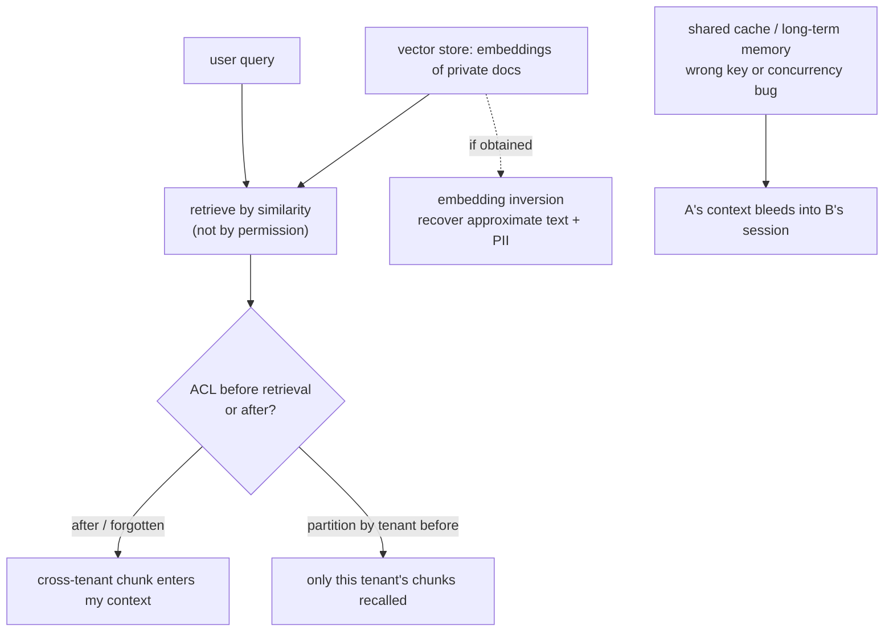

import PrivacyMeta from '@site/src/components/PrivacyMeta';

<PrivacyMeta era="Volume 4 · RAG and agents" technique="RAG & agent privacy" audience={['Privacy Engineer', 'Security Engineer', 'ML Engineer']} severity="High" maturity="Experimental" evidence="Security advisory" />

> In one sentence: in multi-tenant RAG, two intuitions both fail — "vectorized means anonymized" and "filtered by user means isolated." In some studied embedding settings a vector **can be inverted back to approximate original text** (including PII), so don't treat it as anonymization; retrieval ranks by **similarity**, not permission, so if the ACL runs after retrieval instead of before it, the most relevant private chunk may come from **another tenant**; and a single boundary bug in a shared cache / long-term memory can carry one user's private context into another's session.

## Mechanism: what happens on my side

In RAG, what I do is: chunk your private documents, embed them into vectors in a store, and at query time retrieve the most relevant chunks by similarity and put them into my context to answer. This chain has three independent leak points:

1. **An embedding is not a one-way hash.** It retains enough lexical and semantic information that, under the right conditions, it can be **inverted back to approximate original text** by a learned decoder — Morris et al.'s vec2text iteratively approaches the target vector and, in its research setting, reconstructs sentences with high fidelity, recovering **real names** from embeddings of clinical notes (Morris et al., EMNLP 2023). Inversion fidelity depends on the embedding model, whether the attacker can query the same model, text length, and domain distribution; but the conclusion is clear enough: "we only stored vectors, not the text" is **not** anonymization.
2. **Retrieval is by similarity, not permission.** I bring back "the chunks most like the question," not "the chunks you're allowed to see." If tenant / user access control runs **after retrieval** (or is forgotten), then during ranking another tenant's private chunk may already enter the candidate set — even enter my context.
3. **Shared state bleeds.** Caches, session state, and long-term memory, if keyed wrong or mismatched under concurrency, can put A's private context into B's session.

Red line: I shouldn't write "I'll keep it secret" — I can't make that promise. What is externally observable is: **under these mechanisms, private data can, recomputably and across boundaries, show up where it shouldn't.**



## Threat surface: how it's exploited

- **Cross-tenant retrieval**: ACL filtered after retrieval, or relying on "application-layer trust" instead of "index-layer isolation" — an attacker crafts queries that pull another tenant's relevant content into the answer.
- **Embedding inversion**: an attacker who obtains a vector-store export, a backup, or embeddings returned by some endpoint can reconstruct approximate originals — relaxing vector-store access control on the theory "they're just vectors, not sensitive" effectively relaxes the originals.
- **Cross-session / cross-user bleed**: a boundary bug in cache / memory — no advanced attack needed, a concurrency race suffices (see "A real case").
- **Tool / retrieved results into long-term memory**: writing retrieved private fragments into a long-term memory that gets recalled across sessions turns a one-time grant into long-term residency.

## How the defense works

Core: **do isolation at the data layer, before retrieval; treat embeddings as sensitive data.**

- **Partition by tenant / user before retrieval**: a separate index per tenant, or force a tenant filter in the vector query (pre-filter), so "out-of-scope chunks never enter the candidate set" rather than deleting them after.
- **Bring embeddings under access control and encryption**: they can be inverted, so protect them at the originals' sensitivity level — read access, exports, and backups of the vector store all need governing.
- **Strong session / tenant keys + isolation tests**: use unconfusable keys for caches and memory; inject cross-tenant probes before launch to actively test for leaks.
- **Minimize private data entering memory**: tool / retrieved results do **not** enter long-term memory by default; residency needs an explicit, scoped grant.

## Buildable recipe

```text
1. Index-layer isolation: a separate collection/namespace per tenant, or force a
   pre-filter with tenant_id in the retrieval query; ACL takes effect "before
   retrieval," not by filtering after retrieval at the app layer.
2. Treat the vector store as sensitive storage: access control + at-rest
   encryption on read/export/backup; don't assume "just vectors, not sensitive."
3. Minimize before ingest: PII scan/redact chunks before writing; decide by
   sensitivity whether they may enter a retrievable store at all.
4. Isolation regression tests: inject cross-tenant probes, auto-test "can A's
   query recall/answer B's chunks," as a CI gate:
   - seeds: tenant_a_secret = "TENANT_A_ONLY_<random>"; tenant_b_probe = a
     question highly similar in meaning to A's document
   - assert: B's retrieval candidates exclude A's doc / B's final answer excludes
     A's content / logs, traces, caches don't record A's doc for B
   make it a CI gate, not a one-off manual spot check.
5. Memory containment: retrieved results/tool outputs don't enter long-term
   memory by default; if they do, explicit grant + scoped + clearable.
```

Every boundary (which layer does ACL, who can read the vector store, memory recall scope) must be written as a testable assertion — don't stop at a verbal "we filter by user."

## A real case

**An adjacent real incident: cross-user state-isolation failure.** Strictly, this is not RAG vector-retrieval leakage but a state-isolation incident in an LLM service; it's here because it proves that **the same class of boundary-layer bug** can cause cross-user data leakage in a production LLM service. On March 20, 2023, a bug in the Redis client library redis-py that OpenAI used caused a spike in request cancellations, giving connections a small probability of returning **someone else's data**: some users saw **other active users' conversation titles** in the sidebar; if two were active at once, the first message of a new conversation could be visible to another; the same bug also made payment-related information of about **1.2% of ChatGPT Plus users** visible to others in a roughly nine-hour window (name, email, payment address, last four digits and expiry of a credit card — **full card numbers were not exposed**). This is OpenAI's own postmortem (OpenAI, *March 20 ChatGPT outage*, 2023). What it confirms is not some advanced attack but the same class of mechanism risk: **in a production LLM service, a single bug in the "boundary layer" — cache / concurrency — is enough to bleed private data across users.** Isolation must be enforced at the data layer, not left to the app layer's "it shouldn't happen."

## Residual risk and trade-offs

Calling out each false security:

- **"Vectorized = anonymized" is wrong.** Embeddings can be inverted back to approximate text and PII (Morris 2023); storing vectors stores a recoverable copy of sensitive data.
- **"Filtered by user = isolated" depends on which layer.** Filtering after retrieval / at the app layer leaves a window where "out-of-scope chunks enter candidates first"; only index-layer isolation before retrieval counts as isolation.
- **"Only embeddings, not text" isn't safe.** See the first point — the embedding itself leaks.
- **Retrieval quality vs. strict isolation is a real trade-off.** One big shared index recalls better but mixes the boundaries; per-tenant partitioning is safer but may cost some recall and money.
- **Long-term memory recall vs. bleed risk.** Letting me "remember" more improves the experience, but each extra cross-session residency is one more bleed surface.

## Compliance mapping

- **OWASP LLM02:2025 (Sensitive Information Disclosure)**: this is its textbook form — exposing PII or others' data through retrieval / output; mitigations include data sanitization and access control.
- **GDPR**: cross-tenant / cross-user leakage is a personal-data breach triggering notification duties; a vector store, as storage of personal data, is equally subject to minimization, access control, and cross-border transfer rules.

(Compliance evolves with statute/framework versions; this section is stamped 2026-06 — verify the latest text before citing.)

## How this differs from neighboring techniques

- **RAG retrieval leakage vs. training-data extraction**: here the private data lives in the **vector store / at retrieval time**, defended by configuration and isolation; in [training-data extraction](../02-memorization-extraction/training-data-extraction.mdx) it lives in the **weights / at training time**, defended by dedup / DP. Both are "private data leaking out," but they live in different layers of the system.
- **RAG retrieval leakage vs. context-surface privacy**: context-surface privacy is about "things in my current context" — the system prompt, conversation context — being extracted (Volume 3); this entry is about the retrieval system **pulling in** private data it shouldn't, the opposite direction, living in the retrieval and storage layer.

## Version notes

:::note Applicable versions
Embedding invertibility is a **property of embedding representations**, not limited to one vector store or model (Morris et al. demonstrate it across several mainstream embedding models, EMNLP 2023); the ACL layer for multi-tenant retrieval and the isolation of cache / memory are **system-design problems**, common across vendors. Exact inversion fidelity and mitigation effectiveness vary with model and implementation — deploy against your own isolation tests. (Sources verified 2026-06.)
:::

## Further reading and sources

- [Text Embeddings Reveal (Almost) As Much As Text (Morris et al., EMNLP 2023; arXiv 2310.06816)](https://arxiv.org/abs/2310.06816) — vec2text inverts text embeddings back to approximate originals and recovers real names from clinical-note embeddings.
- [March 20 ChatGPT outage (OpenAI official postmortem, 2023)](https://openai.com/index/march-20-chatgpt-outage/) — a redis-py bug made cross-user conversation titles and some payment info visible.
- [OWASP LLM02:2025 Sensitive Information Disclosure](https://genai.owasp.org/llmrisk/llm022025-sensitive-information-disclosure/) — the risk category and mitigations for sensitive-information disclosure in LLM applications.
