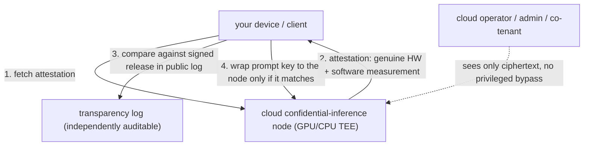

import PrivacyMeta from '@site/src/components/PrivacyMeta';

<PrivacyMeta era="Volume 5 · Frontier and deployment" technique="Privacy-preserving computation" audience={['Privacy Engineer', 'Security Engineer', 'ML Engineer']} severity="Medium" maturity="Production" evidence="Official docs" />

> In one sentence: you want to use a cloud LLM without letting the provider see your prompt (or serve a model without the client getting the weights). Confidential inference is the **deployment** of that goal: what **actually ships** today is mainly the **TEE route** — the model runs in a GPU TEE + remote attestation + verifiable transparency (e.g. Apple Private Cloud Compute, NVIDIA confidential AI); the cryptographic route (HE / MPC) is still too expensive at LLM scale. But "confidential" is a marketing word — the real boundary isn't "the vendor says confidential," it's **whether you (or your device) verified the attestation, who the threat model covers, and what it still doesn't solve** (side channels, trusting the chip vendor, legal orders). This entry takes Volume 1's [TEE](../01-foundations/trusted-execution-environment.mdx) and [HE·MPC](../01-foundations/he-mpc.mdx) foundations down to "can you actually run private inference."

## Mechanism: what happens on my side

When I run as a cloud model in a confidential-inference stack, three steps happen on my side:

1. **My execution environment is invisible to the cloud operator.** The GPU / CPU enclave where I process your prompt is hardware-encrypted and isolated; cloud admins and co-tenants, even with higher privilege, see only ciphertext (mechanism in Volume 1 [TEE](../01-foundations/trusted-execution-environment.mdx)).
2. **You verify first, then send.** Your device / client fetches the remote attestation, confirms "genuine hardware running auditable software," and only **after verifying** sends the prompt (wrapped under a key that decrypts only to that node).
3. **(One step further) verifiable transparency.** Apple Private Cloud Compute **publishes every production software image to a log for independent inspection**, and has the device **wrap its request key only to nodes whose attested measurement matches a signed release in the public transparency log**; PCC is also designed with **no privileged runtime roles** — even cloud admins can't bypass it (Apple Security Research, *Private Cloud Compute*).

Red line: confidential inference gives "**verifiably** the cloud can't see it + provable identity," **not** "just trust me." What's externally checkable is the attestation and transparency log, not a vendor promise.



## Threat surface: what confidential inference does and doesn't defend

- **Defends**: a snooping cloud operator / admin, co-tenants, and (in designs like PCC) the vendor's own privileged access — the core promise is "hand inference to the cloud, but the cloud **verifiably** can't see plaintext."
- **Doesn't defend ① not verifying attestation = useless**: the biggest false security — the client only sets up TLS, never verifies attestation or checks the transparency log, which is sending plaintext to a black box that merely "claims" to be confidential.
- **Doesn't defend ② root of trust is still the chip vendor + side channels**: a TEE's confidentiality gets broken periodically by microarchitectural side channels, and the root of trust sits with the CPU / GPU vendor (see Volume 1 [TEE](../01-foundations/trusted-execution-environment.mdx)).
- **Doesn't defend ③ the cryptographic route's overhead**: HE / MPC achieve "zero hardware trust" but are still too expensive at LLM scale (see Volume 1 [HE·MPC](../01-foundations/he-mpc.mdx)), today limited to small models / partial stages.
- **Doesn't defend ④ legal orders**: "the cloud can't see it" ≠ "the law can't get it" — preservation orders and regulatory demands still sit above retention / deletion arrangements (see Volume 6 [Inference-service data boundary](../06-governance-compliance/inference-service-data-boundary.mdx)).
- **Doesn't defend ⑤ data you authorize out**: once a result leaves the enclave, or you write private context into a non-confidential log / store, protection ends.

## How the defense works

Confidential inference takes Volume 1's three pieces into deployment and adds a layer: **hardware TEE isolation + remote attestation + verifiable transparency**. The load-bearing one is **verifiable transparency** — it downgrades "trust the vendor not to misbehave" to "**check what code the vendor actually ran**": the software image is published to an append-only log, can't be silently changed, researchers can inspect it independently, and the device talks only to nodes whose attestation matches a public release. That's where confidential inference goes beyond bare TEE: it makes not just "genuine hardware" but "genuinely this auditable software" checkable.

## Buildable recipe

```text
1. Pick the route:
   - TEE route (deployable today): build a PCC-style stack, or self-deploy on
     NVIDIA H100/H200 confidential computing — standard models run in the GPU
     TEE largely unmodified.
   - Cryptographic route (HE/MPC): only narrow scenarios / small models / partial
     stages; evaluate overhead per Volume 1 HE·MPC.
2. Enforce client-side verification (the crux): before sending — verify the
   attestation, compare against the signed release in the public transparency
   log, validate the vendor cert chain; refuse if anything mismatches. Make
   verification a gate before sending, not just TLS.
3. End-to-end encryption + key binding: wrap the request key only to a verified
   node's public key; encrypt CPU-GPU and client-node links.
4. Minimize exfiltration: minimize results before they leave the enclave; don't
   write private context into non-confidential logs / traces.
5. State the threat model: are you defending against the operator? co-tenants?
   legal orders? — the last one a TEE doesn't solve; that needs contracts and the
   data boundary (Volume 6).
```

Every choice carries **your threat model and load**: the engineering effort of a self-built stack, GPU TEE overhead, and the feasibility of the cryptographic route all depend heavily on your scale and goal.

**Minimal testable assertions** (turn "verification" into a regression check — don't stop at "we used confidential inference"):

- How to test: forge a node, or change the software image (so the measurement changes), and run the client verification flow.
- Pass: when the attestation is invalid, the measurement isn't in the public transparency log, or the cert chain fails, the client **always refuses to send the prompt**; it sends only when it matches a signed release in the log.
- Fail: the client doesn't verify attestation / doesn't check the transparency log (only TLS) → that's not really confidential inference; make verification a gate before sending.

## A real case / current vendor state

Confidential inference has **production deployments**:

- **Apple Private Cloud Compute (PCC)**: built for Apple Intelligence's cloud requests — device-side remote attestation, **publishing production software images to a verifiable transparency log**, **no privileged runtime roles** (even Apple's own operations can't privileged-access user data), and partial source for key components opened for security research (Apple Security Research, *Private Cloud Compute*). It exemplifies "let the user's device do the verification automatically."
- **NVIDIA H100 / H200 confidential computing**: a GPU TEE where standard PyTorch / TensorFlow / ONNX models run in the enclave **unmodified**, with the client adding an attestation-verification step (NVIDIA official).

:::caution To be verified
The **large-scale private-LLM-inference overhead** of the cryptographic route (HE / MPC) has no single first-source benchmark; this entry states no bald multiplier — to be verified against a first source (recorded in `BACKLOG-privacy.md`).
:::

## Residual risk and trade-offs

Calling out each false security:

- **"Confidential" ≠ secure; the crux is whether you verified.** PCC has the device verify automatically; a self-built stack has to implement attestation verification + transparency-log comparison itself, and skipping that hollows it out.
- **Trust is only shifted, not eliminated.** You moved trust from the cloud operator to the chip vendor (+ side channels remain), see Volume 1 [TEE](../01-foundations/trusted-execution-environment.mdx).
- **"The cloud can't see it" ≠ "the law can't get it."** Preservation orders and regulatory demands still sit above retention / deletion — technical confidentiality doesn't replace the legal boundary (Volume 6 [data boundary](../06-governance-compliance/inference-service-data-boundary.mdx)).
- **The zero-hardware-trust cryptographic route is impractical at LLM scale.** HE / MPC sound purer, but overhead keeps them out of full private inference for large models.
- **A transparency log proves "this software ran," not "this software has no backdoor."** Auditable ≠ audited — it still takes independent security research to look at the published code.

## Compliance mapping

- **GDPR Art. 32 / cross-border**: confidential inference brings "data in use" under verifiable protection — strong evidence of "appropriate technical measures" — and helps argue "data is processed only within a controlled enclave" for cross-border transfers.
- **Liability isn't waived by technology**: even if the cloud **verifiably** can't see plaintext, the processor / subprocessor relationship, retention / deletion arrangements, and response to legal orders remain — a technical guarantee and legal liability are two different things (Volume 6 [data boundary](../06-governance-compliance/inference-service-data-boundary.mdx)).

(Compliance evolves with the statute version; this section is stamped 2026-06 — verify the latest enacted text before citing.)

## How this differs from neighboring techniques

- **Confidential inference (Volume 5, deployment) vs. TEE / HE·MPC (Volume 1, mechanism)**: Volume 1 covers "what the mechanism guarantees and doesn't"; this entry covers "**how to deploy it into usable private inference, who has shipped it, and what's still missing**." Same foundation, one at the mechanism layer, one at the deployment layer.
- **Confidential inference vs. inference-service data boundary (Volume 6)**: confidential inference uses **technology** to keep the cloud from seeing plaintext; the data boundary uses **terms** to check whether the provider retains, trains on, or hands off the data. Tech makes it "invisible," terms govern "obtainable, and whose responsibility" — complementary, neither sufficient alone (see Volume 6 [data boundary](../06-governance-compliance/inference-service-data-boundary.mdx)).

## Version notes

:::note Applicable versions
The **architecture** of confidential inference (TEE + remote attestation + verifiable transparency) is relatively stable, but the **specific products and hardware** evolve fast: PCC, NVIDIA confidential computing, and various clouds' confidential VMs / GPUs all iterate, and the cryptographic route's feasibility shifts with hardware acceleration. This entry reflects the 2026-06 product landscape (Apple PCC, NVIDIA H100/H200 confidential computing); specific capabilities, overhead, and threat models are whatever the vendor's current docs and your own measurements say. (Sources verified 2026-06.)
:::

## Further reading and sources

Mixed evidence — **primary: official docs** (Apple, NVIDIA); **supplementary: standard** (CCC) + mechanism in Volume 1's two foundations.

- [Private Cloud Compute: A new frontier for AI privacy in the cloud (Apple Security Research)](https://security.apple.com/blog/private-cloud-compute/) — official: device-side remote attestation + verifiable transparency log + no privileged access + partial open source for audit.
- [Confidential Computing on H100 GPUs (NVIDIA official)](https://developer.nvidia.com/blog/confidential-computing-on-h100-gpus-for-secure-and-trustworthy-ai/) — official: a GPU TEE where standard models run in the enclave unmodified + client attestation.
- [A Technical Analysis of Confidential Computing (CCC, v1.3)](https://confidentialcomputing.io/wp-content/uploads/sites/10/2023/03/CCC-A-Technical-Analysis-of-Confidential-Computing-v1.3_unlocked.pdf) — standard: the TEE / attestation / trust-model framework for confidential computing.
