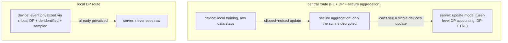

import PrivacyMeta from '@site/src/components/PrivacyMeta';

<PrivacyMeta era="Volume 5 · Frontier and deployment" technique="Federated learning & secure aggregation" audience={['Privacy Engineer', 'ML Engineer']} severity="Medium" maturity="Production" evidence="Research" />

> In one sentence: federated learning (FL) trains a model across many devices with **raw data never leaving the device**, uploading only model updates. But "data doesn't leave the device" is only the start — **the updates themselves leak** (they can reconstruct training data). So production-grade FL layers on: **DP** (bound a single device's / user's influence on the model) + **secure aggregation** (the server sees only the sum of many devices' updates, not any single one). Real deployments: Gboard trained **more than twenty** DP-guaranteed language models with FL + DP-FTRL; Apple collects emoji / keyboard telemetry with **local DP**. Key points: **FL ≠ private**, watch local DP's ε, and don't mismatch user-level vs sample-level. This is the deployment face of Volume 3 [DP fine-tuning](../03-conversational-llms/dp-fine-tuning.mdx) at "federated + large-scale production."

## Mechanism: what happens on my side

- **Federated learning (FL)**: my training happens on the device, the device uploads only **gradients / model updates**, the server aggregates updates to improve me, and **raw data isn't centralized** (McMahan et al.'s FedAvg, 2017).
- **But updates leak**, so layer two things:
  1. **DP**: **clip + add noise** to updates, bounding a single device's / user's influence on me. FL naturally groups by client, fitting **user-level DP**; Gboard uses **DP-FTRL**, a DP accounting that doesn't rely on sampling / shuffling, suited to federated streaming updates.
  2. **Secure aggregation**: cryptography lets the server decrypt only **the sum of many devices' updates**, never any single device's.
- **Another route: local DP** — data is privatized with noise **on the device** before upload, trusting not even the server. Apple's approach: events like emoji are privatized on-device via **ε-local DP**, stripped of device identifiers and timestamps, and randomly sampled before being sent — the server never sees the raw data (Apple, *Learning with Privacy at Scale*).

Red line: I don't write "I won't look at your data" — the accurate statement is: **mechanically the server only gets noised / aggregated quantities**; the raw data either never left the device or was privatized before it did.



## Threat surface: why FL alone isn't enough

- **Updates leak**: raw gradients / updates can be inverted to reconstruct training data (gradient leakage), which FL **alone doesn't defend** — you must layer DP.
- **Server-trust assumption**: without secure aggregation, the server sees **individual** device updates, undercutting "don't centralize raw data."
- **Local DP's ε**: local DP is noisy, often needing a fairly large ε for utility — **check ε for protection strength**, not "we used local DP so it's private."
- **Privacy-unit mismatch**: protecting "all of one user's data" needs **user-level** DP; FL naturally groups by client = user, fitting user-level — don't degrade to sample-level.

## How the defense works

Two routes, both load-bearing on "**data doesn't leave the device**" needing "**updates don't leak either**":

- **Central route**: FL (raw data stays) + DP-FTRL (DP accounting suited to federated streaming, giving a user-level (ε, δ) bound) + secure aggregation (server sees only the sum). **For the goal of claiming both "the server can't see single updates" and "single-user influence is bounded,"** drop any one and it fails: no DP → updates leak; no secure aggregation → the server sees single updates — different goals (like the local route below) call for different combinations.
- **Local route**: local DP (noise added on-device, trusting not even the server), at the cost of large noise and clear utility loss; check ε.

## Buildable recipe

```text
1. Pick a route: high central trust -> FL + DP-FTRL + secure aggregation;
   don't trust the server -> local DP (accept utility loss).
2. Fix the privacy unit: user-level (group clipping / noise by client) — don't
   default to sample-level.
3. Central: use DP-FTRL for privacy accounting, report (ε, δ); enable secure
   aggregation with a minimum-cohort-size threshold.
4. Local DP: report ε, describe de-identification / sampling; assess the noise's
   effect on utility.
5. Report the full set: route / privacy unit / (ε, δ) or local-ε / whether secure
   aggregation — not just "we used federated learning."
```

Every number (ε, aggregation threshold, sampling rate) carries **your deployment conditions**; Gboard's / Apple's values are tied to their scale and tasks and don't transfer directly.

**Minimal testable assertions** (turn the recipe above into a regression check):

- How to test: ① can the DP accounting independently re-derive (ε, δ); ② under secure aggregation, can the server decrypt a single device's update (it should not, and there's a minimum cohort size); ③ is local DP's ε checkable and consistent with the noise mechanism.
- Pass: (ε, δ) re-derives consistently, privacy unit = user-level, secure-aggregation threshold is explicit (or local ε is verified).
- Fail: only FL without DP / secure aggregation, or ε so large the bound is vacuous → the claimed privacy guarantee isn't met.

## A real case / current vendor state

DP·FL is a **production** technology:

- **Gboard (Google)**: trained and deployed **more than twenty** language models with differential-privacy guarantees using FL + **DP-FTRL**; moreover **all** next-word-prediction neural language models in Gboard now carry DP guarantees, and future launches **require** DP (Xu et al., ACL 2023 Industry). This is the hardest public case of "production-grade DP-FL."
- **Apple**: uses **local DP** at scale in iOS / macOS to collect emoji, QuickType, and other usage telemetry — events are privatized on-device via ε-local DP, de-identified, and sampled before upload, with the server never seeing raw data (Apple, *Learning with Privacy at Scale*, 2017).

## Residual risk and trade-offs

Calling out each false security:

- **"Data doesn't leave the device = private" is wrong.** Updates leak; you must layer DP + secure aggregation. FL alone isn't private.
- **"Federated" ≠ "DP."** Many "federated" schemes have no DP guarantee at all — look for clipping / noise / accounting.
- **Local DP's ε is often large.** Under the noise / utility trade-off, protection may be weaker than assumed — check ε, don't stop at "we used local DP."
- **Privacy-unit mismatch.** Protecting "users" with only sample-level dilutes the guarantee when a user has many records.
- **Secure aggregation stops "seeing single updates," not "the aggregate leaking."** The aggregate sum itself can still leak information, so you still layer DP.

## Compliance mapping

- **GDPR / data minimization**: FL (no centralized raw data) + DP (a quantifiable guarantee) is a strong argument for "data minimization + appropriate technical measures"; local DP makes "privatize at collection" possible.
- **But parameters decide compliance**: you must state the privacy unit, (ε, δ) or local-ε, and whether secure aggregation is used — "we used federated / DP" ≠ compliant; regulators and a DPIA look at these parameters (same discipline as Volume 3 [DP fine-tuning](../03-conversational-llms/dp-fine-tuning.mdx)).

(Compliance evolves with the statute version; this section is stamped 2026-06 — verify the latest enacted text before citing.)

## How this differs from neighboring techniques

- **DP·FL (Volume 5, production deployment) vs. DP fine-tuning (Volume 3, training mechanism)**: Volume 3 covers DP-SGD's mechanism in **single-point fine-tuning** (clip + noise + accounting); this entry covers DP's landing at **federated + large-scale production** — DP-FTRL, secure aggregation, local DP, real deployments (Gboard / Apple). Same DP discipline, one at the mechanism layer, one at the production-deployment layer.
- **DP·FL vs. confidential inference (this volume)**: DP·FL protects **training** (don't centralize data + don't leak updates); confidential inference protects **inference** (the cloud can't see the prompt). One governs "how the model learns," the other "how the model is used."

## Framework differences (FL frameworks; stamped 2026-06, defer to each framework's current docs)

FL + DP mechanisms are the same across frameworks, but **built-in support for secure aggregation / DP and the deployment shape** differ:

- **TensorFlow Federated (TFF)**: research / simulation-oriented, with built-in secure-aggregation and DP-aggregation primitives, close to Google's production line.
- **Flower**: framework-agnostic (works with PyTorch / TF / JAX), wiring DP / secure aggregation via strategy plugins, leaning flexible and cross-stack.
- **NVFlare / FedML etc.**: enterprise / cross-institution-oriented; secure-aggregation and privacy components vary by release.

The point: **don't assume "using an FL framework" automatically gives you secure aggregation + DP** — both are usually components you **explicitly enable and configure** (see this volume's [Secure aggregation](./secure-aggregation.mdx) and [Gradient leakage](./gradient-leakage.mdx)). When switching frameworks, verify whether they're on by default, which accountant is used, and the threshold assumptions of secure aggregation. (This subsection ages fast; defer to each framework's release docs.)

## Version notes

:::note Applicable versions
The **mechanisms** of FL + DP (FedAvg, DP-FTRL, secure aggregation, local DP) are relatively stable, but the **parameters and scale of specific deployments** evolve with products: Gboard's model count and everyone's ε values change. This entry reflects the 2026-06 public deployments (Gboard DP-FTRL, Apple local DP); specific privacy parameters are whatever the vendor's current docs say — re-derive with your own privacy accounting for deployment. (Sources verified 2026-06.)
:::

## Further reading and sources

> Primary: a **production-deployment paper** (Gboard DP-FL — the official description of a shipped system, and the direct basis for this entry's maturity=production); supporting: research (FedAvg, the mechanism foundation) and vendor practice (Apple's local DP).

- [Federated Learning of Gboard Language Models with Differential Privacy (Xu et al., ACL 2023; arXiv 2305.18465)](https://arxiv.org/abs/2305.18465) — production DP-FL: more than twenty DP-guaranteed Gboard language models deployed with FL + DP-FTRL, all next-word-prediction models now requiring DP.
- [Learning with Privacy at Scale (Apple, 2017)](https://machinelearning.apple.com/research/learning-with-privacy-at-scale) — production local DP: on-device ε-local DP privatization + de-identification + sampling, collecting emoji / QuickType telemetry.
- [Communication-Efficient Learning of Deep Networks from Decentralized Data / FedAvg (McMahan et al., AISTATS 2017; arXiv 1602.05629)](https://arxiv.org/abs/1602.05629) — the foundation of federated learning: raw data stays on-device, only updates are aggregated.
