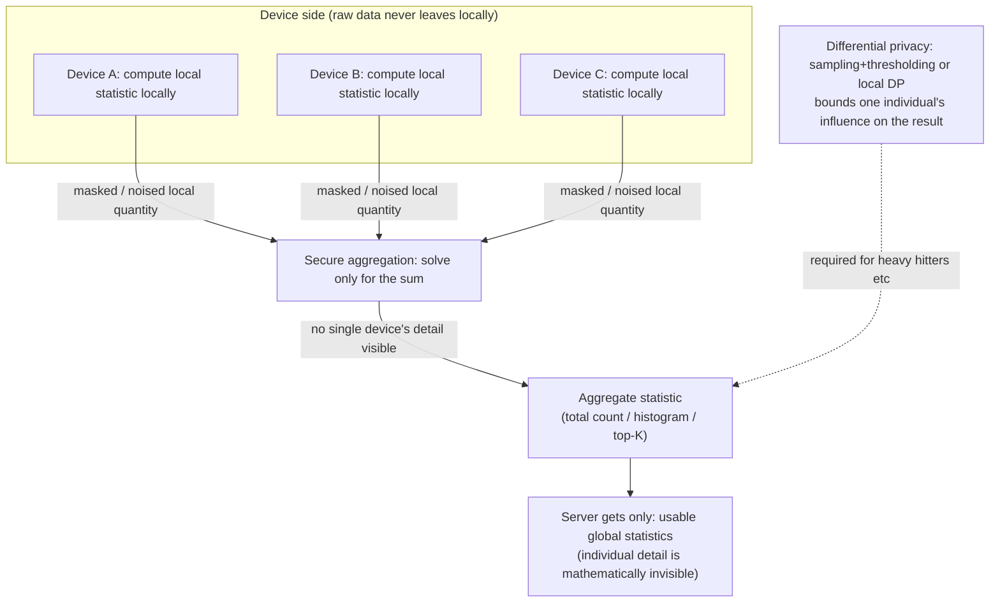

import PrivacyMeta from '@site/src/components/PrivacyMeta';

<PrivacyMeta era="Volume 5 · Frontier and deployment" technique="Federated learning & secure aggregation" audience={['Privacy Engineer', 'ML Engineer', 'Compliance Engineer']} severity="Medium" maturity="Production" evidence="Research" />

> In one sentence: federated analytics is a class of data-science methods that **don't centralize raw data and bring only statistics off the device** — each device computes a local quantity over its local data, and **secure aggregation** lets the server see only the combined totals, never any single device's detail (Ramage & Mazzocchi, Google Research, 2020); discovering "most-frequent items" (heavy hitters) additionally requires stacking **differential privacy** (Zhu, Kairouz et al., AISTATS 2020; Bassily et al., NeurIPS 2017). It's the sibling of **federated learning**: that trains a **model**, this computes **statistics**. Already deployed: Google Pixel's "Now Playing" song-popularity tallies and Apple's popular-emoji / domain telemetry are both production use cases. Conclusion first: **the word "federated" does not automatically mean private** — keeping data local is only the start; **the real privacy guarantee hinges on whether DP and secure aggregation are actually done right**; miss either layer and the aggregate result plus multi-round queries can still shake individuals loose.

## Mechanism: what happens on my side

The first-person collapses to a single mechanistic statement, with no false introspection: **from the outside, this device of mine only emits "masked / noised local statistics" (a count, a histogram bucket, a hit signal for a candidate string); the raw records never leave the device, and on the server side one can only recompute the aggregate totals across many devices — never any single device's detail.**

Break it into two primitives (both from existing entries in this volume):

- **Compute it, don't centralize it**: each device computes a **local quantity** over its local data (e.g. "how many times was this song recognized today"), rather than uploading raw playback history. What the server wants is the **cross-device aggregate** (network-wide total count / global histogram / global top-K), not any single device's detail.
- **How to combine local quantities without exposing the single point**: use [secure aggregation](./secure-aggregation.mdx) as the primitive — the server can solve only for the **sum of all devices' local quantities**, never any single device's contribution (Google Now Playing's song-popularity tallies are computed exactly this way: the server sees only the combined counts, never any one phone's listening history).
- **Discovering "most-frequent items" additionally needs noise**: to find heavy hitters (the most common words / strings / domains) in a stream of user data, even when the server sees only the aggregate, **the aggregate itself can still leak individuals**. So stack **differential privacy**: either obtain inherent DP in the distributed protocol via **sampling + thresholding** (Zhu, Kairouz et al., AISTATS 2020), or privatize on-device with **local DP** before uploading (Bassily et al.'s TreeHist / Bitstogram, NeurIPS 2017; Apple's ε-local DP telemetry).

To be clear about the red line: "private" here **is not "I promise not to look at your data"** — it's that **mechanically** the raw data never left the device and the server receives a noised / aggregated quantity; how strong the guarantee is **depends entirely on whether secure aggregation's threshold assumption holds and whether DP's ε is actually applied and applied enough**.



## Threat surface: what it doesn't defend

Federated analytics is a **positive / deployed privacy technique**, but the safety the word "federated" buys is bounded; below breaks down item by item what it **doesn't defend**, or it's false security.

- **The aggregate result itself can still leak → needs DP.** Secure aggregation hides the "single point," it **doesn't bound single-sample influence on the aggregate sum**. Too few participating devices, a statistic that is inherently rare (only one device ever hit a given string), or **differencing across multiple rounds** (this round's global count minus last round's, differencing out one device's change) can all shake individuals loose. This is exactly why heavy hitters must stack DP — **computing only statistics ≠ private**.
- **Secure aggregation's threshold assumption may not hold.** Its security binds to an "**honest-party threshold**" and a "single-server / honest-majority" assumption: enough colluding parties, or a malicious server using Sybils to forge many fake clients and isolate a target, can recover the single point. A mis-set threshold (a few colluders break it) = protection in name only. See [secure aggregation](./secure-aggregation.mdx).
- **DP's nonzero ε means there's still leakage.** Local DP's ε is often **large** (to preserve utility); the larger ε, the weaker the protection; not reporting ε clearly, or treating "added DP" as "zero leakage," is this entry's most common false security. Quantified costs must carry conditions (see version notes).
- **The "purpose" of statistical queries can be abused.** Federated analytics bounds "don't centralize raw data," it **doesn't bound "what statistic you ask"** — a poorly designed or colluding query sequence is itself a side channel (multi-round differencing, targeted small-group counts). It's a mechanism-layer defense, not a substitute for **query governance / privacy accounting**.

Attacker model (for cross-checking): an honest-but-curious aggregation server (default threat) / can issue multiple rounds of queries and difference across rounds / partial parties colluding within the threshold / an active malicious server (Sybil, isolating a target — exceeds the default model, needs extra assumptions).

## How the defense works

Federated analytics' privacy **relies on no single silver bullet, but on two orthogonal properties stacked**:

- **Secure aggregation (hides the single point)**: additive masking from secure multiparty computation makes "the sum of all devices' local quantities" computable while "any single device's local quantity" is invisible. It upgrades the trust assumption from "**the server doesn't look at details**" (good behavior) to "**the server can't see details**" (cryptographically enforced, within the threshold).
- **Differential privacy (bounds influence)**: adding noise / constraints to each individual's contribution makes "**swapping out / removing any single individual**" produce only an ε-bounded observable change in the final statistic's distribution — so even seeing the aggregate result, even differencing across multiple rounds, a single individual can only be inferred with controlled probability. Heavy hitters additionally rely on a **threshold** (reporting only items appearing across enough users; rare items naturally never get emitted) to obtain inherent DP (Zhu, Kairouz et al.).

Breaking down the boundary: **both must be present.** Secure aggregation without DP → the aggregate sum and multi-round differencing leak individuals; DP without secure aggregation → the server first saw unprotected single-device detail (local DP is the exception: it moves the noising onto the device and distrusts even the server, but at the cost of a larger ε and tighter utility). Taking "the data never left the device" alone as a privacy conclusion is the core false security this entry breaks.

## Buildable recipe

```text
1. First distinguish whether you want a "statistic" or a "model": global counts /
   histograms / top-K → federated analytics; training a model → go DP·FL (see
   Production-grade DP·FL). Don't use a model-training pipeline to compute simple stats.
2. Use secure aggregation as the combining primitive, don't let the server see single-
   device detail: use a mature implementation, set threshold t to your participation
   scale and dropout rate (it decides "how many must collude to break" and "how many
   dropouts still recover"), don't use defaults.
3. Computing heavy hitters / any "discover most-frequent items" must stack DP:
   - Distributed DP: obtain inherent DP via sampling + thresholding (report only items
     appearing across enough users; Zhu, Kairouz et al.).
   - Local DP: privatize on-device with ε-local DP before uploading (TreeHist /
     Bitstogram; strip device IDs and timestamps, randomly sample before sending).
   For both, report ε (and δ) as first-class parameters and run privacy accounting.
4. Govern "what statistic you ask," not just "where the data is": run privacy accounting
   over queries (accumulate the budget across rounds), restrict fine-grained breakdowns
   on small groups / high-cardinality dimensions — multi-round differencing is a side
   channel.
5. Audit three things: (1) the server side really gets only aggregate quantities, not
   single-device detail; (2) run small-group / multi-round differencing attacks on your
   setup, confirming no single individual can be reliably inferred within the ε and
   threshold; (3) ε / threshold / participation scale all match (too few participants /
   too small a sample → the aggregate is information-rich and the single point is easier
   to infer).
```

Every parameter is tied to **your participation scale, query frequency, and threat model** — copying paper ε, thresholds, sampling will mismatch.

**Minimal testable assertions** (turn the guarantee into a regression / audit check; test it yourself, don't stop at "we did federated analytics"):

- How to test: at your real participation scale, verify what lands on the server side is an **aggregate statistic**, not single-device detail; and run **small-group counting + cross-round differencing** attacks on that statistic, plus collusion / inversion analysis.
- Pass: a single device's local quantity is **cryptographically invisible** to the server (within the threshold assumption); heavy hitters / any frequency statistic **stacks DP** with **ε (δ) reported clearly** and privacy accounting recomputable; the cross-round budget is accumulated and not exceeded.
- Fail: the server can get single-device detail, the threshold lets **a few colluders break it**, you **compute frequency statistics without DP** (no noise yet claiming "private because it's only statistics"), or **multi-round differencing can stably difference out one individual's change** → fix per the corresponding recipe item.

## Real case / production deployment

(This entry's maturity is "Production": federated analytics has **real production-deployment** evidence; below covers both the deployment and the algorithms.)

- **Production deployment · Google Pixel "Now Playing"**: Ramage & Mazzocchi (Google Research, 2020-05), in the same post that coins "federated analytics," give a real use case — Pixel's "Now Playing" uses **federated analytics + secure aggregation** to tally **song popularity**: each phone records the songs it recognized locally, and via secure aggregation the server sees only the **combined network-wide counts**, never any one phone's listening history. This is the paradigm of "bring only the statistic off the device" in deployment.
- **Production deployment · Apple local-DP telemetry**: Apple (*Learning with Privacy at Scale*, 2017) uses **local differential privacy** to privatize on-device before collecting telemetry such as **popular emojis / domains** — events are noised on the device with ε-local DP, de-identified, and randomly sampled before upload, so the server never sees the raw events. This is the production form of "noise on-device first, then aggregate" (vendor doc; ε and other quantities per the source).
- **Algorithmic support · federated heavy hitters with DP**: Zhu, Kairouz et al. (AISTATS 2020, PMLR v108) give **distributed, privacy-preserving most-frequent-items discovery** — obtaining inherent DP over user data streams via **sampling + thresholding**; Bassily et al.'s (NeurIPS 2017) **TreeHist / Bitstogram** are the foundational algorithms for **local-DP heavy hitters** with near-optimal error. These two are the research support for "why discovering most-frequent items in federated analytics must stack DP, and how."

## Residual risk and trade-offs

Breaking the false security item by item:

- **"The data never left the device" ≠ private.** That's only the start. The aggregate result and multi-round differencing still leak individuals — without DP, "computing only statistics" offers no privacy guarantee.
- **The aggregate sum / small groups / multiple rounds can still leak → needs DP.** Secure aggregation hides the single point, not single-sample influence on the sum; too few participants, a rare statistic, and cross-round differencing can all infer individuals.
- **Collusion ≥ threshold breaks it, active malicious servers need extra defense.** Security binds to an honest-party threshold and a single-server / honest-majority assumption; Sybils, isolating a target, and other active attacks exceed the default model.
- **DP's nonzero ε means there's still leakage, and local DP's ε is often large.** The larger ε, the weaker the protection; enlarging ε to preserve utility trades privacy for usability — report ε clearly and set it per scenario.
- **It only covers the "aggregation / statistics" side.** It doesn't cover device-local storage security, nor whether a model — if the data is later used to train one — will memorize / be inverted (that needs memorization auditing + DP·FL). Don't assume the whole chain is private just because "what's running is federated analytics."

## How this differs from neighboring techniques

- **Federated analytics vs. secure aggregation (this volume)**: [secure aggregation](./secure-aggregation.mdx) is the **primitive** (let the server see only the sum of updates / local quantities); federated analytics is the **application that uses it to compute statistics** — secure aggregation is "how to combine without exposing the single point," federated analytics is "what to combine, and why you still stack DP."
- **Federated analytics vs. production-grade DP·FL (this volume)**: [Production-grade DP·FL](./dp-federated-learning.mdx) trains a **model** (devices return gradients / model updates, stacking DP + secure aggregation); this entry computes **statistics** (counts / histograms / heavy hitters). Both share the secure-aggregation + DP primitives, but the **output differs**: one is model parameters, the other is aggregate statistics. Don't use a model-training pipeline to compute simple stats, nor a statistics pipeline to train a model.
- **Federated analytics vs. gradient leakage (this volume)**: [Gradient leakage](./gradient-leakage.mdx) is the **attack** — it shows "sharing only a single update" gets inverted, which is exactly why FL / federated analytics must use secure aggregation to hide the single point; this entry is the **positive deployment** that takes secure aggregation + DP as established primitives to land statistics. One offense, one defense (sharing the same premise: once the single point is visible, it's dangerous).

## Version notes

:::note Applicable versions
"Federated analytics" as a term, and the Pixel Now Playing use case, were introduced by Ramage & Mazzocchi (Google Research) in 2020-05; its privacy **binds to secure aggregation's threshold / honest-majority / single-server assumptions, and to the ε / δ and accounting method of the stacked DP** — this section paraphrases the cryptographic and DP details from the respective sources; defer to **mature implementations and the original protocols / algorithms** for deployment, and verify ε and other quantified numbers at the source (different workloads often differ by an order of magnitude; don't write a single optimistic value bare). The algorithm skeletons for federated heavy hitters with DP are in Zhu, Kairouz et al. (AISTATS 2020) and Bassily et al. (NeurIPS 2017); Apple's local-DP telemetry ε is per its vendor doc. Stamped 2026-06. (Sources verified 2026-06.)
:::

## Further reading and sources

Primary: Research (federated heavy hitters with DP, AISTATS 2020 / NeurIPS 2017); supplementary: vendor deployment docs (Google Now Playing, Apple local-DP telemetry).

- [Federated Analytics: Collaborative Data Science without Data Collection (Ramage & Mazzocchi, Google Research, 2020-05)](https://research.google/blog/federated-analytics-collaborative-data-science-without-data-collection/) — coins "federated analytics = data science over data stored locally on devices," and gives the real Pixel Now Playing use case computing song popularity via secure aggregation. This entry's production-deployment evidence (vendor doc; pair the DP part with the two peer-reviewed sources below).
- [Federated Heavy Hitters Discovery with Differential Privacy (Zhu, Kairouz, McMahan, Sun, Li, AISTATS 2020; PMLR v108)](https://proceedings.mlr.press/v108/zhu20a.html) — distributed, privacy-preserving most-frequent-items discovery, obtaining inherent DP via sampling + thresholding. This entry's primary source for "heavy hitters must stack DP."
- [Practical Locally Private Heavy Hitters (Bassily, Nissim, Stemmer, Thakurta, NeurIPS 2017; arXiv 1707.04982)](https://arxiv.org/abs/1707.04982) — the TreeHist / Bitstogram local-DP heavy-hitter algorithms with near-optimal error; the foundational source for locally private most-frequent-items discovery.
- [Learning with Privacy at Scale (Apple Differential Privacy Team, Apple ML Research, 2017)](https://machinelearning.apple.com/research/learning-with-privacy-at-scale) — production use of local DP to collect telemetry such as popular emojis / domains; this entry's vendor status for local-DP telemetry (ε etc. per the source).
