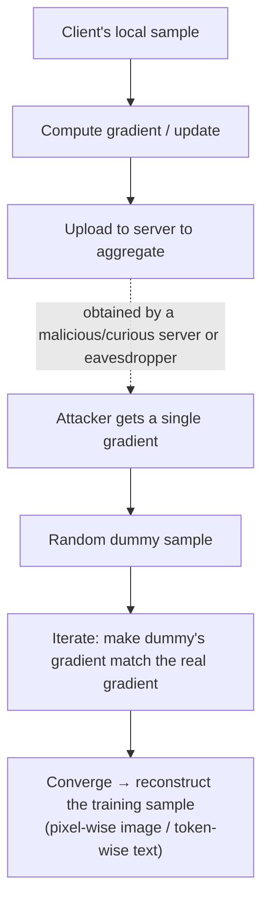

import PrivacyMeta from '@site/src/components/PrivacyMeta';

<PrivacyMeta era="Volume 5 · Frontier and deployment" technique="Federated learning & secure aggregation" audience={['Privacy Engineer', 'ML Engineer', 'Security Engineer']} severity="High" maturity="Research" evidence="Research" />

> In one sentence: federated learning is often described as "share only **gradients / updates**, not raw data, so it's private." But Deep Leakage from Gradients (Zhu et al., NeurIPS 2019) shows that shared gradients can be **inverted back into the original training samples** — pixel-wise for images, token-wise for text, with a core algorithm under 20 lines. Geiping et al. (NeurIPS 2020) went further on **high-resolution images and trained networks**, and broke gradients even **averaged over steps / samples**. Conclusion first: "sharing gradients" ≠ "private"; FL needs **secure aggregation + DP** for a real guarantee — don't read "didn't send raw data" as privacy.

## Mechanism: what happens on my side

In FL, the client sends its locally-computed **gradient / update** to the server to aggregate. A gradient is the derivative of the loss w.r.t. parameters, and it **encodes** information about the sample that produced it. An attacker (a malicious / curious server, or an eavesdropper who can see a single update) who obtains a client's gradient can **solve backward**:

1. Randomly initialize a **dummy sample** (and a dummy label).
2. Run the dummy through forward + backward to get its gradient.
3. **Iteratively optimize the dummy** so its gradient **approaches the observed real gradient**.
4. On convergence, the dummy approximates the **real training sample**.

To be clear about the red line: this isn't the model "leaking on purpose" — it's that **a gradient as a mathematical object constrains the input that produced it**, and enough optimization can **solve** for that input (same logic as model extraction's "output constrains parameters," here "gradient constrains input"). Externally verifiable and reproducible, independent of whether anyone "wants to" leak.



## Threat surface: who can attack, what's reconstructable, and the boundary

**Who can attack**: anyone who can see a **single client's gradient / update** — a malicious or "honest-but-curious" aggregation server, an eavesdropper on the link.

**What's reconstructable**: single or small-batch training samples — images pixel-wise, text token-wise; small batches are especially fragile.

**Amplifying / limiting factors**:

- **Larger batches** are harder to reconstruct, but Geiping et al. show it's **not impossible** — averaging up to a point can still be broken.
- **Late training / trained networks** can also be inverted (Geiping) — not only fragile at random initialization.

**Boundary**: this entry is the leak surface of "shared updates," premised on the attacker getting a **single** client's gradient. Once updates are **securely aggregated** (the server sees only the sum, not individuals) or have **DP noise** added, inversion difficulty spikes — which is exactly its mitigation (see this volume's *Secure aggregation* and [Production-grade DP·FL](./dp-federated-learning.mdx)).

## How the defense works

Two complementary substantive defenses:

- **Secure aggregation**: the server sees **only the aggregate sum, not individual gradients** — inversion loses the "single point" it stands on (see this volume's *Secure aggregation*).
- **Differential privacy**: **clip + add noise** to gradients, bounding single-sample influence within (ε, δ) — with correct clipping, sufficient noise, and re-computable accounting, inversion quality drops sharply; the strength of protection depends on ε/δ, the privacy unit, and the training setup (see [DP fine-tuning](../03-conversational-llms/dp-fine-tuning.mdx) and *Production-grade DP·FL*).

Empirical measures (**larger batch, lower update frequency, gradient compression / sparsification**) **raise** inversion difficulty but are **not a formal guarantee** — Geiping's very title asks "how easy is it to break privacy in FL," and the answer is "easy," so these empirical measures **can't stand alone as a privacy guarantee**. To break it down: "sharing only gradients" carries **zero guarantee**; substantive privacy needs secure aggregation / DP.

## Buildable recipe

```text
1. Default-assume "a single gradient = invertible": design for this threat; don't treat
   "didn't send raw data" as privacy.
2. Add secure aggregation: the server sees only the aggregate sum, not individual
   updates (see this volume's Secure aggregation).
3. Stack DP-FL for sensitive cases: clip + add noise to gradients, report (ε, δ) clearly
   (see Production-grade DP·FL).
4. Don't treat empirical measures as a guarantee: big batch / compression / lower
   frequency only raise difficulty, they don't replace secure aggregation / DP.
5. Run an inversion audit: run gradient-inversion attacks (DLG / Inverting Gradients
   class) against your FL config as a privacy regression, quantifying "how much can be
   reconstructed under your batch / aggregation / DP."
```

Every conclusion is tied to **your model, batch, aggregation, and DP config** — "how big a batch is safe" from a paper doesn't transfer; you must measure with your own inversion audit.

**Minimal testable assertions** (turn inversion risk into a regression check):

- How to test: run gradient inversion (DLG / Inverting Gradients class) against your FL updates, evaluating reconstruction quality under your batch / secure-aggregation / DP config.
- Pass: there's **secure aggregation** (the server can't get individual updates) or **DP** (ε reported clearly), and inversion quality is pushed to **unrecognizable / unusable**.
- Fail: a single update is obtainable and inversion reconstructs **recognizable** samples, or there's no aggregation / DP at all → don't claim "FL so it's private"; add secure aggregation / DP first.

## Research status (engineering feasibility)

(This entry's maturity is "Research": below is **empirical attack** evidence proving "shared gradients ≠ private," not "FL is unusable" — it points to "you must stack secure aggregation / DP.")

- **Reconstructing training data from gradients**: Zhu et al.'s **Deep Leakage from Gradients** (NeurIPS 2019) shows that shared gradients alone can **reconstruct images pixel-wise and match text token-wise**, with the core matching algorithm implementable in under 20 lines of PyTorch — directly falsifying "sharing only gradients is safe."
- **Breaking at high resolution, on trained networks**: Geiping et al.'s **Inverting Gradients** (NeurIPS 2020) uses a **cosine-similarity loss + optimization tricks from adversarial attacks** to faithfully reconstruct on **high-resolution** images and **trained deep networks**, and notes that **privacy is not protected even for gradients averaged over multiple iterations / samples** — directly refuting "just average and it's safe." The title's rhetorical "how easy is it to break privacy" answers: easy.

## Residual risk and trade-offs

Breaking the false security item by item:

- **"Sharing only gradients" carries zero guarantee.** Gradients encode the input; enough optimization reconstructs it; FL privacy rides on secure aggregation / DP, not "didn't send raw data."
- **Big batch / compression only raise difficulty.** They raise inversion cost, but Geiping shows it's not unbreakable — not a formal guarantee.
- **Secure aggregation protects the single point, but with premises.** If parties collude, or honest parties fall below threshold, the aggregation's protection weakens (see *Secure aggregation*'s threat model).
- **DP has a utility cost, and ε must be reported.** Noise suppresses inversion while degrading accuracy; without a clear ε, "added DP" says nothing.
- **Inversion attacks keep getting stronger.** A "big enough batch" today may be broken by a new attack tomorrow — re-audit as attacks advance.

## How this differs from neighboring techniques

- **Gradient leakage vs. secure aggregation (this volume)**: this entry is the **attack** (why you must defend); *Secure aggregation* is the **defense** (the server can't see individual updates). One offense, one defense, read together.
- **Gradient leakage vs. production-grade DP·FL (this volume)**: DP is **another** defense (clip + add noise to bound single-sample influence), **complementary** to secure aggregation — one **hides the single point**, the other **bounds the influence**; often stacked.
- **Gradient leakage vs. membership inference (Volume 1)**: MIA decides "is a sample **in or out**"; gradient inversion directly **reconstructs content**, a stronger leak.
- **Gradient leakage vs. model extraction (Volume 1)**: model extraction steals the **model** (parameters / behavior); this entry steals the **training data** from gradients — opposite objects.

## Version notes

:::note Applicable versions
"Shared gradients can be inverted into training samples" is a **model-independent** mathematical fact (gradients constrain the input). But **how big a batch / which aggregation / how much DP noise suffices** are tightly tied to model structure, data, and attack method — Zhu's (2019, small-batch origins) and Geiping's (2020, high-res / trained nets / breaking averages) conclusions **don't transfer directly** to your setup; you must run an inversion audit against your own FL config. Inversion attacks keep advancing; stamped 2026-06. (Sources verified 2026-06.)
:::

## Further reading and sources

- [Deep Leakage from Gradients (Zhu et al., NeurIPS 2019; arXiv 1906.08935)](https://arxiv.org/abs/1906.08935) — reconstructs images pixel-wise and text token-wise from shared gradients, core algorithm under 20 lines. This entry's primary source (the founding falsification of "shared gradients ≠ private").
- [Inverting Gradients — How easy is it to break privacy in federated learning? (Geiping et al., NeurIPS 2020; arXiv 2003.14053)](https://arxiv.org/abs/2003.14053) — cosine-similarity loss + adversarial optimization, faithful reconstruction on high-resolution images and trained networks, and privacy not protected even when averaging.
