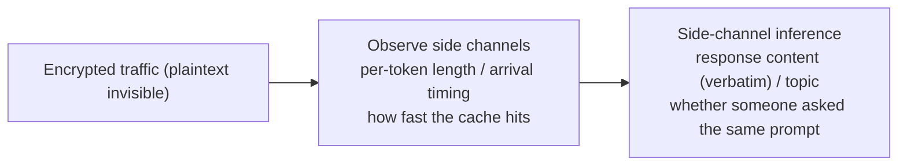

import PrivacyMeta from '@site/src/components/PrivacyMeta';

<PrivacyMeta era="Volume 5 · Frontier and deployment" technique="Inference-service privacy" audience={['Security Engineer', 'Privacy Engineer', 'ML Engineer']} severity="High" maturity="Research" evidence="Research" />

> In one sentence: even with traffic fully encrypted and the model emitting not one extra word, **the system that deploys me** — token-by-token streaming, packets segmented by token length, caches shared across users — is itself a leak channel. Weiss et al. (USENIX Security 2024), **observing only the length of each encrypted streamed token**, reconstructed about **29% of an AI assistant's responses word-for-word and inferred the topic of about 55%** (demonstrated on OpenAI ChatGPT-4 and Microsoft Copilot, over both browser and API traffic; vendors patched after disclosure). Gu et al. (ICML 2025) audited **17 real-world LLM API providers** and found **caching in 8, with global cross-user cache sharing in 7 (including OpenAI)** — an attacker who sees an unusually fast response infers that **another user recently submitted that exact prompt**. Conclusion first: draw the privacy boundary at the **deployment / network / cache layer**, not just the model layer — otherwise you think encryption makes you safe, while timing and length are speaking on your behalf.

## Mechanism: what happens on my side

State the red line first: it's **not "I let something slip"** — I can't introspect "whether I just leaked." What's externally observable and recomputable is that **how I'm deployed determines which side channels a bystander can use to reconstruct content**. Neither path below touches model weights or needs to decrypt the plaintext:

- **Token-by-token streaming + length-based segmentation**: to get characters in front of you sooner, my response is often pushed one token at a time. Even over TLS, **the length of each encrypted packet** still approximates the character length of the corresponding token; hand a sequence of "token lengths" to a language model to guess, and you can reconstruct a large fraction of the original text — exactly Weiss et al.'s attack.
- **Cross-user shared prompt cache**: to save compute, providers cache the result of computing a prompt prefix. If that cache is **globally shared across users**, then "has anyone computed this prompt before" shows up in the **response latency**: a cache hit is noticeably faster. A bystander (even another user) can use timing to infer "someone just asked this" — exactly Gu et al.'s audit finding.

The subject can be "I," but every predicate is something others can measure from outside: packet lengths, arrival timing, time-to-first-token.



## Threat surface: how it's exploited / how you leak

Attacker models (per the measured conditions in the sources — **keep the conditions**, don't extrapolate):

- **Token length to content (Weiss et al., USENIX'24)**: the attacker is a **passive network bystander** who only sees encrypted traffic, doesn't decrypt, and doesn't touch the model. The premise is that responses **stream token-by-token** and that **packet length leaks token length**. Success criterion: measured by about 29% word-for-word reconstruction and about 55% topic inference; demonstrated to hold over browser and API traffic for ChatGPT-4 and Copilot. These numbers are **tied to their tested systems and settings**, not universal constants.
- **Prompt-cache timing to cross-user (Gu et al., ICML'25)**: the attacker needs **only black-box API access + timing**, no logprobs, no privilege. By distinguishing cache hit / miss via the response-latency distribution: auditing 17 providers, **8 had caching detected and 7 shared globally across users (including OpenAI)**. Two consequences — first, an unusually fast response implies "**another user recently submitted this prompt**" (the prompt itself often carries sensitive intent); second, cache timing can also **leak architectural detail** (e.g., implementation differences across some providers).
- **From "detecting" to "reconstructing" (PromptPeek, NDSS 2025)**: a shared cache doesn't just reveal "did someone ask this" — it can be used to **reconstruct another user's prompt token-by-token**. PromptPeek, on multi-tenant serving frameworks like **SGLang** (radix-tree KV-cache + longest-prefix-match scheduling), uses cache hit / miss timing to **recover another user's prompt token-by-token**: up to about **99%** when the prompt template is known, and about **95%** with no background knowledge (⚠️ tied to its tested framework and settings, not to be extrapolated). It pushes the prompt-cache side channel from "leaking metadata (did someone ask)" to "**leaking the plaintext (what they asked)**" — making cross-user KV-cache sharing a heavier liability.
- **Same family, not covered here**: the accept / reject rhythm of speculative decoding, and GPU/CPU hardware-cache contention, are in principle also inference-time side channels; this entry focuses only on **timing and prompt caching**, the two channels with first-party empirical research, and treats the rest as further reading without endorsing them.

## How the defense works

The defense relies on **erasing the correlation between the side channel and the plaintext**, along two lines, each protecting only one segment:

- **Mask token length** (against the length attack): do **padding / batching** at the streaming layer — pad packets to a fixed length, or batch several tokens before sending, so packet length no longer maps one-to-one to token length. The cost is **latency or bandwidth**: the more uniformly you pad or the larger you batch, the safer but slower / more bandwidth-hungry. This is exactly the line vendors patched along after Weiss's disclosure.
- **Isolate the prompt cache** (against cache timing): **isolate the cache per user**, or **disable cross-user sharing**, so "whether someone else computed it" can't show up in your latency; or accept cross-user sharing but **fix / flatten the timing** (hits and misses take the same latency) to remove distinguishability. The cost is reduced cache benefit.

To break down the boundary: both **live at the deployment / network layer, beyond the model's reach** — so **writing "don't leak timing" into the prompt is meaningless**. And it's a **back-and-forth tug-of-war**: padding and flattening timing buy safety at the cost of performance, the patch a vendor ships is tied to its implementation at that moment, and a new streaming optimization can open a new channel. Don't treat "some vendor already fixed it" as "this class of problem is over."

## Buildable recipe

```text
1. Length side (streamed output): pad or batch on the response stream so encrypted packet
   length no longer leaks single-token length — fix a packet size, or flush every N tokens.
   Load-test latency / bandwidth regression and pick an acceptable tier.
2. Cache side (prompt cache): scope cache keys per user / tenant (see the key-scoping in
   "Cross-session memory bleed"), or explicitly disable cross-user sharing; if you must
   share, flatten the timing of hits vs. misses.
3. Timing baseline: run a Gu-et-al.-style timing audit on your own inference service —
   compare the time-to-first-token distribution of "cached vs. cold" prompts, and quantify
   how distinguishable they are.
4. Threat register: explicitly register "token-by-token streaming + global cache" as a
   side-channel surface in your threat model and change reviews; re-test on every streaming
   / cache change, and don't assume last time's patch still holds.
```

Every step is tied to your own deployment: until you've quantified **whether you stream token-by-token, whether the cache is shared across users, and how much extra latency you can tolerate**, the defense is just a slogan.

**Minimal testable assertions** (turn the side channel into a regression check):

- How to test: (1) Length — record the encrypted packet-length sequence of your own streamed responses, and assert its correlation with the underlying token lengths has been squashed below a threshold by padding / batching; (2) Cache — run the same prompt "cold / warm" twice, take the time-to-first-token distributions, and assert the two are indistinguishable (or that the cache is already per-user isolated).
- Pass: the packet-length sequence has no significant correlation with token length, or the latency distributions of cache hit and miss overlap within the set threshold — the side channel is unusable.
- Fail: packet length is still readable token-by-token, or cold/warm latency is significantly separable → don't claim "encrypted therefore safe"; go back to the streaming / cache layer and add padding or isolation.

## Real cases / engineering status (research demonstrations)

(This entry's maturity is "Research": both are **empirical demonstrations from first-party academic research**, not an endorsement that "some product is now fully immune." Vendors have patched the **specific disclosed channels**, but the cat-and-mouse continues.)

- **Remote keylogging-style attack (Weiss et al., USENIX Security 2024)**: **observing only the length of each streamed encrypted token**, reconstructs about **29%** of an AI assistant's responses word-for-word and infers the topic of about **55%**. Demonstrated to hold over the browser and API traffic of **OpenAI ChatGPT-4 and Microsoft Copilot**; the relevant vendors patched after disclosure. The reconstruction rates are tied to their tested systems and streaming settings, and **don't transfer** to a different deployment.
- **Auditing prompt caching (Gu et al., ICML 2025, PMLR v267)**: a timing audit of **17 real-world LLM API providers** found **caching in 8, of which 7 share globally across users (including OpenAI)**. That means an attacker can infer from an unusually fast response that "another user recently submitted the same prompt"; the paper also notes timing can leak architecture-level implementation detail. It's empirical evidence that "a shared cache introduced for performance = a cross-user timing side channel."
- **Reconstructing another user's prompt (PromptPeek, NDSS 2025)**: *I Know What You Asked*, on **SGLang** multi-tenant serving (radix-tree KV-cache + longest-prefix match), uses cache hit / miss timing to **recover another user's prompt token-by-token**, holding across three scenarios of differing prior knowledge — up to about **99%** with a known template, about **95%** with no background knowledge (⚠️ tied to its tested framework / settings). It upgrades Gu et al.'s "detecting reuse" to "**reconstructing the plaintext**," first-party evidence for the heavier consequence of a shared KV-cache side channel.
- **Same-family corroboration**: this theme already has [Confidential inference and trusted execution environments](./confidential-inference.mdx) discussing that inference under a TEE is still subject to **side channels** — encryption / the enclave protect plaintext and weights, while **metadata channels like timing / length / cache still need separate defenses** — which mutually corroborates this entry.

## Residual risk and trade-offs

Breaking the false security item by item:

- **Encryption ≠ side-channel-proof.** TLS keeps the plaintext unreadable; packet **length and arrival timing** are still out in the open. Believing "we have HTTPS so we're safe" is exactly this entry's textbook false security.
- **The numbers are tied to the tested setup and don't transfer.** About 29% / 55% were measured by Weiss et al. on their specific systems and specific streaming implementation; with a different tokenization, segmentation, or batching strategy your reconstruction rate could be higher or lower — you **must test on your own stack**, not cite a single optimistic or pessimistic number.
- **The cache privacy / performance trade-off is real.** A cross-user shared cache saves money and compute but inherently creates a cross-user timing channel; isolating it or flattening timing is more private but sacrifices cache benefit. It's an engineering trade-off, not a free lunch.
- **"Already patched" is a point-in-time snapshot.** Vendors patch the **specific disclosed channel**; a new streaming / decoding / cache optimization may introduce a new one. This is a continuous cat-and-mouse — treat it as a one-off fix and you'll step in it again.
- **Third-party inference you can't fully test.** With a managed API, you can only require + spot-check the provider's padding / cache isolation (e.g., do an external timing audit as Gu et al. did), not fully control it.

## How this differs from neighboring techniques

- **Inference-time side channels vs. [Inference-service data boundary](../06-governance-compliance/inference-service-data-boundary.mdx) (Volume 6)**: that one is about you **trusting the provider and caring how much it retains / trains on your data** (the trust and compliance layer); this entry **does not assume the provider is malicious** — the leak comes from the timing / length side channels of the deployment shape itself (the deployment / network layer), usable by a passive bystander.
- **Inference-time side channels vs. [Cross-session memory bleed](../04-rag-agents/cross-session-memory-bleed.mdx) (Volume 4)**: that one is misrouted cache / memory **data** that **directly drags someone else's content into** your context (the data is delivered to the wrong user); this entry infers from a **timing** side path and doesn't directly obtain the plaintext. The two are related at **cross-user shared prompt caching** — in one shared cache, misrouting bleeds data and timing leaks timing, so they're often audited together.
- **Inference-time side channels vs. [Context-surface privacy](../03-conversational-llms/context-surface-privacy.mdx) (Volume 3)**: that one is content in the context window being **extracted by prompting** (the interaction layer, adversary is a conversing end user); here the adversary **doesn't even need to converse** — they just watch the network or measure timing (the deployment layer).

## Version notes

:::note Applicable versions
"Beyond encryption, streamed token length and prompt-cache timing are still side channels" is a vendor-independent **deployment-time fact** (the root cause is token-by-token streaming + length-based segmentation + cross-user cache reuse). But **two things change with version**: (1) after Weiss et al.'s disclosure, the relevant vendors patched the token-length channel, and the **~29% / ~55% reconstruction rates are tied to their tested systems at that time**, not the current state of any deployment today; (2) Gu et al.'s "8/17 have caching, 7 share across users" is a **2025 snapshot**, and providers can adjust their cache policies at any time. The cat-and-mouse is dynamic — padding / isolation can be reopened by a new streaming / decoding optimization, so re-test continuously on your own deployment. Stamped 2026-06. (Sources verified 2026-06.)
:::

## Further reading and sources

> Primary: Research (two first-party academic papers).

- [What Was Your Prompt? A Remote Keylogging Attack on AI Assistants (Weiss et al., USENIX Security 2024)](https://www.usenix.org/conference/usenixsecurity24/presentation/weiss) — from the length sequence of encrypted streamed tokens alone, reconstructs about 29% of responses word-for-word and infers the topic of about 55% (ChatGPT-4 / Copilot); this entry's primary evidence on the length side.
- [Auditing Prompt Caching in Language Model APIs (Gu et al., ICML 2025, PMLR v267)](https://proceedings.mlr.press/v267/gu25b.html) — a timing audit of 17 providers, 8 with caching and 7 sharing globally across users (including OpenAI), where a fast response exposes "someone asked the same prompt"; this entry's primary evidence on the cache side.
- [I Know What You Asked: Prompt Leakage via KV-Cache Sharing in Multi-Tenant LLM Serving (PromptPeek, NDSS 2025)](https://www.ndss-symposium.org/ndss-paper/i-know-what-you-asked-prompt-leakage-via-kv-cache-sharing-in-multi-tenant-llm-serving/) — pushes the cache side channel from "detecting reuse" to "reconstructing the plaintext token-by-token": recovering another user's prompt on the SGLang multi-tenant framework, ~99% with a known template, ~95% without background (tied to its settings). This entry's first-party evidence for KV-cache reconstruction.
