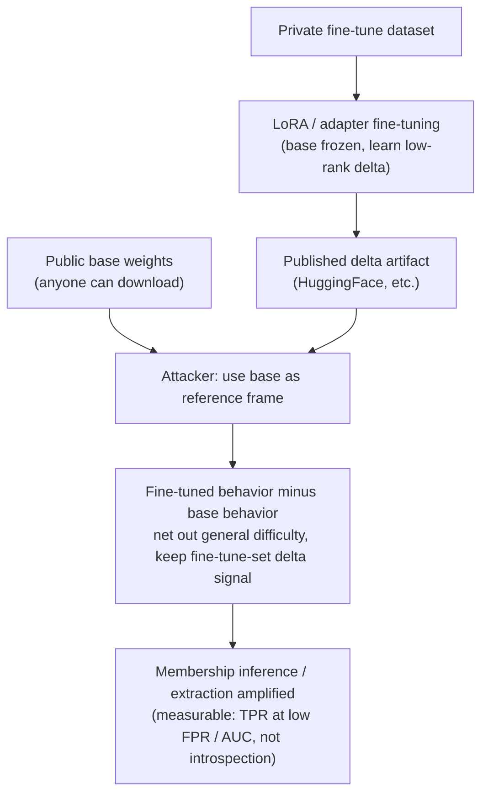

import PrivacyMeta from '@site/src/components/PrivacyMeta';

<PrivacyMeta era="Vol. 5 · Frontier & Deployment" technique="Inference Attacks" audience={['Privacy Engineer', 'ML Engineer', 'Security Engineer']} severity="Medium" maturity="Research" evidence="Research-backed" />

> In one sentence: you fine-tune with LoRA / an adapter on **private data**, then publish that delta to HuggingFace, reasoning "the base is public and I only shipped a tiny diff, so my data is safe." That comfort is false — **the published delta is exactly where the fine-tuning signal is concentrated**: the difference between the base and the fine-tuned model is itself the **fingerprint of the fine-tune data**. An attacker who holds your adapter **and** that public base can use the public base as a **reference frame** and run **membership inference / extraction** amplified by the delta. LoRA-Leak (arXiv 2507.18302, ⚠️preprint) measures it: even under conservative fine-tuning settings, membership inference still reaches **0.775 AUC**, and "use the public pre-trained model as a reference" is precisely the move that prior MIAs neglected yet that amplifies leakage. Bottom line up front: **"the delta is small / the base is public" is not privacy — the public base is a free reference in the attacker's hands that raises your members' distinguishability.**

## The Mechanism: What Happens on My Side

Parameter-efficient fine-tuning (LoRA / adapter) trains only a small set of added parameters: the base is frozen, and what you learn is a low-rank delta that, added on top, produces the fine-tuned me. When you publish, you usually ship only that delta (tens of MB), with the base pointing at some public weights. Intuitively "small delta = small exposure."

But from a privacy standpoint, this delta is **not** an "inconsequential small change" — it is **the slice of parameter change born to fit your fine-tune set**, and it **concentrates** the traces of the training data in one place. More importantly, the attacker now has an extra thing: the **public base**. With the base as a **reference frame**, the attacker can **subtract** "the fine-tuned model's behavior on a given sample" from "the base's behavior on the same sample" — the base's "general difficulty" over all text is netted out, and in the remaining delta signal, **members of your fine-tune set** show a steeper signal. This is exactly the move LoRA-Leak points out and prior MIAs neglected: **using the pre-trained model as a reference can induce more information leakage than looking at the fine-tuned model alone** (Ran et al., 2025, ⚠️preprint).

Let me be clear about the first-person red line (write the mechanism as externally observable, not as self-introspection): I don't write "I remember the fine-tune data in the adapter" / "I know which samples are in my fine-tune set" — those are self-reports I can't reliably introspect. What's externally observable and recomputable is: **the published delta is an externally obtainable artifact; whether an attacker can distinguish fine-tune-set members using "base + delta" is a membership inference success rate measurable under stated conditions (e.g., TPR at low FPR, or AUC — with the base, adapter rank, dataset, and whether the attacker holds the reference base)** — this is a measurement of an attack run against an artifact, **not** any self-report by me about "what I remember."



## Threat Surface: Attacker Model and Distinguishability

State the attacker model clearly (matching this theme's "classification checklist"):

- **What the attacker holds**: your published **adapter / LoRA delta**, **plus** that public **base** (a LoRA adapter must be paired with its base to be used at all, so "the attacker has the base" is a **built-in premise** of this class of artifact, not an extra assumption). Reference-based MIA typically needs the ability to compute per-sample loss / likelihood on the model (white-box, or the ability to obtain logprobs).
- **What the attacker wants**: to decide whether a given sample **is or is not** in your private fine-tune set (membership inference, one bit — see [Membership Inference Attacks](../01-foundations/membership-inference.mdx)), and further to attempt **verbatim extraction** on highly repeated / rare fragments.
- **The role of the public base (the crux of this entry)**: the base is a **free reference**. LoRA-Leak's core increment is precisely those **five improved MIAs that leverage the pre-trained model as a reference** — beyond its ten existing MIAs, it uses the "base vs fine-tuned" difference to lift the membership signal out; empirically, even under **conservative fine-tuning settings**, membership inference still reaches **0.775 AUC** (Ran et al., 2025, ⚠️preprint; across three language models and three NLP tasks; the number shifts with base / rank / dataset / fine-tuning steps — do not port it as your own).

**Measurement caliber (don't be fooled by the average)**: as with MIA generally, look at the **true positive rate (TPR) at low false positive rates (e.g., 0.1% / 1% FPR)** to gauge whether individual members can be picked out *with confidence*; don't report only average accuracy or a single AUC — averages wash out the real risk that "tail samples get identified with high confidence" (rationale via LiRA in [Membership Inference Attacks](../01-foundations/membership-inference.mdx)).

**A nastier variant (supply-chain side, must be kept separate from passive reference)**: if the attacker is not passively grabbing a public base but **actively publishing a tampered base** and luring you to fine-tune on it, the leakage is amplified further — PreCurious (CCS 2024) shows: an attacker who **releases the pre-trained model and only needs black-box access to the fine-tuned model** can **simultaneously amplify both membership inference and data extraction** on the fine-tune set (Liu et al., 2024). Note the boundary: **LoRA-Leak uses an honest public base as a passive reference; PreCurious is an active supply-chain variant where the attacker carefully crafts the base** — different mechanisms, different threat premises, don't conflate them (the "defenses" and "case" sections below treat them separately).

## How the Defense Works

The root of this threat is "**the delta concentrates the fine-tuning signal + the public base provides a reference**," so a defense must either **weaken the membership signal in the delta** or **not hand over that reference / artifact**:

- **Assess the adapter's leakability before publishing**: treat "publishing the delta" as a privacy event, and **before publishing**, run a reference-based MIA audit against "base + delta," quantify member distinguishability, and set a threshold (recipe below). This doesn't change the mechanism, but it lets you decide **with numbers** whether to publish, and which checkpoint.
- **DP fine-tuning gives a formal upper bound**: use differentially private fine-tuning (DP-SGD: per-sample clipping + noise) to bound **any single sample's influence on the parameters** within an (ε, δ) upper bound, thereby **upper-bounding** the advantage of "distinguishing whether a sample is in the fine-tune set" — this is the **formal** mitigation of this entry's MIA (see [DP Fine-tuning](../03-conversational-llms/dp-fine-tuning.mdx)). Point out the boundary: ε is not zero, there is a utility cost, and parameter-efficiency (LoRA) by itself is **not** privacy — only clipping + noise + privacy accounting + a privacy unit together constitute DP.
- **Restrict release / private hosting**: when leakability is too high yet sensitive data must be used for fine-tuning, **do not publish the delta openly** — host it privately, expose only an inference endpoint, authorize on demand. If the attacker can't get the artifact, this reference-based amplification has nowhere to start (but an inference endpoint still has a black-box MIA surface, see Membership Inference Attacks).
- **Fine-tune-side mitigations (the two that LoRA-Leak measured as effective)**: LoRA-Leak evaluated four defenses and found that **only dropout and "excluding specific LM layers during fine-tuning"** reduce MIA risk while **preserving utility** (Ran et al., 2025, ⚠️preprint); the rest either lose too much utility or don't defend. These empirical measures **weaken the signal but give no formal guarantee**, and should be kept separate from DP: **dropout / layer exclusion "make the signal weaker," DP "caps the signal."**
- **Don't count on "merging into the base" to erase the fingerprint**: merging LoRA into the base to get a full weight set only changes the artifact's form — **the parameter imprint of the fine-tune data remains**, and the attacker can still use an **independently obtained original public base** as a reference to take the difference. Merging ≠ erasure (details in "Residual Risks").

## Implementation (Recipe: Member-Distinguishability Audit Before Publishing a LoRA)

Upgrade "publishing an adapter" from "upload and done" to "a publishing decision with an audit threshold":

```text
1. Assemble three items: your adapter delta, the matching public base, and a held-out set of
   samples "definitely in the fine-tune set" (members) and "definitely not" (non-members)
   (non-members must be same-distribution, same-preprocessing — don't introduce a distribution shortcut).
2. Build two models: the base alone (reference), and base+delta merged as the fine-tuned one (target).
3. Run reference-based per-sample MIA: for each sample, compute loss/likelihood on target and reference,
   take the difference (or likelihood ratio) as the membership score — this is the core of "use the public
   base as a reference"; if you can, compare multiple scorers.
4. Report with the right caliber: draw the ROC, read TPR at low FPR (0.1% / 1%), don't report only average AUC;
   for highly repeated/rare fragments, run a verbatim-extraction probe (how much original text can be forced
   out of the member set).
5. Set threshold + decide: distinguishability above your set threshold → don't publish openly. Order optional
   mitigations by cost: try dropout / excluding specific layers first (LoRA-Leak measured them as utility-preserving),
   DP fine-tuning on sensitive data (report ε, δ, privacy unit clearly); still over threshold → private hosting /
   inference endpoint only. Archive each decision alongside the numbers.
```

Every number (AUC, low-FPR bucket, threshold) must carry **your own base, adapter rank, dataset, and fine-tuning steps** — LoRA-Leak's 0.775 AUC is bound to its experimental setup and cannot be ported directly as your threshold.

**Minimal testable assertion** (fold "publishing an adapter" into a regressible check in CI / the release pipeline):

- How to test: in the release pipeline, run a reference-based MIA audit against "base + delta to be published," report TPR at low FPR (0.1% / 1%) and overall AUC, and run one verbatim-extraction probe against the member set.
- Pass: at low FPR, TPR is near the random baseline (≈ FPR) and AUC is near 0.5, and the verbatim-extraction probe pulls out no recognizable original text; if DP is used, (ε, δ) can be independently recomputed and the privacy unit matches the object to be protected.
- Fail: at low FPR, TPR is significantly above baseline, or AUC is clearly above 0.5, or original text can be extracted → judged "the adapter can leak the fine-tune set"; go back and add dropout / layer exclusion / DP, or switch to private hosting; don't publish openly.

## Research Progress and Engineering Feasibility (The Reality of Publishing LoRAs / Adapters)

(This entry is marked maturity "Research": the following is **research-progress and engineering-feasibility** evidence pointing to "audit before publishing the delta of a private fine-tune," **not** an endorsement that "large-scale in-the-wild leakage incidents already exist." Every preprint result is flagged ⚠️ and conditioned.)

**Deployment reality (why this matters)**: model hubs like HuggingFace are **full of shared LoRAs / adapters** — many teams routinely publish deltas fine-tuned on private data, defaulting to "it's just a small diff on a public base, my data is safe." That default comfort is exactly what this entry breaks.

**LoRA-Leak (Ran et al., arXiv 2507.18302, 2025-07; ⚠️preprint, primary source of this entry)**: a holistic MIA evaluation framework against language-model fine-tune sets, comprising **fifteen MIAs (ten existing + five improved)**, where the improved ones' key is **using the public pre-trained model as a reference** — precisely the move prior MIAs neglected yet that amplifies leakage. Core conclusion: **LoRA tuning only a small fraction of parameters does not mean the fine-tune data is immune to MIA**; even under **conservative fine-tuning settings**, membership inference reaches **0.775 AUC** (across three language models and three NLP tasks). On the defense side: of four evaluated, **only dropout and excluding specific LM layers** reduce risk while preserving utility. ⚠️ Preprint, no formal publication found; numbers bound to its experimental setup, must be re-tested for your setting.

**PreCurious (Liu et al., CCS 2024; peer-reviewed, supply-chain variant)**: upgrades the "public base" from a **passive reference** to an **active attack surface** — an attacker who **releases a pre-trained model and only has black-box access to the fine-tuned model** can **simultaneously amplify both membership inference and data extraction** on the fine-tune set; the method is to manipulate the memorization stage of the pre-trained model and then guide fine-tuning with a seemingly legitimate configuration. This comes from **a top-venue first-hand empirical study** (ACM CCS 2024) and is strong evidence that "the publish/adopt-the-base link is itself a privacy attack surface." Usage boundary (reiterated): it is an **attacker-crafts-the-base** active path, and **cannot** be extrapolated to "honest public base + honest fine-tuning would be extracted this way" — that part belongs to LoRA-Leak's passive-reference conclusion.

**Adjacent comparison (Wen et al., arXiv 2310.11397, 2023; ⚠️preprint)**: compares the robustness of LoRA / soft prompt tuning / in-context learning under MIA, backdoor, and model stealing, using a **black-box** threat model with a loss-based MIA. Its relative conclusion (different fine-tuning paradigms have different vulnerability) shows "LoRA's leakage surface must be viewed bound to its specific setting," and can serve as a mechanism reference; ⚠️ preprint, and its caliber differs from LoRA-Leak (black-box vs reference-based), so don't swap numbers with the primary source.

Together the three point at the same thing: **"publishing the delta of a private fine-tune" is a privacy event that needs auditing — the public base can be used by an attacker as a passive reference to amplify membership inference (LoRA-Leak), or may itself be a crafted attack surface (PreCurious); "small delta / public base" was never a privacy guarantee.**

## Residual Risks and Trade-offs

Puncture the false security one by one:

- **"The delta is small / the base is public, so my data is safe" is wrong.** The delta is exactly what **concentrates** the fine-tuning signal, and the public base is a **free reference** in the attacker's hands — together they are an **amplifier**, not a barrier. LoRA-Leak still reaches 0.775 AUC under conservative settings (⚠️preprint, bound to its setup).
- **"Parameter-efficient = privacy" is a confusion.** LoRA / adapter is merely a **compute-saving vehicle**, not a privacy technique. Only clipping + noise + privacy accounting + a privacy unit together constitute DP (see DP Fine-tuning); without these, "using LoRA" has nothing to do with privacy.
- **DP works, but has a cost.** DP fine-tuning gives an (ε, δ) upper bound on the "distinguish membership" advantage, **but ε is not zero** (it "limits leakage," not "zero leakage"), and tightening ε loses utility — an explicit trade-off, not free security.
- **Merging into the base ≠ erasing the fingerprint.** Merging LoRA into a full weight set only changes the artifact's form; the fine-tune data's parameter imprint remains, and the attacker can still use an **independently obtained original public base** as a reference to take the difference. To truly eliminate single-sample influence requires machine unlearning / retraining (see [Machine Unlearning](./machine-unlearning.mdx)), and the unlearning itself must be verifiable (see [Unlearning Verification](./unlearning-verification.mdx)).
- **Dropout / layer exclusion "weaken," not "cap."** In LoRA-Leak these two reduced risk while preserving utility, but they are **empirical measures with no formal guarantee**; for highly sensitive data, don't use them to replace DP's formal upper bound.
- **Private hosting moves the artifact surface, not the black-box surface.** Not publishing the delta blocks the "use the artifact as a reference" path; but as long as an inference endpoint is open, ordinary black-box MIA still holds (see Membership Inference Attacks).
- **Magnitudes are bound to the experimental setup.** "0.775 AUC / conservative settings / three models three tasks" and "dropout·layer exclusion effective" come from LoRA-Leak's setup (⚠️preprint), and PreCurious's amplification comes from its CCS'24 setup — none can be ported directly to your base, rank, and data; landing must be self-tested.

## Compliance Mapping

- **GDPR**: "whether a person is in a given fine-tune set" can identify an individual and is personal data; **publicly releasing** an adapter from which membership can be inferred with high confidence is equivalent to leaking personal data via the published artifact, touching minimization, purpose limitation, and security obligations. The pre-publication member-distinguishability audit is one link in the "technical measures taken" argument.
- **Anonymization threshold**: if membership of the fine-tune set can be inferred with high confidence from your published delta, any claim of "de-identified / anonymized" does not hold (consistent with GDPR's high bar for "truly anonymous data") — MIA is the touchstone that tests it.
- **OWASP LLM02:2025**: sensitive information disclosure includes the facet of "the model / published artifact lets outsiders infer training membership"; a public adapter is one concrete carrier of this.

(Compliance evolves with statute / framework versions; this section is stamped 2026-07, verify against the latest text in force before citing.)

## Distinction from Adjacent Techniques

- **This entry vs [DP Fine-tuning](../03-conversational-llms/dp-fine-tuning.mdx) (Vol. 3)**: that one is a **defense** (DP training bounds single-sample influence); this one is an **attack** — the attacker uses **your published adapter** for reference-based membership inference / extraction. DP fine-tuning is precisely this entry's **primary mitigation** (caps the MIA advantage), hence the cross-link.
- **This entry vs [Membership Inference Attacks](../01-foundations/membership-inference.mdx) (Vol. 1)**: that one is the **general foundation** of MIA (the behavioral gap between members / non-members); this one is its **specific amplification via a shared artifact (delta + public base)** in the LoRA setting — the increment is the "public base as reference" move, plus the supply-chain premise that "you publish the delta yourself."
- **This entry vs [Fine-tuning-as-a-Service Privacy](../06-governance-compliance/ftaas-privacy.mdx) (Vol. 6)**: that one is the **vendor-API-side** data boundary and alignment erosion (you hand data to the vendor, where the data goes on the vendor side); this one is the **open-weights supply-chain** side — **you yourself publish the delta**, and the artifact lands in the attacker's hands. One is "how the vendor handles data after you hand it over," the other is "a derived artifact you actively make public."

## Version Notes

:::note Applicable Versions
"A public base as a reference can amplify membership inference on a LoRA / adapter fine-tune set" is currently supported mainly by **LoRA-Leak (arXiv 2507.18302, 2025-07, ⚠️preprint, no formal publication found)** — its "0.775 AUC / conservative settings" and "dropout and excluding specific LM layers effective" are bound to its three-model, three-task experimental setup, **cannot be ported directly**, and must be re-tested with your own base, adapter rank, dataset, and fine-tuning steps. The supply-chain variant (an attacker actively crafts the base to amplify MIA + extraction) has first-hand empirical support in **PreCurious (CCS 2024, peer-reviewed)**, but that is an **attacker-crafts-the-base** active path — don't mix it with "honest public base + passive reference." The adjacent comparison **Wen et al. (arXiv 2310.11397, ⚠️preprint)** uses a black-box caliber and doesn't swap numbers with the primary source. This attack/defense evolves with parameter-efficient fine-tuning and MIA methods; this section is stamped 2026-07. (Sources verified 2026-07.)
:::

## Further Reading and Sources

Evidence is mixed — **primary: research-backed** (LoRA-Leak, ⚠️preprint, the primary source of this entry's passive-reference amplification); **supplementary: peer-reviewed first-hand empirical study** (PreCurious, CCS 2024, the active supply-chain variant). All quantitative numbers are bound to their respective experimental setups; landing must be self-tested.

- [LoRA-Leak: Membership Inference Attacks Against LoRA Fine-tuned Language Models (Ran et al., arXiv 2507.18302, 2025-07; ⚠️preprint)](https://arxiv.org/abs/2507.18302) —— primary source of this entry: comprises fifteen MIAs (ten existing + five improved that use the **public pre-trained model as a reference**), revealing "LoRA tuning few parameters ≠ the fine-tune data is immune to MIA"; under conservative settings, membership inference reaches **0.775 AUC** (three models, three tasks); of four defenses, only **dropout and excluding specific LM layers** reduce risk while preserving utility. ⚠️ Preprint, numbers bound to its experimental setup.
- [PreCurious: How Innocent Pre-Trained Language Models Turn into Privacy Traps (Liu et al., ACM CCS 2024; DOI 10.1145/3658644.3690279)](https://dl.acm.org/doi/10.1145/3658644.3690279) —— peer-reviewed first-hand empirical study (supply-chain variant): an attacker who **releases the pre-trained model and only has black-box access to the fine-tuned model** can **simultaneously amplify both membership inference and data extraction** on the fine-tune set. Used as strong evidence that "the publish/adopt-the-base link is itself a privacy attack surface"; **not** extrapolated to "honest base + honest fine-tuning is also extracted this way."
- [Last One Standing: A Comparative Analysis of Security and Privacy of Soft Prompt Tuning, LoRA, and In-Context Learning (Wen et al., arXiv 2310.11397, 2023; ⚠️preprint)](https://arxiv.org/abs/2310.11397) —— adjacent comparison: under a black-box, loss-based MIA it compares the robustness of LoRA / soft prompt tuning / in-context learning, showing "LoRA's leakage surface must be viewed bound to its specific setting." ⚠️ Preprint, its caliber (black-box) differs from the primary source (reference-based), so don't swap numbers.
