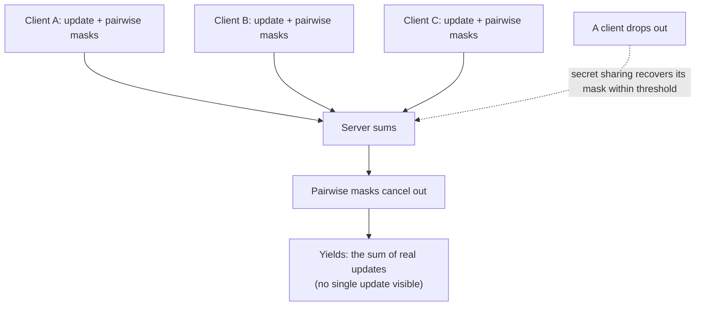

import PrivacyMeta from '@site/src/components/PrivacyMeta';

<PrivacyMeta era="Volume 5 · Frontier and deployment" technique="Federated learning & secure aggregation" audience={['Privacy Engineer', 'ML Engineer', 'Security Engineer']} severity="Medium" maturity="Production" evidence="Research" />

> In one sentence: [Gradient leakage](./gradient-leakage.mdx) shows "sharing only a single update" gets inverted. Secure aggregation (Bonawitz et al., ACM CCS 2017) is the direct defense: use secure multiparty computation so the server **can compute only "the sum of all clients' updates," never any single update** — the single point is hidden, and inversion loses what it stands on. It's **communication-efficient and robust to client dropout**, and is already used in Google's production FL (Bonawitz et al., MLSys 2019: keeping individual device updates encrypted even in data-center memory). Conclusion first: secure aggregation downgrades "the server is trusted" to "the server only sees the aggregate sum"; but it's **not a cure-all** — it defends against "seeing a single update," not "the aggregate sum itself leaking" or "parties colluding," so still pair it with DP.

## Mechanism: what happens on my side

:::caution Cryptographic details paraphrased from the paper
The masking / secret-sharing / threshold below is paraphrased from Bonawitz et al. (CCS 2017); **the actual security binds to its threat model and threshold assumptions**, so defer to the **original protocol and your implementation** — don't implement cryptography from this section.
:::

Intuition: have each client add a layer of **random masks that cancel pairwise** on top of its update.

- Each **pair** of clients agrees on a **shared random mask**, one adds it, the other subtracts it.
- Each client uploads its update **plus the sum of its pairwise masks with all other clients**.
- When the server **sums** all uploads, the pairwise masks **cancel out**, yielding exactly the **sum of real updates**; while any **single** upload is masked into "looks random," so the server can't read it individually.

To handle client **dropout** (a dropped client's mask has no one to cancel it, so the sum is wrong), the protocol uses **secret sharing** to let online parties **recover** a dropped client's mask terms within a threshold. To be clear about the red line: this is a guarantee a **cryptographic protocol** gives within its threat model — **not a "model guarantee."** It's not "I promise not to look"; the server mathematically **cannot get** a single update.



## Threat surface: what it defends, what it doesn't

**Defends**:

- **An honest-but-curious server** seeing a **single** update — the premise of gradient inversion (getting the single point) is cut.
- **Data-center insider threat**: individual device updates stay encrypted even in memory (MLSys 2019 uses it as a privacy enhancement against additional in-data-center threats).

**Doesn't defend** (must be stated, or it's false security):

- **The aggregate sum itself** may leak information: too few participants, or differencing across rounds, can still infer individuals — secure aggregation **hides the single point, doesn't bound single-sample influence on the sum** (that needs DP).
- **Enough colluding parties** can recover a target's update — security binds to a **threshold assumption**.
- **A malicious server's active attacks** (isolating a target, Sybil-forging many fake clients) need **extra assumptions / defenses**.

**Boundary**: secure aggregation hides the "single point," it doesn't replace DP's "bounding influence"; they're orthogonal and often **stacked** in production.

## How the defense works

The core is **additive masking from secure multiparty computation**: pairwise masks cancel on summation, each upload is randomized, so the "sum" is computable while "individuals" are invisible; **secret sharing** keeps the sum correct within a dropout threshold (failing it either corrupts the sum or weakens security). It upgrades the trust assumption from "**the server doesn't look**" (good behavior) to "**the server can't see individuals**" (cryptographically enforced) — a qualitative difference.

To break it down: **secure aggregation ≠ DP**. It **hides the single point, adds no noise**; the aggregate sum can still leak across rounds or in small groups, so production often **stacks secure aggregation + DP** (see [Production-grade DP·FL](./dp-federated-learning.mdx)). Treating secure aggregation as "have it and you're private" is the false security this entry breaks.

## Buildable recipe

```text
1. Use a mature implementation, don't roll your own crypto: masking / secret-sharing /
   threshold details are very easy to get wrong.
2. The threshold isn't one magic number — set four things separately: the privacy
   threshold (how many must collude to break), dropout tolerance (how many dropouts
   still recover), the minimum participant count, and the server/client collusion
   model (does it defend an actively malicious server or not) — these parameters
   aren't synonymous across secure-aggregation variants; tune to your participation
   scale and dropout rate, don't use defaults.
3. Stack DP: secure aggregation hides the single point + DP bounds single-sample
   influence = complementary; sensitive cases need both (report ε clearly).
4. Mind participant count and per-round sampling: too few participants / too small a
   sample → the aggregate sum is information-rich and the single point is easier to infer.
5. Audit two things: (1) the server implementation really can't get individual updates;
   (2) run gradient inversion + collusion analysis on your setup, confirming a single
   update isn't recoverable within the threshold assumption. Note: runtime auditing
   only shows the implementation doesn't visibly expose single updates — it doesn't
   substitute for cryptographic security, which still rests on the protocol proof,
   a mature implementation, and parameter review.
```

Every parameter is tied to **your participation scale, dropout rate, and threat model** — copying paper thresholds / sampling will mismatch.

**Minimal testable assertions** (turn the guarantee into a regression / audit check):

- How to test: verify the server actually receives the **aggregate sum**, not single updates; and run collusion / inversion analysis within the threshold assumption.
- Pass: a single update is **cryptographically invisible** to the server; threshold / dropout parameters match your scale; sensitive cases **stack DP** (ε reported clearly).
- Fail: the server can get single updates, the threshold lets **a few colluders break it**, or you **treat secure aggregation as DP** (no noise yet claiming "bounded influence") → fix per the recipe.

## Real case / production deployment

(This entry's maturity is "Production": secure aggregation has **real production-deployment** evidence; below covers both the protocol and the deployment.)

- **Protocol foundation**: Bonawitz et al. (ACM CCS 2017) give a **communication-efficient, dropout-robust** secure-aggregation protocol — the server can compute the sum of high-dimensional vectors while **learning no individual user's contribution**, designed exactly for aggregating model updates in federated learning.
- **Production deployment**: Bonawitz et al. (MLSys 2019) incorporate secure aggregation into **Google's scalable production FL system design** as a privacy enhancement, keeping **individual device updates encrypted even in data-center memory** (against additional in-data-center threats), deployed in mobile settings like Gboard. Production FL often **uses secure aggregation together with DP** (the DP side is in *Production-grade DP·FL*).

## Residual risk and trade-offs

Breaking the false security item by item:

- **The aggregate sum / multiple rounds can still leak → needs DP.** Secure aggregation hides the single point, not single-sample influence on the sum; small groups and cross-round differencing can still infer individuals.
- **Collusion ≥ threshold breaks it.** Security binds to an honest-party threshold assumption; large-scale collusion or compromise lowers protection.
- **Active malicious servers need extra defense.** Isolating a target, Sybil-forging clients, and other active attacks exceed the "honest-but-curious" model and need extra assumptions.
- **Crypto / dropout-handling bugs downgrade it.** Implementation bugs in masking, secret sharing, thresholds void the guarantee — use a mature implementation + audit.
- **It only covers the aggregation phase.** The final model can still memorize / be inverted — that needs memorization auditing + DP; don't assume secure aggregation makes the whole chain private.

## How this differs from neighboring techniques

- **Secure aggregation vs. gradient leakage (this volume)**: *Gradient leakage* is the **attack** (why you must defend); this entry is the **defense** (the server can't see individual updates, cutting inversion's premise). One offense, one defense.
- **Secure aggregation vs. production-grade DP·FL (this volume)**: DP **adds noise to bound single-sample influence**, secure aggregation **hides the single point** — **orthogonal and complementary**, often stacked in production: secure aggregation stops "the server seeing a single update," DP stops "the aggregate result / multiple rounds still leaking."
- **Secure aggregation vs. HE·MPC (Volume 1)**: secure aggregation is a **specialized, efficient instance of MPC** (optimized just for "summation"); [Homomorphic encryption / MPC](../01-foundations/he-mpc.mdx) covers the more general HE / MPC mechanisms and their overhead costs.

## Version notes

:::note Applicable versions
Secure aggregation's protocol skeleton (pairwise masks + secret-sharing dropout recovery) was established in 2017 (Bonawitz, CCS) and has since been optimized for communication / compute overhead by follow-up work (e.g. logarithmic-overhead variants). **Its security binds to the threshold, honest-majority / single-server assumptions, and the specific variant**; this section paraphrases the original paper — defer to the **original protocol and mature implementations**, and verify cryptographic details at the source. Production-deployment evidence is MLSys 2019 (Google's FL system). Stamped 2026-06. (Sources verified 2026-06.)
:::

## Further reading and sources

- [Practical Secure Aggregation for Privacy-Preserving Machine Learning (Bonawitz et al., ACM CCS 2017; arXiv 1611.04482)](https://arxiv.org/abs/1611.04482) — a communication-efficient, dropout-robust secure-aggregation protocol: the server gets only the sum of updates, learns no individual contribution. This entry's primary source.
- [Towards Federated Learning at Scale: System Design (Bonawitz et al., MLSys 2019; arXiv 1902.01046)](https://arxiv.org/abs/1902.01046) — Google's scalable production FL system design, using secure aggregation as a privacy enhancement to keep individual device updates encrypted even in the data center. This entry's production-deployment evidence.
