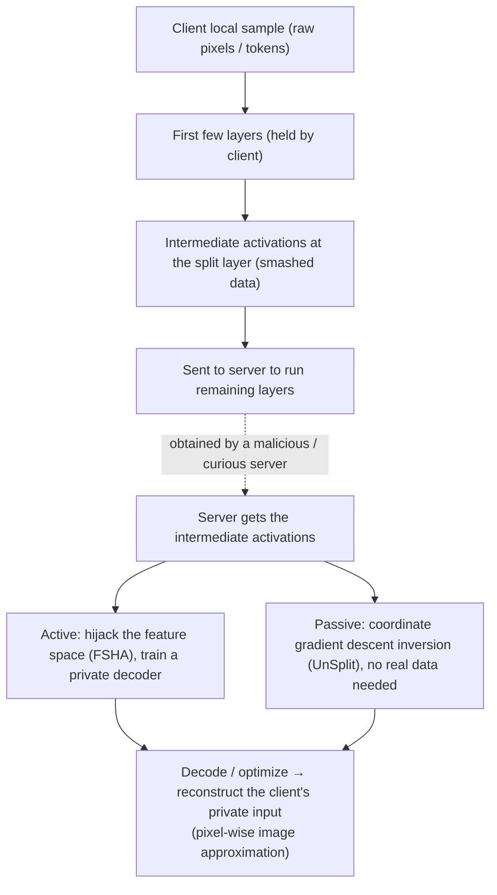

import PrivacyMeta from '@site/src/components/PrivacyMeta';

<PrivacyMeta era="Volume 5 · Frontier and deployment" technique="Federated learning & secure aggregation" audience={['Privacy Engineer', 'ML Engineer', 'Security Engineer']} severity="High" maturity="Research" evidence="Research" />

> In one sentence: split learning cuts the model at some layer into two halves — the client runs the first few layers and sends the **intermediate activations** (smashed data) to the server to run the rest — and is often described as "**raw data never leaves the client, so it's private.**" Conclusion first: this is **not** private. The Feature-Space Hijacking Attack (Pasquini et al., CCS 2021) shows a **malicious server** can actively steer the split model into an insecure state and **reconstruct the client's private training inputs** from the intermediate activations (reconstructing images on MNIST / Omniglot / CelebA); UnSplit (Erdoğan et al., WPES @ CCS 2022) shows that even an **honest-but-curious server** — knowing only the client architecture, with no active interference — can invert (reconstruction MSE ≈ 0.08–0.15 on MNIST / Fashion-MNIST / CIFAR-10). Don't read "didn't send raw pixels" as privacy.

## Mechanism: what happens on my side

In split learning, the client holds only the **first few layers** of the model: a local sample runs forward up to the **split layer** to produce one set of **intermediate / smashed activations**, which it sends to the server; the server runs the remaining layers and returns gradients for joint training. The "raw data" (pixels, tokens) does stay on the client, but **the intermediate activations that leave the client are the product of a deterministic mapping of the input through the first few layers** — they **encode** the input's information.

To be clear about the red line: this isn't the model "confessing" its inputs on purpose — it's that **intermediate activations, as the product of a forward mapping, constrain the input that produced them mathematically**, and enough optimization / active steering can **solve** for that input from the activations (same family as gradient leakage: there it's "gradient constrains input," here it's "activation constrains input"); the whole process is externally reproducible and independent of whether anyone "wants to" leak. Two attacker types take two paths:

- **Active (FSHA, malicious server)**: during training the server **quietly swaps its own training objective**, using a private "shadow" autoencoder to progressively **hijack** the output feature space of the client's half into a shape its decoder can invert; after some steps it can **decode any received intermediate activation back into an approximate original image** — the client only sees the loss decreasing normally and can't tell the objective was changed.
- **Passive (UnSplit, honest-but-curious)**: the server **doesn't change the protocol** and, knowing only the client architecture, runs **coordinate gradient descent** on the intermediate activations — jointly optimizing a "guessed client model" and a "guessed input" so their forward product approaches the observed activations, thereby inverting the input **data-obliviously** (without any real data).



## Threat surface: who can attack, what's reconstructable, and the boundary

**Who can attack**: **whoever runs the server-side half of the split model** —

- **A malicious server** (FSHA): can actively change its own training objective. This is the weakest link in split learning's default trust assumption — the client usually can't verify what the server is optimizing.
- **An honest-but-curious server** (UnSplit): **without deviating from the protocol**, needs only to know the client's network architecture (a weak assumption) to invert passively — which is what makes it sharper than FSHA: **it reconstructs without having to act maliciously**.

**What's reconstructable**: the client's **private training inputs**. FSHA reconstructs images on MNIST / Omniglot / CelebA; UnSplit achieves reconstruction MSE ≈ 0.08–0.15 against a **trained client model** on MNIST / Fashion-MNIST / CIFAR-10 (note: this MSE is tightly tied to dataset / client architecture / split point / whether trained — it is **not a setting-independent constant**, measure it yourself before transferring). UnSplit also achieves **perfect label inference** when labels are kept naively client-side, and doubles as model stealing.

**Amplifying / limiting factors**:

- **Shallower split points** (the client runs very few layers) → intermediate activations are "closer to the original image" → easier to invert; deeper split points, with a more nonlinear / information-bottlenecked client half, make inversion harder (but FSHA's active hijacking weakens the "go deeper and it's safe" intuition).
- **Whether the client architecture is known to the server**: UnSplit's passive inversion is premised on "knowing the architecture"; keeping the architecture secret raises the cost of the passive attack but helps little against FSHA, which can actively change its objective.

**Boundary**: this entry is the leak surface of "**shared intermediate activations**," premised on the attacker holding the server side and being able to get / steer those activations. It's the **same family as gradient leakage (shared gradients) but a different object**: that one inverts the **gradient**, this one inverts the **forward intermediate activation**.

## How the defense works

Same family as gradient leakage, and the mitigations share the same origin — but first recognize one **structural fact**: in split learning, **the trust boundary falls on the server**. The moment the client hands the activations over, protection depends on "whether the server can be trusted / constrained," and the **default protocol gives zero guarantee on this** (FSHA exploits exactly this gap).

- **Perturbing / obfuscating the intermediate activations** (adding noise, NoPeek-style reduction of mutual information between activations and input, adversarial regularization): can **raise** inversion difficulty, and is **empirical** — these carry no formal privacy guarantee, and are often bypassed by stronger active attacks (FSHA-class ones that hijack the entire feature space).
- **DP-style perturbation** (adding DP noise to the activations / training process): can bound single-sample influence within (ε, δ), but **a formal DP guarantee at the activation layer in split learning is hard** — the noise has to be large enough to suppress inversion, and the utility cost rises with it; this is the same difficulty as the gradient-leakage entry's "DP / perturbation is empirical, formal guarantees are hard."
- **Actually changing the trust assumption**: put the server inside a **trusted execution environment + remote attestation** (see [Confidential inference](./confidential-inference.mdx)), or use secure computation so the server **can't compute on plaintext activations** — only by touching the "trust boundary" layer do you remove FSHA's premise at the root.

To break it down: **"raw data stays local" carries zero privacy guarantee by itself**; the intermediate activations carry the input's information across the trust boundary, and substantive privacy rides on "constraining / not trusting the server," not on "didn't send raw pixels."

## Buildable recipe

```text
1. Default-assume "intermediate activations = invertible, server untrusted": design for
   both FSHA (active) and UnSplit (passive) threats; don't treat "data didn't leave the
   device" as privacy.
2. Don't split shallow: make the split point as deep as feasible and give the client half
   enough nonlinearity / an information bottleneck to raise inversion difficulty — but
   remember this is empirical, weakened by FSHA-class active attacks, not a guarantee.
3. Don't leave labels bare on the client: UnSplit infers labels perfectly under naive
   client-side labels — treat "labels leak too."
4. Touching the trust boundary is the real fix: put the server side inside a TEE + remote
   attestation (see Confidential inference), or use secure computation, so the server
   can't get / steer plaintext activations — this removes FSHA's premise.
5. Run an inversion audit: against your split point / client architecture / whether
   trained, run FSHA- and UnSplit-class inversion as a privacy regression, quantifying
   "how clearly the input can be reconstructed under your config."
```

Every conclusion is tied to **your split point, client architecture, dataset, and whether it's trained** — the paper's "MSE ≈ 0.08–0.15 on MNIST" doesn't transfer directly to your setup; you must measure with your own inversion audit.

**Minimal testable assertions** (turn inversion risk into a regression check):

- How to test: against your split config, run passive inversion (UnSplit-class coordinate gradient descent) plus active hijacking (FSHA-class shadow autoencoder), evaluating reconstruction quality (e.g. reconstruction MSE / human recognizability) and label inferability under your split point / client architecture.
- Pass: the server side is **constrained by trust** (TEE + remote attestation, or secure computation so it can't get plaintext activations), and both inversions push reconstruction quality to **unrecognizable / unusable** with labels not inferable.
- Fail: the server can get / steer the intermediate activations, passive or active inversion reconstructs **recognizable** inputs, or labels are perfectly inferred → don't claim "split learning so data-stays-local is private"; add the trust-boundary layer first.

## Research status (engineering feasibility)

(This entry's maturity is "Research": below is **empirical attack** evidence proving "split learning's shared intermediate activations ≠ private," not "split learning is unusable" — it points to "you must constrain / not trust the server.")

- **Active hijacking inversion (malicious server)**: Pasquini et al.'s **Unleashing the Tiger: Inference Attacks on Split Learning** (ACM CCS 2021) introduces the **Feature-Space Hijacking Attack (FSHA)**: during training the malicious server uses a private "shadow" autoencoder to **hijack** the feature space of the client's half into an invertible state, thereby **reconstructing the client's private training inputs** from the intermediate activations, demonstrated on **MNIST / Omniglot / CelebA** — while the client only sees the loss decreasing normally and can hardly notice the objective was changed. This directly falsifies "raw data stays local so it's private."
- **Data-oblivious passive inversion (honest-but-curious)**: Erdoğan et al.'s **UnSplit** (WPES @ CCS 2022 — the Workshop on Privacy in the Electronic Society co-located with CCS, **not main-track CCS**) gives a **data-oblivious** model inversion: an honest-but-curious server, **knowing only the client architecture**, uses coordinate gradient descent to jointly solve for the client model and the input, achieving reconstruction **MSE ≈ 0.08–0.15** against a **trained client model** (MNIST / Fashion-MNIST / CIFAR-10), and **perfect label inference** when labels are kept naively client-side, doubling as model stealing — proving inversion is possible **without acting maliciously**.

## Residual risk and trade-offs

Breaking the false security item by item:

- **"Raw data stays local" carries zero guarantee.** The intermediate activations carry the input's information across the trust boundary; enough optimization / active steering reconstructs it; split learning's privacy rides on "constraining / not trusting the server," not "didn't send raw pixels."
- **Deeper split point / perturbing activations only raise difficulty.** NoPeek / noise / adversarial regularization raise inversion cost, but carry no formal guarantee and are weakened by FSHA-class active hijacking — not a privacy guarantee on their own.
- **Honest-but-curious can invert too.** UnSplit shows passive reconstruction needs no malicious act, only knowing the architecture — "the server didn't act maliciously" is not a safety argument.
- **DP-style perturbation has a utility cost, and ε must be reported.** Formal DP at the activation layer is hard; noise large enough to suppress inversion also degrades accuracy; without a clear ε, "added noise" says nothing.
- **MSE / reconstruction quality is tightly tied to the setting.** The paper's 0.08–0.15 is the value under its dataset / split point / trained model; another setting may be better or worse — measure it yourself, don't treat a single number as a general conclusion.
- **Inversion attacks keep getting stronger.** A "deep enough split point" today may be broken by a new attack tomorrow — re-audit as attacks advance.

## How this differs from neighboring techniques

- **Split learning leakage vs. gradient leakage (this volume's [Gradient leakage](./gradient-leakage.mdx))**: **same family, different object**. Gradient leakage inverts the **shared gradient**; this entry inverts the **shared forward intermediate activation**. They share the mechanism (an intermediate product constrains the input) and the mitigation direction (constrain the server / DP), but the leak carrier differs — read together.
- **Split learning leakage vs. secure aggregation (this volume's [Secure aggregation](./secure-aggregation.mdx))**: secure aggregation lets the server see only the **sum of many parties' updates**, not individual ones; but in split learning the server needs **per-client plaintext intermediate activations** to run the remaining layers, so the "see only the sum" paradigm **doesn't directly fit** — which is exactly why split learning needs TEE / secure computation as a separate path.
- **Split learning leakage vs. production-grade DP·FL (this volume's [Production-grade DP·FL](./dp-federated-learning.mdx))**: DP·FL uses clipping + noise to bound the single-sample influence of **gradients / updates**; this entry's leak carrier is the **forward activation**, so DP has to act on the activations / training process, and a formal guarantee is harder — both are footnotes to "data not leaving the device ≠ private," but the target and the difficulty differ.

## Version notes

:::note Applicable versions
"Split learning's shared intermediate activations can be inverted into the input" is a **model-independent** structural fact (forward activations constrain the input; the trust boundary is on the server). But **how deep a split point / which client architecture / how much perturbation suffices** are tightly tied to model structure, data, and attack method — FSHA's (CCS 2021, active hijacking) and UnSplit's (WPES @ CCS 2022, data-oblivious passive inversion) conclusions, and that "MSE ≈ 0.08–0.15," **don't transfer directly** to your setup; you must run an inversion audit against your own split config. Inversion attacks keep advancing; stamped 2026-06. (Sources verified 2026-06.)
:::

## Further reading and sources

- [Unleashing the Tiger: Inference Attacks on Split Learning (Pasquini et al., ACM CCS 2021)](https://dl.acm.org/doi/10.1145/3460120.3485259) — introduces the Feature-Space Hijacking Attack (FSHA): a malicious server actively steers the split model into an insecure state and reconstructs the client's private training inputs from the intermediate activations (MNIST / Omniglot / CelebA). This entry's primary source (the active-attack falsification of "raw data stays local ≠ private").
- [UnSplit: Data-Oblivious Model Inversion, Model Stealing, and Label Inference Attacks Against Split Learning (Erdoğan et al., WPES @ CCS 2022)](https://dl.acm.org/doi/10.1145/3559613.3563201) — a data-oblivious (honest-but-curious, knowing only the client architecture) coordinate-gradient-descent model inversion, reconstruction MSE ≈ 0.08–0.15 against a trained client model (MNIST / Fashion-MNIST / CIFAR-10), perfect label inference when labels are kept naively client-side. Proves inversion is possible without acting maliciously.
