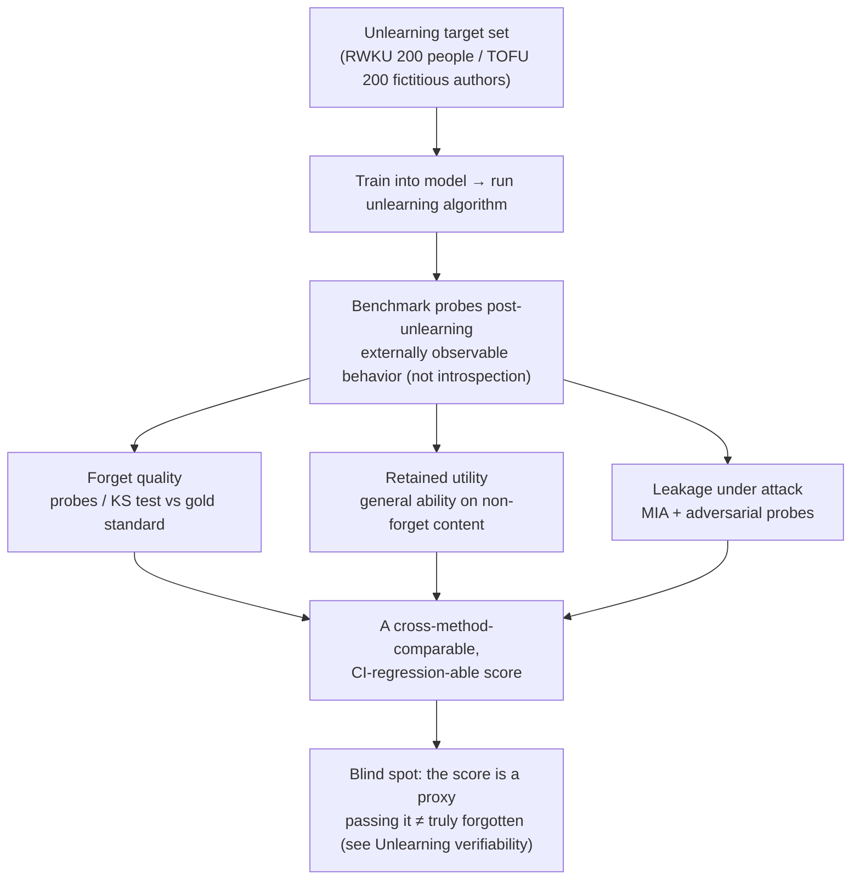

import PrivacyMeta from '@site/src/components/PrivacyMeta';

<PrivacyMeta era="Volume 5 · Frontier and deployment" technique="Privacy evaluation & auditing" audience={['Privacy Engineer', 'ML Engineer', 'Compliance Engineer']} severity="Medium" maturity="Research" evidence="Research" />

> In one sentence: you ran an unlearning algorithm — now you have to **prove it worked**. Standardized benchmarks (RWKU, MUSE, the TOFU family) turn "we forgot it" into a **comparable, regression-able score**: not just "can it still recite it?" but **forget quality × retained utility × privacy leakage under attack**, three axes at once. And these benchmarks converge on an uncomfortable finding — **few methods survive both the utility test and the leakage test** (MUSE reports that of eight algorithms, only one avoids severe privacy leakage ⚠️ preprint). But the benchmarks have blind spots of their own: **a benchmark is a proxy, and passing it ≠ truly forgotten** (this picks up this volume's [Unlearning verifiability](./unlearning-verification.mdx)); whatever it doesn't cover is a corner it can't see.

## Mechanism: what happens on my side

First, the division of labor between this entry and its two neighbors: this volume's [Verifiable deletion & machine unlearning](./machine-unlearning.mdx) is about *how* to forget (exact / approximate methods); [Unlearning verifiability](./unlearning-verification.mdx) is the impossibility argument that model-level unlearning **can't be verified and its proof can be forged**; **this entry is the evaluation layer** — once you've picked a method and want a **cross-method-comparable score you can put into CI regression** to answer "how well did it actually forget," an unlearning benchmark is what you reach for.

An unlearning benchmark performs **external behavioral measurement**; it does not have me introspect "did I truly forget?" It fixes a set of **unlearning targets** (RWKU uses 200 real-world famous people; TOFU uses 200 fictitious author profiles), trains / fine-tunes them into the model, runs unlearning, then probes my post-unlearning **externally observable behavior** from three directions:

- **Forget quality**: on the unlearning targets, can I still answer, still recite? RWKU presses with **fill-in-the-blank / question-answer probes** plus **adversarial probes**; TOFU is stricter — it defines forget quality as the **p-value of a Kolmogorov–Smirnov test between the unlearned model and a "retrain-without-the-target-data" gold-standard model** (it only passes when the output distributions are **indistinguishable**).
- **Retained utility**: unlearning shouldn't strip away the rest of the model's abilities along with it. The benchmark measures whether my general ability / reasoning / factuality on **non-forget content** still holds.
- **Privacy leakage under attack**: the crucial axis — **can the unlearning target still be extracted back?** RWKU pairs **membership inference (MIA)** methods with **adversarial probes**; MUSE lists "privacy leakage" outright as one of its six properties.

To be clear about the red line: the score measures my output behavior **under this particular probe set, this particular attack, this particular decision lens** — not my own account of "whether I truly forgot." I can't reliably introspect the influence of training data (as in [Quantifying memorization & auditing](../02-memorization-extraction/quantifying-memorization.mdx): a canary's exposure likewise quantifies an **externally observable preference** into a scalar, not "I admit I remember"). A benchmark turns "unlearning" into a comparable, regression-able **proxy metric** — the proxy is its power, and also its boundary.



## Threat surface: what the benchmark can and can't measure

This entry is a **defender's measurement tool**, so the "threat surface" becomes **capabilities and blind spots** — following the pattern of *Quantifying memorization & auditing*.

**What it can measure (the benchmark's power)**:

- **Gives a cross-method-comparable score**: it turns "we forgot it" from a slogan into a number that **compares horizontally under one lens** — which of method A and method B forgot more cleanly, and how much utility each shed, is visible at a glance.
- **Measures the three-axis trade-off**: forget quality ↔ retained utility ↔ leakage under attack, not just one axis. The value of a benchmark is precisely that it **forces the trade-off into the open** — many methods can suppress "can it recite it," but at the cost of collapsed utility, or a leak that reappears under a different attack.
- **Regression**: after a new method / new model version, re-measuring on the same targets and probes answers "did this version forget more cleanly or worse than the last."

**What it can't measure / its limits (must be spelled out, or it's another false security)**:

- **A benchmark is a proxy; passing it ≠ truly forgotten.** It measures "was the target suppressed **under this probe set / this attack**," not "did this data's influence truly vanish from the weights" — which picks up [Unlearning verifiability](./unlearning-verification.mdx): model-level unlearning is inherently unverifiable and its "proof" is forgeable. A benchmark score **measures behavior, not the fact of deletion**.
- **Adversarial probes don't exhaust the attack space.** RWKU uses nine kinds of adversarial probes and four MIA methods, but "**these probes didn't extract it**" ≠ "**no probe can extract it**" — with a stronger attack, or a phrasing outside the coverage, residual information may resurface (the same "necessary but not sufficient" limit as MIA-as-audit).
- **Whatever it doesn't cover is a blind spot.** A benchmark is only valid on **the target / probe distribution it chose**: RWKU picks celebrities, TOFU fabricates fictitious authors — both to cleanly separate "the unlearning target" from "abilities the model ought to have anyway" — but the actual PII you need to delete may not fall, in format or distribution, within the benchmark's coverage.
- **The metric can be gamed.** If a single benchmark score becomes the only release gate, there's an incentive to **overfit-and-"suppress-the-score" toward that probe set** (e.g. specifically suppressing outputs for those few phrasings) rather than truly reducing influence — the score looks good, the forgetting isn't there.

## How the defense works

The logic of this defense is to upgrade **"we ran unlearning" into "multi-dimensional scoring on a standard benchmark + regression"**: don't accept "we ran an unlearning algorithm" as evidence; require scores on all three axes — **forget quality / retained utility / leakage under attack** — that can be regressed across versions.

Two load-bearing points:

- **Multi-dimensional, not single-axis.** Looking only at "can the target be recited" hands you false security — MUSE's six properties (no verbatim memorization, no knowledge memorization, no privacy leakage, utility preservation, scalability, sustainability) are useful precisely because they force you to look at leakage **and** utility **together**, rather than suppressing one and calling it a pass.
- **Gold-standard retrain as the anchor.** TOFU's approach is to take a "**retrain without the target data**" model as the reference frame; the unlearned model must be **indistinguishable** from it (KS-test p-value) to pass. That anchor answers "what does true forgetting look like" — approximate methods report their gap against it instead of self-certifying (the same footing as *Unlearning verifiability*: evidence lands on "the gap to the gold standard").

To break it down: a benchmark score is an **empirical measurement, not a formal guarantee** (formal guarantees need DP — see [DP fine-tuning](../03-conversational-llms/dp-fine-tuning.mdx)); it can **empirically corroborate** whether an unlearning method suppressed leakage on this target set, but it **can't replace** the auditable process that *Unlearning verifiability* demands — the score is the "thermometer," the auditable logs + gold-standard retrain are the "chart."

## Buildable recipe

Back to a neutral engineering register: turn unlearning evaluation into a copyable, regression-able release gate.

```text
1. Pick benchmarks matched to your threat:
   - Want "real-world knowledge + strong adversarial probes + MIA" → RWKU
     (NeurIPS'24 D&B, 200 celebrity targets).
   - Want "multi-dimensional coverage (incl. privacy leakage / scalable / sustainable)"
     → MUSE's six properties (⚠️ preprint).
   - Want "distinguishability test against a gold-standard retrain" → TOFU
     (fictitious authors, KS-test p-value).
   Don't report only the one benchmark that flatters your method.
2. Report all three axes, not just forget quality:
   - forget quality (can the target still be answered / distinguishability vs gold standard);
   - retained utility (did general ability on non-forget content collapse);
   - leakage under attack (run the benchmark's built-in MIA + adversarial probes; can the
     target be extracted back).
3. Compare against retrain-from-scratch: when affordable, take a "retrain without the target
   data" model as anchor and report the "unlearned model vs gold standard" gap, not
   self-certification (picks up Unlearning verifiability).
4. Set a release gate (joint across axes, not a single axis):
   any axis below bar blocks release — forget quality passing but utility collapsed, or a
   leak reappearing under a different probe, both count as not passing.
5. Guard against gaming: rotate / expand the probe set periodically so a method can't
   overfit-and-suppress toward fixed probes; a benchmark score means "at least this probe
   set / this attack can't detect it," not "compliant deletion done."
```

Every decision (which benchmark, whether a gold standard is affordable, each axis's threshold, the MIA's FPR band, the acceptable residual leakage) must carry **your model and threat model**; the scores a paper reports are comparable only within **its own targets / probes / decision lens**, and the absolute values don't transfer directly to your scenario.

**Minimal testable assertions** (turn unlearning evaluation into a regression check; don't stop at "we ran an unlearning algorithm"):

- How to test: after each unlearning run, on a fixed standard benchmark (or several), score all three axes — **forget quality / retained utility / leakage under attack** — under one lens, and compare against the previous baseline; when affordable, run the benchmark's built-in MIA + adversarial probes on the target and use a gold-standard retrain model as the distinguishability reference (TOFU-style).
- Pass: all three axes **jointly clear the bar** — the target is suppressed under probes / MIA down to baseline and **indistinguishable** from the gold standard, while retained utility is **no lower** than threshold and no worse than the previous version; where a gold standard exists, the gap is within an acceptable band.
- Fail: forget quality passes but utility collapsed, or a different probe / stronger MIA can extract the target again, or there's no multi-dimensional baseline at all, or you only "suppressed the score" toward fixed probes → don't claim "forgotten / compliant deletion done"; go back and check whether you only did output suppression, or should switch to exact unlearning (see [Verifiable deletion & machine unlearning](./machine-unlearning.mdx)).

## Research status (engineering feasibility)

(This entry's maturity is "Research": below are **benchmarks and research findings** proving "unlearning evaluation can be made into a comparable score" and "most methods fail the joint 'utility × leakage' test" — not an endorsement that "verifiable LLM unlearning is in production.")

- **RWKU: a real-world knowledge unlearning benchmark (the peer-reviewed spine).** Jin et al.'s **RWKU: Benchmarking Real-World Knowledge Unlearning for Large Language Models** (**NeurIPS 2024 Datasets & Benchmarks Track**; arXiv 2406.10890) builds a more realistic, harder unlearning benchmark: **200 real-world famous people as unlearning targets**, with **13,131 multi-level forget probes** (of which **3,268 fill-in-the-blank + 2,879 question-answer + 6,984 adversarial**). Its evaluation lens presses three things at once — **four membership inference (MIA) methods** + **nine kinds of adversarial probes** test whether the target can be extracted back, plus it measures unlearning **locality and model utility** (general ability / reasoning / truthfulness / factuality / fluency). It deliberately sets **neither the forget corpus nor the retain corpus to be accessible** (akin to zero-shot knowledge unlearning), to avoid secondary information leakage from the forget corpus and distribution bias from the retain corpus — making the evaluation closer to a real deletion situation.
- **MUSE: six-way evaluation, most methods don't pass ⚠️ preprint.** Shi et al.'s **MUSE: Machine Unlearning Six-Way Evaluation for Language Models** (2024; arXiv 2407.06460) decomposes unlearning evaluation into **six desirable properties**: (1) no verbatim memorization, (2) no knowledge memorization, (3) no privacy leakage, (4) utility preservation (on non-removed data), (5) scalability (with the size of removal requests), and (6) sustainability (under successive unlearning requests). On **7B-parameter models**, it evaluates **eight popular unlearning algorithms** unlearning the **Harry Potter books + news articles**, and reports: **most algorithms can prevent verbatim and knowledge memorization to varying degrees, but only one algorithm does not lead to severe privacy leakage**; moreover, existing algorithms **often degrade general model utility** and **can't sustainably accommodate successive unlearning requests or large-scale content removal** — i.e. most methods fail the joint "utility × leakage × sustainability" test. (Preprint; findings hold within its own setup, flagged ⚠️.)
- **TOFU: an earlier fictitious-unlearning benchmark (one-line lineage).** Maini et al.'s **TOFU** (COLM 2024) is the earlier work that turned "forget quality" into a measurable benchmark — **200 fictitious author profiles × 20 QA each**, forget quality = the **p-value of a KS test against a gold-standard retrain model** (only p greater than 0.05 counts as indistinguishable from the gold standard) — and found no baseline truly passes "forget quality vs. utility." (Its verifiability / forging argument is developed in [Unlearning verifiability](./unlearning-verification.mdx); here it's only a lineage pointer, not re-argued.)

## Residual risk and trade-offs

Break the false security point by point:

- **"Passing a benchmark" ≠ "compliant deletion."** A benchmark score is a **behavioral proxy** — it says "under this probe set / this attack the target was suppressed," not "this data's influence truly vanished from the weights and it's legally deleted." Model-level unlearning is inherently unverifiable and its proof is forgeable (see [Unlearning verifiability](./unlearning-verification.mdx)); reading a benchmark pass as "Art. 17 deletion complete" is textbook false security.
- **A benchmark can't cover what it doesn't cover.** The score is valid only on the targets / probe distribution it chose; if the PII you actually need to delete falls, in format or distribution, outside the coverage, the benchmark can't see it — passing doesn't mean that record was seen.
- **Most methods fail the trade-off.** MUSE reports that of eight algorithms only one avoids severe privacy leakage, and they broadly degrade utility / can't handle successive deletions (⚠️ preprint); TOFU likewise shows no baseline passes both "forget quality vs. utility." **Crushing utility to buy a "passing" forget quality is not a real solution** — weigh it against your own multi-axis budget rather than reporting a single flattering axis.
- **The metric can be gamed.** If a single benchmark score is the only gate, there's an incentive to **overfit-and-suppress** toward that probe set (specifically suppressing those few phrasings); the score looks good, the forgetting isn't there. Rotate / expand probes so the gate doesn't degrade into "memorizing the exam."
- **Adversarial probes / MIA are "at least this can't detect it."** The benchmark's built-in attacks passing only says the current batch of attacks produced no signal at this lens; a stronger attack may resurface it — don't treat it as case-closing evidence (the same necessary-but-not-sufficient limit as MIA-as-audit).
- **Gold-standard retrain is expensive and not always obtainable.** The strength of TOFU-style "report the gap to the gold standard" depends on being able to "retrain without the target data"; for large models that's costly and hard to run for every deletion request, and without the anchor the argument's strength is discounted.

## Compliance mapping

- **GDPR Art. 17 (right to be forgotten)**: the law requires "deleting personal data," and regulators / data subjects will demand "**prove** you deleted it." An unlearning benchmark can provide "a multi-dimensional score under a standard lens after unlearning" as **one piece of evidence**, but **passing a benchmark ≠ legal deletion complete** — there's a real gap between the technical measure (quantifying leakage / utility into a score) and legal satisfaction (provable deletion); the provable step rests on an auditable process + gold standard, see [Unlearning verifiability](./unlearning-verification.mdx).
- **EU AI Act**: training-data transparency and record-keeping duties will make "whose data was used, how effective the unlearning is, and how it's measured" require a reviewable evaluation lens, not just a one-line "already unlearned."

(Compliance evolves with statute versions; this paragraph is stamped 2026-07, verify the latest in-force text before citing.)

## How this differs from neighboring techniques

- **Unlearning benchmarks & evaluation vs. Verifiable deletion & machine unlearning (this volume)**: [Verifiable deletion & machine unlearning](./machine-unlearning.mdx) is about **unlearning methods** (how exact / approximate forgetting works, how SISA makes exact unlearning affordable); **this entry is about scoring the methods** — turning "how well did it forget" into a cross-method-comparable, CI-regression-able multi-dimensional score. One is "how to forget," the other is "how well it forgot, quantified for me."
- **Unlearning benchmarks & evaluation vs. Unlearning verifiability (this volume)**: [Unlearning verifiability](./unlearning-verification.mdx) is the **impossibility / forging argument** — model-level unlearning can't be proven and its "proof" is forgeable, so evidence must move to the algorithm / process layer. **This entry doesn't re-argue that**; it picks up its caution: a benchmark score is a **behavioral proxy**, passing it ≠ truly forgotten, and what's uncovered is a blind spot. One draws the "can't be proven" boundary; the other, within that boundary, quantifies "the part that can be measured" into a regression-able score — read them together.
- **Unlearning benchmarks & evaluation vs. Quantifying memorization & auditing (Volume 2)**: [Quantifying memorization & auditing](../02-memorization-extraction/quantifying-memorization.mdx) uses **canary + exposure** to measure "how much I memorized" **before release** (oriented to memorization strength); this entry, oriented to **after unlearning**, measures "how well it forgot, and does it still leak" (oriented to unlearning effect). Both are the measurement discipline of "quantify risk into a regression-able scalar" — one measures memorization, the other unlearning — written from the same source (what it can / can't measure, the boundary of a proxy).

## Version notes

:::note Applicable versions
The methodology of "turning unlearning into a multi-dimensional comparable score" is independent of any specific LLM, but **each benchmark's reported scores are tightly bound to its targets / probes / decision lens and model scale**: the findings of RWKU (NeurIPS 2024 D&B, 200 celebrities, 13,131 probes, 4 MIA methods + 9 adversarial probe kinds), MUSE (⚠️ preprint, six properties, 7B, 8 algorithms, Harry Potter + news, "only one avoids severe leakage"), and TOFU (COLM 2024, 200 fictitious authors, KS-test p-value) are all **conclusions on those benchmarks at that time**; new benchmarks / methods keep emerging, and absolute scores don't transfer directly. Ground it in your own model, benchmark choice, probe distribution, and gold-standard retrain cost. Verifiable unlearning as a whole is still an open problem. This paragraph is stamped 2026-07. (Sources verified 2026-07.)
:::

## Further reading and sources

Primarily: RWKU (peer-reviewed benchmark) + MUSE (⚠️ preprint, multi-dimensional evaluation and the "most methods don't pass" finding); supplementary: TOFU (the earlier fictitious-unlearning benchmark, as lineage).

- [RWKU: Benchmarking Real-World Knowledge Unlearning for Large Language Models (Jin et al., NeurIPS 2024 Datasets & Benchmarks; arXiv 2406.10890)](https://openreview.net/forum?id=wOmtZ5FgMH) — this entry's spine: 200 real-world celebrity targets + 13,131 probes (3,268 fill-in-the-blank / 2,879 QA / 6,984 adversarial), four MIA methods + nine adversarial probe kinds testing leakage, plus locality and utility; a more realistic setting where both forget and retain corpora are inaccessible.
- [MUSE: Machine Unlearning Six-Way Evaluation for Language Models (Shi et al., 2024; arXiv 2407.06460)](https://arxiv.org/abs/2407.06460) — ⚠️ preprint: six properties (incl. privacy leakage / scalability / sustainability); on 7B, evaluates eight algorithms unlearning Harry Potter + news and reports "only one avoids severe privacy leakage" while they broadly degrade utility / can't sustain successive deletions — i.e. most methods fail the joint test.
- [TOFU: A Task of Fictitious Unlearning for LLMs (Maini et al., COLM 2024)](https://openreview.net/forum?id=P8seBluN3c) — the earlier fictitious-unlearning benchmark (200 fictitious authors × 20 QA, forget quality = KS-test p-value against a gold-standard retrain) as a lineage pointer; its verifiability / forging argument is in *Unlearning verifiability*, not re-argued here.
