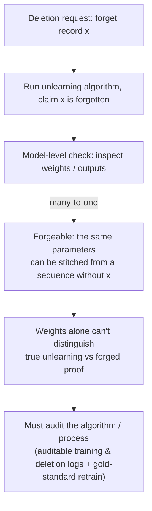

import PrivacyMeta from '@site/src/components/PrivacyMeta';

<PrivacyMeta era="Volume 5 · Frontier and deployment" technique="Machine unlearning & right to be forgotten" audience={['Privacy Engineer', 'Compliance Engineer', 'ML Engineer']} severity="Medium" maturity="Research" evidence="Research" />

> In one sentence: you ran an unlearning algorithm and claim some record is "forgotten" — but **at the level of a single trained model, that claim can't be verified**. Thudi et al. (USENIX Security 2022) give a **forging** construction: the same model parameters can be produced from a **different dataset / a different gradient sequence**, so a model owner can pass off a fabricated "I unlearned it" proof while actually keeping the record. Alongside it, TOFU (Maini et al., COLM 2024) turns "forget quality" into a measurable benchmark and finds **no off-the-shelf method convincingly passes the "forget quality vs. utility" tradeoff**. Conclusion first: audit the **algorithm / process**, not the final weights; "deleted" must be provable, or it's compliance theater.

## Mechanism: what happens on my side

A sample once influenced my parameters, and unlearning aims to erase that influence (the how-it-got-here is in this volume's [Verifiable deletion & machine unlearning](./machine-unlearning.mdx) — that entry is about *how* to forget; this one is about *how to prove* you forgot). The problem is on the **proof** side.

"Weights" are a **many-to-one** object: many different training trajectories (different data, different gradient ordering, different random seeds) can converge to **almost the same** parameters. Thudi et al. exploit exactly this to construct a **forgery** — given a target model, an adversary can stitch together a gradient sequence that "looks like it came from a dataset that never contained a record," yet yields the same parameters as "the model actually trained with that record." So a **model-level** argument of the form "these weights prove I never used / already deleted that data" collapses at the root: the same weights can arise from "really deleted" *or* from "didn't delete + forged," and you can't tell which by looking at the weights alone.

To be clear about the red line: I do not write "I promise I forgot it" or "I confirm this record is no longer inside me" — **I can't reliably introspect whether I truly forgot**, and writing introspection as fact manufactures false security. What can be argued externally is only this: under a **pre-defined unlearning algorithm** and **audit assumptions**, whether the unlearning process was executed correctly (logged, re-computable, spot-checkable). From the final weights alone, an outsider can neither distinguish "true unlearning" from "a forged proof of unlearning," nor vouch for me that it was "cleanly forgotten."



## Threat surface: who can attack, what's forgeable, and the boundary

**Who attacks / who fakes it**: the threat party is **the model owner / data controller themselves** — faced with a regulator's or data subject's "prove you deleted it" demand, they have an incentive to produce a "unlearned" proof while quietly keeping and using the record. This is the opposite of "an external attacker steals data"; it's an **insider adversary against the audit**.

**What's forgeable**: Thudi et al.'s forgery targets the **"proof" of model-level unlearning itself** — by constructing a substitute data / gradient sequence whose final parameters match a target model, one can claim "the training behind these weights didn't include x / x has been unlearned." Hence any approximate-unlearning definition that takes the **final model as evidence** is **unsound** at the model level.

**Limits of MIA-as-audit**: a common verification idea is "after deletion, run membership inference on x (see Volume 1's [Membership inference](../01-foundations/membership-inference.mdx)); if it can't detect membership, it's forgotten." But "**this MIA didn't detect it**" does **not** equal "truly forgotten" — it only says the signal was suppressed under this one attack at this one FPR; with a stronger attack or a different audit lens, residual influence may resurface. Reading "MIA didn't fire" directly as "compliant deletion done" is another flavor of false security.

**Boundary**: this entry concerns the verification *level* of a **single trained model**; it does **not** deny that you can argue unlearning at a **well-defined algorithmic level with auditable logs** — quite the opposite, Thudi et al.'s conclusion is precisely that unlearning can only be well-defined and audited at the **algorithm / process** level. This entry also doesn't vouch for the effectiveness of any particular unlearning method (that's the scope of *Verifiable deletion & machine unlearning*).

## How the defense works

Moving the "proof" off the weights and back onto the algorithm and process is the only footing that holds:

- **Algorithmic, auditable unlearning definitions**: instead of asserting "these weights forgot x" (forgeable), assert "**this specific unlearning algorithm was correctly executed on this input**," and make that execution **re-computable and spot-checkable**. This is Thudi et al.'s core claim: model-level definitions of approximate unlearning are unsound; unlearning is only well-defined when bound to the **algorithm**.
- **Keep auditable training / deletion logs**: record "which data was used, which deletion ran, which retrain / shard the deletion triggered, what the artifact hashes are," so an auditor can **replay** rather than merely "trust." Without logs, a forgery can't be refuted.
- **Retrain-from-scratch as the gold standard**: "a model retrained without x" is the reference frame for unlearning — TOFU measures forget quality precisely as **being indistinguishable from that gold-standard model**. It's expensive, but it anchors "what true unlearning looks like"; approximate methods should report their gap against it instead of self-certifying.
- **Write "provable unlearning" into the process**: deletion isn't just "run an unlearning algorithm" but should produce an **externally falsifiable evidence chain** (what was deleted + when + the triggered retrain / shard + the verification lens + the gap to the gold standard), as an artifact for responding to a GDPR Art. 17 inquiry.

To break it down: this defense protects "**the process is auditable**" — it does **not** protect "provable unlearning at the weight level," which, per Thudi et al.'s forging result, simply isn't obtainable at the single-model level. And if the audit assumptions (logs not tampered with, the algorithm faithfully implemented, the gold-standard retrain trustworthy) don't hold, the argument collapses just the same.

## Buildable recipe

```text
1. Don't treat "final weights" as unlearning evidence: model-level proofs are forgeable
   (Thudi'22); weights alone can't tell "really deleted" from "didn't delete + forged."
2. Bind unlearning to a specific algorithm: define clearly "delete one record → triggers
   what (retrain / retrain a shard / approximate step)," and make that process
   re-computable and spot-checkable (see the exact/approximate routes in
   Verifiable deletion & machine unlearning).
3. Keep auditable logs: which data was used, which deletion ran, which retrain/shard it
   triggered, artifact hashes — so an auditor can "replay," not "trust."
4. Set a gold-standard retrain as reference: when affordable, train a "retrain without the
   target record" model as an anchor and report "the gap between the unlearned model and
   the gold standard" (don't self-certify; report against the gold standard).
5. Treat MIA as "necessary, not sufficient" corroboration: after deletion run membership
   inference on the target (Volume 1 MIA), but "this MIA didn't detect it" ≠ "truly
   forgotten" — don't treat it as case-closing evidence.
6. Write the evidence chain into a compliance artifact: what was deleted + when + the
   triggered retrain/shard + verification lens + gap to the gold standard, as falsifiable
   evidence for an Art.17 inquiry, not a one-line "we deleted it."
```

Every decision (the retrain-trigger threshold, whether a gold standard is affordable, the MIA's FPR band, the acceptable residual gap) must carry **your model and threat model**; paper settings don't necessarily transfer to your scenario.

**Minimal testable assertions** (turn "provable unlearning" into a regression check; don't stop at "we ran an unlearning algorithm"):

- How to test: for one deletion request, check whether you can **replay its unlearning process end-to-end** (pull the logs → re-compute the unlearning algorithm / retrain the affected shard → compare artifact hashes), and when affordable, use a "retrain without that record" gold-standard model as reference (TOFU-style: measure distinguishability between the unlearned model and the gold standard on the target).
- Pass: the unlearning process is **externally re-computable** with matching artifacts, the deletion evidence chain is complete (what / when / which retrain was triggered / the gap to the gold standard), and the model is **indistinguishable** from the gold standard on the target — this is "process-provable," not "weight-provable."
- Fail: you can't produce re-computable logs, can only offer "final weights" as evidence (forgeable), or close the case on "MIA didn't fire" alone → don't claim "compliant deletion done"; build the auditable process and evidence chain first.

## Research status (engineering feasibility)

(This entry's maturity is "Research": below are **research findings and a benchmark** proving "model-level unlearning is unverifiable and proofs can be forged" and "forget quality and utility are hard to satisfy at once" — not an endorsement that "verifiable LLM unlearning is in production.")

- **Forging: model-level unlearning proofs don't hold**: Thudi et al.'s **On the Necessity of Auditable Algorithmic Definitions for Machine Unlearning** (USENIX Security 2022) shows, via a **forging** construction, that an adversary can use a **different dataset / gradient sequence** to produce the **same parameters** as a target model, so a model owner can forge an "unlearned" proof for a record they actually kept. Conclusion: model-level definitions of approximate unlearning are **unsound**; unlearning is only well-defined — and only auditable — at the **algorithm** level (audit the algorithm / process, not the final weights).
- **TOFU: forget quality vs. utility, nobody really passes**: Maini et al.'s **TOFU: A Task of Fictitious Unlearning for LLMs** (COLM 2024) builds an LLM unlearning benchmark — **200 fictitious author profiles × 20 QA each**; "forget quality" is defined as the **p-value of a Kolmogorov–Smirnov test against a gold-standard retrained model** (forgetting "passes" only when the unlearned model's output distribution is **indistinguishable** from the gold standard, i.e. p > 0.05), paired with a **model-utility** axis. Its reported finding: **no baseline method convincingly solves TOFU** — there's always a tradeoff between forget quality and utility. The fictitious authors exist precisely to cleanly separate "the forgetting target" from "the general capability the model is supposed to retain."

## Residual risk and trade-offs

Breaking the false security item by item:

- **"Ran an unlearning algorithm" ≠ "provable unlearning."** Final weights are forgeable (Thudi'22); weights alone can't separate true deletion from "didn't delete + forged" — evidence must land on the auditable algorithm / process.
- **"MIA didn't detect it" ≠ "truly forgotten."** Membership inference is necessary-not-sufficient corroboration; it only says one attack at one FPR produced no signal, and a stronger attack may surface residual influence — don't treat it as case-closing.
- **Audit assumptions are the load-bearing wall; if one falls, all falls.** Provable unlearning relies on "logs not tampered with, algorithm faithfully implemented, gold-standard retrain trustworthy" — if those premises fail, the process argument fails too.
- **Gold-standard retrain is expensive and may be unavailable.** For large models, "retrain without the target record" is costly and hard to run per deletion request; skip it and you lose the anchor of "what true unlearning looks like," discounting the strength of the argument.
- **Forget quality and utility are hard to satisfy together.** TOFU shows no method passes on both axes — crushing utility to buy a "passing forget quality" isn't a real solution; weigh it against your own two-axis budget in practice.
- **Verifiable unlearning is still an open problem overall.** This entry is "why it's hard to prove / how to move the proof to the process level," not "the problem is solved" — don't package any single method as "provably unlearned."

## Compliance mapping

- **GDPR Art. 17 (right to be forgotten)**: the law requires "erasing personal data," and regulators and data subjects will want you to "**prove** you deleted it." But a model-level "proof" is forgeable (Thudi'22) — upgrading "we deleted it" to "**we deleted it, externally falsifiably**" rests on an auditable algorithm / process plus an evidence chain, not on presenting final weights. Between the technical duty to delete and "provable deletion" lies a real engineering gap.
- **EU AI Act**: training-data transparency and record-keeping duties will make "whose data was used, whether its influence can be deleted, and how to prove it" demand documented auditable process, not just a result.

(Compliance evolves with statute versions; this section is stamped 2026-06 — verify against the latest text in force before citing.)

## How this differs from neighboring techniques

- **Unlearning verifiability vs. verifiable deletion & machine unlearning (this volume)**: [Verifiable deletion & machine unlearning](./machine-unlearning.mdx) is about **unlearning methods** (how exact / approximate forgetting works, how SISA makes exact unlearning affordable); **this entry is about how to prove it** — the core difficulty on the proof side is that it's "model-level unverifiable and forgeable," moving verification to the algorithm / process level. One is "how to forget," the other "how to prove you forgot"; read together.
- **Unlearning verifiability vs. data lifecycle & deletion propagation (Volume 6)**: [Data lifecycle & deletion propagation](../06-governance-compliance/data-lifecycle-deletion.mdx) is about fanning a deletion request out to **all copies** — backups, logs, vector stores, derived models; among them, "**the copy that made it into the weights**" is the hardest cell — and this entry is exactly the "verifiability" of that cell. Deletion propagation solves "delete all copies"; this entry solves "how to prove the weights copy."
- **Unlearning verifiability vs. membership inference (Volume 1)**: [Membership inference](../01-foundations/membership-inference.mdx) is both the MIA **attack** and a common **verification tool** for unlearning — but this entry points out its limit: **"MIA didn't detect it" ≠ "truly forgotten."** It's necessary-not-sufficient corroboration, not case-closing evidence of provable unlearning.

## Version notes

:::note Applicable versions
"Unlearning can't be verified at the level of a single trained model, and model-level proofs are forgeable" is Thudi et al.'s (USENIX Security 2022) conclusion at the **algorithmic-definition** level, independent of any particular LLM. But the **forget-quality-vs-utility** of any specific method is tightly bound to model and data — TOFU's (COLM 2024; 200 fictitious author profiles, KS-test p-value as forget quality) "no method really passes" is a finding on that benchmark at that time, and new methods keep appearing; in practice, go by your own model, verification lens, and gold-standard retrain cost. Verifiable unlearning remains an open problem overall; stamped 2026-06. (Sources verified 2026-06.)
:::

## Further reading and sources

- [On the Necessity of Auditable Algorithmic Definitions for Machine Unlearning (Thudi et al., USENIX Security 2022)](https://www.usenix.org/conference/usenixsecurity22/presentation/thudi) — this entry's primary source: a forging construction proving model-level unlearning is unverifiable (the same parameters can be produced from a different data sequence); model-level definitions of approximate unlearning are unsound, and unlearning must be audited at the algorithm / process level.
- [TOFU: A Task of Fictitious Unlearning for LLMs (Maini et al., COLM 2024)](https://openreview.net/forum?id=P8seBluN3c) — an LLM unlearning benchmark (200 fictitious authors × 20 QA); forget quality = the p-value of a KS test against a gold-standard retrained model (p > 0.05 to count as indistinguishable), with the finding that no baseline truly passes on "forget quality vs. utility."
