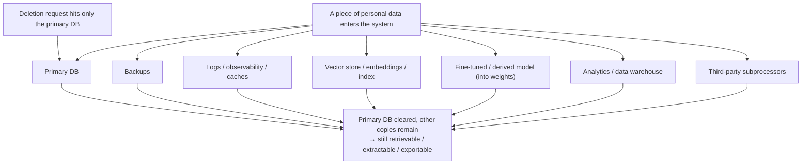

import PrivacyMeta from '@site/src/components/PrivacyMeta';

<PrivacyMeta era="Volume 6 · Governance and compliance" technique="Data lifecycle & data governance" audience={['Privacy Engineer', 'Compliance Engineer', 'Security Engineer']} severity="Medium" maturity="Production" evidence="Official docs" />

> In one sentence: "I deleted that record" ≠ "the data is gone." Once a piece of personal data enters the system, it gets copied to a pile of places — primary DB, backups, logs, caches, vector store / embeddings, fine-tuned / derived models, analytics warehouses, third-party subprocessors. The right to be forgotten (GDPR Art. 17) only counts when deletion **propagates to every copy**; and **my side** — baked into weights, embedded into the vector store — is exactly the hardest cell to delete. The NIST Privacy Framework treats this as a governance problem spanning the **data lifecycle** (collection → processing → storage → disposition / deletion). Conclusion first: govern by "**data lineage + deletion propagation**," and don't read "deleted from the primary DB" as "deleted" — that's the most common false security here.

## Mechanism: what happens on my side

A piece of personal data flowing to "my" side has several **copy-leaving** paths:

- **Training / fine-tuning** → into the **weights** (the hardest cell to delete, see machine unlearning).
- **Embedding** → into the **vector store / index** (delete the source document and the embedding and index may still be there).
- **Into context** → landing in **logs / observability / prompt caches**.

Each path is an **independent copy**. If the deletion request only hits the primary DB, these copies on my side persist and can still be retrieved or extracted.

To be clear about the red line: I can't write "on receiving a deletion request I'll forget it" — I can't guarantee that introspectively. What's **externally verifiable** is that **whether the deleted data can still be extracted from me / retrieved from the vector store depends on whether it was cleared from training memory, the vector store, logs, and caches together** — measurable objectively with extraction / retrieval probes, not on my "promise."



## Threat surface: where copies remain, and the boundary

**Residual-copy checklist** (each is a leak surface when deletion didn't propagate):

- **Backups**: within the retention window, the deleted data is still in backups.
- **Logs / observability / prompt caches**: context is often secondarily retained (see the secondary-leak surface in [Context-surface privacy](../03-conversational-llms/context-surface-privacy.mdx)).
- **Vector store / embeddings / index**: delete the source document and the **embedding vector and index entry** may not be deleted — still retrievable, even invertible (see [Multi-tenant RAG retrieval leakage](../04-rag-agents/rag-retrieval-leakage.mdx)).
- **Fine-tuned / derived models**: data in the weights — deleting the source **won't** make the model forget; this cell needs unlearning / retraining.
- **Analytics / data warehouse / feature store**: the copies ETL'd out.
- **Third-party subprocessors**: propagation rides on contract, not your unilateral technical enforcement (see [Inference-service data boundary](./inference-service-data-boundary.mdx)).

**Boundary (what this entry covers and doesn't)**: this entry covers the **lifecycle ledger** of "where copies are and whether deletion propagated"; "how to truly delete the copy **in the weights**" is the machine-unlearning specialty (Volume 5), and "whether the third party retains it" is the inference-service-boundary specialty (this volume) — this entry **strings them into a deletion-propagation chain** without repeating their details.

## How the defense works

The **NIST Privacy Framework** (v1.0) governs privacy risk by the **data lifecycle** (collection → processing → dissemination → use → storage → disposition incl. destruction/deletion), with function groups like Identify-P / Govern-P / **Control-P**. In engineering terms, the core is two things:

- **Data lineage**: know **where each class of personal data flows and gets copied to** — without lineage, deletion propagation is blind deletion.
- **Deletion propagation (fan-out)**: a deletion request must **fan out** to all **known copies**, not just delete the primary DB.

**GDPR Art. 17/19** is the legal driver: a controller must take "**reasonable steps, including technical measures**," to inform other controllers of erasure (Art. 17(2)), and notify recipients of rectification / erasure (Art. 19); but the standard is "**reasonable / not disproportionate effort**," explicitly **acknowledging** the technical difficulty of backups and the like. To break it down: the "reasonableness" leeway the law gives is a backstop for "genuinely can't," **not** an excuse for "couldn't be bothered to build lineage or delete" — you still must be able to show you took reasonable technical measures.

## Buildable recipe

```text
1. Build data lineage / inventory: list which stores each class of personal data lands
   in — primary DB / backups / logs / caches / vector store / derived models / warehouse
   / subprocessors. Without this map, deletion propagation is a non-starter.
2. Make the deletion request a fan-out workflow: one request triggers deletion / scheduled
   deletion across all known copies, with an end-to-end audit trail.
3. Backups: use a "periodic full expiry" strategy (GDPR-acknowledged), and explicitly
   record "the deletion request takes effect in the next backup rotation cycle," stating
   that window in your response.
4. Vector store: delete the embedding and index entry along with the source document,
   not just the metadata.
5. Derived models: mark the copy in the weights as "needs unlearning / retraining" (see
   Volume 5); don't pass off "output filtering" as "deleted."
6. Third parties: write the deletion-propagation obligation into the DPA / subprocessor
   agreement (see Inference-service data boundary).
```

Every step is tied to **your own data map and jurisdiction** — without spelling out "what counts as personal data, how long to retain, who the subprocessors are," the recipe doesn't land.

**Minimal testable assertions** (turn deletion propagation into an auditable check):

- How to test: sample a subject who has **requested deletion**, check for residue across **all known stores**; and probe with extraction / retrieval to see whether the model and vector store can still surface it.
- Pass: **no residue** in any store (or within a **documented** backup expiry window), the probe can't surface it, and there's an **end-to-end audit trail** proving the request fanned out to every copy.
- Fail: some copy remains with **no expiry plan**, or the probe can still surface it from the model / vector store, or no audit trail → deletion propagation isn't closed-loop; don't claim "deleted."

## Governance status (engineering practice)

(This entry's maturity is "Production": data-lifecycle governance is a mature engineering practice **driven by GDPR and structured by the NIST Privacy Framework**; but "complete propagation" is **always imperfect** in engineering — backups and derived models especially. Below is the governance structure and status, no unverified case named.)

- **A standard makes the lifecycle a governable function set**: the NIST Privacy Framework (CSWP, 2020-01-16) decomposes privacy risk along the data lifecycle (incl. storage and disposition / deletion) into Identify-P / Govern-P / Control-P, giving "where to govern deletion" a standardized skeleton; its "data processing ecosystem" view matches the reality of "copies spread to many parties."
- **The law acknowledges propagation is hard but requires reasonable effort**: GDPR Art. 17 establishes the right to be forgotten, Art. 17(2) requires "reasonable steps (incl. technical measures)" to inform others of erasure, and Art. 19 requires notifying recipients; the "reasonable / not disproportionate" standard explicitly acknowledges the technical constraints of backups — which is exactly why "deletion propagation" is a **recognized, not-auto-solved** engineering problem, approximated with lineage + fan-out workflows rather than assuming "delete once = cleared."

## Residual risk and trade-offs

Breaking the false security item by item:

- **Deletion propagation is never perfect.** Copies not on your lineage map (shadow copies, ad-hoc exports, personal downloads) are blind spots — propagation only covers **known** copies.
- **Within the backup expiry window, the data is still there.** "Takes effect next rotation cycle" is a compliance-acceptable approach, but **disclose** the effective window honestly; don't call it "deleted instantly."
- **The copy in the derived model isn't truly deleted.** Deleting the source ≠ the model forgetting; true deletion needs unlearning / retraining, itself not well solved (see [Verifiable deletion and machine unlearning](../05-frontier-deployment/machine-unlearning.mdx), Volume 5).
- **Third-party propagation rides on contract, not technical enforcement.** You can require and audit it, but you can't press delete on their machines unilaterally.
- **"Reasonable effort" can become an excuse.** Reasonableness is a backstop for the genuinely impossible; using it to cover "didn't build lineage" won't hold up in an audit / litigation.

## Compliance mapping

- **GDPR**: Art. 17 (right to be forgotten / erasure) + Art. 19 (notify recipients of erasure) + Art. 5(1)(e) (storage limitation: no longer than necessary). Deletion propagation and backup strategy must support evidence against these three.
- **EU AI Act**: training-data transparency obligations are indirectly related — how personal data in a derived model is disposed of is where compliance and machine unlearning intersect.
- **NIST**: the Privacy Framework's Govern-P / Control-P provide the terminology and function set for data-lifecycle governance, usable as a yardstick for "is lineage + deletion propagation in place."

(Compliance evolves with statute / standard versions; this section is stamped 2026-06 — check the latest text before citing.)

## How this differs from neighboring techniques

- **Data lifecycle vs. machine unlearning (Volume 5)**: unlearning solves "how to delete the copy **in the weights**"; this entry is the lifecycle ledger of "where all copies are and whether deletion propagated" — unlearning is the **hardest cell** in that ledger, not the whole thing.
- **Data lifecycle vs. inference-service data boundary (this volume)**: the boundary entry is about "whether a **third-party provider** retains what you send"; this entry folds the third party in as **one copy node** in the deletion-propagation chain, a fuller view.
- **Data lifecycle vs. context-surface privacy (Volume 3)**: that entry is about what's in the context window being **extracted**; this entry is about retention and deletion **after context lands in logs / caches** — one at interaction time, one at retention time.

## Version notes

:::note Applicable versions
"Personal data spreads into many copies across a system, and deletion must propagate to every one to count" is a **tech-stack-independent** governance fact (the root cause is data being copied to primary DB / backups / logs / vector store / derived models / third parties). The NIST Privacy Framework is **v1.0 (2020-01-16)** (note 1.1 is in progress); GDPR text and local regulations / regulator guidance update over time. **This section is stamped 2026-06** — verify the **latest statute and your jurisdiction's guidance** before acting. (Sources verified 2026-06.)
:::

## Further reading and sources

> Primary: Official docs (GDPR statute + NIST standard).

- [GDPR Art. 17 — Right to erasure ('right to be forgotten')](https://gdpr-info.eu/art-17-gdpr/) — the right-to-be-forgotten statute: the erasure duty, Art. 17(2) informing others, Art. 19 notifying recipients, and the "reasonable / not disproportionate effort" standard. This entry's legal driver.
- [NIST Privacy Framework v1.0 (NIST CSWP, 2020-01-16)](https://nvlpubs.nist.gov/nistpubs/CSWP/NIST.CSWP.01162020.pdf) — the standard skeleton for governing privacy risk along the data lifecycle (incl. storage and disposition / deletion) via Identify-P / Govern-P / Control-P, with the "data processing ecosystem" view. This entry's governance-structure basis.
