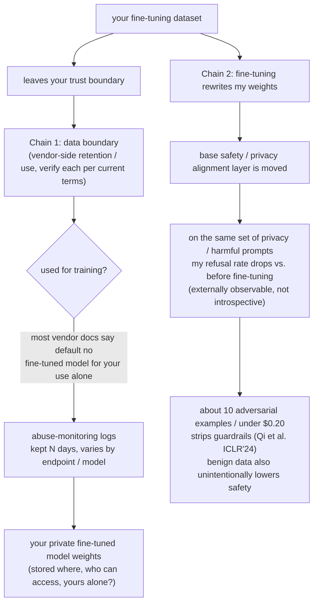

import PrivacyMeta from '@site/src/components/PrivacyMeta';

<PrivacyMeta era="Volume 6 · Governance and compliance" technique="Inference-service privacy" audience={['Privacy Engineer', 'Compliance Engineer', 'ML Engineer']} severity="Medium" maturity="Research" evidence="Research" />

> In one sentence: fine-tuning on a vendor API (fine-tuning-as-a-service) has two faces to keep separate. **Face 1 — where your fine-tuning data goes on the vendor's side**: how long it's retained, whether it's used for training or human review, whether the resulting fine-tuned model is yours alone — none of this is a single number; **verify each vendor's current terms item by item** (most vendor docs say fine-tuning inputs/outputs aren't used for training by default and the fine-tuned model is for your use alone — but still check the terms for *your* tier, *your* endpoint, *your* region, and remember they change). **Face 2 — fine-tuning itself erodes alignment**: Qi et al. (ICLR 2024) used OpenAI's fine-tuning API and **only about 10 adversarial examples, costing under $0.20**, to strip GPT-3.5 Turbo's guardrails; and crucially, **even fine-tuning on benign data (Alpaca / Dolly) unintentionally degraded safety alignment**. Conclusion first: **handing data to a vendor fine-tuning API means you must both verify the data boundary and assume fine-tuning will weaken alignment — including the privacy refusals the model would otherwise make.** (Note: Qi et al. is primarily a result about **safety-alignment erosion**, **not** a direct data-leak / PII-extraction result — this entry uses it to say "fine-tuning weakens privacy refusals along with the rest," and does **not** overstate it as "fine-tuning can extract the training data.")

## Mechanism: what happens on my side

When you hand a batch of fine-tuning data to a vendor API, you trigger **two independent** chains — don't conflate them into one thing.

**Chain 1 (data boundary)**: your fine-tuning data **leaves your trust boundary** and enters the vendor's systems, where it passes through a series of retention / use hops — used for training? written to abuse-monitoring logs? kept how long? subject to human review? where are the resulting fine-tuned weights stored, and are they for your use alone? This chain has the same shape as [Inference-service data boundary](./inference-service-data-boundary.mdx), but it happens at **fine-tuning time** and adds two assets that each need their own boundary: the **fine-tuning dataset** and **your private fine-tuned model weights**.

**Chain 2 (alignment erosion)**: fine-tuning **rewrites my weights**. The base model ships with a layer of safety / privacy alignment (refusing harmful requests, refusing to divulge personal information). Fine-tuning me further on your data **moves the parameters that layer lives in** — even if your data is entirely benign and entirely unintentional, the alignment may get **partly worn away as a side effect**. To an outside user this shows up as: for the same privacy / harmful request, before fine-tuning I would refuse, and after fine-tuning I'm more likely to comply.

There is a first-person red line here, and it must be written as something externally observable rather than self-introspective: **I will not "promise to remember to hold the privacy refusal" — whether I refuse depends on whether the alignment layer survives fine-tuning; what is externally observable and regression-testable is "after fine-tuning, my refusal rate on the same set of privacy / harmful prompts drops relative to before fine-tuning," not any self-report of mine about "whether I'm still safe."**



## Threat surface: which hop breaks the boundary

Treating "we fine-tune on the vendor and the vendor says it doesn't train on the data" as the whole story misses risks on both chains:

**On the data-boundary side (same as Inference-service data boundary, plus fine-tuning assets)**:

- **Retention / training use of fine-tuning data**: how long is your fine-tuning data kept? Does it enter abuse-monitoring logs? Is it human-reviewed? Docs often say fine-tuning I/O isn't used for training by default, but **retention period, logs, review, and per-tier differences** still need item-by-item verification.
- **Who owns the fine-tuned weights, and where they live**: is the resulting fine-tuned model **for your use alone — never served, never used to train others' models** (which is how OpenAI describes its fine-tuned models)? The weights are hosted on the vendor's side, and they are themselves an asset derived from your private data.
- **Deletion semantics**: after you delete the fine-tuning dataset / fine-tuned model, are derived copies (logs, caches, checkpoints) deleted too? Can "deletion" be overridden by a legal hold (same as at inference time — see the neighboring entry)?

**On the alignment-erosion side (this is the face this entry adds over the inference-time entry)**:

- **The attacker only needs fine-tuning-API access + a few samples**: in Qi et al.'s threat model, the adversary can submit training samples to the vendor fine-tuning API — **about 10 adversarial examples, costing under $0.20**, removed GPT-3.5 Turbo's guardrails. This **actively** weakens alignment, at a very low bar.
- **Unintentional erosion (the more common threat)**: you have **no malicious intent** — you just fine-tune normally on business data (or even public Alpaca / Dolly) — and Qi et al. measured that this too **unintentionally lowers** safety alignment. That is, the threat doesn't require an attacker; the **normal fine-tuning process itself** can introduce an alignment regression.
- **Privacy refusal is one of the things eroded**: the base alignment includes privacy refusals like "refuse to divulge personal information / refuse to help de-anonymize." When alignment is worn away, this part **regresses along with it** — so the fine-tuned model is more likely to assist a privacy-crossing request that should have been refused.

**Adjudication and the boundary you must not cross (key)**: Qi et al. measure **safety-alignment breakdown** (compliance / refusal rates on harmful requests), **not** "extracting the training data out of the fine-tuned model." So this entry can only conclude "fine-tuning erodes alignment, weakening privacy refusals along with it"; **"someone can extract your fine-tuning data out of the model" is a separate claim** whose mechanism anchors on the "poisoning amplifies extraction" path in [Privacy-targeted poisoning](../02-memorization-extraction/privacy-poisoning.mdx), and **a top-venue primary on 'fine-tuning-data extraction' via a vendor fine-tuning API is currently lacking** — treat that cell as unsettled and don't overstate it.

:::caution The "fine-tuning-data extraction" cell currently lacks sufficient evidence — don't design defenses on it
"Extracting someone else's submitted fine-tuning data out of the resulting model" feels plausible, but **end-to-end extraction via a vendor fine-tuning API currently lacks top-venue / top-journal primary evidence**. The citable neighboring mechanism is [Privacy-targeted poisoning](../02-memorization-extraction/privacy-poisoning.mdx) (Truth Serum, CCS 2022) — which proves "poisoning amplifies extraction / membership inference on **other** records," **not** "the fine-tuning API replays the submitted fine-tuning set." Until a top-venue primary is in hand, don't write "fine-tuning data can be extracted by others" into a threat model or an external commitment as established fact.
:::

## How the defense works

Two chains need two sets of defenses, and you can't skip either:

**For the data boundary**: treat fine-tuning as a **data egress + derived-asset hosting** event — apply the "verify the data lifecycle hop by hop + put it in writing" method from [Inference-service data boundary](./inference-service-data-boundary.mdx), and **additionally define a boundary for two extra assets: the "fine-tuning dataset" and the "fine-tuned model weights"** (retention / training use / deletion propagation / whether it's for your use alone). Fix the key variables as one set: fine-tuning-data training use / fine-tuning-data retention / human review / whether the fine-tuned model is yours-alone-not-served / deletion semantics / data residency / subprocessors / DPA·BAA — each with "source of the term + version date."

**For the fine-tuning data itself**: **minimize what you hand over** — if you can redact / de-identify, don't carry raw PII (see PII detection & redaction); if you can use synthetic / sub-sampled data, don't pour in the full set. The less you hand over, the smaller both the Chain-1 retention surface and the Chain-2 surface of writing private fragments into the weights.

**For alignment erosion**: assume "alignment will be worn away" by default, and do **not** count on the vendor fine-tuning API to hold it for you — so **re-test privacy / safety refusals after fine-tuning**, turning the alignment regression into an observable, regression-testable metric rather than a trust statement. Calling out the boundary: the vendor's promise that "we don't train on your data" **only covers Chain 1**; it **guarantees nothing** about Chain 2 — your own benign fine-tuning will weaken alignment regardless, and that has nothing to do with whether the vendor holds the data boundary.

## Buildable recipe (FTaaS two-chain checklist + post-fine-tuning alignment regression)

```text
A. Data boundary (verify each per the vendor's current terms; written answer + date stamp;
   terms change):
   1. Fine-tuning-data training use: are your fine-tuning inputs/outputs used to train the
      vendor's models? Default or opt-out?
   2. Fine-tuning-data retention: how many days? Are abuse-monitoring copies separate?
      At expiry, real deletion or just "invisible"?
   3. Human review: is fine-tuning data human/automated-reviewed? Who can access it?
   4. Model ownership: is the resulting model for your use alone, never served, never used
      to train others' models?
   5. Deletion propagation: after you delete the FT set/model, are logs/caches/checkpoints
      deleted too? Can it be overridden by a legal hold?
   6. Data residency / subprocessors / DPA·BAA: same list as at inference time, each cell
      carrying "source of the term + version date."

B. Fine-tuning-data minimization (before you hand it over):
   7. Redact/de-identify: strip non-essential PII (see PII detection & redaction);
      use synthetic/sub-sampled data instead of pouring in the full raw set.

C. Alignment-erosion regression (this step is unique to this entry and not optional):
   8. Build a "privacy + safety refusal" probe set (a few each of personal-info disclosure /
      de-anonymization assistance / harmful requests).
   9. Run it once before fine-tuning, record the baseline refusal rate; run the same probe
      set again after fine-tuning.
   10. Compare before/after refusal rates: if privacy/safety refusal rate drops noticeably
       -> alignment is eroded; re-align / narrow the fine-tune / change approach.
```

Any quantitative parameter (refusal-rate threshold, sample size, retention days) must carry **your own experimental conditions and the vendor's current terms** when you deploy it — Qi et al.'s "about 10 examples / under $0.20" is the setting for GPT-3.5 Turbo on its fine-tuning API in 2023–24; don't copy it as your own number.

**Minimal testable assertions** (turn "alignment erosion" from trust into a regression check):

- How to test: keep a fixed "privacy + safety refusal" probe set; for **each** fine-tuned model you ship, run "pre-fine-tuning baseline" and "post-fine-tuning" and record both refusal rates (by your definition of "correct refusal").
- Pass: after fine-tuning, the refusal rate on privacy / harmful probes is **not noticeably below** baseline (within your acceptable regression band); the fine-tuning data is minimized / de-identified; the data-boundary checklist has no blank cells, no stale cells, and matches the contract.
- Fail: the post-fine-tuning privacy / safety refusal rate drops noticeably (even with benign data), or a checklist cell has no source / contradicts the contract → mark it "alignment regressed / boundary unverified," re-align or narrow the fine-tune and re-test, and don't ship before the deployment decision.

## A real case / research progress (engineering feasibility)

(This entry is marked maturity "Research": the alignment-erosion side comes from Qi et al.'s research-grade demonstration; the data-boundary side cites vendor official docs for the current state. Below distinguishes "research results" from "vendor state.")

**Research result — fine-tuning erodes alignment (Qi et al., ICLR 2024)**:

- **Active jailbreak (very low cost)**: using OpenAI's fine-tuning API, **only about 10 adversarially designed examples, costing under $0.20**, stripped GPT-3.5 Turbo's safety guardrails, making it respond to harmful instructions far more broadly. How low the bar is is exactly the inherent risk of the "open a fine-tuning API to users" service shape.
- **Unintentional erosion (more common)**: even fine-tuning normally on **benign** datasets (e.g. Alpaca, Dolly) **unintentionally lowered** safety alignment on GPT-3.5 Turbo and Llama-2-7b-Chat — meaning the risk **doesn't require** any malice; normal business fine-tuning can introduce an alignment regression by itself.
- **How this entry uses it (the boundary, restated)**: this is a result about **safety-alignment erosion**. From it this entry concludes "fine-tuning weakens privacy refusals along with the rest" (privacy refusal is part of alignment), but does **not** extrapolate to "fine-tuning can extract training data / PII" — that is a separate claim with separate evidence (see the `:::caution` above).

**Vendor state — fine-tuning data boundary (official docs, stamped 2026-06; verify current terms before deploying)**:

:::caution The following are point-in-time vendor fine-tuning terms, **broken out by endpoint / feature / model / product tier and subject to change** — verify the latest official docs and your contract before citing
The table below is stamped 2026-06 and only illustrates "verify the boundary of the fine-tuning data / fine-tuned model cell by cell"; it is not a basis for deployment. Take any cell as subject to the current official docs you check and the contract you sign:

| Vendor | Is fine-tuning data used to train the vendor's models | Fine-tuning data / model retention | Fine-tuned model ownership |
|---|---|---|---|
| OpenAI | Official docs: no by default (API business data not used for training unless you explicitly opt in) | Fine-tuning training data is handled per its data-controls terms and retained until you delete it; **retention / abuse logs vary by endpoint** | Official wording: your fine-tuned model is **for your use alone** — never served, never used to train other customers' or OpenAI's models |
| Anthropic | Official: commercial / API I/O not used for training by default (not trained on without your express permission) | Per its *API and data retention*: commercial terms don't retain conversation content by default; features that must store use the shortest TTL; **certain models require 30-day retention** | Under commercial terms the output is yours; specific fine-tuning / customization availability and terms are per its current product docs |
| Google (Vertex AI / Gemini) | Official data governance: **your data is not used to train foundation models without your permission**; tuning data is used to produce your tuned model | Per Vertex data governance and your project config; retention / region vary by configuration and product tier | The tuned model produced is for your use within your project |

- **Verify cell by cell — don't stretch one cell across the platform.** At the same vendor, retention and ownership can differ widely by fine-tuning endpoint / model / product tier; treating "one cell" as the whole boundary is exactly the false security this entry breaks (same as Inference-service data boundary).
- **"Not used for training" only covers the data-boundary side.** Even if the vendor fully holds "we don't train on your fine-tuning data," that **does nothing** to stop your own fine-tuning from wearing alignment away — the two chains are independent.

(The table is stamped 2026-06: the OpenAI row is per its *Fine-tuning guide* and data-controls page; the Anthropic row is per its *API and data retention* page; the Google row is per its *Vertex AI / Gemini data governance* page. Verify the current official docs and your contract before deploying.)
:::

Together the two kinds of evidence say the same thing: **fine-tuning-as-a-service has two independent privacy chains — the vendor-side data boundary (verifiable cell by cell, changeable, subject to law) and the alignment erosion on your side (privacy refusals included, and benign data too) — and each must be defended and tested separately.**

## Residual risk and trade-offs

Calling out each false security:

- **"The vendor says it doesn't train on fine-tuning data" ≠ safe.** That covers only one cell of Chain 1 — retention period, abuse logs, human review, fine-tuned-weight hosting, and deletion propagation still need item-by-item verification; and it covers **nothing** of Chain 2's alignment erosion.
- **"We only fine-tune on benign business data" ≠ alignment holds.** Qi et al. specifically show benign data (Alpaca / Dolly) also **unintentionally** lowers safety alignment — "no malice" doesn't mean "no regression."
- **"The fine-tuned model is still that safe base" is an illusion.** Fine-tuning rewrote the weights; the base's safety / privacy refusals may already have regressed — you won't know without re-testing.
- **Jailbreak cost is tiny and asymmetric.** About 10 examples, under $0.20, removed guardrails on an open fine-tuning API (Qi et al.); that cost asymmetry means "open fine-tuning" is itself an attack surface.
- **"Fine-tuning data can be extracted by others" currently lacks sufficient evidence — don't promise on it.** End-to-end fine-tuning-data extraction via a vendor fine-tuning API lacks a top-venue primary (see the `:::caution` above); you can neither inflate the risk on it nor guarantee "it's impossible" — treat it as unsettled.
- **Magnitudes are bound to the experimental setting.** "About 10 examples / under $0.20" and "benign data lowers safety" come from GPT-3.5 Turbo / Llama-2-7b-Chat on their 2023–24 fine-tuning API / weights and **cannot be transferred directly** to your model and data — measure it yourself before deploying.

## Compliance mapping

- **GDPR**: handing a fine-tuning set containing personal data to a vendor fine-tuning API hands personal data to a **processor / subprocessor** — you need a DPA, an explicit subprocessor list, a cross-border transfer mechanism, and retention / deletion arrangements; the resulting fine-tuned model, as a derived asset, also falls within deletion / data-subject rights.
- **OWASP LLM02:2025 / LLM06**: sensitive-information disclosure includes the "input retained by the provider" facet; fine-tuning further adds the "more likely to divulge / assist a crossing once alignment is weakened" facet.
- **EU AI Act**: training / fine-tuning data transparency obligations make "whose data is fine-tuned on, and how the resulting model is used" more explicit.

(Both compliance and vendor terms evolve with versions; this section is stamped 2026-06 — verify the latest enacted text before citing.)

## How this differs from neighboring techniques

- **Fine-tuning-as-a-service privacy vs. Inference-service data boundary** ([Inference-service data boundary](./inference-service-data-boundary.mdx)): that entry is **inference time** — you send out one prompt and the vendor handles it; this entry is **fine-tuning time** — you hand out a **batch of training data** (adding two derived assets, the "fine-tuning dataset" and "fine-tuned model weights," that each need a boundary), and it **adds a chain that inference time doesn't have: fine-tuning rewrites the weights and erodes alignment**. This entry reuses that data-boundary checklist method; the alignment-erosion face is unique to this entry.
- **Fine-tuning-as-a-service privacy vs. DP fine-tuning** ([DP fine-tuning](../03-conversational-llms/dp-fine-tuning.mdx)): DP fine-tuning gives a **formal guarantee at training time** (clipping + noise, bounding single-sample influence within an (ε, δ) bound); this entry isn't about a mathematical guarantee — it's about two engineering realities **at the vendor-API layer**: the boundary of your data after you hand it over, and the erosion of **alignment** by fine-tuning (DP or not). Even if you use DP, DP bounds "a single sample's influence on parameters"; it does **not** directly guarantee "safety / privacy refusals won't regress" — alignment erosion still needs its own re-test.
- **Fine-tuning-as-a-service privacy vs. Privacy-targeted poisoning** ([Privacy-targeted poisoning](../02-memorization-extraction/privacy-poisoning.mdx)): poisoning is **actively mixing samples into the training set to amplify extraction / membership inference on other records**; the alignment erosion here **doesn't require** an attacker (benign data too), and it measures **a drop in refusal ability** rather than "amplified extraction." When this entry raises the unsettled "can you extract the fine-tuning data" angle, the mechanism it anchors on is exactly that poisoning path — but note it proves "amplified leakage on **other** records," not "the fine-tuning API replays your fine-tuning set."

## Version notes

:::note Applicable versions
"Fine-tuning erodes alignment (including unintentional erosion from benign data)" is a research conclusion Qi et al. established on **GPT-3.5 Turbo and Llama-2-7b-Chat** (ICLR 2024); its magnitudes — "about 10 adversarial examples / under $0.20 strips guardrails," "benign data (Alpaca / Dolly) unintentionally lowers safety" — are **bound to that experimental setting and the OpenAI fine-tuning API / open weights of the time, and cannot be transferred directly** to your model and data; measure it yourself before deploying. It is a **safety-alignment-erosion** result, and from it this entry concludes only "privacy refusals are weakened along with the rest," not "fine-tuning-data extraction" (which lacks a top-venue primary and is treated as unsettled). All vendor terms on the data-boundary side (retention, training use, fine-tuned-model ownership, ZDR eligibility) are vendor docs and **change frequently** — every vendor statement here is stamped 2026-06 and is illustrative only; any deployment decision must rest on the **current** official docs you check and the contract you sign, reviewed quarterly. (Sources verified 2026-06.)
:::

## Further reading and sources

Mixed evidence — **primary: Research** (Qi et al. ICLR'24, alignment erosion); **supplementary: Official docs** (OpenAI / Anthropic / Google fine-tuning and data-governance pages, the data-boundary side).

- [Fine-tuning Aligned Language Models Compromises Safety, Even When Users Do Not Intend To! (Qi et al., ICLR 2024)](https://openreview.net/forum?id=hTEGyKf0dZ) — this entry's primary source (**safety-alignment erosion**, not data leak). On OpenAI's fine-tuning API, about 10 adversarial examples costing under $0.20 stripped GPT-3.5 Turbo's guardrails; benign data (Alpaca / Dolly) also unintentionally lowered safety on GPT-3.5 Turbo and Llama-2-7b-Chat.
- [OpenAI, Fine-tuning guide (official)](https://platform.openai.com/docs/guides/fine-tuning) — official docs: fine-tuning data retained until you delete it; the resulting fine-tuned model is for your use alone (never served, never used to train others' models).
- [Anthropic, API and data retention (official)](https://platform.claude.com/docs/en/manage-claude/api-and-data-retention) — official docs: commercial / API inputs and outputs not used for training by default, log retention, ZDR.
- [Google Cloud, Vertex AI / Gemini data governance (official)](https://cloud.google.com/vertex-ai/generative-ai/docs/data-governance) — official docs: your data is not used to train foundation models without permission; tuning data is used to produce your tuned model.
- Neighboring: [Privacy-targeted poisoning](../02-memorization-extraction/privacy-poisoning.mdx) — the mechanism the unsettled "can you extract fine-tuning data" angle anchors on (poisoning amplifies extraction on **other** records, CCS 2022); used as a mechanism reference, not as evidence of "direct extraction via a fine-tuning API."
