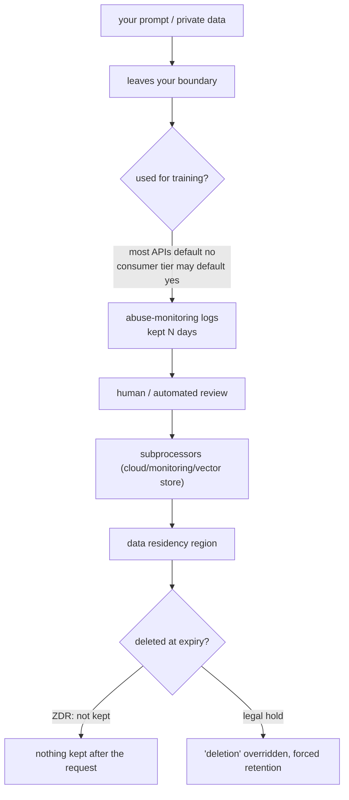

import PrivacyMeta from '@site/src/components/PrivacyMeta';

<PrivacyMeta era="Volume 6 · Governance and compliance" technique="Inference-service privacy" audience={['Privacy Engineer', 'Compliance Engineer', 'Security Engineer']} severity="Medium" maturity="Production" evidence="Official docs" />

> In one sentence: sending private data to a third-party inference API, "they don't train on it" is often true — but that's just **one cell** of the data boundary. You also have to verify, item by item: how long it's retained, how long abuse-monitoring logs are kept, how enterprise vs. consumer tiers differ, whether there's zero data retention (ZDR), who the subprocessors are, which region the data lands in, and whether there's a DPA/BAA. And remember: **these terms change, and can be overridden by a legal order.** Treating one line — "we don't train on it" — as the whole boundary is the most common operational-phase false security.

## Mechanism: what happens on my side (the framing)

Your prompt reaching me is a **data egress** — it leaves your trust boundary and enters the provider's systems. There it passes through a chain of hops, each a potential point of retention or leakage:

used to improve / train the model? → written into **abuse-monitoring logs**, kept how long? → seen by **human review**? → passing through **subprocessors** (cloud, vector store, monitoring)? → landing in which **region**? → entering **caches / eval sets**?

Red line: I shouldn't write "I promise not to keep your data" — keeping it isn't up to "me," it's defined by the provider's terms plus your configuration. What is checkable: **this data boundary is defined by written terms and actual configuration; it can be verified item by item, and it changes with versions.**



## Threat surface: which hop breaks the boundary

Treating "data boundary" as one sentence happens because you only watch the "training" hop. The real retention / leakage risk is spread across the whole chain:

- **Training use**: most APIs default to no training; consumer / team / enterprise / API tiers can default differently — don't carry one tier's assumptions to another.
- **Retention period**: how many days by default? Do abuse-monitoring copies count?
- **Human review / abuse monitoring**: has a person / model looked at the retained data?
- **Subprocessors**: who did the provider hand the data to (cloud, monitoring, third parties)? The boundary widens accordingly.
- **Data residency**: which jurisdiction it lands in decides which law applies.
- **Plan differences**: free / personal / team / enterprise often differ in defaults and options.

## How the defense works

Don't ask the single question "will you train on it"; verify hop by hop along the **data lifecycle**, and **put the answers in writing** (DPA / ZDR agreement) rather than stopping at a line on a marketing page. Fix the key variables as one set: training use / retention / abuse monitoring / plan differences / ZDR / data residency / subprocessors / DPA·BAA. Each needs "source of the term + version date + whether it covers logs and caches."

## Buildable recipe (vendor data-boundary checklist)

```text
Ask each item, with a written answer + a date stamp (vendor terms change):
1. Training use: are API inputs/outputs used for training? Default or opt-out?
   How do consumer and API tiers differ?
2. Retention: how many days by default? Are abuse-monitoring copies separate?
   At expiry, real deletion or just "invisible"?
3. Abuse review: is retained data subject to human/automated review? Who can access?
4. Zero data retention (ZDR): offered? Self-serve toggle or account-team enabled?
   Which endpoints does it cover?
5. Subprocessors: where's the list? Does it include cloud/monitoring/vector store?
   How are changes notified?
6. Data residency: can you pin a region? Where does it default?
7. Legal docs: can you sign a DPA? A BAA for healthcare? SOC2 / ISO reports?
8. Opt-out coverage: does opt-out cover logs, caches, eval sets, and human-review
   samples at the same time?
```

This checklist is the seed of the toolkit's "LLM Vendor Data Boundary Checklist" — **use it as an artifact, file it per vendor, review it quarterly**, because the terms change.

## A real case / current vendor state (stamped 2026-06; verify current terms before deploying)

:::caution The following are point-in-time vendor terms, **broken out by endpoint / feature / model and subject to change** — verify the latest official docs and your contract before citing
The table below is stamped 2026-06 and only illustrates "verify the boundary cell by cell"; it is not a basis for deployment:

| Vendor | Scope | Trained on by default | Default retention | ZDR / exceptions |
|---|---|---|---|---|
| OpenAI | API (most endpoints) | No (unless you opt in) | abuse-monitoring logs commonly ~30 days then deleted (longer if legally required / to prevent abuse); **but application state, retention, and ZDR eligibility vary by endpoint / feature** | ZDR offered to eligible enterprises, not a self-serve toggle — enabled per endpoint by your account team |
| Anthropic | API (commercial terms) | No (not used for training without your express permission) | **conversation content (your inputs and Claude's outputs) is not retained by default**; features that must store use the shortest practical TTL; **certain models (Covered Models) require 30-day retention** | ZDR covers the Messages and Token Counting APIs; **not** Console / Workbench, consumer products, Teams / Enterprise interfaces, or Managed Agents; data may be kept up to 2 years for violations or where required by law |

- **Verify cell by cell — don't stretch one cell across the platform.** At the same vendor, retention and ZDR eligibility can differ widely by API / feature / model (e.g. Anthropic's Batch ~29 days, code-execution containers up to 30 days, Files until explicitly deleted). Treating "one cell" as the whole boundary is exactly the false security this entry breaks.
- **"Deletion" can be overridden by law.** In its litigation with The New York Times, OpenAI was at one point ordered by a court to **preserve** data it would otherwise delete — a legal hold sits above any retention promise, and "deleted at expiry" is not absolute.

(Stamped 2026-06: the Anthropic row is verified against its official *API and data retention* page; the OpenAI row is per its *Data controls in the OpenAI platform* page — verify the current official docs and your contract before deploying.)
:::

They confirm the same thing: **a data boundary is a set of terms that are checkable, changeable, and subject to outside law — not a line that says "we take privacy seriously."**

## Residual risk and trade-offs

Calling out each false security:

- **"Default no training" ≠ "no retention."** Not training on it doesn't mean not logging it — abuse-monitoring copies are usually still kept for N days.
- **"We deleted it" can be overridden by a legal hold.** See OpenAI / NYT above: litigation or regulators can force retention of data you thought was deleted.
- **Tiers default differently.** At the same vendor, the default data use of consumer / team / enterprise / API tiers can differ (some consumer products default to training on your data, requiring opt-out) — don't carry one tier's assumptions to another.
- **ZDR is not a self-serve toggle.** It usually needs eligibility review + account-team enablement + specific endpoints; if you haven't signed it, don't assume you have it.
- **Opt-out may not cover the whole chain.** Opting out of "training" may not also cover logs, caches, eval sets, and human-review samples — confirm coverage item by item.
- **Subprocessors widen the boundary.** You trust the vendor, but the data may flow to its cloud / monitoring / third parties — the boundary is larger than the contract's front page.

## Compliance mapping

- **GDPR**: third-party inference hands personal data to a **processor / subprocessor** — you need a DPA, an explicit subprocessor list, a cross-border transfer mechanism (e.g. SCCs), and retention / deletion arrangements.
- **OWASP LLM02:2025**: sensitive information disclosure also covers the "input retained by the provider / used for training" facet; mitigations include clear data-use terms and opt-out.
- **EU AI Act**: training-data transparency obligations make "whose data, used how" more explicit.

(Both compliance and vendor terms evolve with versions; this section is stamped 2026-06 — verify the latest enacted text before citing.)

## How this differs from neighboring techniques

- **Data boundary (operational phase) vs. DP fine-tuning (training phase)**: this entry is a **responsibility-and-terms mapping** — once data is handed over, who processes it and by what rules; [DP fine-tuning](../03-conversational-llms/dp-fine-tuning.mdx) is a **technical guarantee at training time**. One asks "how are the terms written and verified," the other "can single-sample influence be mathematically bounded."
- **Data boundary vs. context-surface privacy**: context-surface privacy is about "things in my current context being extracted"; this entry is about "data you actively sent out, and how the provider handles it on their side."

## Version notes

:::note Applicable versions
The data-lifecycle checklist is a **vendor-agnostic** methodology, stable over the long run. But the **specific values** filled into it (retention days, whether training is on by default, ZDR conditions, the subprocessor list) are vendor terms and **change frequently** — every vendor figure here is stamped 2026-06 and is illustrative only; any deployment decision must rest on the **current** official docs you check and the contract you sign, reviewed quarterly. (Sources verified 2026-06.)
:::

## Further reading and sources

- [Data controls in the OpenAI platform (OpenAI official)](https://platform.openai.com/docs/guides/your-data) — API not trained on by default, abuse-log retention, enterprise zero data retention (ZDR).
- [API and data retention (Anthropic official)](https://platform.claude.com/docs/en/manage-claude/api-and-data-retention) — commercial terms not used for training, API log retention, ZDR.
- [OWASP LLM02:2025 Sensitive Information Disclosure](https://genai.owasp.org/llmrisk/llm022025-sensitive-information-disclosure/) — sensitive-information disclosure risk including the "input retained / used for training" facet, and mitigations.
