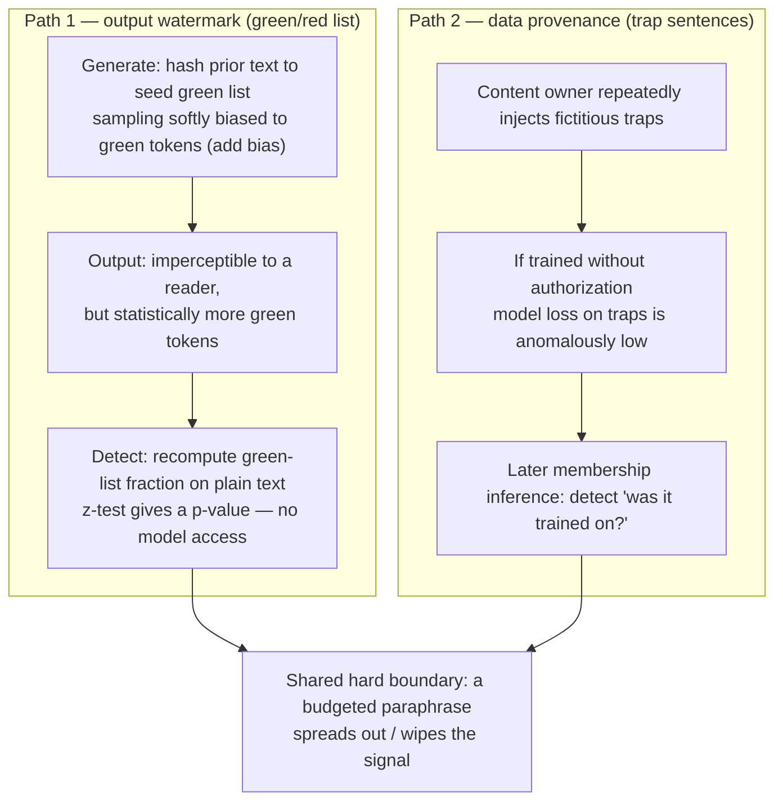

import PrivacyMeta from '@site/src/components/PrivacyMeta';

<PrivacyMeta era="Volume 6 · Governance and compliance" technique="Governance & compliance" audience={['Privacy Engineer', 'Compliance Engineer', 'Security Engineer']} severity="Medium" maturity="Research" evidence="Research" />

> In one sentence: watermarking does two things — it **puts a detectable mark on the text I generate** (a green/red-list watermark whose detector needs no access to my weights), and it lets you **later detect "was my data trained on?"** (bury fictitious "trap" sentences in a corpus, then surface them with membership inference). But both share one hard boundary: **one paraphrase with enough budget wipes the signal out.** Kirchenbauer et al.'s (ICML 2023) green/red-list watermark gives interpretable p-values from a z-test and needs no model access to detect, but detectability **trades against text entropy** (low-entropy / short outputs are harder to mark); their follow-up reliability study (ICLR 2024) measured that **human and especially LLM-based paraphrase markedly lower detectability**, the watermark gets "spread out," detection needs more tokens, and WinMax + SelfHash only **partially** recover. Conclusion first: a watermark is **probabilistic evidence for provenance / forensics**, not a strong guarantee — **don't read "watermarked" as "can't be removed."**

## Mechanism: what happens on my side

A watermark changes my **sampling distribution**, not what I "want to say." Take Kirchenbauer et al.'s (ICML 2023) **green/red-list** scheme:

1. **Marking at generation**: before generating each token, hash the **prior few tokens** to seed a pseudo-random split of the whole vocabulary into a "green list" and a "red list"; sampling is then **softly biased toward the green list** (add a small bias δ to green-list logits). So my output statistically has **more green tokens** — imperceptible to a reader, but the distribution carries a trace.
2. **Verification at detection**: the detector **looks only at the text**, recomputes the green list at each position with the same hash rule, counts "the fraction of tokens that land in the green list," and runs a **z-test** — significantly more green tokens than the random expectation (~half) means "watermarked," with an interpretable **p-value / z-score**. **This step needs neither access to my weights nor the original prompt.**

A second provenance path is **data traps (copyright traps, Meeus et al. ICML 2024)**: a content owner **repeatedly injects fictitious "trap" sentences** (unique, non-existent in the real world) into their corpus; if those sentences are **trained without authorization** into some model, you can later use **membership inference** (does the model's perplexity / loss on the trap sentences look anomalously low?) to detect "**was my data trained on?**"

To be clear about the red line: it isn't "I remember marking this passage" or "I know this data is in my training set" — I can't reliably introspect either; **what's externally recomputable is** that the detector recomputes the green-list fraction on **plain text** with a public hash rule and runs a z-test for a p-value (output watermark), or computes loss / perplexity on **trap sentences** for membership inference (data provenance). The verdict lives in an **external statistical test**, not in my "remember / know."



## Threat surface: who removes it, and can they

Treat "watermark / provenance" as the defender; the **attacker's goal is to remove the signal**, and the threat surface splits by the two paths.

**Removing the output watermark (the reliability stress-test in Kirchenbauer et al. ICLR 2024)**:

- **Attacker model**: takes my watermarked output, wants to strip the mark while keeping the meaning; needs no access to my weights, only a **paraphraser** (a human, or another LLM).
- **Method and effect**: they systematically stress-tested the green/red-list watermark's robustness — **human and especially LLM-based paraphrase markedly lowers detectability**; mechanistically the watermark gets "**spread out**" across the paraphrased text, so detection **needs more tokens** to re-accumulate statistical significance. Net result: the watermark **survives light corruption** (a few insertions/deletions, copy-pasted snippets), but **a paraphrase with enough budget can wipe the signal out.**
- **Entropy as a built-in weak spot**: detectability **trades against text entropy** — low-entropy / highly constrained / very short outputs are inherently hard to mark and detect (a limit already flagged in ICML 2023, not an implementation bug).

**Boundary of data provenance (trap sentences, Meeus et al. ICML 2024)**:

- **Success criterion**: only when traps are **long enough × repeated enough** is later membership inference reliably detectable; short or few-repeat traps don't carry enough signal. The paper validated this in a **controlled 1.3B, from-scratch pre-training** setup — before porting its detectability thresholds to someone else's large model / real training pipeline, you must re-check the conditions at the source.
- **What it solves / doesn't**: traps provide **statistical evidence** for "did this party train on my data," but don't prevent training and don't by themselves prove a legal infringement conclusion.

## How the defense works

State what each path rests on, what it protects and doesn't — no silver bullet.

- **The output watermark rests on "a statistical bias in the distribution + recomputable detection"**: the green list is fixed by the prior-text hash, so the detector can recompute it on plain text and run a z-test **without distributing a key to readers and without model access**. It gives **probabilistic evidence** (a p-value), not a deterministic signature — inherently with false positives / negatives, and **not robust to paraphrase**.
- **It does not protect low-entropy and short text**: when I have "essentially one reasonable phrasing" (code, fixed formats, very short answers), the injectable green-list bias is small, so the watermark **signal is inherently weak**.
- **Data provenance rests on "an identifiable human-planted marker + membership inference"**: trap sentences are **deliberately injected** by the content owner and don't exist in the real world, so once trained in, their anomalously low loss is **attributable**. It **only answers "was it trained on,"** not "how much / whether it's lawful."
- **Shared non-protection**: neither **stops a budgeted paraphrase / rewrite** — an attacker willing to spend compute to rewrite the text will spread out the output watermark and make trap sentences no longer appear verbatim, dropping the signal below the detection threshold.

## Buildable recipe

Back to a neutral technical register — copyable, verifiable, parameters with conditions.

```text
1. Output watermark (green/red list, the Kirchenbauer 2023 scheme):
   - Key hyperparameters: green-list fraction gamma (e.g. 0.25 / 0.5), the bias delta added to
     green-list logits (larger = easier to detect, more "skewed" text), prior-text window h for the hash
     (h=1 = look at the previous 1 token). All three trade "detectability vs text quality."
   - Detect: recompute the green-list hit rate on plain text with the same hash rule, run a
     z-test, set the z threshold to a target false-positive rate (e.g. 1e-2 / 1e-4); report
     z / p-value, not just "detected / not detected."
   - Robustness boost (Kirchenbauer 2024): add schemes like SelfHash + WinMax detection to
     "partially" recover under paraphrase — partial, not immune.
2. Data provenance (trap sentences, the Meeus 2024 scheme):
   - Inject fictitious sentences (unique, never naturally occurring) long enough and repeated
     enough times; keep an injection manifest.
   - Detect later: compute loss / perplexity on the trap sentences against a candidate model,
     run membership inference, compare to a set of non-injected control sentences.
   - Thresholds are bound to "length x repetition" — short or few-repeat traps lack signal;
     re-calibrate for your corpus scale.
3. Always treat the result as probabilistic evidence: report the test statistic + false-positive
   rate; don't treat a single "detected" as proof, and especially don't treat "not detected" as
   "definitely not watermarked / definitely not trained on" — paraphrase or low entropy both yield
   false negatives.
```

Every step is bound to **your text entropy distribution, injection budget, and acceptable false-positive/negative tier** — the same hyperparameters can detect at very different rates on a different workload.

**Minimal testable assertions** (turn "watermark effectiveness" into a regression-able eval, don't stop at "we added a watermark"; test it yourself):

- How to test: build a fixed eval set and run three tiers — (a) raw watermarked output, (b) lightly corrupted (a few insertions/deletions / copy-paste), and (c) **after LLM paraphrase** — measuring the detector's z-score / detection rate for each; on the provenance side, run membership inference once on a control model (no trap sentences trained) and once on the target model.
- Pass: (a)(b) detect reliably at the target false-positive rate and report a p-value; and **honestly record** the **drop** in (c) post-paraphrase detection rate plus "how many tokens are needed to be significant again."
- Fail: claiming (c) "still reliably detected," or not reporting false positives/negatives, or asserting "not watermarked / not trained on" straight from "not detected" — that passes off probabilistic evidence as a strong guarantee; go back, add the paraphrase tier and the control tier, and re-test.

## Research status (engineering feasibility)

(This entry's maturity is "Research": what follows is **paper-level** evidence; the numbers / thresholds are tied to each experiment's setup, not an endorsement that "watermarking is already a dependable strong guarantee.")

- **Green/red-list watermark + no-model-access detection (Kirchenbauer et al., ICML 2023, PMLR v202)**: proposes seeding a green list from a prior-text hash and softly biasing sampling toward green tokens; detection is a **text-only** z-test giving interpretable p-values with **no model access**, and they explicitly note **detectability trades against text entropy** — low-entropy / short outputs are harder to mark. This is the founding-and-boundary statement for the "output watermark" line.
- **Paraphrase wipes it out (Kirchenbauer et al., ICLR 2024)**: a reliability stress-test of the green/red-list watermark, concluding that **human and especially LLM-based paraphrase markedly lower detectability**, the watermark gets spread out, detection needs more tokens; WinMax + SelfHash **partially** recover. The net in one line: **survives light corruption, but a budgeted paraphrase can remove the signal** — exactly the empirical source for this entry's "don't treat it as a strong guarantee."
- **Data provenance via trap sentences + membership inference (Meeus et al., ICML 2024, PMLR v235)**: repeatedly inject fictitious "trap" sentences into a corpus so **unauthorized training** becomes later-detectable via membership inference; **detectable only when traps are long enough × repeated enough**, validated in a **controlled 1.3B from-scratch pre-training** setup. Treat it as "a tool that gives statistical evidence for 'was it trained on,' bound to injection scale" — not a legal conclusion that "establishes rights."

## Residual risk and trade-offs

Breaking the false security item by item:

- **A budgeted paraphrase removes the output watermark.** The one to remember: an attacker willing to spend a single LLM paraphrase spreads the green/red-list signal below the detection threshold; WinMax/SelfHash are **partial** recovery, not immunity. **"Watermarked" ≠ "can't be removed."**
- **Low-entropy / short text is inherently hard to mark and detect.** In code, fixed formats, and very short answers the injectable statistical bias is small — such outputs' watermarks are **inherently weak**; don't assume parity across all scenarios.
- **Detection is a probabilistic verdict with false positives / negatives.** A z-test gives a p-value, not hard proof; treating a single "detected" as legal-grade proof, or "not detected" as "definitely carries no watermark," are both misuses. **"Not detected" is often just paraphrased or too low-entropy.**
- **Trap-sentence provenance is bound to injection scale and only answers "was it trained on."** Short or few-repeat traps lack signal; it gives statistical evidence, doesn't prove a legal infringement conclusion, and doesn't prevent training. The paper's thresholds come from a controlled setup — re-calibrate for your corpus before porting.
- **Watermarking doesn't defend against other privacy leakage.** It does **provenance / forensics** — it doesn't reduce memorization regurgitation, doesn't stop training-data extraction, and doesn't replace DP; don't treat it as the mainstay of privacy defense.

## How this differs from neighboring techniques

- **Watermark provenance vs. model extraction & stealing (Volume 1)**: model watermarking / fingerprinting is the **post-hoc provenance** counter to **model extraction** (a stolen surrogate can be traced back) — see [Model extraction & stealing](../01-foundations/model-extraction-stealing.mdx), where "How the defense works" lists watermarking as a "doesn't prevent stealing, helps trace after the fact" item; this entry is about **text output** watermarks and **training-data** provenance — the objects are content and corpus, not model parameters.
- **Data provenance (trap sentences) vs. membership inference attack (Volume 1)**: membership inference is normally an **attack** — deciding "is a given sample in the training set"; trap sentences **flip it into a defensive tool**: the content owner deliberately injects identifiable sentences, then uses the same membership inference to detect "was it trained on?" Same technique, both sides of the fence — see [Membership inference attack](../01-foundations/membership-inference.mdx).
- **Watermark vs. training-data extraction (Volume 2)**: training-data extraction surfaces **real private data that's already been memorized** (a privacy leak); trap-sentence provenance **deliberately injects** fictitious sentences containing no real privacy, for forensics (a provenance tool). Both concern "what the model memorized," but one is a leakage surface exploited by an attacker, the other a marker the content owner plants — see [Training-data extraction](../02-memorization-extraction/training-data-extraction.mdx).

## Version notes

:::note Applicable versions
"Watermarking can put a detectable mark on generated text, and trap sentences + membership inference can detect training use, but a budgeted paraphrase can remove it" is a **model-generation-independent, paradigm-level** conclusion (the root cause is that a watermark is a statistical bias in the distribution that paraphrase can spread out, and provenance relies on verbatim markers that rewriting can bypass). But the **specific detection rate, whether it's still detectable after paraphrase, how many tokens it takes, and how long / how repeated traps must be** are tightly bound to scheme hyperparameters (gamma / delta / hash window), text entropy distribution, and experimental setup — Kirchenbauer's (2023 green/red list; 2024 reliability, green/red list) and Meeus's (2024 traps, controlled 1.3B from-scratch pre-training) numbers / thresholds **do not transfer directly** to your model and corpus; you must re-estimate against your own workload and test it yourself. Stamped 2026-06. (Sources verified 2026-06.)
:::

## Further reading and sources

- [A Watermark for Large Language Models (Kirchenbauer et al., ICML 2023, PMLR v202)](https://proceedings.mlr.press/v202/kirchenbauer23a.html) — green/red-list watermark + a no-model-access z-test detector; detectability trades against text entropy (low-entropy / short outputs are hard to mark). This entry's founding-and-boundary source for the "output watermark."
- [On the Reliability of Watermarks for Large Language Models (Kirchenbauer et al., ICLR 2024)](https://openreview.net/forum?id=DEJIDCmWOz) — robustness stress-test: human and especially LLM-based paraphrase markedly lower detectability, the watermark gets spread out; WinMax + SelfHash partially recover. This entry's empirical source for "paraphrase removes it."
- [Copyright Traps for Large Language Models (Meeus et al., ICML 2024, PMLR v235)](https://proceedings.mlr.press/v235/meeus24a.html) — inject fictitious trap sentences and detect unauthorized training later via membership inference; detectable only when long enough × repeated enough, in a controlled 1.3B from-scratch pre-training setup. This entry's "data provenance" source.
