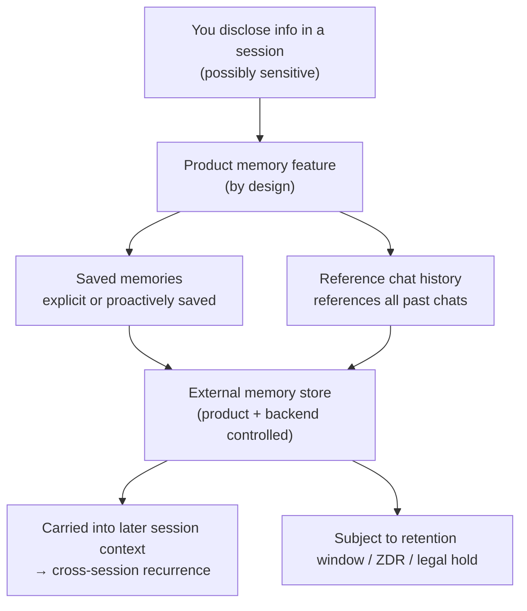

import PrivacyMeta from '@site/src/components/PrivacyMeta';

<PrivacyMeta era="Volume 6 · Governance and compliance" technique="Data lifecycle & data governance" audience={['Privacy Engineer', 'Compliance Engineer', 'Security Engineer']} severity="Medium" maturity="Production" evidence="Official docs" />

> In one sentence: a product-grade "memory" feature persists cross-session information to external stores **by design** — ChatGPT references **all** of your past conversations and, unprompted, **proactively** saves details it deems useful as "saved memories"; if you disclose something sensitive in a chat, it can land in memory. This is not an isolation bug (that's the incident in [cross-session memory bleed](../04-rag-agents/cross-session-memory-bleed.mdx)) — it's the governance consequence of the feature **working as built**: **how much you can see and delete is decided by the product and its backend**. The harder lesson comes from *NYT v. OpenAI* (2025): a **legal preservation order** once froze OpenAI's deletion of data that would otherwise have been deleted (roughly mid-May to late September), puncturing the false security of "turn off memory / it deletes on expiry" in one shot. Conclusion first: govern the product's memory as **one more copy of your data, subject to both the product and the law** — don't read "I flipped the switch off" as "it's all deleted."

## Mechanism: what happens on my side

Set the red line straight first — this is one of the sharpest spots in this theme: I **can't introspect** "what I remember about you." "Memory" isn't something inside my head; it's a cross-session state the product maintains for me in **external storage I can't reach**. What's externally observable and recomputable is only this: **which cross-session information the feature wrote to external storage, how long it's kept, and where you can see / delete it** — all decided by **product logic and backend terms**, not by "me." So below, the subject may be "I," but every predicate is a behavior someone else can verify, not my self-report.

Product memory typically follows two **by-design** retention paths (using ChatGPT as the example, per the official *Memory FAQ*):

- **Saved memories**: you explicitly ask it to remember ("remember I'm vegetarian"), or — **when you share information it deems useful for the future, it may save those details as a memory without you asking**. These persist until you delete them.
- **Reference chat history**: lets it draw on information from **all your past conversations** to personalize later answers; the docs state that with this on, **there is no storage limit** on what it can reference, and its sense of "what's useful" updates over time.

What gets written is then carried into the context of **later sessions** — so "what you disclosed last session" can surface in "the next session's" answer. That step is by design, not a misrouting.



## Threat surface: what's kept by design, can I see it, can I delete it

Break the risk into three lists, then draw the boundary against neighboring entries.

**(a) What's kept by design**

- **Proactive writes**: ChatGPT's official *Memory FAQ* says that "if you share information that might be useful for future conversations, ChatGPT may save those details as a memory **without you needing to ask**"; **sensitive information can end up in memory if you share it** (the docs acknowledge this, and say they are working to "steer ChatGPT away from proactively remembering sensitive information, like your health details — unless you explicitly ask it to").
- **Unbounded reference surface**: with `reference chat history` on, there's no storage limit on what can be referenced — the retention surface equals **your entire history**, not just the last few items.

**(b) How much I can see / control**

- **Visibility and control exist, but you have to actively use them**: in ChatGPT you can view / delete individual saved memories or clear them all, and turn memory off entirely, under *Settings › Personalization* (official *Memory FAQ*). The default is more **proactive** — it saves for you.
- **Opt-in vs. opt-out differences**: defaults differ across products. **Claude's memory is opt-in by design, off by default, and user- / org-controllable** (Anthropic official; see the case section); **ChatGPT is more proactive** (it writes proactively and references all history). Don't map one product's default onto another.

**(c) Can I delete it, and how far**

- **"Delete in one place" ≠ "delete everywhere"**: memory is **one more copy** of the data — flipping the switch off does not delete what's already stored; "deletion" often has to be done **in every place** (the saved-memories list, chat history, and possibly log / cache / abuse-monitoring copies). This is exactly the deletion-fan-out problem from [data lifecycle & deletion propagation](./data-lifecycle-deletion.mdx), landing on the specific cell of memory.
- **Deletion can be frozen by law**: retention windows and ZDR eligibility are set by the backend; more extreme still, a **legal preservation order can override a deletion commitment** (see the NYT case below).

**Boundary (what this entry covers, and doesn't)**:

- **vs. [cross-session memory bleed](../04-rag-agents/cross-session-memory-bleed.mdx) (Vol. 4)**: that one is an **isolation-failure incident** — A's data **bleeds** into B's session via a cache race; it's a bug. This entry is about the memory feature **working normally**: **your own** cross-session data being retained by design, and your visibility / deletability boundary over it — a **governance** problem. One asks "did isolation break," the other "what was kept by design, and can I delete it."
- **Excludes injection persistence**: planting instructions **into memory** via indirect prompt injection to later manipulate the agent (SpAIware-style) belongs to the **data-exfiltration / injection** topic and is not covered here — this entry is only about **retention and deletion governance**.

## How the defense works

This defense rests not on cryptography but on **bringing product memory into data-lifecycle governance**, holding by three engineering properties:

- **Memory is an enumerable copy, so it can join the deletion fan-out**: as long as "product memory" is explicitly listed in your [data lineage](./data-lifecycle-deletion.mdx) inventory, one deletion request should fan out to it — rather than letting it become a blind spot off the lineage map.
- **Visibility / control are established product interfaces**: the saved-memories list, the memory toggle, the opt-in default, and incognito / Temporary Chat are all **verifiable interfaces** — governance means writing "whether to use it, how to configure it, what the default is" into policy, rather than silently accepting the most proactive tier.
- **Final discretion over retention / deletion sits with the product and the law, not the model**: so the defense must land on **verifying terms + configuration + contracts (DPA / ZDR)**, and must **pre-assume** the external constraint that "deletion can be frozen by law."

What it **protects**: it makes "what's stored in memory, and whether deletion propagated" **auditable and provable**. What it **doesn't protect**: the model won't therefore "guarantee to forget" — forgetting and true deletion are another layer (machine unlearning, Vol. 5), and a **legal preservation order can leave you unable to delete unilaterally**.

## Buildable recipe

Back to neutral engineering. Goal: turn "product memory" from a blind spot into a **governed, auditable** cell.

```text
1. Build a memory inventory: explicitly register every product / API "memory feature" you use
   into your data lineage — what it writes, how long it's kept, where it's viewable / deletable,
   whether it's opt-in or opt-out, and whether org-level disable exists.
2. Tighten defaults: don't accept the most proactive tier by default.
   - For consumer / team surfaces that default to proactive memory (e.g. ChatGPT), evaluate per
     policy whether to turn off reference chat history and disable proactive saved memory;
     route sensitive scenarios through Temporary Chat / incognito (which neither reads nor writes memory).
   - For dev surfaces (e.g. the Claude memory tool), memory is client-side files with storage you control:
     back /memories with a per-user directory, add path validation, wire up ZDR as needed, and
     validate / strip sensitive fields before writing.
3. Make deletion a fan-out: one deletion must cover every place memory lives — the saved-memories list,
   chat history, and possibly log / cache / abuse-monitoring copies; "flip the switch" ≠ "delete what's stored,"
   record each separately.
4. Verify terms and stamp dates: retention window / ZDR eligibility / org-level disable / legal-hold risk —
   verify each against official docs + contract, review quarterly (see the vendor data-boundary checklist).
5. Pre-assume legal freezes: write into the retention policy that "deletion may be frozen by a preservation order,"
   and don't promise users "absolute deletion on expiry."
```

Every step binds to **your own data map and jurisdiction** — without pinning down "what counts as sensitive, how long is compliant to keep, who can sign a DPA / enable ZDR," the recipe won't land.

**Minimal testable assertions** (turn "what's stored in memory, and whether deletion propagated" into an auditable check):

- How to test: (1) in one session, explicitly have the product remember an **identifiable probe fact** (or trigger its proactive memory), then **open a new session** to see whether it recurs, and check the *settings / memory list* for whether that item was recorded — this tests "what's kept by design, where it's visible"; (2) run a **deletion** (delete the memory + delete the chat + request deletion of log copies if any), then repeat (1) to see whether the probe no longer recurs and the list no longer shows it — this tests "whether deletion propagated."
- Pass: memory behavior matches the official docs (what should be kept is kept, what should be deleted is fully deleted), the probe no longer recurs after deletion, every copy is visible and deletable with an **audit record**, and the deletion window / ZDR / legal-hold constraints are **truthfully written** into your user-facing and compliance statements.
- Fail: some place still retains it (the list is cleared but it still recurs, or the log / abuse-monitoring copy can't be deleted), or no audit trail exists, or "flipping the switch" is claimed externally as "deleted" → deletion isn't closed-loop; don't claim "deleted."

## A real case / current vendor state (cross-vendor comparison + the NYT preservation order; stamped 2026-06, verify current terms before deploying)

(This entry's maturity is "Production": everything below is **live product features + first-party vendor docs / official statements**. Features and terms change fast; the table below only illustrates "memory is a copy subject to both the product and the law" and is not a deployment basis.)

:::caution The following are point-in-time vendor features / terms, **broken out by product tier / endpoint / model and subject to change** — verify the latest official docs and your contract before citing
| Dimension | ChatGPT (consumer / team surface) | Claude memory (consumer Pro/Max surface + dev API memory tool) |
|---|---|---|
| Default | **More proactive**: can proactively write saved memories, can reference **all** history | **Opt-in / off by default, user-controllable**; org admins can disable org-wide |
| Storage location | Product backend | Consumer surface in the product backend; **the dev API memory tool is client-side `/memories` files, with storage the developer controls** |
| Privacy controls | View / delete / clear saved memories or turn off entirely in settings; steers away from sensitive info (unless you explicitly ask); Temporary Chat neither reads nor writes memory | Pause / reset memory; incognito chats aren't saved to history and aren't referenced; dev surface can wire up **ZDR** and custom validation before writes |

- **Same "memory," two default philosophies.** ChatGPT's official *Memory FAQ* says it may save memories **without you asking** and that `reference chat history` has **no** reference limit; Anthropic built Claude's memory as **off by default, opt-in, org-disable-able**, and the dev API memory tool goes further — **memory is files in storage you own** (official *Memory tool* docs, marked ZDR-eligible). Mapping one product's default onto the other is the first layer of false security this entry breaks.
- **A legal preservation order can override "delete on expiry."** *NYT v. OpenAI*: on 2025-05-13, a magistrate judge in the Southern District of New York ordered OpenAI to "**preserve and segregate all output log data that would otherwise be deleted**" — covering consumer ChatGPT and API content; that preservation obligation ended around **late September 2025** and was then formally **terminated**, with OpenAI **resuming its standard practice** (per its statement: deleted conversations and Temporary Chats are typically deleted from systems within **about 30 days**). But data within the order's active window, and data for accounts flagged by the NYT, remained under special constraints. This confirms: **the memory and logs you believed "deleted / deleted-on-expiry" can be frozen by an external legal order** and left undeletable. (Timeline synthesized from OpenAI's official statement and public court reporting, all stamped 2026-06; figures / dates are bound to this case — verify the current ruling before citing.)

They confirm the same thing: **product memory is a copy of your data subject to both the product's terms and external law — not "gone once I turned it off."**

## Residual risk and trade-offs

Puncture the false security, point by point:

- **Turning the memory switch off ≠ what's stored is deleted.** Flipping the switch usually just means "stop remembering / stop referencing going forward"; **what's already stored, and the chat history already landed, remain** — you have to run a separate deletion, in every place.
- **"Deletion" often has to be done in each place separately.** The saved-memories list, chat history, and possibly log / cache / abuse-monitoring copies are **independent copies**; deleting the list item doesn't mean the one in logs is gone (see [data lifecycle & deletion propagation](./data-lifecycle-deletion.mdx)).
- **Proactive memory quietly widens the retention surface.** Without you explicitly asking, it may store details that "look useful" — the risk of sensitive info entering memory is *mitigated* by "steering away," not eliminated; high-sensitivity scenarios should go through Temporary Chat / incognito or be turned off.
- **Deletion can be frozen by a legal order.** See NYT: a preservation order / regulator can compel retention of data you thought was deleted — "delete on expiry" isn't absolute; don't hard-code a deletion promise to users.
- **Visibility has blind spots.** You can see the saved-memories list, but copies in **backend logs / caches / abuse monitoring** you can't fully audit; managed third parties you can only require + spot-check.
- **The model won't "guarantee to forget."** Deleting source data / a memory item ≠ removing the copy already baked into weights (true deletion needs machine unlearning / retraining, Vol. 5); reading "memory deleted" as "the model has forgotten" is another layer of false security.

## Compliance mapping

- **GDPR**: personal data in product memory falls under **Art. 17 right to be forgotten** (deletion must propagate to this copy), **Art. 5(1)(c) data minimization** (don't default to keeping all history), and **Art. 5(1)(e) storage limitation** (no longer than necessary). **Proactive / default-on memory** also implicates **lawful basis and notice** — whether users are clearly told "it will proactively remember and reference all history."
- **Retention minimization**: making "reference all history, no limit" the default conflicts with the minimization principle; a policy should be able to justify "why keep this, and for how long."
- **Legal preservation vs. deletion rights**: a litigation preservation order can **temporarily override** deletion rights (the NYT case being the example) — the compliance narrative must truthfully reflect that "deletion may be lawfully frozen," rather than promising unconditional immediate deletion.

(Compliance evolves with statutes / case law and vendor terms; this section is stamped 2026-06 — verify the latest effective text and your jurisdiction's guidance before citing.)

## Version notes

:::note Applicable versions
"Product memory persists cross-session by design, and the retention / visibility / deletability boundary is decided by the product and its backend" is a **vendor-agnostic** governance fact. But the **specific features and defaults** cited here (ChatGPT's saved-memories / reference-chat-history behavior and sensitive-info steering; Claude's opt-in / org-disable / incognito; the memory tool's client-side files and ZDR eligibility) are **live product features** that iterate frequently; the NYT preservation order's **dates and scope are bound to that case** (ordered 2025-05-13, ended around late September 2025, then terminated). Every vendor behavior and date here is **stamped 2026-06** and illustrative only; any deployment decision must rest on the **current** official docs you check, the contract you sign, and the current ruling, reviewed quarterly. (Sources verified 2026-06.)
:::

## Further reading and sources

> Primary: Official docs (OpenAI / Anthropic official feature docs and statements); this entry is a cross-vendor first-party comparison, papers not required.

- [OpenAI Help Center — Memory FAQ](https://help.openai.com/en/articles/8590148-memory-faq) — Official: the distinction between saved memories and reference chat history, "may save memories without you asking," no reference limit, view / delete / turn off under *Settings › Personalization*, sensitive-info steering, Temporary Chat neither reads nor writes memory. First-party basis for "what's kept by design / how much I can control."
- [OpenAI — Memory and new controls for ChatGPT](https://openai.com/index/memory-and-new-controls-for-chatgpt/) — Official: the product announcement of the memory feature and user controls (toggle, Temporary Chat). Supplements the above.
- [Anthropic / Claude Docs — Memory tool](https://platform.claude.com/docs/en/agents-and-tools/tool-use/memory-tool) — Official: the dev API memory tool is **client-side `/memories` files, with storage the developer controls, marked ZDR-eligible**; contrast with Claude's consumer-surface memory (opt-in / org-disable / incognito). First-party basis for the cross-vendor comparison.
- [OpenAI — How we're responding to The New York Times' data demands](https://openai.com/index/response-to-nyt-data-demands/) — Official: the legal preservation order requiring retention of consumer ChatGPT and API data that would otherwise be deleted; standard practice is deletion within about 30 days. First-party basis for the NYT preservation order.
