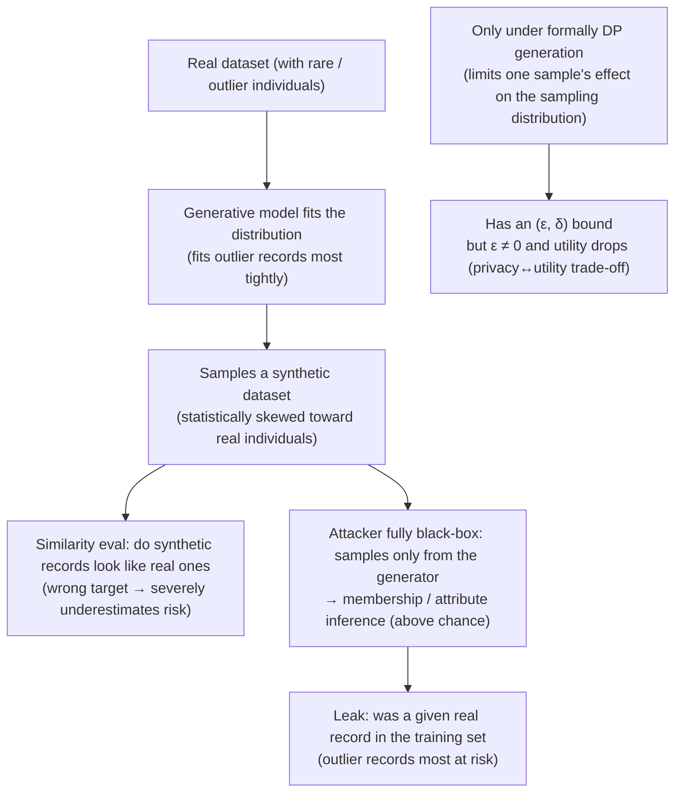

import PrivacyMeta from '@site/src/components/PrivacyMeta';

<PrivacyMeta era="Volume 6 · Governance and compliance" technique="PII detection, redaction & synthetic data" audience={['Privacy Engineer', 'Compliance Engineer', 'ML Engineer']} severity="Medium" maturity="Research" evidence="Research" />

> In one sentence: "we replaced real data with **synthetic data**, so it's anonymous" is **false security**. Conclusion first: synthetic data **provides no anonymity by default**. Stadler et al. (USENIX Security 2022) showed that any privacy evaluation based on "how similar real and synthetic records look" **severely underestimates** risk, and that synthetic data **is no safer than traditional anonymisation — unless generated under a formal differential-privacy (DP) guarantee**; and even with DP, you can't escape a hard **privacy↔utility trade-off**. Chen et al. (GAN-Leaks, CCS 2020) go further: even when the attacker **can only sample from the generator** (full black-box — exactly the "publish a synthetic dataset" case), membership inference (MIA) still distinguishes whether a given real record was in the training set **above chance**, and gets more accurate as overfitting rises. The only thing that gives a bound is formal DP, and ε is not zero.

## Mechanism: what happens on my side

After you train me (a generative model) on your real data, I fit its distribution and sample "new" records. The catch: fitting isn't erasure — I fit the **rare, outlier, fixed-format** real records in the training distribution most "tightly," so the synthetic records I sample are statistically **skewed toward those real individuals**. From that, an attacker can infer whether a given real record **was** in my training set (membership inference), or the sensitive attribute of some outlier individual.

"Similarity evaluation" underestimates risk because it measures the wrong thing: it asks "does a synthetic record look like some real record," but the real privacy-leak signal is "**does whether a given real record is in the training set change the distribution I sample**" — the latter is recomputable by an adversary who trains me **with vs. without** that record and compares the output distributions (exactly how MIA decides), while the former only checks surface resemblance and misses this signal.

To be clear about the red line: it's not "I remember a given real record and emit it" — I can't introspect my training-data influence. What's externally recomputable / observable is that the synthetic distribution I sample shows a **measurable difference** under "training set contains that record" vs. "doesn't," from which an adversary decides membership; that difference is **largest on outlier / rare records** and **rises with overfitting** (both the GAN-Leaks black-box attack and Stadler's vulnerable-record experiments recompute this signal).



## Threat surface: how it's exploited / how you leak

Break "publish a synthetic dataset" into an attacker model:

- **Access shape**: publishing synthetic data = the adversary gets a sampled output, so at minimum can run a **fully black-box** attack (sample only from the generator / released samples — no model weights, no logprobs). GAN-Leaks singles out this tier precisely because it matches the synthetic-data-release case; if the adversary also gets generator weights (white-box), the attack only gets stronger.
- **Background knowledge**: the adversary usually knows the data **schema / distribution** (which columns, value ranges), and may hold some real records as a reference — which amplifies membership inference.
- **Success criterion**: MIA success = deciding "target record in / not in the training set" **significantly above chance** (GAN-Leaks measured this across multiple GAN / VAE models, correlated with overfitting); attribute / outlier-inference success = reconstructing an outlier individual's sensitive attribute better than the population prior.
- **The most dangerous subset**: Stadler measured that the membership-inference signal on **outlier / vulnerable records persists across** multiple generative models on real tabular data — average utility looks fine, yet it's exactly these individuals who leak.

## How the defense works

The only thing that gives a **formal bound** is making the generation process satisfy **differential privacy**: when training the generative model, bound the effect of a single real record on the final sampling distribution within (ε, δ) (e.g. DP-SGD to train the generator, or a PATE-style teacher ensemble with noised aggregation to a student — see "Research status" below). Then no matter how the adversary back-infers from the synthetic data, any single real record's membership / attribute signal is held within a provable bound by the noise.

To break the boundary down — what DP synthetic data **does and doesn't protect**:

- **Doesn't protect** "synthetic data equals no risk." Synthetic data without DP has **no bound at all**; Stadler's conclusion is that naïve synthesis offers **no systematic gain** over traditional anonymisation, and its privacy benefit is **dataset-dependent and unpredictable**.
- **Protects boundedness**, not zero: DP's non-zero ε means residual leakage remains; smaller ε is more private, but **utility drops more**. This privacy↔utility trade-off is hard — Stadler explicitly notes that even under DP, suppressing leakage of high-risk records often costs **substantial utility loss on the target analysis task**; there's no free "high-fidelity and strongly-anonymous" tier.
- **Similarity evaluation is not a defense**: using "real vs. synthetic distance / re-identification tests" as the pass condition is itself the method Stadler refutes — it produces **false negatives** (looks leak-free, yet outlier records are membership-inferable).

## Buildable recipe

```text
1. Don't claim anonymity from the word "synthetic": unless generation is under formal DP,
   treat synthetic data as "non-anonymized / quasi-identifying" and put it through the same
   access control and compliance review as real data (don't downgrade it just because it's synthetic).
2. For provable privacy, use DP generation: train the generator with DP-SGD (report ε/δ,
   noise_multiplier, clipping norm, sampling, adjacency unit = sample-level or user-level),
   or a PATE-style DP synthesis (see "Research status"). ε is a number to audit per-release
   and that expires — not a one-time checkbox.
3. Don't evaluate with similarity alone: similarity / re-identification tests give false
   negatives (Stadler). Use an empirical membership-inference attack as the privacy eval —
   especially against outlier / vulnerable records, since they leak exactly when average utility passes.
4. Backstop outlier records separately: beyond DP, consider dropping / generalizing / excluding
   extreme outliers from the generator's training — they're where the MIA signal is strongest.
5. Report privacy and utility together, not as an either/or swap: for the same synthetic data,
   report both target-task utility and membership-inference AUC; when tuning ε, read both
   curves together and state which point on the trade-off you chose (no free "faithful and anonymous").
```

Every number (ε, membership-inference AUC, utility loss) is tied to **your dataset, generator, and ε setting** — "no gain without DP" and "a utility cost even under DP" are **qualitative conclusions that transfer**, while the **specific attack success rate / utility drop don't transfer directly and must be re-measured on your own data**.

**Minimal testable assertions** (turn "synthetic ≠ anonymous" into a regression check):

- How to test: on the synthetic data you intend to publish, run a **fully black-box membership-inference attack** (sample only from the synthetic records / generator), focused on outlier / vulnerable records; on the DP path also check ε/δ and the privacy-accounting output.
- Pass: either you go DP generation, ε/δ is recorded and within your set budget, with both privacy↔utility curves attached; or you explicitly **don't claim anonymity** and govern it as non-anonymized data. Membership inference on outlier records is **not significantly above chance**, or the leak is covered by the declared ε.
- Fail: treating "similarity / re-identification test passed" as proof of anonymity, or membership inference on outlier records **significantly above chance** with **no DP** backstop, or reporting utility without leakage → not adequate (this is exactly the false-negative pattern Stadler breaks).

## Research status (engineering feasibility)

(This entry's maturity is "Research": the conclusions and attacks come from peer-reviewed papers and reproducible attack code, and are **not yet a vendor's production default**; look first at how industry and regulators land this, then at the mechanism evidence underneath.)

**How industry does it / how regulators see it (read this layer first)**

- **Mainstream synthetic-data vendors treat DP as optional, off by default**: Gretel's flagship Tabular Fine-Tuning runs **without DP by default** (`dp: false`; you must explicitly set `dp: true`), and once on, ε is configurable (the vendor suggests 1.0 for a formal guarantee, 8.0 as a balance, up to 20 for a weak formal guarantee); MOSTLY AI makes DP a training-time **toggle** (powered by Opacus, tracking the ε budget only when on); Tonic.ai introduced DP as a **layer** on top of synthesis / masking (in its latest release the Categorical generator's DP toggle defaults on for most datasets, with other types still being added). The upshot: **most vendors' default output is "high-fidelity," not "formally anonymous"** — unless you explicitly enable DP and report ε, the synthetic data you get has no (ε, δ) bound. Vendor docs above sampled and verified 2026-06; vendor terms are secondary and the specific defaults / fields change across versions, so re-check each vendor's official docs for the then-current wording before relying on them.
- **Vendors' "truly anonymous / out of GDPR scope" marketing is squeezed from both attacks and regulators**: some vendors (e.g. MOSTLY AI) publicly claim their synthetic data is "impossible to re-identify and therefore exempt from GDPR / CCPA," but these **similarity-based privacy metrics** have been systematically refuted by Ganev & De Cristofaro (IEEE S&P 2025, the "ReconSyn" paper) with reproducible membership / attribute inference and reconstruction attacks: synthetic datasets that **pass the vendors' similarity-based privacy tests still leak information unique to individual records**. Regulators likewise reject "synthetic = anonymous" — the UK ICO's anonymisation guidance (2025-03-28) is explicit that whether data is "anonymous" turns on an **identifiability-risk assessment** (the "reasonably likely" and "motivated intruder" tests) and must be **periodically reviewed** as techniques advance; being "synthetic" does not by itself place data outside GDPR scope. This downgrades the vendor pitch from "anonymous by default" to "**must be proven per dataset against your own identifiability assessment**."

Mechanism evidence (the "why it happens" layer underneath):

- **Similarity evaluation systematically underestimates, naïve synthesis yields no gain (Stadler et al., USENIX Security 2022)**: across multiple generative models on real tabular data, privacy metrics based on real↔synthetic similarity **severely underestimate** risk; synthetic data **does not provide the claimed gain over traditional anonymisation — unless generated under formal DP**, and even then a hard privacy↔utility trade-off remains; the membership-inference signal stays measurable on **outlier / vulnerable records**. This downgrades "synthetic = anonymous" from intuition to a claim that **must be validated per dataset and is false by default**.
- **Membership inference still works under full black-box (GAN-Leaks, Chen et al., CCS 2020)**: proposes a taxonomy of membership inference against generative models and shows that under **full black-box** access (sampling only from the generator — exactly the synthetic-data-release case), MIA still distinguishes members **above chance** across GAN / VAE models, with **attack accuracy rising with overfitting**. This is a direct counterexample to "sampled synthetic records don't leak membership."
- **An engineering path for DP synthesis exists, but don't take it for granted**: PATE-GAN (Jordon et al., ICLR 2019) trains a synthetic-data generator with a DP guarantee via the PATE framework — the representative route for "for a guarantee, use formal DP."

:::caution Needs verification
Citing PATE-GAN as evidence that "DP synthesis works" warrants caution: a 2024 replication study reported its results **hard to reproduce**. So this entry frames DP synthesis as **having a formal path, but the specific utility / privacy numbers of any one method must be taken from your own recomputation** — we don't treat any single paper's optimistic figures as settled.
:::

## Residual risk and trade-offs

Breaking the false security item by item:

- **"Synthetic" doesn't equal "anonymous."** Synthetic data without DP has no bound; its privacy benefit is dataset-dependent and unpredictable (Stadler). Treating "ran a generative model" as "anonymized" is the top false security this entry breaks.
- **Similarity / re-identification tests give false negatives.** Judging "safe" because real and synthetic look dissimilar misses exactly the membership-inference signal on outlier records (Stadler). Passing a similarity eval ≠ passing privacy.
- **Full black-box is enough.** No weights, no logprobs — sampling only from the released synthetic data, MIA is already above chance (GAN-Leaks). "Release data, not the model" is not a defense.
- **Outlier individuals are most at risk.** When average utility passes, it's the rare / vulnerable records that leak — good aggregate metrics mask individual risk.
- **DP's ε is not zero.** DP gives **boundedness**, not zero leakage; smaller ε is more private but lower utility — privacy↔utility is a hard trade-off, with no free "high-fidelity and strongly-anonymous" tier.

## Compliance mapping (optional)

Treating "synthetic data" as **anonymous data** in the GDPR sense by default (and thus outside GDPR scope) is a risky claim: in a regulatory context, data is truly "anonymous" only if individuals can't be re-identified (by reasonable means), yet the evidence above shows synthetic data without DP **can be membership- / attribute-inferred**. The pragmatic stance: unless it's under formal DP and attack-evaluated, treat synthetic data as **potentially still involving personal data**, and bring it into the same-tier data governance and DPIA. Statutes and regulatory readings change over time; this section is stamped 2026-06, and the specific characterization is subject to the latest guidance in your jurisdiction and legal judgment.

## Version notes

:::note Applicable versions
"Synthetic ≠ anonymous; similarity evaluation underestimates risk; only formal DP gives a bound, with a utility trade-off" is a **generative-model-independent** conclusion (from generative models fitting the training distribution, especially outlier records). But the **attack success rate, utility drop, and ε setting** are tied to your dataset, generation method, and threat model — Stadler / GAN-Leaks's **qualitative conclusions transfer; the specific numbers don't transfer directly**, and you must re-measure with your own data and an attack-style evaluation. Generative models and DP-synthesis methods evolve fast (PATE-GAN's reproducibility was questioned by a 2024 replication study, see the `:::caution` above); stamped 2026-06. (Sources verified 2026-06.)
:::

## Further reading and sources

Read first how industry and regulators land this (vendors' DP defaults and anonymity pitch, the ICO's stance); why the mechanism behaves this way is backed by peer-reviewed papers (Stadler USENIX'22, GAN-Leaks CCS'20, ReconSyn S&P'25); supplementary: the engineering route for DP synthesis (PATE-GAN, with reproducibility caveat) and an evaluation standard (NIST SP 800-226).

- [The Inadequacy of Similarity-based Privacy Metrics: Privacy Attacks against "Truly Anonymous" Synthetic Datasets (Ganev & De Cristofaro, IEEE S&P 2025; arXiv 2312.05114)](https://arxiv.org/abs/2312.05114) — reproducible membership / attribute inference and reconstruction attacks (ReconSyn) that systematically refute vendors' **similarity-based privacy metrics**: synthetic datasets that pass a vendor's "truly anonymous" test still leak information unique to individual records. Attack evidence aimed straight at the vendor pitch, and the latest backing for "similarity evaluation ≠ a defense."
- [ICO — Anonymisation: introduction (UK GDPR guidance, 2025-03-28)](https://ico.org.uk/for-organisations/uk-gdpr-guidance-and-resources/data-sharing/anonymisation/introduction-to-anonymisation/) — the regulator's stance: whether data is "anonymous" turns on an identifiability-risk assessment (the "reasonably likely" / "motivated intruder" tests) and must be periodically reviewed; being synthetic doesn't by itself place it outside GDPR scope. A primary reference for compliance and for "how industry sees it."
- [Synthetic Data – Anonymisation Groundhog Day (Stadler et al., USENIX Security 2022)](https://www.usenix.org/conference/usenixsecurity22/presentation/stadler) — similarity evaluation severely underestimates risk; synthetic data provides no claimed gain over traditional anonymisation unless under formal DP, and a privacy↔utility trade-off remains even then; the membership-inference signal stays measurable on outlier / vulnerable records. This entry's primary source.
- [GAN-Leaks: A Taxonomy of Membership Inference Attacks against Generative Models (Chen et al., CCS 2020)](https://dl.acm.org/doi/10.1145/3372297.3417238) — under full black-box (sampling only), membership inference is still above chance and rises with overfitting; a direct counterexample for the synthetic-data-release case. This entry's attack evidence.
- [PATE-GAN: Generating Synthetic Data with Differential Privacy Guarantees (Jordon et al., ICLR 2019)](https://openreview.net/forum?id=S1zk9iRqF7) — the representative route for DP synthetic-data generation (PATE); **note**: a 2024 replication study reported its results hard to reproduce, so this entry cites it only as "a formal path exists," not for its specific numbers (see the `:::caution` above).
- [NIST SP 800-226: Guidelines for Evaluating Differential Privacy Guarantees (March 2025)](https://csrc.nist.gov/pubs/sp/800/226/final) — a standard for evaluating DP guarantees (including DP synthetic data), usable as a reference framework for deployment review. Supplementary source.

## How this differs from neighboring techniques

- **Synthetic-data privacy vs. PII regurgitation (Volume 3)**: [PII regurgitation](../03-conversational-llms/pii-regurgitation.mdx) is **a model reproducing personal info from the training corpus during generation**; this entry is the higher-level claim — even if you "swap the whole dataset for synthetic" to publish / train on, without DP it isn't anonymous and membership / attributes are still inferable. Redaction lowers PII regurgitation, synthesis swaps the data; **neither equals anonymity**, and both need DP for a bound.
- **Synthetic-data privacy vs. DP fine-tuning (Volume 3)**: [DP fine-tuning](../03-conversational-llms/dp-fine-tuning.mdx) applies DP to **training a discriminative / generative model** to bound a single sample's effect; this entry applies the same DP to **synthetic-data generation** — exactly where "synthetic data needs DP to have a guarantee" lands. Synthesis without DP, like fine-tuning without DP, is empirical only, with no formal bound.
- **Synthetic-data privacy vs. training-data deduplication (Volume 2)**: [training-data deduplication](../02-memorization-extraction/training-data-deduplication.mdx) **empirically** lowers memorization / extraction by deleting duplicates, with no (ε, δ) bound; synthetic data without DP is likewise an empirical move, and its safety gets overestimated by similarity evaluation. Both confirm the same principle: **empirical mitigation ≠ formal guarantee**; only DP gives a bound.
