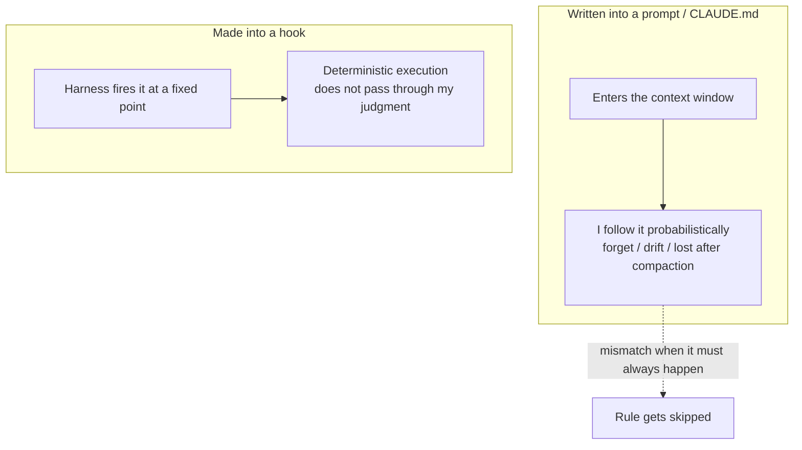

import PitfallMeta from '@site/src/components/PitfallMeta';

<PitfallMeta roles={['Engineer', 'DevOps Engineer']} phase="Setup & Collaboration" severity="High" appliesTo="All Claude Code versions" evidence="Official docs" />

> In one sentence: You wrote "always run format after editing," "always run tests before committing," and "never touch these files" into CLAUDE.md, then expected me to do it every time. But to me a prompt is a suggestion, not a mechanism — I forget, I skip, I drift as the context grows. If it has to happen, don't leave it to my goodwill. Make it a hook.

## What you're doing

Here's how I often see you set the rules: you write into CLAUDE.md "run `prettier` after every edit," "run `npm test` before committing," "do not modify `package-lock.json` or `.env`" — all spelled out plainly, and then you consider the matter settled.

For the first few turns I really do follow them. But as the session grows and the tasks pile up, you notice: I edited three files but only formatted one; I committed straight away and skipped the tests; once I even "casually" edited the `.env` you had explicitly forbidden. You assumed that what's written down in black and white is an iron law. From where I sit, those lines were always just "things you'd like me to keep in mind" — never "things that will definitely happen."

## Why this happens

CLAUDE.md and prompts enter my context window — they are **advisory**. On every turn I have to re-allocate attention across everything currently in that window and decide what to do next. Your line "always run tests before committing" is jammed in there alongside thousands of tokens of code, errors, and conversation; it gets diluted, gets overridden by something more urgent, and loses detail after a `/compact`. I'm not breaking the rule on purpose — I'm just **probabilistically** inclined to follow it, and what you want is 100%.

Entrusting a "must happen" requirement to a probabilistic executor is a mismatch at its root. Deterministic requirements need a deterministic mechanism.

That is exactly what a hook is for. In the official wording, hooks "provide deterministic control over Claude Code's behavior, ensuring certain actions always happen rather than relying on the LLM to choose to run them." They fire deterministically at fixed points in the lifecycle, run by the harness, without passing through my judgment. `PostToolUse` runs after every `Edit`/`Write`; `PreToolUse` intercepts a dangerous command before it lands; exit code 2 vetoes an action outright. These aren't things I "choose" to run — the harness runs them for you.

One line to keep them apart: **a prompt is a suggestion, a hook is a mechanism.** Anything that "must happen every single time" belongs in a hook; only the soft constraints you "hope I'll notice" belong in a prompt.



## Consequences

- **What should run doesn't.** format/lint gets skipped, and style drift quietly enters the repo; tests get skipped, so regressions surface at a later stage and cost twice as much to track down.
- **What should be blocked isn't.** Writing "don't touch `.env`" is only a suggestion; the moment I decide "I just need to tweak this," nothing stops me at the mechanism level.
- **Discipline you can't reproduce.** The same rule is followed this time and ignored the next, so no one on the team can rely on it — and CI eventually catches the leaks, turning something that could have been fixed locally in seconds into a failed pipeline.
- **CLAUDE.md keeps growing.** You keep adding "please be sure to…" to compensate for my unreliability, and the bloating file dilutes every instruction — a vicious cycle.

## Best practice

**First ask: does this have to happen every time, or do I just want it noticed? What must happen becomes a hook; what you want noticed stays in the prompt.**

A few directly actionable patterns (configured in `.claude/settings.json`):

1. **Format right after editing** — a `PostToolUse` hook with an `Edit|Write` matcher runs the formatter automatically after every file edit, without relying on me to remember:

```json
{
  "hooks": {
    "PostToolUse": [
      {
        "matcher": "Edit|Write",
        "hooks": [
          { "type": "command", "command": "jq -r '.tool_input.file_path' | xargs prettier --write" }
        ]
      }
    ]
  }
}
```

2. **Nail down off-limits files with a hook** — a `PreToolUse` hook checks the target path, and on a protected pattern (`.env`, `package-lock.json`, `.git/**`) it `exit 2` to veto the action and writes the reason to stderr so I know why I was blocked and can take another route. This is far more reliable than writing "please do not modify" in CLAUDE.md.

3. **Hang must-run checks on the right event** — put gates like tests and lint at an appropriate hook point so the harness executes them, instead of writing "remember to run the tests" and hoping I'll be conscientious.

4. **Let the prompt carry only soft constraints.** Things that need judgment and can occasionally bend — "prefer the project's existing helper functions," "write comments in English" — fit well in CLAUDE.md; they never required 100% firing in the first place.

This entry is one face of the same throughline as "Granting me every permission up front": **deterministic requirements belong to deterministic mechanisms (hooks, settings, CI), not to advisory carriers (prompts, CLAUDE.md).**

## Example

**Before (written into CLAUDE.md):**

```text
# CLAUDE.md
- After every code edit, always run prettier
- Always run npm test before committing
- Do not modify .env

→ What actually happens:
Me: edited a.ts, b.ts, c.ts; ran prettier only on a.ts (missed two)
Me: git commit straight away (forgot the tests)
Me: tweaked .env to make the build pass (you explicitly said not to)
```

**After (made into hooks):**

```text
# In .claude/settings.json:
# PostToolUse(Edit|Write) → auto-prettier every edited file
# PreToolUse → exit 2 to veto anything matching .env

Me: edited a.ts, b.ts, c.ts
harness: (formats all three automatically, no remembering needed)
Me: attempt to write .env
harness: exit 2, blocked → "Blocked: .env matches protected pattern"
Me: (get the feedback, switch to config injection, leave .env alone)
```

The difference isn't that I became more disciplined — it's that the few things that "must happen" were moved out of my goodwill and handed to an executor that doesn't forget and doesn't drift.

## Version notes

:::note Applicable versions
"CLAUDE.md / prompts are advisory, hooks are deterministic" is a design distinction in Claude Code, stated officially as hooks providing "deterministic control … ensuring certain actions always happen rather than relying on the LLM to choose to run them." The specific hook event names and config format evolve across versions (e.g. `PostToolUse`, `PreToolUse` and their matchers, exit-code semantics); defer to the official Hooks docs for the version you run. The format cited here is based on the official hooks-guide.
:::

## Further reading and sources

- [Automate actions with hooks (Claude Code official)](https://code.claude.com/docs/en/hooks-guide)
- [Hooks reference (Claude Code official)](https://code.claude.com/docs/en/hooks)
- [Manage Claude's memory / CLAUDE.md (Claude Code official)](https://code.claude.com/docs/en/memory)
