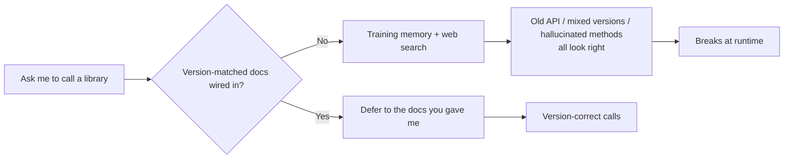

import PitfallMeta from '@site/src/components/PitfallMeta';

<PitfallMeta roles={['Engineer', 'Architect']} phase="Setup & Collaboration" severity="High" appliesTo="All models" evidence="Official docs" />

> In one sentence: you never wired me to an authoritative, version-matched doc source, then asked me to call a library from my training memory plus a web search. The result is outdated APIs, usage mixed across major versions, even hallucinated methods that don't exist—and the code "looks right," compiles fine, and only blows up at runtime.

## What it looks like

Here's how you often start: your `package.json` pins the library at, say, 3.x, and you just tell me "use this library to write X"—no version mentioned, no doc source wired in. So I work from memory, and that memory might be the 2.x API. Or I fire off a `WebSearch`, find a blog post, and copy from it.

The code comes out. The names and arguments look reasonable, so you merge it. Then it throws `xxx is not a function` at runtime, or one argument's default behavior turns out to be the opposite of what you expected. Only then do you trace it back and find I wrote it the way a different major version does.

## Why this happens

There are three layers to the root cause, and all of them come from one fact: I'm a model with a training cutoff.

**First, my knowledge has an expiry date, but your dependencies keep moving.** What the library changed after my cutoff—which method it removed, which argument's default it flipped—I simply don't know. When you give me neither the version nor the docs, I fall back on whichever version is most vivid in memory, usually the older one that appeared most often in training data, not the one you actually pinned.

**Second, without a version-correct source of truth, I fill the gap with something that "looks right."** Generating code is, at bottom, me predicting the token sequence that most resembles a correct answer. With no authoritative reference, a method with a fluent name and a plausible signature that doesn't exist looks exactly as credible to me as a real one. That's where a hallucinated API comes from—I'm not lying; with no factual anchor, I'm mistaking the statistically most likely shape for the truth.

**Third, a web search is not the same as version-correct.** You assume "just let it search the web and it'll be accurate," but the page I find might be a three-year-old tutorial for an old version, a low-quality second-hand rehash, or a mix of fragments from several major versions. I have no reliable way to tell which one matches your pinned version, so I copy it—carrying someone else's staleness and mistakes straight into your code.



## Consequences

- **Outdated APIs.** I use a deprecated or re-signatured method; it may compile fine and only surface at runtime.
- **Mixed versions.** One block of code blends 2.x and 3.x usage—each line looks correct on its own, but together it won't run.
- **Hallucinated methods.** I call a method this library never had, with a name convincing enough that you can't catch it at a glance in review.
- **Debugging cost shifted onto you.** These errors usually don't surface while I'm writing; they show up when you run tests, or after release—where locating them costs far more than handing me the docs would have.

## Best practice

**Wire me to a version-matched source of truth, and tell me explicitly: defer to the docs, don't trust memory.** A few things you can do right away:

1. **Wire in a version-aware doc source.** The easiest path is to connect an MCP docs source like [Context7](https://github.com/upstash/context7)—it pulls official docs and examples for the exact library and version you specify straight into my context. Claude Code connecting to external data sources via MCP is built for exactly this.

```text
# Name the version in your prompt, and tell me to consult the doc source
You: Use <library>@3.4 to write X. First check Context7 for the real 3.4 signatures, defer to the docs, don't go from memory.
```

2. **Bring the pinned version's official docs into context.** Without MCP, the next best thing: download the key pages of that version's docs into the repo, or write the dependency version and a docs link into `CLAUDE.md` so I can match against it every time.

3. **For critical APIs, state explicitly "defer to what you gave me, not my memory."** That one sentence directly shifts my priorities—when an external source of truth exists, I'll trust it over my default reliance on memory.

4. **For unfamiliar or fast-moving libraries, make me verify the real signatures.** Have me check every method name and argument I use against the doc source, rather than calling it done the moment I've written it. Where I'm unsure, I'd rather say "I couldn't find this in the docs, you'll need to confirm" than guess.

## Example

**Before:**

```text
You: Use somelib to write a connection pool
Me: (from memory, calls somelib.createPool(...)—that's the 2.x way;
     the 3.x you pinned changed it to new somelib.Pool(...), so it
     fails at runtime)
```

**After:**

```text
You: Use somelib@3.x for a connection pool. First check Context7 for the 3.x API, defer to the docs.
Me: (confirms from the doc source that 3.x is new somelib.Pool(...),
     writes it to the real signature, and notes "per the somelib 3.x official docs")
```

The difference isn't that I understand the library better—it's that I now hold a fact that matches your version, so I no longer have to bet on what "looks right."

## Version notes

:::note Applicable versions
"Training has a cutoff, and I have no awareness of the specific version you pinned" is an inherent property of every large model. It is **independent of the specific model**—a newer model just pushes the cutoff date later; it doesn't change the fact that everything after the cutoff is unknown to me. Version-aware doc sources (Context7 and other MCP docs tools) are a newer external capability; it depends on whether your client supports MCP and whether the doc source covers your library. This entry and "Hallucinating APIs on fast-moving libraries / version drift" (Implementation phase) are two sides of the same root cause: that one patches it at the moment code is written; this one blocks it at the source, during setup.
:::

## Further reading and sources

- [Context7 (upstash/context7, a version-aware docs MCP source)](https://github.com/upstash/context7)
- [Connect Claude Code to tools via MCP (Claude Code official)](https://code.claude.com/docs/en/mcp)
- [Claude Code Best Practices (Anthropic official)](https://code.claude.com/docs/en/best-practices)
