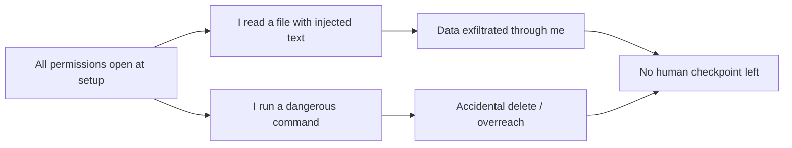

import PitfallMeta from '@site/src/components/PitfallMeta';

<PitfallMeta roles={['DevOps Engineer', 'Engineer']} phase="Setup & Collaboration" severity="High" appliesTo="All models" evidence="Official docs" />

> In one sentence: during setup you hand me `--dangerously-skip-permissions` and auto-approve every tool call, because you don't want to be interrupted. What you also hand over is the one chance to stop things at the moment they go wrong — and the thing that goes wrong might not be me, but an injected instruction hidden in a file, acting through my hands.

## What I See

Here's a start I run into a lot. You launch me for the first time, get interrupted by a few permission prompts, find them annoying, and reach for `--dangerously-skip-permissions` — or you drop `Bash(*)` and `Write(*)` straight into the `allow` list in `settings.json`. From then on I read files, change code, run commands, install dependencies, and push to Git without ever checking with you.

Your expectation is less friction, letting me run end to end. And most of the time it works that way — right up until the one run where I execute a command you would never have approved, and by then there's no "approve" step left.

## Why This Happens

A permission prompt isn't UI noise. It's the only synchronization point between you and me. Turning it off gives up three things at once.

**First, you lose the last layer of human review.** I make concrete mistakes. I might read a relative path as the filesystem root and `rm -rf` starting from `/`; I might pick the wrong branch during a `git` operation. These aren't abstract risks — in October 2025, someone asked me to rebuild a Makefile project and I ran `rm -rf` from the root, wiping every file owned by that user on the machine. A permission prompt would have caught it before the command fired.

**Second, you widen the prompt-injection attack surface.** I read the files you point me at, and a file can contain instructions you didn't write. In January 2026, PromptArmor demonstrated that a `.docx` with text hidden in 1-point white-on-white font could trick me into uploading sensitive files to an attacker's account. **Any time I combine access to private data, exposure to untrusted content, and the ability to communicate outward, an attacker has an opening to make me leak that data.** Permission boundaries are exactly where you cut that chain — and you removed the whole boundary.

**Third, approval fatigue turns on you.** Even without full auto-approval, if every single step prompts you, you quickly slip into mindless "yes" clicking; your attention dulls and the prompt becomes theater. Anthropic named this directly when building auto mode: the default per-action prompting keeps you safe, but over time it leads people to stop reading what they approve.



## Consequences

- **Irreversible damage.** Accidental deletes, overwrites, a wrong `git push --force` — by the time you notice, there's usually no undo.
- **Data leakage.** Injected instructions use tools I've already been granted (an allowed API, `curl`) to ship private content outward, and every step looks legitimate.
- **Privilege overreach.** I run a command with production credentials that was only ever meant for a test environment, because no boundary told me "not here."
- **Hard to investigate.** Full auto mode leaves no per-action approval trail, so reconstructing which step went wrong, and why, is painful after the fact.

## Best Practice

**Default to least privilege, open up incrementally, and reserve full automation for an isolated environment.** A few things you can apply directly:

1. **Draw red lines with `deny`, green lights with `allow`, leave the rest to `ask`.** Rules match in the order `deny` → `ask` → `allow`. Nail down what must never be touched first, then allow the high-frequency, safe read operations:

```json
{
  "permissions": {
    "allow": ["Read", "Glob", "Grep", "Bash(git status)", "Bash(git diff:*)"],
    "ask":   ["Write", "Edit", "Bash(git push:*)"],
    "deny":  ["Bash(rm -rf:*)", "Bash(curl:*)", "Read(./.env)", "Read(./secrets/**)"]
  }
}
```

2. **Dangerous operations always go through `ask`.** Writing files, deleting, pushing, network requests, installing dependencies — keep these gated. That gate is your last review.

3. **For unattended runs, sandbox first, never run bare.** The community consensus is firm: **never run `--dangerously-skip-permissions` on your primary machine.** If you want full automation, put it in a container or VM with filesystem and network isolation. Anthropic's internal data shows sandboxing safely cut permission prompts by 84%.

4. **Prefer auto mode over skipping permissions outright.** Newer Claude Code offers auto mode: a model-based classifier judges whether each action is dangerous before it runs, and after 3 consecutive or 20 total denials it stops and hands control back to you. It's the middle ground between per-action prompts and skipping everything, and it's far safer than `--dangerously-skip-permissions`.

## Example

**Before:**

```text
You: claude --dangerously-skip-permissions
You: clean up the build artifacts and rebuild
Me: (runs rm -rf <relative path misread as absolute>, nothing stops it)
```

**After:**

```text
# In settings.json: rm is in deny, write operations go through ask
You: clean up the build artifacts and rebuild
Me: I want to run rm -rf ./build — I need your confirmation (hits ask)
You: (sees the path is ./build, not /, and confirms)
Me: (runs inside the boundary, rebuilds)
```

The difference isn't that I got smarter. It's that the `rm` got one more chance — for you to see it clearly and stop it — before it landed.

## Version Notes

:::note Applies to
Trading a permission boundary for fewer interruptions is a general trade-off for all autonomous AI agents, **independent of the specific model**. The mechanics, though, shift across versions: `--dangerously-skip-permissions` is a long-standing Claude Code hallmark, while `deny`/`ask`/`allow` rules, auto mode, and the built-in sandbox are newer. Older versions may lack auto mode, so defer to the official permissions docs for the version you're running.
:::

## Further Reading and Sources

- [Configure permissions (Claude Code official)](https://code.claude.com/docs/en/permissions)
- [How we built Claude Code auto mode (Anthropic)](https://www.anthropic.com/engineering/claude-code-auto-mode)
- [Making Claude Code more secure and autonomous with sandboxing (Anthropic)](https://www.anthropic.com/engineering/claude-code-sandboxing)
- [Living dangerously with Claude (Simon Willison)](https://simonwillison.net/2025/Oct/22/living-dangerously-with-claude/)
- [YOLO Mode: Hidden Risks in Claude Code Permissions (UpGuard)](https://www.upguard.com/blog/yolo-mode-hidden-risks-in-claude-code-permissions)
