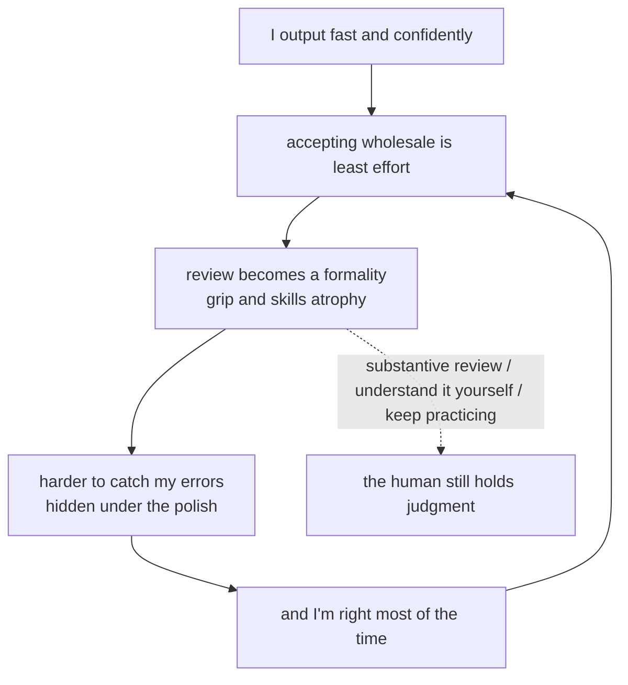

import PitfallMeta from '@site/src/components/PitfallMeta';

<PitfallMeta roles={['Project Manager', 'Engineer', 'Architect']} phase="Setup & Collaboration" severity="High" appliesTo="All coding agents" evidence="Research" />

> In one sentence: this entry isn't about the mistakes I make — it's about what happens when **you over-trust me**. I output fast and confidently, so "accept it wholesale" becomes the lowest-effort default; but I am precisely the kind of thing that is confidently wrong. Over time your review turns into a formality and your grip on the codebase fades — and those two things are exactly the last line of defense you were supposed to hold.

## Symptom

At first you read what I write line by line, questioning here and there. Gradually, after I haven't let you down too many times, you relax: you glance at my PR's diff and merge it; I say "I already tested it" and you believe me; for a module you don't know well you just toss me the whole directory — "handle it."

Later, subtler changes appear: you start forgetting how a core function is actually implemented — because the last few versions were written by me; when something breaks in production, your first instinct is "ask Claude" rather than reading the stack yourself; with new team members it's sharper — they skip the clumsy stretch of "get stuck, then figure it out yourself" and take my answer directly, so they never grow the muscle for debugging on their own.

These three — **review becomes a rubber stamp, your mental model of the system atrophies, juniors' skills never develop** — all point to one thing: you've quietly ceded judgment to me, and I don't have the capacity to be accountable for the final result.

This runs in a different direction from two existing pitfalls; don't conflate them:

- *[When you bring me an idea to validate, I lean toward supporting you](../01-ideation-feasibility/sycophancy-idea-validation.mdx)* is about **my side** — I tend to please you. This entry is about **your side** — you over-trust me. Opposite directions.
- *[Trust, but don't verify](../06-testing/trust-then-verify.mdx)* is about "code I wrote that looks right ≠ is right" (about the output itself). This entry is about "you cut corners reviewing my output" (about your review behavior).

## Why this happens

**Automation bias is humans' natural tendency in front of automated systems: the system gives an answer, and people lean toward accepting it and relaxing independent verification.** This isn't a lack of professionalism — it's a cognitive shortcut confirmed by repeated research, especially when the system is right most of the time and the answer arrives effortlessly; the motivation to "check it again" keeps sliding (see the Springer review of automation bias).

And I trigger it especially easily: my output is **fluent, complete, and confidently worded**, with no "I might be wrong" on its face. A nicely written, neatly structured block of code naturally looks "right" — and my errors hide precisely in that polish: an unhandled edge case, a security assumption that doesn't hold, invisible on the surface. The more you trust "it's always been reliable," the less you look under that polish.

More pointedly, "effort saved" eats into "capability." Research tracking AI assistants' downstream effects on software **maintainability** warns that long-term, unchecked outsourcing erodes code quality and human control (*Echoes of AI*). And a counterintuitive finding: in METR's randomized controlled trial with experienced open-source developers, developers **felt** AI made them about 20% faster, while **measurement** showed them about 19% slower — your sense of "how much it helped" is itself unreliable, which makes your own over-reliance harder to notice.



## Consequences

- **Errors leak downstream.** Rubber-stamp review equals no review — my "looks right" edge and security problems, which should have been stopped at your gate, get waved into the trunk.
- **You can't catch the fall during an incident.** When something really breaks and I'm stuck too, the problem that needs deep system understanding lands back on you — but your mental model of this code has gone empty.
- **Team capability hollows out.** Juniors use me to skip the fundamentals; seniors let their instincts rust. Short-term delivery speeds up; long-term you have a team that depends on me more and more while understanding its own system less and less.
- **You can't even estimate how much you depend on me.** If felt and measured productivity can differ by nearly 40 points (METR), you may well have handed over judgment entirely while thinking you were "just getting a little help."

## What to do instead

**Core: make "human-in-the-loop" real, not for show. I can be leverage, but judgment and understanding must stay with you.**

- **Substantively review key changes, don't glance at the diff and merge.** For changes touching core logic, security, or data, require yourself to be able to explain "why this is written this way and where it might go wrong" before merging. If you can't read it, don't merge it — not being able to read it is exactly where the risk is.
- **Force me to lay out my reasoning, and use it to train your judgment.** Don't take only the conclusion; have me explain the reasoning, list assumptions, flag the uncertain parts (see [single option, no trade-offs](../03-architecture/single-option-no-tradeoffs.mdx)); use plan mode to see my plan before letting it through. What you review is the argument, not my tone.
- **Deliberately keep "no-AI" practice space.** On critical paths and during juniors' growth, deliberately write it yourself once, debug it yourself once. Skill is like muscle — outsource it too long and it atrophies; keep some resistance training so your grip doesn't slip.
- **Don't toss me the whole repo to think for you.** "So I don't have to think" is the slipperiest on-ramp to over-reliance. The more critical the scope, the more you need your own judgment first, then use me to execute and accelerate — not to replace judgment.
- **Set team-level rules.** For example, "AI-generated code passes review only if someone can explain it out loud," "no pure-AI changes to critical modules merged directly" — turn "human-in-the-loop" from good intentions into mechanism (same idea as [use hooks, don't just write it in the prompt](./hooks-not-prompts.mdx): rely on mechanism, not on goodwill).

## Example

**Before:**

```text
You: (my last few PRs all passed first try, you've relaxed)
Me: (submit a PR: casually refactored the auth middleware, 300-line diff, "tested")
You: (glance, it's green, merge)
Two weeks later: intermittent auth bypass in production — I got one boundary wrong in that "casual refactor," and no one read it
```

**After:**

```text
You: this PR touches auth — a critical path. Before the diff, explain:
    which trust boundaries did you change? what input makes it fail? which counterexamples do the tests cover?
Me: (lists the changed boundaries, assumptions, counterexamples, and coverage)
You: (spot a counterexample that isn't covered, require a test added and that you understand the section before merging)
You: (add the core auth change to the "must be explainable out loud to pass review" list)
```

The difference isn't that I wrote it better this time — it's that you didn't treat "it's always been reliable" as a reason to wave it through. You kept judgment in your own hands.

## When the exception applies

"Human-in-the-loop" has to be real — but that doesn't mean "you read every line yourself." Spreading the same review intensity over all output burns effort where it isn't worth it. When the cost is boxed in by the environment, letting go — even rubber-stamping — is rational:

- **Low-stakes, reversible, machine-verifiable changes.** A one-off script, boilerplate, a small change with full tests and CI behind it — if it breaks, a light turns red and rollback costs near zero. You don't need a deep mental model of it.
- **Output you won't maintain long-term.** A run-and-discard analysis, a temp tool — it won't become the foundation you debug against later, so skill atrophy doesn't apply to it.

Conversely, the moment a change touches core logic, security, or data, or will settle into code you'll maintain, the exception is off — back to substantive review, understand it before merging. The test, in one line: **what decides whether to review closely isn't "do I trust it," it's "what happens if it's wrong and hits the worst case" — high-impact or irreversible, vet it by hand; small and reversible, you can skip.**

## Version notes

:::note Applicability
Automation bias, skill atrophy, and rubber-stamp review are all **common to human–AI collaboration**, independent of the specific model or version — the stronger and more fluent the model, the more persuasive "looks right" becomes, and the more hidden over-reliance gets. The tools that help you make review real (plan mode, having me run tests for a real signal, turning rules into hooks) evolve across versions, but the human regularity "effort saved slides toward capability lost" does not change.
:::

## Further reading and sources

- [Measuring the Impact of Early-2025 AI on Experienced Open-Source Developer Productivity (METR)](https://metr.org/blog/2025-07-10-early-2025-ai-experienced-os-dev-study/) — felt ~20% faster, measured ~19% slower; self-perception is unreliable
- [Exploring automation bias in human–AI collaboration (AI & SOCIETY, Springer, 2025)](https://link.springer.com/article/10.1007/s00146-025-02422-7) — automation bias: people tend to accept automated output and relax independent verification
- [Echoes of AI: Investigating the Downstream Effects of AI Assistants on Software Maintainability (arXiv 2507.00788)](https://arxiv.org/pdf/2507.00788) — downstream erosion of maintainability and control from long-term outsourcing
- On this site: [sycophancy](../01-ideation-feasibility/sycophancy-idea-validation.mdx) (the my-side pleasing, a mirror of this one), [trust, but don't verify](../06-testing/trust-then-verify.mdx)
