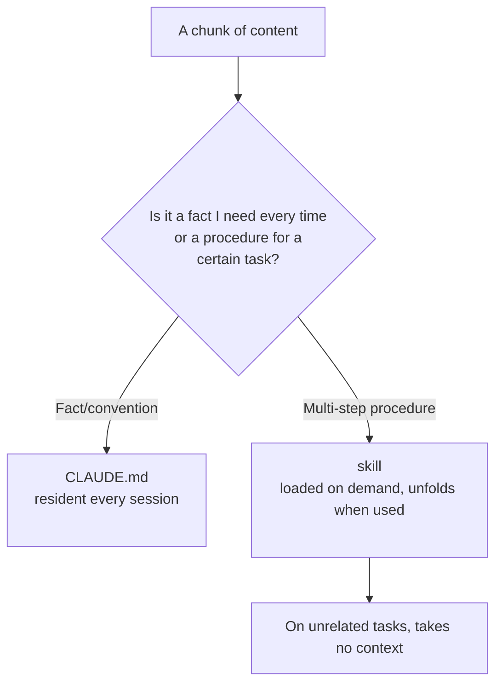

import PitfallMeta from '@site/src/components/PitfallMeta';

<PitfallMeta roles={['Engineer', 'Architect']} phase="Setup & Collaboration" severity="Medium" appliesTo="All Claude Code versions" evidence="Official docs" />

> In one sentence: You drop your "twelve-step release process" and your "full database-migration SOP" straight into `CLAUDE.md`, figuring I'll always remember them. The result: they sit in context on every session, so even a "fix a typo" task has to read through them first — yet these steps, useful only for specific tasks, belong in a skill that loads on demand.

## What I see you do

I often see a block like this grow inside `CLAUDE.md`:

```markdown
# Release process
1. Switch to the release branch and rebase main
2. Run the full test suite, confirm all green
3. Update CHANGELOG in keepachangelog format
4. Bump the version (package.json + three constants)
5. Tag as vX.Y.Z
6. Build artifacts and check their size
7. ... (six more steps)
```

The content itself is good — clear, specific, each step justified. The problem isn't the content, it's the **placement**: this is a "procedure used only for a certain kind of task," yet you've welded it into the always-loaded context that gets read on every session.

## Why this happens

The key is that `CLAUDE.md` and a skill have completely different **load timing**.

`CLAUDE.md` is loaded into context **in full at the start of every session**, whether this task needs it or not. A skill is different: its body **unfolds only when it's used** — when you explicitly invoke `/skill-name`, or when I judge the current task relevant to it. The official docs put this plainly: "a skill's body loads only when it's used, so long reference material costs almost nothing until you need it"; and — a line that could have been written for this entry — "when a section of `CLAUDE.md` has grown into a *procedure* rather than a *fact*, move it to a skill."

That's the value of progressive disclosure: the always-loaded context holds only "facts you need every time," while "procedures needed only for specific tasks" go in a drawer you pull open when you need them.

Leaving the procedure in `CLAUDE.md` trips two wires at once:

- **Signal-to-noise drops.** Those twelve release steps are pure noise for tasks like "fix a typo" or "add a log line," yet they still consume my limited attention budget and push the conventions that genuinely matter every time further down. This is a cause-and-effect pair with [CLAUDE.md Overload](../05-implementation/claude-md-overload.mdx) — that entry is about "too many rules getting ignored," and dumping a whole procedure in is one of the main things that bloats the file.
- **Fixed overhead grows.** The longer the file, the more of the window gets eaten at the opening of every session, and the less room is left for the actual task — even when this session has nothing to do with releasing.

Drop it into the three-layer model from earlier and it's clear:

- **`settings.json` = what I *can do*** (see [You Wrote a settings.json Rule as a CLAUDE.md Note](./settings-vs-claudemd.mdx)).
- **`CLAUDE.md` = what I *should know*:** the always-loaded facts and conventions.
- **skill = a *procedure loaded on demand*:** unfolds only when used.

This entry is only about the boundary between the latter two: **the always-loaded "facts/conventions" stay in `CLAUDE.md`; "procedures for specific tasks" become a skill.**



## Consequences

- **You pay for unused procedures every session.** Release SOPs and migration manuals lie in context year-round, crowding attention and raising fixed overhead, while most tasks never trigger them at all.
- **`CLAUDE.md` keeps swelling.** Procedures are the content most prone to growing long; dropping a whole one in quickly pushes the file past the "overload" line and triggers the dilution problems from CLAUDE.md Overload.
- **The procedure is hard to maintain and hard to discover.** A set of steps buried in the middle of a several-hundred-line `CLAUDE.md` is awkward to update on its own, and the team is unlikely to even realize "oh, there's a procedure for this." As a skill it has its own file and can be invoked directly with `/`.

## Best practice

**Pull multi-step procedures out of `CLAUDE.md` and make them skills; keep `CLAUDE.md` to facts you need every time.**

1. **The signal: if a chunk is "steps" rather than a "fact," move it.** Anything that goes "first... then... next...," carries a numbered list, or appears only for a certain kind of task is almost certainly skill material.

2. **Create a skill.** Write the procedure in `.claude/skills/<name>/SKILL.md`; the body can be as long as you like — it only loads when invoked or judged relevant:

```text
.claude/skills/
└── release/
    └── SKILL.md   # the full twelve-step release process goes here
```

3. **Leave just a one-line pointer in `CLAUDE.md` (if needed).** For example, "for releases, use the `/release` skill," rather than copying all twelve steps verbatim.

4. **Rule of thumb: is this chunk "something every task needs to know"?** Yes → keep it in `CLAUDE.md`; no (only a certain kind of task needs it) → make it a skill. The official wording is just as crisp: "Keep CLAUDE.md to facts Claude should hold in every session; move a multi-step procedure to a skill."

## Example

**Before (`CLAUDE.md`, 200+ resident lines, including the whole release process):**

```markdown
# CLAUDE.md
# Release process
1. Switch to release branch and rebase main
2. Run the full test suite
3. Update CHANGELOG
4. Bump the version
... (12 steps total, loaded every session)
```

**After: `CLAUDE.md` slims down, the procedure moves to a skill:**

```markdown
# CLAUDE.md
# Workflows
- Releases: use the /release skill (loaded on demand)
```

```text
# A typo-fixing session: CLAUDE.md has none of those 12 steps, context stays clean
You: Change "recieve" to "receive" in the README.
Me: (just fixes it, undistracted by a release process)

# When you actually release:
You: /release
Me: (only now loads the release process and walks the twelve steps)
```

The difference isn't whether I can remember the procedure; it's that **when you don't need it, it takes no space, and when you do, it's there in full.**

## How this differs from CLAUDE.md Overload

[CLAUDE.md Overload](../05-implementation/claude-md-overload.mdx) is about "too many rules, averaged into dilution" — a *quantity* problem whose fix is trimming and adding priority. This entry is about "this procedure shouldn't be resident at all" — a *placement* problem whose fix is changing layers (move it into an on-demand skill). The two often appear together: dumping a whole procedure into `CLAUDE.md` is frequently the very move that tips it into overload.

## When the exception applies

"Make the procedure a skill" exists so unrelated tasks don't pay for it. When "on demand" saves nothing, or the "drawer" itself has a cost, leaving the procedure in `CLAUDE.md` is the better fit:

- **A short procedure almost every task runs.** A three-to-five-line convention this repo uses nearly every time ("follow this commit format after every change") — it should be resident anyway, and making it a skill wraps an always-unfolded thing in an on-demand shell, adding a load step for nothing.
- **Too small for the skill's indirection to pay off.** In a personal repo or a temp project, creating a directory, a `SKILL.md`, and remembering to invoke it costs more than a few lines in `CLAUDE.md`. When the procedure is short and you're its only user, don't split it out.

The test, in one line: **ask "does almost every session use this procedure?" — if yes and it's short, keep it in `CLAUDE.md`; only when it fires for one kind of task and runs long does it belong in a skill.**

## Version notes

:::note Applicable versions
"Keep resident facts in `CLAUDE.md`, make on-demand procedures into skills" is Claude Code's recommended division of labor and **applies to all versions**; skills follow the [Agent Skills](https://agentskills.io) open standard. The specific capabilities of skills (subagent execution, invocation control, dynamic context injection, etc.) evolve across versions — defer to the official skills docs for the version you run.
:::

## Further reading and sources

- [Extend Claude with skills (official)](https://code.claude.com/docs/en/skills)
- [How Claude remembers your project (official memory docs)](https://code.claude.com/docs/en/memory)
