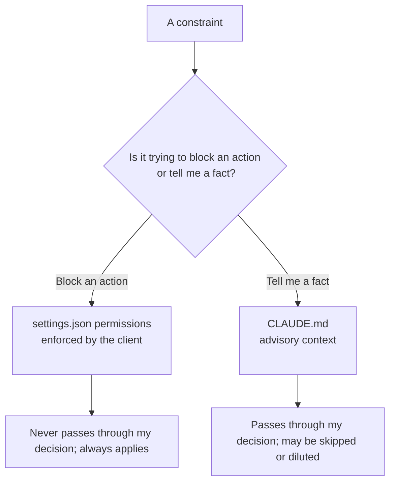

import PitfallMeta from '@site/src/components/PitfallMeta';

<PitfallMeta roles={['Engineer', 'Architect']} phase="Setup & Collaboration" severity="High" appliesTo="All Claude Code versions" evidence="Official docs" />

> In one sentence: You write "never touch the production database" and "ask me before running commands" into `CLAUDE.md`, assuming that fences me in. But to me `CLAUDE.md` is only *advisory context* — I read it and try to comply, but there's no guarantee. Actually stopping an action is `settings.json`'s job: it's enforced by the client and never passes through my "decision" at all.

## What I see you do

I often see you set boundaries like this during setup, writing a string of natural-language prohibitions into `CLAUDE.md`:

```markdown
# Safety rules
- Never run `rm -rf`.
- Don't touch `.env` or anything under `secrets/`.
- Always ask me before pushing code.
- Don't run `npm install` to add new dependencies on your own.
```

Your mental model is: spell out the rules and I'll keep them. That logic holds for a human teammate — written guidelines plus professional judgment usually work. But you're writing them for me, and the way I handle those lines isn't what you imagine.

## Why this happens

`CLAUDE.md` and `settings.json` are **two entirely different layers**, and confusing them is the root of this pitfall.

`CLAUDE.md` is loaded into my context at the start of every session, but the official docs are blunt about what it is: **it's "context, not enforced configuration."** It arrives as a user message after the system prompt; I read it and try to follow it — but there's **no guarantee of strict compliance**, especially when an instruction is vague or conflicts with something elsewhere. It shapes my *tendencies*, not my *capabilities*.

The `permissions` block in `settings.json` is a different beast entirely: it's enforced by the **client**, intercepting an action *before* the tool is actually invoked, **regardless of what I happen to think or whether I even read that rule**. The official docs draw the line with no ambiguity: "To block an action regardless of what Claude decides, use `permissions.deny`," and "Settings rules are enforced by the client regardless of what Claude decides to do; CLAUDE.md instructions shape behavior but are not a hard enforcement layer."

So handing "can I do this?" to `CLAUDE.md` is like turning what should be a **lock** into a **sticky note on the door**. Sticky notes blow away, get covered by newer notes (exactly the dilution described in [CLAUDE.md Overload](../05-implementation/claude-md-overload.mdx)), and may simply get skipped on a session where the task itself fills my attention. A lock doesn't.

Here's a three-layer mental model worth fixing in place once and for all:

- **`settings.json` = what I *can do*:** permissions, capability switches, `env`, automation — executable, enforced.
- **`CLAUDE.md` = what I *should know*:** project facts, conventions, invariants — advisory context.
- **skill = a *procedure loaded on demand*:** unfolds only when used (see [You Stuffed a Procedure Into CLAUDE.md Instead of a skill](./process-in-claudemd-not-skill.mdx)).

This entry is only about the top line: **anything that controls whether I *can do* something belongs in `settings.json`, not `CLAUDE.md`.**



## Consequences

Writing permissions as advice means **the protection you think you have simply isn't there**:

- **Prohibitions get silently skipped.** You wrote "never `rm -rf`," but one time I misread a cleanup task and issued the command anyway — `CLAUDE.md` won't stop it before execution, because it was never an interception layer. By the time you notice, the files are gone.
- **Secrets can still be read.** "Don't touch `.env`" is a suggestion; if I judge that reading it helps finish the task, I might. To actually lock it, you need `Read(./.env)` in `permissions.deny`.
- **More rules, less reliability.** These natural-language bans crowd the same limited attention budget as dozens of other rules, and in a long file the odds of skipping one go up — you've bet your safety on the least stable layer.
- **You debug in the wrong place.** After an incident you go back to `CLAUDE.md` ("but I wrote it down!"), not realizing it could never have stopped the action — the thing that actually needed changing was `settings.json`.

## Best practice

**Route by "capability vs. fact": whether I *can* do something goes in `settings.json`; what something *is* and how you've agreed to do it stays in `CLAUDE.md`.**

1. **Anything about "allow / forbid an action" becomes a `permissions` rule.** Red lines go in `deny`, frequent and safe ones in `allow`, the uncertain ones to `ask`:

```json
{
  "permissions": {
    "allow": ["Read", "Grep", "Bash(npm test)"],
    "ask":   ["Bash(git push:*)", "Bash(npm install:*)"],
    "deny":  ["Bash(rm -rf:*)", "Read(./.env)", "Read(./secrets/**)"]
  }
}
```

2. **For "always do X at moment Y," use a hook, not a note.** A hard requirement like "lint before every commit" should be a `PreToolUse` / commit-related hook; it runs as a shell command at a fixed lifecycle point and, again, doesn't pass through my "decision."

3. **Environment and automation switches also belong in `settings.json`.** `env` variables, model selection, automation tiers — these are "runtime capability config," not natural language written for me to read.

4. **Keep `CLAUDE.md` to facts and conventions only.** "Store all timestamps as UTC," "API handlers live in `src/api/handlers/`" — project knowledge I need to *know* but don't need to be forcibly *stopped* over.

One rule of thumb: **if a rule's intent is to *block an action*, it shouldn't be a sentence — it should be a `settings.json` rule or a hook.**

## Example

**Before (written into `CLAUDE.md`, advisory):**

```markdown
# CLAUDE.md
- Never run rm -rf.
- Don't read .env.
- Ask before pushing.
```

```text
You: Clear the build artifacts and rebuild.
Me: (misjudges a relative path, issues rm -rf <wrong path>; CLAUDE.md doesn't intercept)
```

**After (split into `settings.json`, enforced):**

```json
{
  "permissions": {
    "deny":  ["Bash(rm -rf:*)", "Read(./.env)"],
    "ask":   ["Bash(git push:*)"]
  }
}
```

```text
You: Clear the build artifacts and rebuild.
Me: rm -rf matched deny — this action is forbidden, so I'll use a more precise delete or ask you to confirm.
```

The difference isn't that I became more obedient; it's that this time the "can I delete?" call moved off my discretion and onto a lock I can't route around.

## How this differs from CLAUDE.md Overload

[CLAUDE.md Overload](../05-implementation/claude-md-overload.mdx) is about "too many rules, averaged into dilution and ignored" — a *quantity* problem. This entry is about "the rule is in the wrong layer entirely" — a *placement* problem. Even if your `CLAUDE.md` had a single line, "never `rm -rf`," it still wouldn't stop me, because permissions were never its job.

## When the exception applies

"Action-blocking belongs in settings" rests on the action being **expressible** as a rule. When it isn't, leaving it in `CLAUDE.md` isn't cutting corners — it's the only control available, as long as you know it's just a soft constraint:

- **The constraint is semantic, and no command/path pattern captures it.** "Don't touch production data" — but prod and staging run the same kind of command, the same SQL, so `deny` has no literal signature to anchor to. A rule like this can't be written as a lock, only as context (the real backstop is a different layer: read-only credentials, environment isolation — not that sentence).
- **It's a tendency, not a red line.** "Prefer editing config over deleting outright" — directional, but I should be allowed to judge the exception in the moment. That belongs in advisory context; putting it in `settings.json` would weld shut the reasonable workarounds too.

The test, in one line: **ask "can this action be pinned by a literal `deny`/`ask` pattern?" — if yes, don't write a sentence, write a rule or a hook; only when it can't be pinned, or it's meant to stay my judgment call, does it belong in `CLAUDE.md` — and know it won't truly stop the action.**

## Tool differences

**Gemini CLI (as of 2026-06)**: In Gemini CLI the same line holds, only the filenames change. My project-memory file is `GEMINI.md` (the name is configurable in settings), and it's the same kind of thing as `CLAUDE.md` — **advisory context** I read and try to honor, not an enforcement layer. To actually stop an action, that's `.gemini/settings.json`: it's enforced by the client and never passes through my judgment. So the same rule of thumb carries over: anything meant to be enforced doesn't go in `GEMINI.md`, it goes in `.gemini/settings.json`.

**Codex CLI (as of 2026-06)**: Same three layers, just different filenames — `AGENTS.md` is advisory context (I read it and try to follow it, but the next prompt can override it), while `config.toml` is the enforced configuration (`approval_policy`, `sandbox_mode`), and enterprises get one more layer in `requirements.toml`, a managed policy even the user can't edit (it can forbid `approval_policy="never"`). `AGENTS.md` is an open, cross-tool convention, so the "advice ≠ lock" mental model carries straight over.

**Cursor (as of 2026-06)**: Cursor splits this same distinction across three pieces: **Rules** (`.cursor/rules/*.mdc` plus the legacy `.cursorrules`) are advisory "guidance, not constraints"; `permissions.json` is the enforcement layer closest to `settings.json` (command / tool allowlists); and `sandbox.json` governs OS isolation. But there's a reversal worth remembering: Cursor's own docs say even the `permissions.json` allowlist / autoRun is a "best-effort convenience, not a security guarantee" — its "lock" is softer than Claude Code's `permissions.deny` (a hard client-side interception), so don't rely on it alone for what must truly be locked down.

## Version notes

:::note Applicable versions
"`CLAUDE.md` is advisory context, `settings.json` is the enforcement layer" is a consistent part of Claude Code's design and **applies to all versions**. The specifics of `permissions` (`allow`/`ask`/`deny`), hook lifecycle points, `env`, and so on evolve across versions — defer to the official settings / permissions / memory docs for the version you run.
:::

## Further reading and sources

- [Claude Code settings (official)](https://code.claude.com/docs/en/settings)
- [How Claude remembers your project (official memory docs)](https://code.claude.com/docs/en/memory)
- [Configure permissions (official)](https://code.claude.com/docs/en/permissions)
