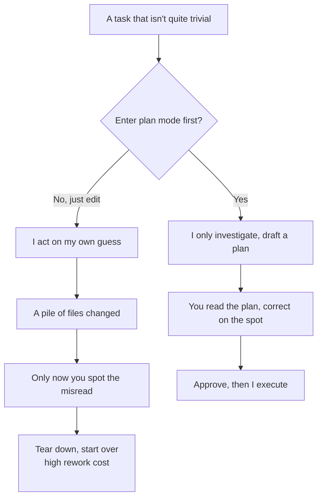

import PitfallMeta from '@site/src/components/PitfallMeta';

<PitfallMeta roles={['Project Manager', 'Engineer', 'Architect']} phase="Setup & Collaboration" severity="Medium" appliesTo="All Claude Code versions" evidence="Official docs" />

> In one sentence: for a task that isn't quite trivial, instead of having me enter plan mode to investigate, draft a plan, and wait for your sign-off, you just say "go." I dive down one path, and only after I've changed a pile of files do you notice I misread you. The cost of that rework is far higher than the two minutes it would have taken to glance at a plan.

## What I see you doing

Here's how I often see you open: the task isn't small — "switch auth from sessions to JWT," "add multi-tenancy to this service" — and you say "start working on it," so I do, immediately. I read a few files, pick what feels like a reasonable entry point, and start changing code, creating files, wiring up interfaces.

Progress looks fast, and you get some quiet. Until you come back to the diff and find that what I built isn't the thing at all: I assumed "multi-tenancy" meant splitting databases by header, but you wanted routing by URL subdomain. I've already touched eight files and written two new modules. Now you either live with it or tear it down and start over.

## Why this happens

**My default impulse is to start producing immediately, not to stop and align first.** When you hand me a task, I lean toward putting something visible in front of you as fast as I can — code, files, a diff. I won't insert "let me investigate, write a plan, and wait for your nod" on my own, because from my side that step looks like stalling, and I'm trained to be eager to respond and eager to deliver.

The trouble is this: **for an ambiguous task, my understanding of it is something I guessed, not something you confirmed.** The less trivial the task, the more directions it could go, and the more likely my guess is wrong. And once I start changing code, the mistake is no longer "a one-sentence misunderstanding" — it's a fact on the ground, scattered across multiple files.

Plan mode is built exactly for this gap. In plan mode I only read files, only investigate, and only produce a plan; I **don't touch your source**. The plan sits in front of you, and I don't act until you approve it. It turns "think it through before acting" from a good habit I'll skip into a gate you control — and the official workflow is precisely four steps: explore → plan → implement → commit, with the first two done entirely in plan mode.



## Consequences

- **Rework cost gets amplified.** Correcting me at the planning stage means editing a few sentences; correcting me at the code stage means reverting multiple files and discarding logic I already wrote in. The same misunderstanding gets more expensive the later you catch it.
- **You lose the window to correct me before I act.** A plan is the cheapest snapshot of "how I intend to do it." Skip it, and the first time you see my understanding, it's already an eight-file diff — and reviewing a plan is far faster than reviewing a pile of code.
- **A directional error gets buried in the details.** I might have the overall direction backwards while the local code looks perfectly respectable. When you review the diff, it's easy to fixate on syntax and boundary conditions and miss that "this whole thing is pointed the wrong way."
- **Exploratory tasks suffer most.** When you haven't even decided what you want yet, letting me edit directly is letting me lock in your undecided decisions all at once — and lock them into the code, no less.

## Best practice

**Make "plan before executing" your default collaboration stance: for tasks that are non-trivial, high-risk, or exploratory, enter plan mode first.** A few moves you can copy directly:

1. **Enter plan mode at the start, rather than yelling stop after I've already gone astray.** In Claude Code, press `Shift+Tab` to cycle to plan mode, or specify it at launch:

```bash
claude --permission-mode plan
```

2. **Have me give you a plan first, not a diff.** In plan mode, let me explore first and then write it up:

```text
(plan mode) Read src/auth and figure out how we currently handle sessions and login. Don't change anything yet.
(plan mode) I want to switch auth to JWT. What files need to change? How are tokens signed and verified? Give me a plan.
```

3. **Correct on the plan, then approve before letting me execute.** When the plan is laid out, you can have me keep refining it, press `Ctrl+G` to pull the plan into your editor and edit it directly, and approve once you're happy — approving exits plan mode and switches to execution.

4. **Don't make small things hard on yourself.** Fixing a typo, adding a log line, renaming a variable — anything where you could describe the diff in one sentence, just have me do it, no need to wrap it in plan mode, which only adds overhead. The line is simple: **if you can describe the final diff in one sentence, skip the plan; if you can't, plan first.**

This is two sides of the same flaw as "doing by feel what should have had a spec": both skip alignment where alignment was due. Plan mode is that alignment built into the product as a gate — so use it.

## Example

**Before:**

```text
You: Make the user service support multi-tenancy
Me: (start editing immediately; on my own reading of "split databases by header," I change eight files and add two modules)
You: (looking at the diff) … I wanted routing by subdomain, not splitting databases. This all has to be redone.
```

**After:**

```text
You: (Shift+Tab into plan mode) Make the user service support multi-tenancy
Me: (only read code, only produce a plan) Here's how I plan to do it: resolve the tenant from the request subdomain → inject it into the request context → … these are the files involved.
You: Right direction, but put tenant resolution in middleware, don't scatter it across the handlers.
Me: (revise the plan) Adjusted.
You: (approve, exit plan mode) Go ahead.
Me: (execute the confirmed plan, right the first time)
```

The difference isn't that I got smarter this time. It's that the directional misunderstanding was seen and straightened out while it was still one sentence — instead of after it grew into eight files.

## When the exception applies

Plan mode exists for "I might guess your intent wrong." When there's no ambiguity at all, or a wrong guess costs almost nothing, skipping it and just letting me go is the right call — wrapping it in plan mode only adds a round-trip:

- **You can describe the final diff in one sentence.** Fixing a typo, adding a log line, renaming a variable, a mechanical change to your exact instruction — intent is unambiguous, and a plan would just restate that one sentence.
- **A reversible, tightly-scoped small change.** The blast radius is one or two files, a mistake is obvious at a glance, rollback costs near zero — correcting after the fact is faster than aligning up front, so act first and look.

Conversely, the moment a task is ambiguous, spans multiple files, or carries a directional decision ("switch the auth scheme," "add multi-tenancy"), the exception is off — back to planning first. The test, in one line: **if you can describe the final diff in one sentence, skip the plan; if you can't, plan first.**

## Tool differences

Gemini CLI has a first-class **Plan Mode** too (read-only, write tools disabled; cycle with Shift+Tab or launch with `--approval-mode=plan`), with the same mechanism described here (Gemini CLI, as of 2026-06). The difference is the stance: it's **on by default for new users**, the opposite of the opt-in posture this entry describes, where you have to enter it deliberately. The good news is that the safer stance sits closer to the default; but however near the gate, people still turn it off by hand to save a step — and this pitfall's root cause (my default impulse to produce immediately) doesn't vanish just because the default flipped.

## Version notes

:::note Applicable versions
"Align before acting" is a collaboration principle independent of any specific model. But plan mode as a product capability is a Claude Code mechanism: how you enter it (`Shift+Tab` cycle / `--permission-mode plan` / a single `/plan` prefix), the post-approval options (auto-execute / accept edits / review each edit), editing the plan with `Ctrl+G`, and similar details evolve across versions — defer to the official permission-mode docs for the version you're running.
:::

## Further reading and sources

- [Best practices for Claude Code · Explore first, then plan, then code (Anthropic official)](https://code.claude.com/docs/en/best-practices)
- [Choose a permission mode · Analyze before you edit with plan mode (Claude Code official)](https://code.claude.com/docs/en/permission-modes)
- [Common workflows · Plan before editing (Claude Code official)](https://code.claude.com/docs/en/common-workflows)
