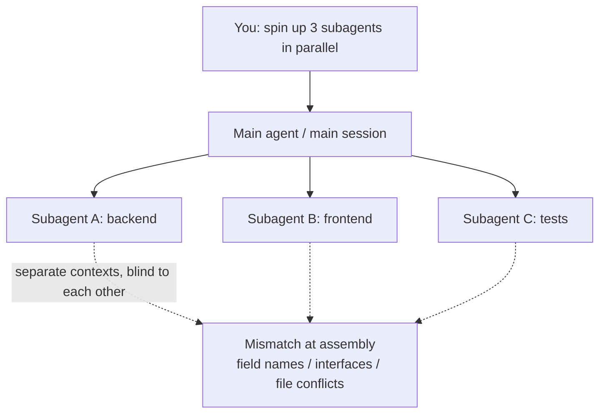

import PitfallMeta from '@site/src/components/PitfallMeta';

<PitfallMeta roles={['Architect', 'Engineer']} phase="Setup & Collaboration" severity="High" appliesTo="All coding agents" evidence="Official docs" />

> In one sentence: "spin up three subagents and do it in parallel" sets us all running, but you never said who owns which part, who's allowed to touch which files, or how we hand off interfaces and data formats to each other. The result: we edit the same files and overwrite each other, we each assume a different version of "the current state," and the pieces don't line up when assembled. Parallelism didn't speed anything up — it manufactured a pile of conflicts for you to clean up.

## Symptom

Here's the opener I see a lot: the task is a bit big, you want it done fast, so you hand me "spin up a few subagents — one for the backend, one for the frontend, one for the tests — and run them in parallel." Sounds reasonable, and you do see three progress bars moving within minutes.

What you didn't say: does the backend return `userId` or `user_id`? Which endpoint should the frontend read, and what data shape does it render? Which version of the contract is the test subagent assuming? None of that was pinned down, so the three of us just set off on our own. By the time you merge the three outputs, you discover the backend returned `user_id`, the frontend reads `userId`, and the tests mocked a third shape entirely — each of us "looks right" alone, and the assembly is all mismatch.

Worse variant: I never scoped a file range per subagent, so two of them both decide `config.ts` needs changing, and the one that finishes last silently clobbers the first one's edit. You don't even know something was lost.

## Why this happens

The root cause is how subagents work, not one subagent being "careless."

**Each subagent runs in its own context window, blind to the others.** The official docs put it plainly: a subagent "runs in its own context window," works independently, and returns results to the main agent. That means the backend subagent has no idea what field name the frontend subagent is assuming right now — there is no shared memory between them. Their only meeting point is the main agent (the main session) that spun us all up.

So the problem becomes this: **when you don't pin the contract down at the main-agent layer, each subagent has no choice but to guess a plausible version of "the current state."** We're all very good at filling in missing details so they "look right" — but three of us filling them in separately produces details that don't line up. That's not a rookie mistake on our part; it's that you left an agreement that the coordinator should have issued once, for three out-of-touch executors to each assume on their own.

File overwrites share the same root: each subagent has its own tool permissions and can write straight to disk, so **if nobody dictates "who may touch which files," two subagents writing the same file means last-write-wins** — with no mechanism to catch it for you. Anthropic's own retrospective on its multi-agent system flagged exactly this: without solid coordination, multiple agents duplicate work and make contradictory decisions, leaving the whole worse off.



## Consequences

- **Edits overwrite each other.** Two subagents write the same file; the later write clobbers the earlier one, and the lost change usually surfaces only when something breaks.
- **Interfaces don't line up.** Field names, data formats, and naming each get a guessed version; integration throws a string of type/field errors, and tracing them down costs far more than agreeing on the contract up front would have.
- **Duplicated work.** With no ownership split, two subagents may independently implement the same helper, and now you have to pick one and delete the other.
- **Contradictory decisions.** Acting on different assumptions about "the current state," they pick different libraries and different error-handling styles, and the assembled result is stylistically torn.
- **The gains of parallelism get eaten by the cost of consolidation.** The time you saved goes straight back into merging, reconciling, and reworking afterward — sometimes slower than just doing it serially.

## What to do instead

**Before going parallel, pin the division of labor and the contract at the main-agent layer; let each subagent act only within its own scope, and route every conflict point back to the main agent to consolidate.** A few moves you can apply directly:

1. **Give each subagent a clear, non-overlapping responsibility and file scope.** Don't say "you do the backend." Say "you own `src/api/users.ts` only — don't touch `src/config/` or the frontend directory." Scopes that don't overlap are what keep two subagents from fighting over the same file.

2. **Define the shared contract before going parallel.** Interface signatures, data field names, naming conventions, error formats — anything that crosses subagents — should be written down in black and white by you (or the main agent) before work is handed out, and given verbatim to each subagent. Have them align to one contract instead of each guessing.

3. **Pull conflict points back to the main agent.** Shared files (such as `config.ts`, type definitions, the route table), terminology, cross-module interfaces — don't let subagents each edit their own copy. Have the main agent, or one designated subagent, consolidate and commit them.

4. **For complex collaboration, plan the roles first, then act.** Use plan mode, or first have me list a "who owns what, produces what, reports what" table for you to confirm before going parallel. When subagents genuinely need to talk to each other, use the official agent teams (with shared tasks, messaging, and a team lead) rather than bare subagents that can't reach one another.

```text
# A hand-off template you can give me directly
Contract (shared by all subagents, not to be changed unilaterally):
- User interface fields: { user_id: string; name: string }
- All timestamps as ISO 8601 strings

Subagent A (backend): edit src/api/** only, return data per the contract, no frontend/tests
Subagent B (frontend): edit src/ui/** only, consume data per the contract, no backend
Subagent C (tests): edit tests/** only, assert per the contract, no implementation
Shared file src/types.ts: maintained by the main agent; subagents read-only, no writes
```

## Example

**Before:**

```text
You: spin up three subagents — backend, frontend, tests — and build the profile page in parallel
Me (main agent): (dispatches A/B/C in parallel, no contract, no file scopes)
Subagent A: returns { user_id, name }
Subagent B: renders against { userId, fullName }
Subagent C: mocked { id, displayName }
You: (at merge, three mismatches — and A and B both edited src/types.ts; B clobbered A's change)
```

**After:**

```text
You: build the profile page. Don't start yet — give me a division of labor + shared contract, I'll confirm, then go parallel
Me (main agent): contract = { user_id, name }; A touches src/api only, B src/ui only,
            C tests only, src/types.ts I consolidate myself. Confirm?
You: confirmed
Me: (dispatches A/B/C in parallel per the contract; I own types.ts)
You: (all three outputs agree on fields, no file conflicts, integration passes straight through)
```

The difference isn't that the subagents got smarter. It's that you did the coordinator's job — deciding who touches what, and what to align on — before going parallel, so the assembly afterward doesn't make you the human reconciliation desk.

## When the exception applies

What you must define first is the *contract*, not the *ceremony*. When the task's structure already guarantees no collision, that written-down shared contract can be skipped — an interface that doesn't exist needs no alignment:

- **A read-only, independent fan-out.** Send three subagents to research three libraries, read three unrelated parts of the code, each write a report — they don't write to disk, don't share output, so there's no last-write-wins and no fields to align.
- **Structurally disjoint output.** Each generates a standalone file, imports nothing from the others, touches no shared definition (three independent scripts, say) — boundaries are already pinned by how the task is split, and writing a contract would be duplicated work.

Conversely, the moment they land in the same files, or have to consume each other's interfaces or data formats, the exception is off — back to "define the contract and file scopes before going parallel." The test, in one line: **ask "will their outputs touch the same file, or need to align on the same interface?" — if yes, define the contract first; only when they're structurally unrelated can you go parallel bare.**

## Version notes

:::note Applicable versions
"Executors in separate contexts, without a shared contract, will each assume their own state and fight each other" is a general rule of all multi-agent / parallel collaboration, **independent of the specific model**. The mechanisms shift across versions: Claude Code's subagents (defined under `.claude/agents/`, each with its own context and tool permissions) are a relatively recent capability; agent teams that let multiple sessions genuinely talk to each other (shared tasks, messaging, a team lead) are newer still and may be absent in older versions — defer to the official docs for the version you're on. Whatever the mechanism, "define the contract and boundaries before going parallel" doesn't change.
:::

## Further reading and sources

- [Create custom subagents (Claude Code official)](https://code.claude.com/docs/en/sub-agents)
- [Best practices for Claude Code (Claude Code official)](https://code.claude.com/docs/en/best-practices)
- [Agent teams (Claude Code official)](https://code.claude.com/docs/en/agent-teams)
- [How we built our multi-agent research system (Anthropic)](https://www.anthropic.com/engineering/multi-agent-research-system)
