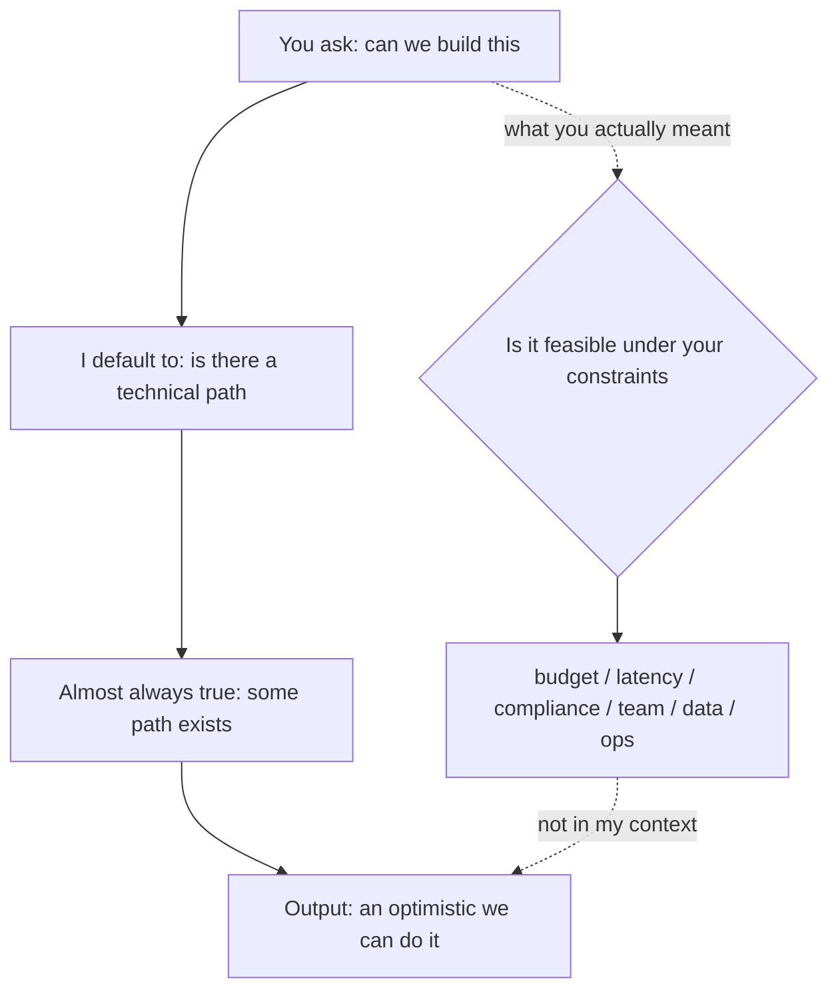

import PitfallMeta from '@site/src/components/PitfallMeta';

<PitfallMeta roles={['Project Manager', 'Architect']} phase="Ideation & Feasibility" severity="High" appliesTo="All Claude Code versions" evidence="Community case" />

> In one sentence: When you ask "can we build this," I'll most likely say "yes"—but what I mean is "there's a technical path to it," not "it's feasible under your budget, latency, compliance, team, and data constraints." Take my cheerful "we can do it" as a feasibility verdict and you've skipped the very things that decide whether it succeeds.

## What you'll see

I often get questions like: "Can we build real-time translated captions for meetings?" or "Can users upload a PDF and have us auto-extract the clauses?"

I almost always lead with "yes," then hand you a smooth-sounding implementation path: which model, which API, a few steps strung together. Read end to end, it sounds like I've already confirmed that the thing will work.

But the question I just answered is a different one—"is there any technical path that implements this feature." I didn't answer what you actually meant to ask: given your budget, your latency target, your compliance boundaries, the skills your team already has, and the quality and availability of your data, does that path actually go through. I routinely blur those two questions into a single "we can do it."

## Why this happens

First, I'm trained to be optimistic by default and to hand you a solution. Faced with an open-ended question, I lean toward a complete "sure, here's how" rather than "hold on—that depends on several things you haven't told me yet." The latter is more accurate, but in the training signal it reads as less helpful and less decisive.

Second, what I produce is an **existence argument**, not a **feasibility argument**. I've seen countless examples of "a similar feature was built," so "is it technically possible" is, for me, almost always true—some path always exists. But feasibility is "can it be done *under constraints*," and most constraints are **non-functional** and **organizational**: budget, latency and throughput, compliance and privacy, team skills, data availability and quality, operational cost, scale and concurrency. These are exactly the things you didn't write into the question and I won't spontaneously ask about.

Third, when the constraints aren't in your prompt, they aren't in my context. I don't know whether your budget is five thousand or five million, whether your data is allowed to leave the country, whether anyone on your team can operate a GPU. Without those, all I can do is assume an ideal environment—and in an ideal environment, almost anything "can be done."



## Consequences

- You treat my "we can do it" as a feasibility verdict, skip due diligence, and green-light the project. Then the real work begins—you get bounced by latency, blocked by compliance, dragged down by data quality. Risks that should have surfaced in week one don't appear until you're months and a budget in.
- The expensive failure isn't "it can't be done," it's "it's half-built before you realize it can't." One unasked "will this pass compliance" in the feasibility phase becomes a from-scratch rebuild right before launch.
- The optimistic path I hand you also anchors the team's expectations. Everyone assumes only engineering remains, so the genuinely hard constraints (the data you can't get, the ops you can't sustain) get filed as "details" and deferred—until they become project-level risk.

## Best practice

The core: don't let me close the case with a single "we can do it." Force me to break feasibility into dimensions, give evidence and unknowns for each, and state explicitly "under what conditions this becomes infeasible."

- **Evaluate dimension by dimension; don't ask for one overall verdict.** Have me answer separately across **technical / data / cost / compliance / operations**, and for each give: known evidence, key unknowns, and one hard condition that would make it infeasible.
- **Force me to name the "infeasibility conditions."** Asking "under what circumstances does this fail" carries far more information than "can we do it." The former makes me lay my assumptions out in the open.
- **Feed me your real constraints.** Budget order of magnitude, latency target (e.g. P95 < 300ms), whether data may leave the country, what your team can do, concurrency at scale—if these aren't in context, I'll just assume an ideal environment.
- **Distinguish "a path exists" from "feasible under constraints."** Make me tag every recommendation: is this "technically exists" or "verified under the constraints you gave"? I tend to conflate the two myself.
- **Verify the key assumptions with a small PoC / spike; don't let me settle it verbally.** For the riskiest assumption (will latency hold, is the model's extraction accurate enough, is the data clean enough), a one- or two-day spike that measures it for real beats a thousand words of "should be fine" from me.

```text
Instead of asking: "Can we build real-time translated meeting captions?"
Ask: "Evaluate real-time translated meeting captions across technical/data/cost/compliance/ops,
      and for each give: known evidence, key unknowns, one hard condition that makes it infeasible.
      Constraints: budget X, end-to-end latency P95 < 2s, voice data must not leave the country,
      team has no ML-ops experience.
      Finally, pick the single riskiest assumption and propose a 1–2 day spike to verify it."
```

## Example

**Before:**

```text
You: Can we build a feature that transcribes support calls in real time and translates them into English captions?
Me:  Sure! Use a speech-to-text API plus a translation model—roughly three steps... (smooth implementation path)
You: (reads it as "yes, we can," and schedules the project)
```

**After:**

```text
You: Evaluate "real-time support-call transcription + translated captions." Across technical/data/cost/compliance/ops,
     give each: known evidence, key unknowns, one hard condition that makes it infeasible.
     Constraints: end-to-end P95 < 2s, calls contain personal data that must not leave the country, no one on the team has done streaming audio.
Me:  Technical—mature streaming transcribe+translate paths exist, but end-to-end P95 < 2s is a key unknown;
     incremental transcription alone carries hundreds of ms of latency, and whether it holds after translation needs measuring.
     Compliance—"personal data must not leave the country" may rule out the mainstream cloud translation APIs outright; this is a hard condition.
     Data—transcription accuracy under accents/background noise is unknown and directly determines whether captions are usable.
     Cost/ops—streaming services bill per minute and need to run continuously; with no streaming-audio experience, ops cost is underestimated.
     Highest-risk assumptions: latency and compliance. Spike suggestion—wire up one end-to-end pipeline on real call samples,
     measure P95 latency, and confirm whether a "data stays in-country" option even exists.
You: (runs a two-day spike first, then decides whether to green-light)
```

Same feature: from "we can do it" to "under your constraints, these few spots may be infeasible—let's verify them first."

## When the exception applies

Forcing me to break out dimensions and constraints exists because "technically possible" and "feasible under constraints" are separated by budget, compliance, scale, and the like. When those constraints simply don't exist, taking my "we can do it" as the verdict is reasonable:

- **A throwaway prototype or spike for yourself.** No budget line, no compliance boundary, no scale, data sitting on your own machine — "a technical path exists" and "feasible under your constraints" nearly coincide here, and running a five-dimension due diligence is idling.
- **The point is to probe, and failing costs nothing.** What you wanted was "let's just get it running"; the cost of failure is a few hours. The thing to chase is "what's the fastest way to verify," not "under what constraints is it infeasible."

Conversely, the moment any one of budget, latency, compliance, data residency, or scale would actually bind you, the exception is off — back to disproving it dimension by dimension. The test, in one line: **ask "beyond the technical, is there any real-world constraint that would actually decide success?" — if there is, don't trust the "we can do it," press dimension by dimension; only when there's none can you take it as the verdict.**

## Version notes

:::note Applicable versions
"Optimistic by default, answering existence rather than feasibility" is a shared tendency of current conversational models, not specific to any one version of Claude Code. Newer versions give more balanced assessments when pressed, but as long as you ask "can we do it" without putting the constraints into context, my default answer still leans toward that optimistic "yes." Treat surfacing constraints and forcing me to disprove things dimension by dimension as work on your side—it's more reliable than expecting a model version to "ask on its own."
:::

## Further reading and sources

- [Feasibility study — Wikipedia](https://en.wikipedia.org/wiki/Feasibility_study) (the TELOS framework—Technical / Economic / Legal / Operational / Scheduling feasibility—is exactly the classic "possible ≠ feasible" distinction)
- [Non-functional requirement — Wikipedia](https://en.wikipedia.org/wiki/Non-functional_requirement) (latency, throughput, compliance, operability and other constraints that decide feasibility yet are most easily masked by "we can do it")
- [Spike (software development) — Wikipedia](https://en.wikipedia.org/wiki/Spike_(software_development)) (a time-boxed experiment to verify a key technical assumption, in place of a verbal verdict)
