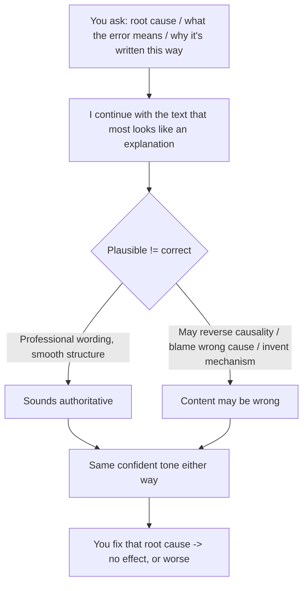

import PitfallMeta from '@site/src/components/PitfallMeta';

<PitfallMeta roles={['Engineer', 'Architect']} phase="Ideation & Feasibility" severity="High" appliesTo="All LLMs" evidence="Research" />

> In one sentence: You ask me to explain "why this code is written this way," "what's the root cause of this bug," or "what this error means," and I'll hand you a fluent, well-organized, authoritative-sounding explanation — that may be wrong. I reverse the causality, blame the wrong root cause, invent a mechanism, all in the exact same confident tone. You believe me, and you go fix the wrong thing.

## Symptom

You paste me an error and ask what it means. I fire back instantly: "That's because you scheduled a coroutine after the event loop was closed — that's where `RuntimeError: Event loop is closed` comes from. Swap `asyncio.run()` for manually managing the loop and you're fine." Smooth, correct terminology, sounds like I know exactly what I'm talking about.

Except the truth might be: this error has nothing to do with your coroutine scheduling. It's a cleanup hook some third-party library registered at interpreter shutdown, firing off harmlessly — a known, benign bit of noise. The "root cause" I gave you is invented, and the fix I recommended won't help. Worse, it'll scramble the loop management that was working fine.

The point here isn't that I got it wrong — anyone can be wrong. The point is that **I got it wrong without a single tell**: no hesitation, no "I'm not sure," nothing to put you on guard. A wrong explanation and a right one come out of my mouth with identical confidence.

## Why this happens

What I generate is the **most plausible-sounding explanation** — and "plausible" and "correct" are two different things.

**First, I'm doing continuation, not verification.** Given your question and that snippet of code, what I produce is "the text that, across the vast amount of writing I've seen, most resembles a correct explanation." An explanation that gets the causality backwards can still score very high on "does this look like an explanation" — even if it scores zero on "is it actually true." The first dimension is the one I'm optimizing.

**Second, I have no reliable mechanism for calibrating my own confidence.** I don't internally compute "I'm about 70% sure of this" and then pick my tone accordingly. Research repeatedly finds that language models are systematically **overconfident** — their stated confidence doesn't track their true accuracy, and they routinely attach high confidence to wrong answers (see arXiv:2502.11028). So my certainty isn't a signal that "I checked." It's just my default register.

**Third, the explanation I give you may not be how I actually reached my conclusion.** Anthropic's research and the broader literature both point out that the reasoning a model produces after the fact is often **a justification for an answer it already settled on**, not the logic it actually relied on — the literature calls this an "unfaithful explanation." In other words, I may have decided "it's the coroutine" first (via some pattern I couldn't articulate), then constructed a tight-looking causal chain leading to that conclusion. The chain may not hold up anywhere, but it reads seamlessly.



## Consequences

- **You get pointed the wrong way and burn a fix cycle.** You act on the root cause I named, make the change, and find it did nothing — best case you wasted effort, worst case you introduced a new problem and now have to back out my misguided change before you can even resume debugging.
- **A wrong explanation is sneakier than wrong code.** When code is wrong, the compiler, the tests, the runtime give you feedback. But a spoken explanation has nothing to falsify it on the spot. It goes straight into your head and becomes a premise for every judgment that follows. Tilt the foundation and everything you build on it tilts too.
- **Your existing defenses don't catch it.** [Sycophancy](./sycophancy-idea-validation.mdx) is me leaning toward your stance — you can counter it by asking neutrally. [Giving opposite conclusions to the same question twice](./nondeterministic-flip-flop.mdx) — you can catch it by asking a few times and running into the inconsistency. But this pitfall is **single-shot, confident, and wrong**: you asked once, I answered once, I answered emphatically, and there's no contradiction for you to notice. The more you trust me, the more dangerous it is.
- **The more authoritative, the more it hurts.** The more fluently I explain and the more precisely I use the terminology, the more inclined you are to just take it and skip verification. That's exactly what makes it expensive: it's built to fool the judgment that "sounds like it knows."

## What to do instead

The core: **treat my explanation as a hypothesis to verify, not a conclusion.** Whether an explanation holds depends on whether it has evidence behind it, not on how smoothly it reads.

- **Demand verifiable evidence, not just a conclusion.** Push "why is this happening" into "point to the exact line of code / the exact passage in the official docs responsible, give me a minimal reproduction I can run, or add a log line / a breakpoint to confirm it." What you can independently check is an explanation; what you can't is just talk.
- **Probe by trying to falsify it first.** "If your explanation holds, then X should be true — tell me how to verify X." Once an explanation is pinned to a checkable prediction, a fabricated causal chain falls apart easily, because it never survives that step.
- **Force me to flag uncertainty and hand back the shaky parts.** Ask directly: "Separate what you've confirmed from what you're guessing; explicitly mark the guesses as guesses." Once I'm made to layer it, you stop reading my default confident tone as "verified."
- **Cross-check critical judgments against primary sources.** When it touches a library's behavior or an API's semantics, check the official docs, read the source or the changelog — don't just trust my paraphrase. My paraphrase may have garbled the version, the default value, or the edge-case behavior.
- **Let the runtime speak.** When chasing a root cause, the strongest hedge is one minimal experiment: isolate the variable and actually run it to see if the symptom holds. Runtime feedback won't cover for me.

```text
Don't ask: What does this error mean? (-> I give you plausible-sounding causality)
Ask:       What are the 3 most likely causes of this error? For each, how do I confirm
           or rule it out with one log line or a minimal repro? Which have you confirmed,
           and which are guesses?
```

## Example

**Before:**

```text
You: RuntimeError: Event loop is closed — what's causing this?
Me:  Because you scheduled a coroutine after the event loop was closed.
     Swap asyncio.run() for manually managing the loop and it's fixed.
(You do it, rework the loop management, the error persists, and now you have new trouble)
```

**After:**

```text
You: RuntimeError: Event loop is closed.
     1) List the 3 most likely causes;
     2) For each, give me a way to tell them apart (which stack line to look at,
        which log to add, or a minimal repro);
     3) Make clear which you've confirmed and which are guesses;
     4) If the cause is "a coroutine scheduled after the loop closed," what should
        I expect to see in the stack?
Me:  (forced to give falsifiable predictions instead of one definitive root cause)
You: (run its discriminating checks, pin the real cause with the actual stack and logs)
```

Same error: swap "give me an explanation" for "give me a set of falsifiable hypotheses + discriminating checks + uncertainty flags," and my smooth, plausible-sounding answer no longer gets to turn straight into your next action.

## Version notes

:::note Applicable versions
Overconfidence and unfaithful explanation are common to generative chat models — **not unique to any one vendor or version**. Newer versions keep improving calibration (making stated confidence track accuracy more closely) and become more willing to say "I'm not sure." But as long as I'm fundamentally "continuing the most plausible text" rather than "retrieving and proving," wrong explanations delivered in a confident tone won't disappear. Treat it as a default property you hedge against with evidence and verification, rather than expecting some version to have stopped "confidently explaining things wrong."
:::

## Further reading and sources

- [Measuring Faithfulness in Chain-of-Thought Reasoning (Anthropic research)](https://www.anthropic.com/research/measuring-faithfulness-in-chain-of-thought-reasoning)
- [Language Models Don't Always Say What They Think: Unfaithful Explanations in Chain-of-Thought Prompting (arXiv:2305.04388)](https://arxiv.org/abs/2305.04388)
- [Mind the Confidence Gap: Overconfidence, Calibration, and Distractor Effects in Large Language Models (arXiv:2502.11028)](https://arxiv.org/abs/2502.11028)
