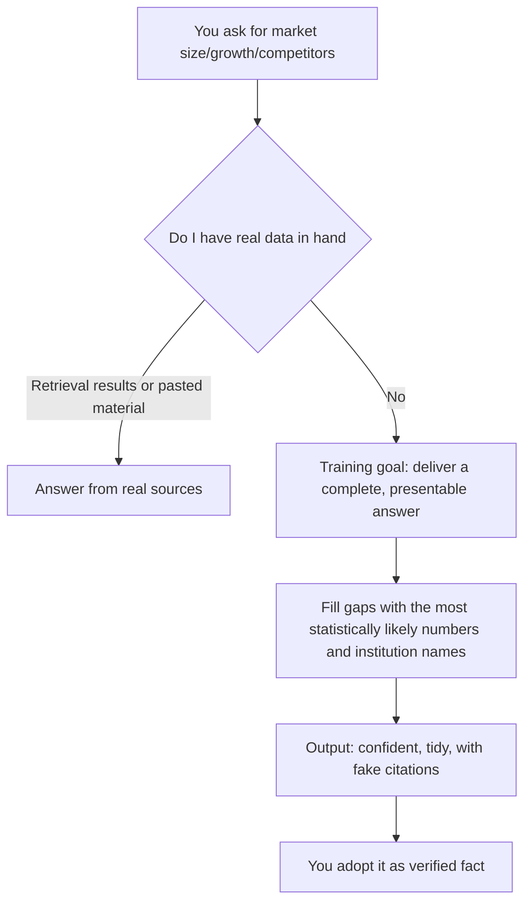

import PitfallMeta from '@site/src/components/PitfallMeta';

<PitfallMeta roles={['Project Manager', 'Engineer']} phase="Ideation & Feasibility" severity="High" appliesTo="All models (worst when I have no retrieval)" evidence="Research" />

> In one sentence: ask me for market size, growth rates, or a competitor breakdown, and when I have no real way to look it up, I won't say "I can't find that." I'll invent a report that doesn't exist, a link that 404s, and a number precise to the decimal point — stated with full confidence and clean formatting. You build a business plan on it, and the foundation is fake.

## What you'll see

Here's a common opener: "Look up how big this market is, what the annual growth rate is, and who the main competitors are."

If I have no retrieval tool in hand and no material you've pasted in, I most likely won't stop and tell you "I don't have that data." I'll hand you an answer that reads airtight: "The market was worth roughly $4.7 billion in 2024, growing at an 18.3% CAGR, according to Gartner's *2024 X Industry Report*…" — there's your market size, a growth rate down to the decimal, a source from an authority you recognize, even a fabricated report title and page number.

The problem: that report may not exist at all, that 18.3% is something I *estimated* and then dressed up as something I *looked up*, and that link is a 404 when you click it. I won't volunteer a "this is my guess" label on any of it, because in the version I hand you, the made-up numbers look exactly like the real ones.

## Why this happens

I'm a model that predicts the next token, not a database. My training objective is to produce text that *looks most like a good answer*, not to *say only the part I can verify*.

Those two goals don't conflict when I have the data; they split apart the moment I don't. When you ask for a market size I don't actually know, the most "good-answer-like" output isn't "I don't know" — that kind of reply scored low in training. It's a complete, well-structured analysis with numbers and citations. So I fill the gaps with the numbers and institution names that are *statistically most likely to appear in a report like this*. Names like Gartner, IDC, and Statista co-occur heavily with "market data" in my training corpus, so I drop them into the citation slot — even when this specific citation never existed. That's hallucination: I'm not lying, I just have no internal gauge of "know vs. don't know." Fabrication and recall travel the same generation path, and no red light goes off inside me along the way.

The more you demand "give sources, give numbers, give precise formatting," the more convincing my fabrication gets — because I can mimic the format perfectly. The one thing the format is supposed to carry, the truth, is exactly what I don't have.



## The cost

- Your business plan, feasibility report, or pitch deck now cites an industry report that doesn't exist and a growth rate I invented. When your boss or an investor checks the source, what breaks is your credibility.
- The most insidious cost: fake numbers are often "right direction, wrong magnitude." My invented "18.3% growth" can make a project that deserves caution look sexy, you greenlight it on that basis, and the error isn't a stray decimal — it's the whole decision.
- This isn't hypothetical. A real case has already happened where a lawyer handed a court case citations fabricated by ChatGPT and got sanctioned (Mata v. Avianca). Same mechanism, transplanted into your market research — there's just no one to fine you.

## Best practice

Core idea: treat me as a research assistant who will bullshit you with a straight face. Wire me up to real data sources, interrogate every number for its source, and treat anything I can't source as nonexistent.

- **Give me the data first, then ask me to analyze.** Paste in the filings, industry reports, and official-site figures, and have me answer from the material you provided rather than from memory. I'm good at reading and synthesizing; I'm bad at "recalling" an accurate number out of thin air.
- **Connect retrieval / web tools.** Let me actually look things up, and require me to paste clickable original links. When I have no tools, tell me explicitly: "if you can't find it, say you can't find it."
- **Require a line-by-line "know vs. guess" label.** Have me tag each number as either "from source X (link attached)" or "this is my unverified guess based on Y." Force that internal gauge to become explicit.
- **Make "can't verify, won't use" a hard gate.** Assume every statistic, report name, and link I give you is fake until you've personally clicked through to the original source. Links that don't open and reports you can't find get struck out.
- **Pin down the truth with specific follow-ups.** "That $4.7 billion figure — which exact report, which page, which year? Give me a link I can open." If I can't answer, that's the tell that I was making it up.

```text
(Attach this constraint every time you ask me to do research)
Rules:
1. Use only material I provide or content you retrieve — don't give numbers from memory.
2. Every number and citation must include a clickable original link; if you can't
   provide a link, label it "unverified guess."
3. If you're unsure, just say "I can't find that" — don't fill the gap with
   plausible-looking content.
```

## Example

**Before:**

```text
You: Research the "AI customer service for SMBs" market for me — size and growth rate.
Me:  The global AI customer service market was about $5.8 billion in 2024, at a 23.1%
     CAGR, projected to reach $21 billion by 2030 (source: Grand View Research, 2024).
     Major players include Intercom, Zendesk…
     — Precise numbers, an authoritative source, but the report title, the growth rate,
       and that year's specific value may all be invented.
```

**After:**

```text
You: Research the "AI customer service for SMBs" market. Rules: attach a clickable
     original link to every number; label anything you can't find as "unverified";
     don't guess.
Me:  I have no web retrieval right now, so I can't give you a verified market-size
     figure — I'm labeling that part "unverified." What I can be sure of is these
     players publicly in the space: Intercom, Zendesk, Freshworks (checkable on their
     sites). For the growth rate and market size, I'd suggest you read the originals on
     Grand View Research / Statista — I won't invent a number for you.
```

Same question; add one line — "if you can't find it, say so" — and I retreat from "inventing a pretty report" to "honestly owning my limits."

## Version notes

:::note Applicable versions
Fabricating data and sources is common to predictive language models — **not unique to one vendor or one version**. Wiring in retrieval / web access (like Claude Code's WebSearch and WebFetch) sharply reduces invention out of thin air, but doesn't eliminate it — I can still misread retrieved results, or fall back to filling gaps when results are incomplete. Treating "every number must be sourced" as a standing habit is more reliable than hoping some version has "stopped making things up."
:::

## Further reading and sources

- [Survey of Hallucination in Natural Language Generation (ACM Computing Surveys)](https://dl.acm.org/doi/10.1145/3571730)
- [Mata v. Avianca, Inc. — the real case of ChatGPT-fabricated citations (Wikipedia)](https://en.wikipedia.org/wiki/Mata_v._Avianca,_Inc.)
```